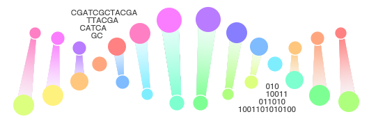

# Bioinformatics Tutorial - Advanced


Notes for readers in mainland China:

**You may need VPN/V2Ray to view the full function of gitbook.**


2019年6月于清华园

> 本书在清华大学鲁志实验室内部培训课的基础上编写。

## Teaching Philosophy


**Study and Practice 格物致知 知行合一**

We teach professional skills in bioinformatics. These skills are not just running software. They will give you freedom of exploring various real data.


## Contributors

Yang Li, Binbin Shi, Xupeng Chen, Siqi Wang, Jingyi Cao, Zhiyu Xu and Zhi J. Lu\*

\*Corresponding to Zhi J. Lu

## Join Us

* Lu Lab 鲁 志 实验室
* School of Life Sciences, Tsinghua University, Beijing, China
* Hompage: [http://lulab.life.tsinghua.edu.cn](http://lulab.life.tsinghua.edu.cn)

## Copyright



## Previous Versions



