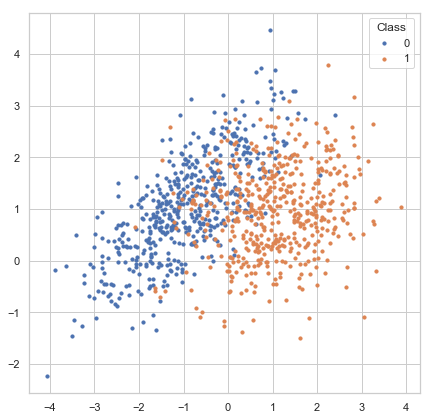
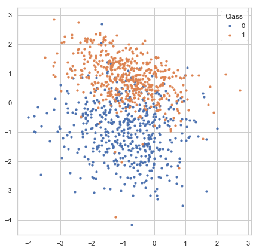
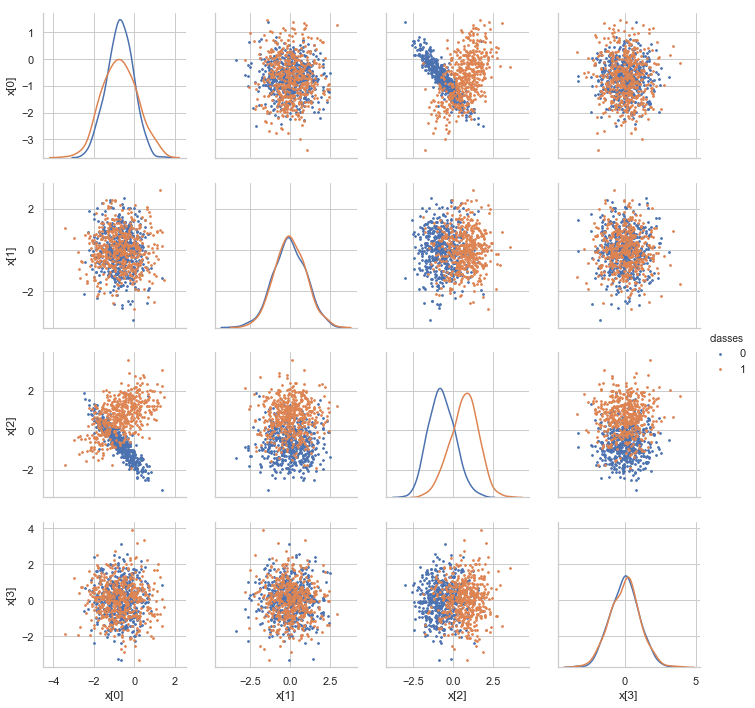
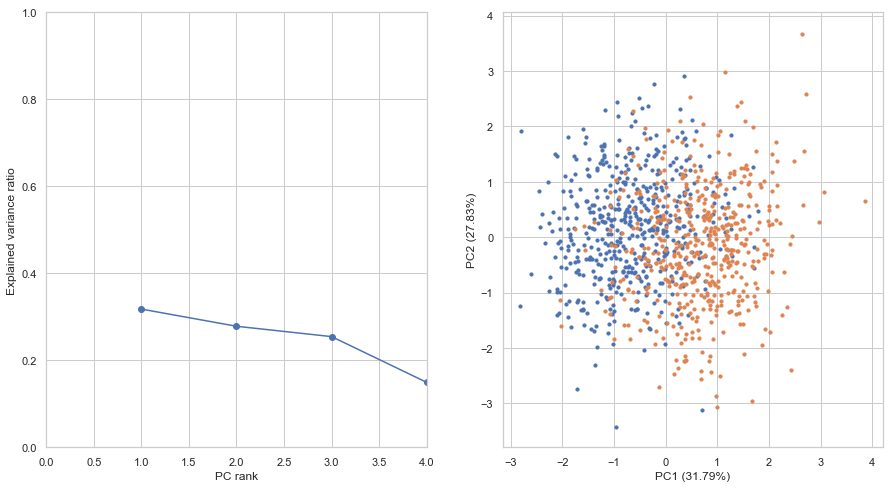
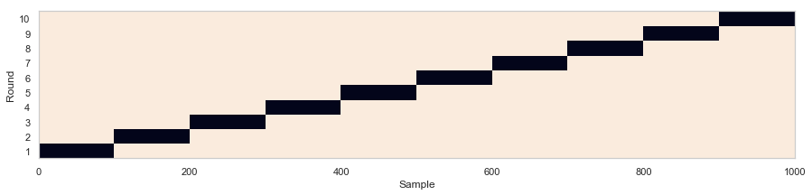
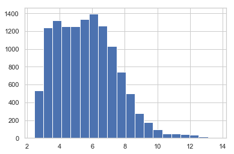
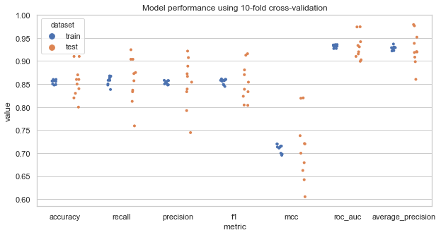

```python
%pylab inline
```

    Populating the interactive namespace from numpy and matplotlib


## Import data

Datasets for machine learning can be loaded from a variety of souces. 
Tabular data can be loaded through the [*pandas*](https://pandas.pydata.org) package in various formats:

| Format Type | Data Description | Reader | Writer |
| ----------- | ---------------- | ------ | ------ |
| text | CSV | [pandas.read_csv](https://pandas.pydata.org/pandas-docs/stable/generated/pandas.read_csv.html) | [pandas.to_csv](https://pandas.pydata.org/pandas-docs/stable/generated/pandas.DataFrame.to_csv.html) |
| text | JSON | [pandas.read_json](https://pandas.pydata.org/pandas-docs/stable/generated/pandas.read_json.html) | [pandas.to_json](https://pandas.pydata.org/pandas-docs/stable/generated/pandas.DataFrame.to_json.html) |
| text | HTML | [pandas.read_html](https://pandas.pydata.org/pandas-docs/stable/generated/pandas.read_html.html) | [pandas.to_html](https://pandas.pydata.org/pandas-docs/stable/generated/pandas.DataFrame.to_html.html) |
| text | Local clipboard | [pandas.read_clipboard](https://pandas.pydata.org/pandas-docs/stable/generated/pandas.read_clipboard.html) | [pandas.to_clipboard](https://pandas.pydata.org/pandas-docs/stable/generated/pandas.DataFrame.to_clipboard.html) |
| binary | MS Excel | [pandas.read_excel](https://pandas.pydata.org/pandas-docs/stable/generated/pandas.read_excel.html) | [pandas.to_excel](https://pandas.pydata.org/pandas-docs/stable/generated/pandas.DataFrame.to_excel.html) |
| binary | HDF5 Format | [pandas.read_hdf](https://pandas.pydata.org/pandas-docs/stable/generated/pandas.read_hdf.html) | [pandas.to_hdf](https://pandas.pydata.org/pandas-docs/stable/generated/pandas.DataFrame.to_hdf.html) |

You can refer to [Pandas IO Tools](https://pandas.pydata.org/pandas-docs/stable/io.html)
for more usage of data importing using *pandas*.

For large datasets, it is recommended to use binary formats such as *HDF5* and *NPZ* for more efficient reading and writing and also reducing disk usage.

HDF5 format can be read to or write from numpy arrays conveniently using the [h5py](http://docs.h5py.org/en/stable/) package:

```python
import h5py
# read data assuming that datasets 'X' and 'y' exists in HDF5 file input_file
with h5py.File(input_file, 'r') as f:
    X = f['X'][:]
    y = f['y'][:]
# write data to HDF5 file output_file
# X and y are numpy arrays
with h5py.File(output_file, 'w') as f:
    f.create_dataset('X', data=X)
    f.create_dataset('y', data=y)
```

*NPZ* format is [native format](https://docs.scipy.org/doc/numpy/reference/routines.io.html) for numpy. *NPZ/NPY* format can be read from file using [numpy.load](https://docs.scipy.org/doc/numpy/reference/generated/numpy.load.html#numpy.load) and
write to file using [numpy.save](https://docs.scipy.org/doc/numpy/reference/generated/numpy.save.html#numpy.save) 
or [numpy.savez](https://docs.scipy.org/doc/numpy/reference/generated/numpy.savez.html#numpy.savez).

## Obtain the Data
**Data used this tutorial**

Refer to  [Machine Learning and Its Applications to Biology](https://journals.plos.org/ploscompbiol/article?id=10.1371/journal.pcbi.0030116) for the leukemia (ALL) dataset. The original tutorial used R to demonstrate how to use machine learning for the classification task.

**Download the data (exported from R packages to a CSV file: ALL.csv)**

```R
source("http://www.bioconductor.org/biocLite.R")
biocLite("ALL")
library(ALL)
data(ALL)
# restrict to BCR/ABL or NEG
bio = which( ALL[['mol.biol']] %in% c("BCR/ABL", 'NEG'))
# restrict to B-cell
isb = grep("^B", as.character(ALL[['BT']]))
bio = which( ALL[['mol.biol']] %in% c("BCR/ABL", 'NEG'))
bfus = ALL[, intersect(bio,isb)]
write.csv(exprs(bfus), 'ALL.csv')
write.table(as.character(bfus$mol.biol), 'ALL.classes.txt', col.names=FALSE, row.names=FALSE)
```

## Import required Python packages

Documentation for required Python packages:

* [numpy](https://docs.scipy.org/doc/numpy/): arrays
* [pandas](https://pandas.pydata.org/): data IO, DataFrame
* [imbalanced-learn](https://imbalanced-learn.readthedocs.io/en/stable): deal
* [scikit-learn](http://scikit-learn.org/): machine learning
* [statsmodels](https://www.statsmodels.org/): statistical functions
* [matplotlib](https://matplotlib.org/): plotting
* [seaborn](https://matplotlib.org/): high-level plotting based on *matplotlib*
* [jupyter](https://jupyter.org/): Python notebook


```python
from collections import defaultdict
# For data importing
import pandas as pd
# For machine learning
from sklearn.datasets import make_classification, make_regression, make_circles, make_moons, make_gaussian_quantiles
from sklearn.preprocessing import StandardScaler
from sklearn.linear_model import LogisticRegression
from sklearn.ensemble import RandomForestClassifier
from sklearn.neighbors import KNeighborsClassifier
from sklearn.tree import DecisionTreeClassifier
from sklearn.cluster import KMeans
from sklearn.svm import SVC
from sklearn.decomposition import PCA
from sklearn.model_selection import KFold, train_test_split, GridSearchCV, cross_val_score
from sklearn.metrics import accuracy_score, roc_auc_score, f1_score, recall_score, precision_score, \
    roc_curve, precision_recall_curve, average_precision_score, matthews_corrcoef, confusion_matrix
from statsmodels.robust.scale import mad
# For plotting
import seaborn as sns
sns.set()
sns.set_style('whitegrid')
from matplotlib.colors import to_hex
```

## Generate datasets

You can start with simple datasets that is easy to understand and visualize before handling realistic datasets.
*scikit-learn* provides many functions ([sklearn.datasets](http://scikit-learn.org/stable/modules/classes.html#module-sklearn.datasets)) for generating datasets easily.

### Classification dataset
For example, [sklearn.datasets.make_classification](http://scikit-learn.org/stable/modules/generated/sklearn.datasets.make_classification.html#sklearn.datasets.make_classification) generates samples from a mixture of Gaussian distributions with parameters to specify the number of classes,
number of features, number of classes, etc. The following example generate a two-class classification dataset of 1000 samples with 2 features for visualization. Samples are generated from two independent 2D Gaussian distributions. This dataset is suitable for linear classifier.


```python
X, y = make_classification(n_samples=1000, n_classes=2, n_features=2,
                           n_informative=2, n_redundant=0, n_clusters_per_class=1)
fig, ax = plt.subplots(figsize=(7, 7))
for label in np.unique(y):
    ax.scatter(X[y == label, 0], X[y == label, 1], s=10, label=str(label))
ax.legend(title='Class')
```


    <matplotlib.legend.Legend at 0x7f7642f555c0>





### Regression dataset

You can also use [make_regression](http://scikit-learn.org/stable/modules/generated/sklearn.datasets.make_regression.html) to generate a simple regression dataset.
The following dataset consists of 1000 samples with 1 feature and 1 response variable. A Gaussian noise 10 is added to each response variable.


```python
X, y = make_regression(n_samples=1000, n_features=1, n_informative=1, noise=10)
fig, ax = plt.subplots(figsize=(7, 7))
ax.scatter(X[:, 0], y, s=5, label=str(label))
ax.set_xlabel('X')
ax.set_ylabel('y')
```


    Text(0,0.5,'y')





### Specialized datasets

*scikit-learn* also provides sample generators for specialized classification/regression/clustering problems, e.g. 
[make_circles](http://scikit-learn.org/stable/modules/generated/sklearn.datasets.make_circles.html), 
[make_moons](http://scikit-learn.org/stable/modules/generated/sklearn.datasets.make_moons.html),
[make_gaussian_quantiles](http://scikit-learn.org/stable/modules/generated/sklearn.datasets.make_gaussian_quantiles.html).
These datasets can be used to demonstrate cases where simple classifier or clustering algorithms don't work but 
non-linear and more complicated algorithms work better.


```python
fig, axes = plt.subplots(1, 3, figsize=(16, 5))

for i, f in enumerate((make_circles, make_moons, make_gaussian_quantiles)):
    if f == make_gaussian_quantiles:
        X, y = f(n_samples=1000)
    else:
        X, y = f(n_samples=1000, noise=0.03)
    for label in np.unique(y):
        axes[i].scatter(X[y == label, 0], X[y == label, 1], s=5, label=str(label))
    axes[i].legend(title='Class')
    axes[i].set_title(f.__name__)
```


### The *digits* dataset

*scikit-learn* also includes some commonly used public datasets that is useful for exploring machine learning algorithms in the package. For example, the *digits* dataset is a small handwriting image dataset of 10 digits.


```python
from sklearn.datasets import load_digits

X, y = load_digits(return_X_y=True)
fig, ax = plt.subplots(figsize=(10, 11))
data = np.swapaxes(X[:16].reshape((-1, 8, 8)), 0, 1).reshape((8, -1))
with plt.rc_context({'axes.grid': False}):
    ax.imshow(data, cmap='Greys')
ax.set_axis_off()
```


### Dataset used in this tutorial

We use *sklearn.datasets.make_classification* to generate a dataset with 2 features


```python
make_classification?
```


```python
X, y = make_classification(n_samples=1000, n_classes=2, n_features=4,
                           n_informative=2, n_redundant=0, n_clusters_per_class=1, class_sep=0.7)
```

## Single feature analysis

### Analyze the separability of classes using individual features

Plot the distribution of feature values of each feature. A good feature should separate the two class well.
The following plot shows that each individual feature can largely separate the two classes, though not perfectly.


```python
fig, axes = plt.subplots(1, X.shape[1], figsize=(15, 4))
for i in range(X.shape[1]):
    for label in (0, 1):
        sns.kdeplot(X[y == label, i], label=str(label), ax=axes[i])
    axes[i].legend(title='class')
    axes[i].set_xlabel('Feature x[{}]'.format(i))
    axes[i].set_ylabel('Density')
```


### Feature correlation analysis

Sometimes highly correlated features may be detrimental to model performance and feature selection.
A redundant feature does not provide more information, but introduces extra parameters to the model to make
the model prone to overfitting. For feature selection, the model may assign a small weight to each redundant features
too many redundant features may dilute the contribution of individual features. Although the impact of
redundant features on model performance depends on the machine learning algorithm used, 
it is a good practice to identify these features and remove/merge redundant features.


```python
data = pd.DataFrame(X, columns=['x[{}]'.format(i) for i in range(X.shape[1])])
data.loc[:, 'classes'] = y.astype('U')
g = sns.PairGrid(data, hue='classes', vars=['x[{}]'.format(i) for i in range(X.shape[1])])
g.map_offdiag(plt.scatter, s=3)
g.map_diag(sns.kdeplot)
g.add_legend()
```


    <seaborn.axisgrid.PairGrid at 0x7f762580a860>





## PCA analysis


```python
X_scaled = StandardScaler().fit_transform(X)
pca = PCA()
X_pca = pca.fit_transform(X)
fig, axes = plt.subplots(1, 2, figsize=(15, 8))
axes[0].plot(np.arange(X.shape[1]) + 1, pca.explained_variance_ratio_, marker='o')
axes[0].set_xlabel('PC rank')
axes[0].set_ylabel('Explained variance ratio')
axes[0].set_ylim(0, 1)
axes[0].set_xlim(0, X.shape[1])

for label in np.unique(y):
    axes[1].scatter(X_pca[y == label, 0], X_pca[y == label, 1], label=label, s=10)
axes[1].set_xlabel('PC1 ({:.02f}%)'.format(pca.explained_variance_ratio_[0]*100))
axes[1].set_ylabel('PC2 ({:.02f}%)'.format(pca.explained_variance_ratio_[1]*100))
```


    Text(0,0.5,'PC2 (27.83%)')





## Split data into training and test set

We should split the dataset into a training and test set to evaluate model performance. 
During model training, the model overfits to the data to some extent, and so model performance
on the training set is generally biases and higher than on the test set. The overfitting issue
can be resolved by adding more independent samples to the dataset. The difference of training
and test performance decreases with the increase of sample size.

Here, we use [train_test_split](http://scikit-learn.org/stable/modules/generated/sklearn.model_selection.train_test_split.html)
to randomly set 80% of the samples as training set and 20% as test set.


```python
X_train, X_test, y_train, y_test = train_test_split(X, y, test_size=0.2)
print('number of training samples: {}, test samples: {}'.format(X_train.shape[0], X_test.shape[0]))
```

    number of training samples: 800, test samples: 200


## Train the model

There are numerous machine learning algorithms that can be divided into two major categories: supervised
learning and unsupervised learning. 

In supervised learning, the model takes features and class labels 
or targer values as input to build the model. If the target variable (the variable to predict) is a 
categorical (e.g. positive/negative), the problem is called classification. If the target variable is
continous (e.g. height), the problem is called regression. Most supervised learning problems fall into
these two categories, however, combination of continous output and categorical output or structured output
are also possible.

In unsupervised learning, the target variables are not specified. The objective is to identify internal
structures (clusters) of the data. After model fitting, we can assign new samples to clusters or generate
samples with similar distribution as the original data. Unsupervised learning are also useful as
a data preprocessing step prior to supervised learning.

### Logistic regression

Logistic regression is a linear model for classification. It first forms linear combination of input features
and then map the combined value to class probability between 0 and 1 through a non-linear sigmoid function.
During model training, the weights of the model are adjusted such that the cross-entropy between model prediction
and true labels is minimized.


```python
model = LogisticRegression()
model.fit(X_train, y_train)
```


    LogisticRegression(C=1.0, class_weight=None, dual=False, fit_intercept=True,
              intercept_scaling=1, max_iter=100, multi_class='ovr', n_jobs=1,
              penalty='l2', random_state=None, solver='liblinear', tol=0.0001,
              verbose=0, warm_start=False)


## Evaluate the model

### Predict labels on the test dataset

To evaluate performance of the model, we use the *predict* method of the estimator
to predict class labels of test data. This will return an integer array indicating class labels.


```python
y_pred = model.predict(X_test)
```

### Confusion matrix

The most common way to evaluate classification performance is to construct a 
[confusion matrix](https://en.wikipedia.org/wiki/Confusion_matrix).

A confusion matrix summarizes the number of correctly or wrongly predicted samples and is usually 
made up of four entries:

| Predicted | Negative | Positive |
| --------- | -------- | -------- |
| **True**      |          |          |
| **Negative**  | True Negative (TN) | False Negative (FN) |
| **Positive**  | False Positive (FP) | True Positive (TP) |


```python
pd.DataFrame(confusion_matrix(y_test, y_pred), 
             columns=pd.Series(['Negative', 'Positive'], name='Predicted'),
             index=pd.Series(['Negative', 'Positive'], name='True'))
```


<div>
<style scoped>
    .dataframe tbody tr th:only-of-type {
        vertical-align: middle;
    }

    .dataframe tbody tr th {
        vertical-align: top;
    }

    .dataframe thead th {
        text-align: right;
    }
</style>
<table border="1" class="dataframe">
  <thead>
    <tr style="text-align: right;">
      <th>Predicted</th>
      <th>Negative</th>
      <th>Positive</th>
    </tr>
    <tr>
      <th>True</th>
      <th></th>
      <th></th>
    </tr>
  </thead>
  <tbody>
    <tr>
      <th>Negative</th>
      <td>77</td>
      <td>28</td>
    </tr>
    <tr>
      <th>Positive</th>
      <td>17</td>
      <td>78</td>
    </tr>
  </tbody>
</table>
</div>


### Evaluation metrics for classification

A variety of metrics can be calculate from entries in the confusion matrix.

Accuracy (0 ~ 1) summarizes both positive and negative predictions, but is biased if the classes are imbalanced:
$$\text{Accuracy} = \frac{TP + TN}{TP + TN + FP + FN}$$

Recall/sensitivity (0 ~ 1) summarizes how well the model finds out positive samples:
$$\text{Recall/Sensitivity} = \frac{TP}{TP + FN}$$

Precision/positive predictive value (0 ~ 1) summarizes how well the model finds out negative samples:
$$\text{Precision/Positive Predictive Value} = \frac{TP}{TP + FP}$$

F1 score (0 ~ 1) balances between positive predictive value (PPV) and true positive rate (TPR) and is more suitable for
imbalanced dataset:
$$\text{F1 score} = 2 \frac{PPV \cdot TPR}{PPV + TPR}$$

Matthews correlation coefficient (MCC) (-1 ~ 1) is another metric that balances between recall and precision:
$$\text{MCC} = \frac{TP \times TN - FP \times FN}
{(TP + FN)(TP + FP)(TN + FP)(TN + FN)}$$


```python
scorers = {'accuracy': accuracy_score,
           'recall': recall_score,
           'precision': precision_score,
           'f1': f1_score,
           'mcc': matthews_corrcoef
}
for metric in scorers.keys():
    print('{} = {}'.format(metric, scorers[metric](y_test, y_pred)))
```

    accuracy = 0.775
    recall = 0.8210526315789474
    precision = 0.7358490566037735
    f1 = 0.7761194029850746
    mcc = 0.5546918944318417


### Predict class probability

Many classifiers first predict a continous value for each sample indicating confidence/probability of the prediction
and then choose a fixed cutoff (e.g. 0.5 for probability values) to convert the continous values to binary labels.
We can get the raw prediction values through the *predict_proba* method.


```python
y_score = model.predict_proba(X_test)
```

### ROC curve and precision-recall curve

Sometimes a single fixed cutoff is insufficient to evaluate model performance.
Receiver Operating Characterisic (ROC) curve and Precision-Recall curve are useful tools to inspect the
model performance with different cutoffs. ROC curve and precision-recall curve are also less sensitive
to class imbalance. 
Compared to ROC curve, precision-recall curve are more suitable for extremely imbalanced datasets.

The area under the ROC curve (AUROC) or average precision (AP) is a single value
that summarizes average model performance under different cutoffs and are very commonly used to report
classification performance.


```python
fig, axes = plt.subplots(1, 2, figsize=(14, 7))
# ROC curve
fpr, tpr, thresholds = roc_curve(y_test, y_score[:, 1])
ax = axes[0]
ax.plot(fpr, tpr, label='ROAUC = {:.4f}'.format(roc_auc_score(y_test, y_score[:, 1])))
ax.plot([0, 1], [0, 1], linestyle='dashed')
ax.set_xlabel('False positive rate')
ax.set_ylabel('True positive rate')
ax.set_title('ROC curve')
ax.legend()
# predision-recall curve
precision, recall, thresholds = precision_recall_curve(y_test, y_score[:, 1])
ax = axes[1]
ax.plot(precision, recall, label='AP = {:.4f}'.format(average_precision_score(y_test, y_score[:, 1])))
ax.plot([0, 1], [1, 0], linestyle='dashed')
ax.set_xlabel('Precision')
ax.set_ylabel('Recall')
ax.set_title('Precision-recall curve')
ax.legend()
```


    <matplotlib.legend.Legend at 0x7f7620f647f0>


## Cross-validation

For very large datasets, a single split of the dataset into a training set and a test set is sufficient
to evaluate the model performance. However, for small dataset, the test samples represent only a small
proportion of samples in future predictions. The model performance evaluated on the test samples varies
greatly between resamplings of the dataset.

### K-fold cross-validation

Cross-validation is a commonly used technique for model evaluation on small dataset. 
In **k-fold cross-validation**, the dataset is evenly divided into *k* partitions(folds).
In each round of validation, the model is tested on one parition and trained on remaining *(k-1)/k* 
partitions. K-fold cross-validation ensures that there is no overlap between training and test samples
but can have overlaps between rounds. Each sample is set as test sample for exactly once.
Finally, the average performance is calculated across *k* rounds.

*scikit-learn* provides [many functions for splitting datasets]
(http://scikit-learn.org/stable/modules/classes.html#module-sklearn.model_selection).

Here, we use [KFold](http://scikit-learn.org/stable/modules/generated/sklearn.model_selection.KFold.html)
to create 10-fold cross-validation datasets. 5 and 10 are commonly used values for *k*.
Use 10-fold cross-validation if the sample size and computation burden permits.

The following code illustrates how *KFold* splits the dataset. 
Black boxes indicates test samples in each round.


```python
n_splits = 10

kfold = KFold(n_splits=n_splits)
is_train = np.zeros((n_splits, X.shape[0]), dtype=np.bool)
for i, (train_index, test_index) in enumerate(kfold.split(X, y)):
    is_train[i, train_index] = 1

fig, ax = plt.subplots(figsize=(15, 3))
ax.pcolormesh(is_train)
ax.set_yticks(np.arange(n_splits) + 0.5)
ax.set_yticklabels(np.arange(n_splits) + 1)
ax.set_ylabel('Round')
ax.set_xlabel('Sample')
```


    Text(0.5,0,'Sample')


Then we train the model on each training set and predict labels and scores on the whole dataset.


```python
predictions = np.zeros((n_splits, X.shape[0]), dtype=np.int32)
predicted_scores = np.zeros((n_splits, X.shape[0]))

for i in range(n_splits):
    model.fit(X[is_train[i]], y[is_train[i]])
    predictions[i] = model.predict(X)
    predicted_scores[i] = model.predict_proba(X)[:, 1]
```

### Collect evaluation metrics

Next, we evaluates the model using K-fold cross-validation.


```python
cv_metrics = pd.DataFrame(np.zeros((n_splits*2, len(scorers) + 2)),
                          columns=list(scorers.keys()) + ['roc_auc', 'average_precision'])
cv_metrics.loc[:, 'dataset'] = np.empty(n_splits*2, dtype='U')
for i in range(n_splits):
    for metric in scorers.keys():
        cv_metrics.loc[i*2 + 0, metric] = scorers[metric](y[is_train[i]], predictions[i, is_train[i]])
        cv_metrics.loc[i*2 + 1, metric] = scorers[metric](y[~is_train[i]], predictions[i, ~is_train[i]])
    cv_metrics.loc[i*2 + 0, 'roc_auc'] = roc_auc_score(y[is_train[i]], predicted_scores[i, is_train[i]])
    cv_metrics.loc[i*2 + 1, 'roc_auc'] = roc_auc_score(y[~is_train[i]], predicted_scores[i, ~is_train[i]])
    cv_metrics.loc[i*2 + 0, 'average_precision'] = average_precision_score(y[is_train[i]], 
                                                                           predicted_scores[i, is_train[i]])
    cv_metrics.loc[i*2 + 1, 'average_precision'] = average_precision_score(y[~is_train[i]], 
                                                                           predicted_scores[i, ~is_train[i]])
    cv_metrics.loc[i*2 + 0, 'dataset'] = 'train'
    cv_metrics.loc[i*2 + 1, 'dataset'] = 'test'

cv_metrics.head()
```


<div>
<style scoped>
    .dataframe tbody tr th:only-of-type {
        vertical-align: middle;
    }

    .dataframe tbody tr th {
        vertical-align: top;
    }

    .dataframe thead th {
        text-align: right;
    }
</style>
<table border="1" class="dataframe">
  <thead>
    <tr style="text-align: right;">
      <th></th>
      <th>accuracy</th>
      <th>recall</th>
      <th>precision</th>
      <th>f1</th>
      <th>mcc</th>
      <th>roc_auc</th>
      <th>average_precision</th>
      <th>dataset</th>
    </tr>
  </thead>
  <tbody>
    <tr>
      <th>0</th>
      <td>0.793333</td>
      <td>0.783964</td>
      <td>0.798186</td>
      <td>0.791011</td>
      <td>0.586741</td>
      <td>0.876449</td>
      <td>0.881378</td>
      <td>train</td>
    </tr>
    <tr>
      <th>1</th>
      <td>0.800000</td>
      <td>0.784314</td>
      <td>0.816327</td>
      <td>0.800000</td>
      <td>0.600640</td>
      <td>0.873950</td>
      <td>0.903463</td>
      <td>test</td>
    </tr>
    <tr>
      <th>2</th>
      <td>0.794444</td>
      <td>0.773034</td>
      <td>0.803738</td>
      <td>0.788087</td>
      <td>0.589086</td>
      <td>0.873584</td>
      <td>0.880102</td>
      <td>train</td>
    </tr>
    <tr>
      <th>3</th>
      <td>0.790000</td>
      <td>0.800000</td>
      <td>0.814815</td>
      <td>0.807339</td>
      <td>0.576730</td>
      <td>0.898990</td>
      <td>0.927346</td>
      <td>test</td>
    </tr>
    <tr>
      <th>4</th>
      <td>0.801111</td>
      <td>0.777027</td>
      <td>0.811765</td>
      <td>0.794016</td>
      <td>0.602465</td>
      <td>0.876180</td>
      <td>0.886633</td>
      <td>train</td>
    </tr>
  </tbody>
</table>
</div>


### Summarize evaluate metrics

Take average of model performance across cross-validation runs:


```python
cv_metrics_mean = cv_metrics.groupby('dataset').mean()
cv_metrics_mean
```


<div>
<style scoped>
    .dataframe tbody tr th:only-of-type {
        vertical-align: middle;
    }

    .dataframe tbody tr th {
        vertical-align: top;
    }

    .dataframe thead th {
        text-align: right;
    }
</style>
<table border="1" class="dataframe">
  <thead>
    <tr style="text-align: right;">
      <th></th>
      <th>accuracy</th>
      <th>recall</th>
      <th>precision</th>
      <th>f1</th>
      <th>mcc</th>
      <th>roc_auc</th>
      <th>average_precision</th>
    </tr>
    <tr>
      <th>dataset</th>
      <th></th>
      <th></th>
      <th></th>
      <th></th>
      <th></th>
      <th></th>
      <th></th>
    </tr>
  </thead>
  <tbody>
    <tr>
      <th>test</th>
      <td>0.790000</td>
      <td>0.778696</td>
      <td>0.799108</td>
      <td>0.787705</td>
      <td>0.580135</td>
      <td>0.872866</td>
      <td>0.882269</td>
    </tr>
    <tr>
      <th>train</th>
      <td>0.793889</td>
      <td>0.780860</td>
      <td>0.801819</td>
      <td>0.791176</td>
      <td>0.587952</td>
      <td>0.876587</td>
      <td>0.885591</td>
    </tr>
  </tbody>
</table>
</div>


```python
fig, ax = plt.subplots(figsize=(10, 5))
plot_data = pd.melt(cv_metrics, id_vars=['dataset'], var_name='metric', value_name='value')
sns.stripplot(x='metric', y='value', hue='dataset', 
              dodge=True, jitter=True, data=plot_data, size=4, ax=ax)
#sns.pointplot(x='metric', y='value', hue='dataset', data=plot_data, markers="d", 
#              join=False, ci=None, ax=ax, dodge=True, palette='dark')
ax.set_title('Model performance using 10-fold cross-validation')
```


    Text(0.5,1,'Model performance using 10-fold cross-validation')


### ROC and PR curves

For each cross-validation run, compute an ROC/PR curve. 
Then plot the mean and confidence intervals across cross-validation runs.


```python
from scipy import interp

fig, axes = plt.subplots(1, 2, figsize=(14, 7))
# ROC curve
ax = axes[0]
all_fprs = np.linspace(0, 1, 100)
roc_curves = np.zeros((n_splits, len(all_fprs), 2))
for i in range(n_splits):
    fpr, tpr, thresholds = roc_curve(y[~is_train[i]], predicted_scores[i, ~is_train[i]])
    roc_curves[i, :, 0] = all_fprs
    roc_curves[i, :, 1] = interp(all_fprs, fpr, tpr)
roc_curves = pd.DataFrame(roc_curves.reshape((-1, 2)), columns=['fpr', 'tpr'])
sns.lineplot(x='fpr', y='tpr', data=roc_curves, ci='sd', ax=ax,
             label='Test AUC = {:.4f}'.format(cv_metrics_mean.loc['test', 'roc_auc']))
#ax.plot(fpr, tpr, label='ROAUC = {:.4f}'.format(roc_auc_score(y_test, y_score[:, 1])))
#ax.plot([0, 1], [0, 1], linestyle='dashed')
ax.set_xlabel('False positive rate')
ax.set_ylabel('True positive rate')
ax.plot([0, 1], [0, 1], linestyle='dashed', color='gray')
ax.set_title('ROC curve')
ax.legend()

# predision-recall curve
ax = axes[1]
all_precs = np.linspace(0, 1, 100)
pr_curves = np.zeros((n_splits, len(all_precs), 2))
for i in range(n_splits):
    fpr, tpr, thresholds = precision_recall_curve(y[~is_train[i]], predicted_scores[i, ~is_train[i]])
    pr_curves[i, :, 0] = all_precs
    pr_curves[i, :, 1] = interp(all_precs, fpr, tpr)
pr_curves = pd.DataFrame(pr_curves.reshape((-1, 2)), columns=['precision', 'recall'])
sns.lineplot(x='precision', y='recall', data=pr_curves, ci='sd', ax=ax,
             label='Test AP = {:.4f}'.format(cv_metrics_mean.loc['test', 'average_precision']))

ax.set_xlabel('Precision')
ax.set_ylabel('Recall')
ax.plot([0, 1], [1, 0], linestyle='dashed', color='gray')
ax.set_title('Precision-recall curve')
ax.legend()
```


    <matplotlib.legend.Legend at 0x7f761fc343c8>





## Homework

1. Understand and run all code in this tutorial using Jupyter. You can generate different types of dataset or use a real dataset.

2. Try different classifiers (SVC, random forest, logistic regression, KNN) and compare model performance.

3. Try different K's in K-fold cross-validation and compare mean and variance of model performance.

4. Try different class ratios and compare model performance.

## Further reading

### Machine learning basics

### Class imbalance

### Hyper-parameter optimization

### Resampling methods


```python
data = pd.read_csv('ALL.csv', index_col=0)
n_features, n_samples = data.shape
features = data.index.values
sample_ids = data.columns.values
labels = pd.read_table('ALL.classes.txt', header=None).iloc[:, 0]
unique_labels = ['NEG', 'BCR/ABL']
print('Unique class labels: {}'.format(', '.join(unique_labels)))
labels.index = data.columns
print('Number of features: {}, number of samples: {}'.format(*data.shape))
data.head()
```

    Unique class labels: NEG, BCR/ABL
    Number of features: 12625, number of samples: 79


<div>
<style scoped>
    .dataframe tbody tr th:only-of-type {
        vertical-align: middle;
    }

    .dataframe tbody tr th {
        vertical-align: top;
    }

    .dataframe thead th {
        text-align: right;
    }
</style>
<table border="1" class="dataframe">
  <thead>
    <tr style="text-align: right;">
      <th></th>
      <th>01005</th>
      <th>01010</th>
      <th>03002</th>
      <th>04007</th>
      <th>04008</th>
      <th>04010</th>
      <th>04016</th>
      <th>06002</th>
      <th>08001</th>
      <th>08011</th>
      <th>...</th>
      <th>57001</th>
      <th>62001</th>
      <th>62002</th>
      <th>62003</th>
      <th>64001</th>
      <th>64002</th>
      <th>65005</th>
      <th>68001</th>
      <th>68003</th>
      <th>84004</th>
    </tr>
  </thead>
  <tbody>
    <tr>
      <th>1000_at</th>
      <td>7.597323</td>
      <td>7.479445</td>
      <td>7.567593</td>
      <td>7.905312</td>
      <td>7.065914</td>
      <td>7.474537</td>
      <td>7.536119</td>
      <td>7.183331</td>
      <td>7.735545</td>
      <td>7.591498</td>
      <td>...</td>
      <td>7.195206</td>
      <td>7.407351</td>
      <td>7.756195</td>
      <td>7.913324</td>
      <td>7.694588</td>
      <td>7.583071</td>
      <td>7.609538</td>
      <td>7.324502</td>
      <td>7.545120</td>
      <td>7.679603</td>
    </tr>
    <tr>
      <th>1001_at</th>
      <td>5.046194</td>
      <td>4.932537</td>
      <td>4.799294</td>
      <td>4.844565</td>
      <td>5.147762</td>
      <td>5.122518</td>
      <td>5.016132</td>
      <td>5.288943</td>
      <td>4.633217</td>
      <td>4.583148</td>
      <td>...</td>
      <td>4.744006</td>
      <td>4.930312</td>
      <td>5.238937</td>
      <td>5.074681</td>
      <td>4.928159</td>
      <td>4.804083</td>
      <td>4.715693</td>
      <td>5.379102</td>
      <td>4.650231</td>
      <td>4.795495</td>
    </tr>
    <tr>
      <th>1002_f_at</th>
      <td>3.900466</td>
      <td>4.208155</td>
      <td>3.886169</td>
      <td>3.416923</td>
      <td>3.945869</td>
      <td>4.150506</td>
      <td>3.576360</td>
      <td>3.900935</td>
      <td>3.630190</td>
      <td>3.609112</td>
      <td>...</td>
      <td>3.973128</td>
      <td>3.734818</td>
      <td>3.945514</td>
      <td>3.926906</td>
      <td>3.806746</td>
      <td>4.104208</td>
      <td>3.453649</td>
      <td>4.066075</td>
      <td>3.626514</td>
      <td>3.554142</td>
    </tr>
    <tr>
      <th>1003_s_at</th>
      <td>5.903856</td>
      <td>6.169024</td>
      <td>5.860459</td>
      <td>5.687997</td>
      <td>6.208061</td>
      <td>6.292713</td>
      <td>5.665991</td>
      <td>5.842326</td>
      <td>5.875375</td>
      <td>5.733157</td>
      <td>...</td>
      <td>5.962672</td>
      <td>5.730142</td>
      <td>6.061704</td>
      <td>6.208286</td>
      <td>5.834263</td>
      <td>6.340025</td>
      <td>5.584102</td>
      <td>6.121059</td>
      <td>6.347044</td>
      <td>5.471594</td>
    </tr>
    <tr>
      <th>1004_at</th>
      <td>5.925260</td>
      <td>5.912780</td>
      <td>5.893209</td>
      <td>5.615210</td>
      <td>5.923487</td>
      <td>6.046607</td>
      <td>5.738218</td>
      <td>5.994515</td>
      <td>5.748350</td>
      <td>5.922568</td>
      <td>...</td>
      <td>5.765632</td>
      <td>5.512776</td>
      <td>5.956554</td>
      <td>6.028228</td>
      <td>5.912557</td>
      <td>6.056120</td>
      <td>5.611407</td>
      <td>6.224473</td>
      <td>5.884682</td>
      <td>5.505538</td>
    </tr>
  </tbody>
</table>
<p>5 rows × 79 columns</p>
</div>


```python
hist(data.iloc[:, 1], bins=20)
```


    (array([ 533., 1243., 1318., 1255., 1254., 1334., 1393., 1262., 1033.,
             745.,  503.,  280.,  180.,   98.,   52.,   47.,   42.,   34.,
              16.,    3.]),
     array([ 2.42348943,  2.98601127,  3.54853311,  4.11105495,  4.67357679,
             5.23609863,  5.79862048,  6.36114232,  6.92366416,  7.486186  ,
             8.04870784,  8.61122969,  9.17375153,  9.73627337, 10.29879521,
            10.86131705, 11.4238389 , 11.98636074, 12.54888258, 13.11140442,
            13.67392626]),
     <a list of 20 Patch objects>)





```python
h = hist(mad(data, axis=1), bins=50)
```


```python
col_colors[labels == 'NEG'] = np.repeat([[1, 2, 3]], np.sum(labels == 'NEG'), axis=0)
```


```python
#fig, ax = plt.subplots(figsize=(10, 8))
col_colors = pd.Series(np.empty(data.shape[1], dtype='U'), index=data.columns)
col_colors.name = 'classes'
col_colors[labels == 'BCR/ABL'] = to_hex(sns.color_palette('Set2', n_colors=2)[0])
col_colors[labels == 'NEG'] = to_hex(sns.color_palette('Set2', n_colors=2)[1])
sns.clustermap(data[mad(data, axis=1) > 1], cmap='vlag', figsize=(12, 16),
               col_colors=col_colors)
```


    <seaborn.matrix.ClusterGrid at 0x7f764f6ca6a0>





```python
X = data[mad(data, axis=1) > 1].T.copy()
y = np.zeros(n_samples, dtype=np.int32)
y[labels == unique_labels[1]] = 1

X = StandardScaler().fit_transform(X)
pca = PCA()
X_pca = pca.fit_transform(X)
fig, axes = plt.subplots(1, 2, figsize=(15, 8))
axes[0].plot(pca.explained_variance_ratio_)
axes[0].set_xlabel('PC rank')
axes[0].set_ylabel('Explained variance ratio')

for label in unique_labels:
    axes[1].scatter(X_pca[labels == label, 0], X_pca[labels == label, 1], label=label, s=20)
axes[1].set_xlabel('PC1 ({:.02f}%)'.format(pca.explained_variance_ratio_[0]*100))
axes[1].set_ylabel('PC2 ({:.02f}%)'.format(pca.explained_variance_ratio_[1]*100))
```


    Text(0,0.5,'PC2 (13.33%)')


```python
X_train, X_test, y_train, y_test = train_test_split(X, y, test_size=0.2)
classifier = RandomForestClassifier()
cv = GridSearchCV(classifier, param_grid={'max_depth': list(range(2, 10)),
                                     'n_estimators': list(range(10, 100, 10))},
                 cv=3)
cv = cv.fit(X_train, y_train)
```


```python
cv.best_estimator_.fit(X_train, y_train)
```


    RandomForestClassifier(bootstrap=True, class_weight=None, criterion='gini',
                max_depth=4, max_features='auto', max_leaf_nodes=None,
                min_impurity_decrease=0.0, min_impurity_split=None,
                min_samples_leaf=1, min_samples_split=2,
                min_weight_fraction_leaf=0.0, n_estimators=70, n_jobs=1,
                oob_score=False, random_state=None, verbose=0,
                warm_start=False)


```python
feature_ranks = np.argsort(-cv.best_estimator_.feature_importances_)[:30]
fig, ax = plt.subplots(figsize=(10, 8))
sns.barplot(x='Feature importance', y='Feature',
            data=pd.DataFrame({'Feature importance': cv.best_estimator_.feature_importances_[feature_ranks],
                               'Feature': features[feature_ranks]}),
            color='gray', ax=ax)
```


    <matplotlib.axes._subplots.AxesSubplot at 0x7f7643fefd30>


```python
X.shape
```


    (79, 252)


