```python
cd ~/projects/exSEEK_training/
```

    /home/chenxupeng/projects/exSEEK_training


```python
import gc, argparse, sys, os, errno
from functools import reduce
%pylab inline
import numpy as np
import pandas as pd
import matplotlib.pyplot as plt
import seaborn as sns
from tqdm import tqdm_notebook as tqdm
import scipy
import sklearn
from scipy.stats import pearsonr
import warnings
warnings.filterwarnings('ignore')
from bokeh.io import output_notebook, show
output_notebook()
from sklearn.decomposition import PCA
from sklearn.manifold import TSNE
from sklearn.metrics import roc_curve,roc_auc_score,auc,precision_recall_curve,average_precision_score
from sklearn.preprocessing import RobustScaler,MinMaxScaler,StandardScaler
from sklearn.neighbors import NearestNeighbors
from bokeh.palettes import Category20c
from ipywidgets import interact,interactive, FloatSlider,IntSlider, RadioButtons,Dropdown,Tab,Text
```

    Populating the interactive namespace from numpy and matplotlib


```python
cd ~/projects/exSEEK_training/
```

    /home/chenxupeng/projects/exSEEK_training


# load plotting functions
embed pdf; std_plot; display dataframe


```python
def embed_pdf_figure(width='640', height='480', title='Image'):
    data = BytesIO()
    plt.savefig(data, format='pdf', metadata={'Title': title})
    data = data.getvalue()
    data = 'data:application/pdf;base64,'+ str(b64encode(data), encoding='utf-8')
    display(HTML('<object width="{}" height="{}" data="{}" download="{}.pdf"></object>'.format(
        width, height, data, title)))
    plt.close()
    

from matplotlib.backends.backend_pdf import PdfPages, PdfFile
from IPython.display import HTML, display, FileLink
from base64 import b64encode, b64decode
from io import StringIO, BytesIO
from contextlib import contextmanager

@contextmanager
def embed_pdf_pages(width=960, height=480, title='Image'):
    data = BytesIO()
    try:
        pdf = PdfPages(data, metadata={'Title': title})
        yield pdf
    finally:
        pdf.close()
        data = data.getvalue()
        data = 'data:application/pdf;base64,'+ str(b64encode(data), encoding='utf-8')
        display(HTML('<object width="{}" height="{}" data="{}"></object>'.format(width, height, data)))
        plt.close()

@contextmanager
def embed_pdf_data(width=640, height=480, title='Image'):
    try:
        data = BytesIO()
        yield data
    finally:
        data = data.getvalue()

        data = 'data:application/pdf;base64,'+ str(b64encode(data), encoding='utf-8')
        display(HTML('<object width="{}" height="{}" data="{}"></object>'.format(width, height, data)))
        plt.close()
        
def gradient_func(val):
    return '<span style="background: linear-gradient(90deg, #d65f5f {0}%, transparent 0%)">{0:.3f}</span>'.format(val)

def display_dataframe(df, filename=None, encoding='utf-8', format='csv', type='button',gradientfunc=False, **kwargs):
    #display(df)
    #if isinstance(df, pd.DataFrame):
    #    display(df.style.set_caption(filename))
    #else:
    if gradientfunc == False:
        display(df.style.set_caption(filename))    
    else:
        display(df.style.format(gradient_func).set_caption(filename)) 
    if filename is None:
        filename = "dataframe"
    if format == 'csv':
        data = df.to_csv(**kwargs)
        mime_type = 'text/csv'
        filename = filename + '.csv'
    elif format == 'tsv':
        data = df.to_csv(**kwargs)
        mime_type = 'text/plain'
        filename = filename + '.txt'
    else:
        raise ValueError('unknown file format: {}'.format(format))
    data = 'data:{mime_type};base64,'.format(mime_type=mime_type) + str(b64encode(bytes(data, encoding=encoding)), encoding=encoding)
    if type == 'hyperlink':
        display(HTML('<a href=" " download={filename} target="_blank">{filename}</a >'.format(
            mime_type=mime_type, filename=filename, data=data)))
    elif type == 'button':
        button_id = 'button_{}'.format(np.random.randint(1000000000))
        display(HTML(r'<input type="button" id="{0}" value="Download">'.format(button_id)))
        display(HTML('''<script>
    document.getElementById("{button_id}").addEventListener("click", function(event){{
        var filename = "{filename}";
        var data = "{data}";
        const element = document.createElement('a');
        element.setAttribute('href', data);
        element.setAttribute('download', filename);
        element.style.display = 'none';
        document.body.appendChild(element);
        element.click();
        document.body.removeChild(element);
    }});
</script>'''.format(button_id=button_id, filename=filename, data=data)))
        
def log_transfrom(data,small=0.01):
    return np.log2(data+small)
```


```python
fontsize = 6.5
fontscale = 1
fontweight =  'normal'
fonttitle = {'family':'Arial',
                  'weight' : fontweight, 
                  'size' : fontsize*fontscale}
fontlabel = {'family':'Arial',
                  'weight' : fontweight, 
                  'size' : fontsize*fontscale}
fontticklabel = {'family':'Arial',
                  'weight' : fontweight, 
                  'size' : fontsize*fontscale}
fontlegend = {'family':'Arial',
                  'weight' : fontweight, 
              #'linewidth':0.5,
                  'size' : fontsize*fontscale}
fontcbarlabel = {'family':'Arial',
                 'weight' : fontweight, 
                 #'Rotation' : 270,
                 #'labelpad' : 25,
                 'size' : fontsize*fontscale}
fontcbarticklabel = {'family':'Arial',#Helvetica
                 'weight' : fontweight, 
                 'size' : (fontsize-1)*fontscale}

def std_plot(ax,xlabel=None,ylabel=None,title=None,
             legendtitle=None,bbox_to_anchor=None,
             labelspacing=0.2,borderpad=0.2,handletextpad=0.2,legendsort=False,markerscale=None,
             xlim=None,ylim=None,
             xbins=None,ybins=None,
             cbar=None,cbarlabel=None,
             moveyaxis=False,sns=False,left=True,rotation=None,xticklabel=None,legendscale=True,h=None,l=None,row=1,legend_adj=True,**kwards):
        # height = 2 font = 6.5
    def autoscale(fig):
        if isinstance(fig,matplotlib.figure.Figure):
            width,height = fig.get_size_inches()
        elif isinstance(fig,matplotlib.axes.Axes):
            width,height = fig.figure.get_size_inches()
        fontscale = height/(2*row)
        if width/fontscale > 8:
            warnings.warn("Please reset fig's width. When scaling the height to 2 in, the scaled width '%.2f' is large than 8"%(width/fontscale),UserWarning)
        return fontscale
    
    class fontprop:
        def init(self,fonttitle=None,fontlabel=None,fontticklabel=None,fontlegend=None,fontcbarlabel=None,fontcbarticklabel=None):
            self.fonttitle = fonttitle
            self.fontlabel = fontlabel
            self.fontticklabel = fontticklabel
            self.fontlegend = fontlegend
            self.fontcbarlabel = fontcbarlabel
            self.fontcbarticklabel = fontcbarticklabel
        def update(self,fontscale):
            self.fonttitle['size'] = self.fonttitle['size']*fontscale
            self.fontlabel['size'] = self.fontlabel['size']*fontscale
            self.fontticklabel['size'] = self.fontticklabel['size']*fontscale
            self.fontlegend['size'] = self.fontlegend['size']*fontscale
            self.fontcbarlabel['size'] = self.fontcbarlabel['size']*fontscale
            self.fontcbarticklabel['size'] = self.fontcbarticklabel['size']*fontscale
        def reset(self,fontscale):
            self.fonttitle['size'] = self.fonttitle['size']/fontscale
            self.fontlabel['size'] = self.fontlabel['size']/fontscale
            self.fontticklabel['size'] = self.fontticklabel['size']/fontscale
            self.fontlegend['size'] = self.fontlegend['size']/fontscale
            self.fontcbarlabel['size'] = self.fontcbarlabel['size']/fontscale
            self.fontcbarticklabel['size'] = self.fontcbarticklabel['size']/fontscale
    fontscale = autoscale(ax)
    font = fontprop()
    font.init(fonttitle,fontlabel,fontticklabel,fontlegend,fontcbarlabel,fontcbarticklabel)
    font.update(fontscale)
    
    pyplot.draw()
    #plt.figure(linewidth=30.5)
    if xlim is not None:  
        ax.set(xlim=xlim)
    if ylim is not None:
        ax.set(ylim=ylim)
    #pyplot.draw()
    if xbins is not None:
        locator = MaxNLocator(nbins=xbins)
        locator.set_axis(ax.xaxis)
        ax.set_xticks(locator())
    if ybins is not None:
        locator = MaxNLocator(nbins=ybins)
        locator.set_axis(ax.yaxis)
        ax.set_yticks(locator())
    pyplot.draw()
    ax.set_xticks(ax.get_xticks())
    ax.set_yticks(ax.get_yticks())
    ax.set_xlabel(xlabel,fontdict = font.fontlabel,labelpad=(fontsize-1)*fontscale)
    ax.set_ylabel(ylabel,fontdict = font.fontlabel,labelpad=(fontsize-1)*fontscale)
    if (rotation is not None) & (xticklabel is not None) :
        ax.set_xticklabels(xticklabel,fontticklabel,rotation=rotation)
    elif (xticklabel is not None) &(rotation is None):
        ax.set_xticklabels(xticklabel,fontticklabel)
    elif (xticklabel is None) &(rotation is None):
        ax.set_xticklabels(ax.get_xticklabels(),fontticklabel)
    elif (rotation is not None) & (xticklabel is None):
        ax.set_xticklabels(ax.get_xticklabels(),fontticklabel,rotation=rotation)
    ax.set_yticklabels(ax.get_yticklabels(),font.fontticklabel)

    if moveyaxis is True:
        #fontticklabel 
        ax.spines['left'].set_position(('data',0))
    ax.spines['left'].set_visible(left)
    ax.spines['right'].set_visible(not left)
    ax.spines['top'].set_visible(False)
    ax.spines['right'].set_linewidth(0.5*fontscale)
    ax.spines['bottom'].set_linewidth(0.5*fontscale)
    ax.spines['left'].set_linewidth(0.5*fontscale)
    ax.spines['bottom'].set_color('k')
    ax.spines['left'].set_color('k')
    ax.spines['right'].set_color('k')
    
    ax.tick_params(direction='out', pad=2*fontscale,width=0.5*fontscale)
    #ax.spines['bottom']._edgecolor="#000000"
    #ax.spines['left']._edgecolor="#000000"
    if title is not None:
        ax.set_title(title,fontdict = font.fonttitle)
    if legendscale is True:
        if (h is None)&(l is None):
            legend = ax.legend(prop=font.fontlegend,
                  bbox_to_anchor=bbox_to_anchor,
                  labelspacing=labelspacing,borderpad=borderpad,handletextpad=handletextpad,
                  edgecolor="#000000",fancybox=False,markerscale=markerscale,**kwards)
        else:
            legend = ax.legend(h,l,prop=font.fontlegend,
                  bbox_to_anchor=bbox_to_anchor,
                  labelspacing=labelspacing,borderpad=borderpad,handletextpad=handletextpad,
                  edgecolor="#000000",fancybox=False,markerscale=markerscale,**kwards)
    if legendtitle is not None:
        #if legendloc is None:
        #    legendloc="best"
        legend = ax.legend(title=legendtitle,prop=font.fontlegend,
                      bbox_to_anchor=bbox_to_anchor,
                      labelspacing=labelspacing,borderpad=borderpad,handletextpad=handletextpad,
                      edgecolor="#000000",fancybox=False,markerscale=markerscale,**kwards)
        ax.legend_.get_frame()._linewidth=0.5*fontscale
        legend.get_title().set_fontweight('normal')
        legend.get_title().set_fontsize(fontscale*fontsize)
        if legendsort is True:
            # h: handle l:label
            h,l = ax.get_legend_handles_labels()
            l,h = zip(*sorted(zip(l,h), key=lambda t: int(t[0]))) 
            legend = ax.legend(h,l,title=legendtitle,prop=font.fontlegend,
                      bbox_to_anchor=bbox_to_anchor,
                      labelspacing=labelspacing,borderpad=borderpad,handletextpad=handletextpad,
                      edgecolor="#000000",fancybox=False,markerscale=markerscale,**kwards)
            ax.legend_.get_frame()._linewidth=0.5*fontscale
            legend.get_title().set_fontweight('normal')
            legend.get_title().set_fontsize(fontscale*fontsize)
        if sns is True:
            h,l = ax.get_legend_handles_labels()
            #l,h = zip(*sorted(zip(l,h), key=lambda t: int(t[0]))) 
            legend = ax.legend(h[1:],l[1:],title=legendtitle,prop=font.fontlegend,
                      bbox_to_anchor=bbox_to_anchor,
                      labelspacing=labelspacing,borderpad=borderpad,handletextpad=handletextpad,
                      edgecolor="#000000",fancybox=False,markerscale=markerscale,**kwards)
            ax.legend_.get_frame()._linewidth=0.5*fontscale
            legend.get_title().set_fontweight('normal')
            legend.get_title().set_fontsize(fontscale*fontsize)
    elif legend_adj is True:
        legend = ax.legend(handles=h,labels=l,title=legendtitle,prop=font.fontlegend,
                      bbox_to_anchor=bbox_to_anchor,
                      labelspacing=labelspacing,borderpad=borderpad,handletextpad=handletextpad,
                      edgecolor="#000000",fancybox=False,markerscale=markerscale,**kwards)
        ax.legend_.get_frame()._linewidth=0.5*fontscale
        legend.get_title().set_fontweight('normal')
        legend.get_title().set_fontsize(fontscale*fontsize)

    if cbar is not None:
        #locator, formatter = cbar._get_ticker_locator_formatter()
        #ticks, ticklabels, offset_string = cbar._ticker(locator, formatter)
        #cbar.ax.spines['top'].set_visible(False)
        #cbar.ax.spines['right'].set_visible(False)
        #cbar.ax.spines['bottom'].set_visible(False)
        #cbar.ax.spines['left'].set_visible(False)
        cbar.ax.tick_params(direction='out', pad=3*fontscale,width=0*fontscale,length=0*fontscale)
        cbar.set_label(cbarlabel,fontdict = font.fontcbarlabel,Rotation=270,labelpad=fontscale*(fontsize+1))
        cbar.ax.set_yticks(cbar.ax.get_yticks())
        cbar.ax.set_yticklabels(cbar.ax.get_yticklabels(),font.fontcbarticklabel)
    font.reset(fontscale)
    return ax
```


```python
#setup figure template
figure_template_path = 'bin'
if figure_template_path not in sys.path:
    sys.path.append(figure_template_path)
from importlib import reload
import figure_template
#force reload of the module
reload(figure_template)
from figure_template import display_dataframe, embed_pdf_figure, embed_pdf_pages,std_plot
```

# Python


```python
# use a tab
for i in range(3):
    print(i)
# use 2 spaces
for i in range(3):
  print(i)
# use 4 spaces
for i in range(3):
    print(i)
```

    0
    1
    2
    0
    1
    2
    0
    1
    2


```python
print("The \n makes a new line")
print("The \t is a tab")
print('I\'m going to the movies')
```

    The 
     makes a new line
    The 	 is a tab
    I'm going to the movies


```python
firstVariable = 'Hello World!'
print(firstVariable)
print(firstVariable.lower())
print(firstVariable.upper())
print(firstVariable.title())
```

    Hello World!
    hello world!
    HELLO WORLD!
    Hello World!


```python
print (1+1)
print (130-2.0)
print (126/3)
print (2*3)
print (2**3)
print (10%3)
```

    2
    128.0
    42.0
    6
    8
    1


```python
# Defining a list
z = [3, 7, 4, 2]
```


```python
print (z[0])

print (z[-1])

print (z[0:2])
```

    3
    2
    [3, 7]


```python
x = [3, 7, 2, 11, 8, 10, 4]
y = ['Steve', 'Rachel', 'Michael', 'Adam', 'Monica', 'Jessica', 'Lester']
x.append(3)
y.append('James')
print(x)
print(y)
```

    [3, 7, 2, 11, 8, 10, 4, 3]
    ['Steve', 'Rachel', 'Michael', 'Adam', 'Monica', 'Jessica', 'Lester', 'James']


## numpy and pandas

### numpy
http://cs231n.github.io/python-numpy-tutorial/


```python
import numpy as np

a = np.array([1, 2, 3])   # Create a rank 1 array
print(type(a))            # Prints "<class 'numpy.ndarray'>"
print(a.shape)            # Prints "(3,)"
print(a[0], a[1], a[2])   # Prints "1 2 3"
a[0] = 5                  # Change an element of the array
print(a)                  # Prints "[5, 2, 3]"

b = np.array([[1,2,3],[4,5,6]])    # Create a rank 2 array
print(b.shape)                     # Prints "(2, 3)"
print(b[0, 0], b[0, 1], b[1, 0])   # Prints "1 2 4"
```

    <class 'numpy.ndarray'>
    (3,)
    1 2 3
    [5 2 3]
    (2, 3)
    1 2 4


```python
a = np.zeros((2,2))   # Create an array of all zeros
print(a)              # Prints "[[ 0.  0.]
                      #          [ 0.  0.]]"

b = np.ones((1,2))    # Create an array of all ones
print(b)              # Prints "[[ 1.  1.]]"

c = np.full((2,2), 7)  # Create a constant array
print(c)               # Prints "[[ 7.  7.]
                       #          [ 7.  7.]]"

d = np.eye(2)         # Create a 2x2 identity matrix
print(d)              # Prints "[[ 1.  0.]
                      #          [ 0.  1.]]"

e = np.random.random((2,2))  # Create an array filled with random values
print(e)                     # Might print "[[ 0.91940167  0.08143941]
                             #               [ 0.68744134  0.87236687]]"
```

    [[0. 0.]
     [0. 0.]]
    [[1. 1.]]
    [[7 7]
     [7 7]]
    [[1. 0.]
     [0. 1.]]
    [[0.81929663 0.40442015]
     [0.62721125 0.01390118]]


```python
np.eye(15)
```


    array([[1., 0., 0., 0., 0., 0., 0., 0., 0., 0., 0., 0., 0., 0., 0.],
           [0., 1., 0., 0., 0., 0., 0., 0., 0., 0., 0., 0., 0., 0., 0.],
           [0., 0., 1., 0., 0., 0., 0., 0., 0., 0., 0., 0., 0., 0., 0.],
           [0., 0., 0., 1., 0., 0., 0., 0., 0., 0., 0., 0., 0., 0., 0.],
           [0., 0., 0., 0., 1., 0., 0., 0., 0., 0., 0., 0., 0., 0., 0.],
           [0., 0., 0., 0., 0., 1., 0., 0., 0., 0., 0., 0., 0., 0., 0.],
           [0., 0., 0., 0., 0., 0., 1., 0., 0., 0., 0., 0., 0., 0., 0.],
           [0., 0., 0., 0., 0., 0., 0., 1., 0., 0., 0., 0., 0., 0., 0.],
           [0., 0., 0., 0., 0., 0., 0., 0., 1., 0., 0., 0., 0., 0., 0.],
           [0., 0., 0., 0., 0., 0., 0., 0., 0., 1., 0., 0., 0., 0., 0.],
           [0., 0., 0., 0., 0., 0., 0., 0., 0., 0., 1., 0., 0., 0., 0.],
           [0., 0., 0., 0., 0., 0., 0., 0., 0., 0., 0., 1., 0., 0., 0.],
           [0., 0., 0., 0., 0., 0., 0., 0., 0., 0., 0., 0., 1., 0., 0.],
           [0., 0., 0., 0., 0., 0., 0., 0., 0., 0., 0., 0., 0., 1., 0.],
           [0., 0., 0., 0., 0., 0., 0., 0., 0., 0., 0., 0., 0., 0., 1.]])


```python
imshow(np.eye(15),cmap=cm.gray_r)
```


    <matplotlib.image.AxesImage at 0x7f60eebfa278>


```python
np.random.random(100).reshape(10,10).shape
```


    (10, 10)


```python
imshow(np.random.random(100).reshape(10,10))
```


    <matplotlib.image.AxesImage at 0x7f60eec1fef0>


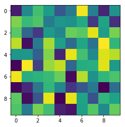


### Pandas
https://github.com/adeshpande3/Pandas-Tutorial/blob/master/Pandas%20Tutorial.ipynb


```python
df = pd.read_csv('data/RegularSeasonCompactResults.csv')
```


```python
df.shape
```


    (145289, 8)


```python
df.head(10)
```


<div>

<table border="1" class="dataframe">
  <thead>
    <tr style="text-align: right;">
      <th></th>
      <th>Season</th>
      <th>Daynum</th>
      <th>Wteam</th>
      <th>Wscore</th>
      <th>Lteam</th>
      <th>Lscore</th>
      <th>Wloc</th>
      <th>Numot</th>
    </tr>
  </thead>
  <tbody>
    <tr>
      <th>0</th>
      <td>1985</td>
      <td>20</td>
      <td>1228</td>
      <td>81</td>
      <td>1328</td>
      <td>64</td>
      <td>N</td>
      <td>0</td>
    </tr>
    <tr>
      <th>1</th>
      <td>1985</td>
      <td>25</td>
      <td>1106</td>
      <td>77</td>
      <td>1354</td>
      <td>70</td>
      <td>H</td>
      <td>0</td>
    </tr>
    <tr>
      <th>2</th>
      <td>1985</td>
      <td>25</td>
      <td>1112</td>
      <td>63</td>
      <td>1223</td>
      <td>56</td>
      <td>H</td>
      <td>0</td>
    </tr>
    <tr>
      <th>3</th>
      <td>1985</td>
      <td>25</td>
      <td>1165</td>
      <td>70</td>
      <td>1432</td>
      <td>54</td>
      <td>H</td>
      <td>0</td>
    </tr>
    <tr>
      <th>4</th>
      <td>1985</td>
      <td>25</td>
      <td>1192</td>
      <td>86</td>
      <td>1447</td>
      <td>74</td>
      <td>H</td>
      <td>0</td>
    </tr>
    <tr>
      <th>5</th>
      <td>1985</td>
      <td>25</td>
      <td>1218</td>
      <td>79</td>
      <td>1337</td>
      <td>78</td>
      <td>H</td>
      <td>0</td>
    </tr>
    <tr>
      <th>6</th>
      <td>1985</td>
      <td>25</td>
      <td>1228</td>
      <td>64</td>
      <td>1226</td>
      <td>44</td>
      <td>N</td>
      <td>0</td>
    </tr>
    <tr>
      <th>7</th>
      <td>1985</td>
      <td>25</td>
      <td>1242</td>
      <td>58</td>
      <td>1268</td>
      <td>56</td>
      <td>N</td>
      <td>0</td>
    </tr>
    <tr>
      <th>8</th>
      <td>1985</td>
      <td>25</td>
      <td>1260</td>
      <td>98</td>
      <td>1133</td>
      <td>80</td>
      <td>H</td>
      <td>0</td>
    </tr>
    <tr>
      <th>9</th>
      <td>1985</td>
      <td>25</td>
      <td>1305</td>
      <td>97</td>
      <td>1424</td>
      <td>89</td>
      <td>H</td>
      <td>0</td>
    </tr>
  </tbody>
</table>
</div>


```python
df.tail(3)
```


<div>

<table border="1" class="dataframe">
  <thead>
    <tr style="text-align: right;">
      <th></th>
      <th>Season</th>
      <th>Daynum</th>
      <th>Wteam</th>
      <th>Wscore</th>
      <th>Lteam</th>
      <th>Lscore</th>
      <th>Wloc</th>
      <th>Numot</th>
    </tr>
  </thead>
  <tbody>
    <tr>
      <th>145286</th>
      <td>2016</td>
      <td>132</td>
      <td>1246</td>
      <td>82</td>
      <td>1401</td>
      <td>77</td>
      <td>N</td>
      <td>1</td>
    </tr>
    <tr>
      <th>145287</th>
      <td>2016</td>
      <td>132</td>
      <td>1277</td>
      <td>66</td>
      <td>1345</td>
      <td>62</td>
      <td>N</td>
      <td>0</td>
    </tr>
    <tr>
      <th>145288</th>
      <td>2016</td>
      <td>132</td>
      <td>1386</td>
      <td>87</td>
      <td>1433</td>
      <td>74</td>
      <td>N</td>
      <td>0</td>
    </tr>
  </tbody>
</table>
</div>


```python
df.shape
```


    (145289, 8)


```python
df.describe()
```


<div>

<table border="1" class="dataframe">
  <thead>
    <tr style="text-align: right;">
      <th></th>
      <th>Season</th>
      <th>Daynum</th>
      <th>Wteam</th>
      <th>Wscore</th>
      <th>Lteam</th>
      <th>Lscore</th>
      <th>Numot</th>
    </tr>
  </thead>
  <tbody>
    <tr>
      <th>count</th>
      <td>145289.000000</td>
      <td>145289.000000</td>
      <td>145289.000000</td>
      <td>145289.000000</td>
      <td>145289.000000</td>
      <td>145289.000000</td>
      <td>145289.000000</td>
    </tr>
    <tr>
      <th>mean</th>
      <td>2001.574834</td>
      <td>75.223816</td>
      <td>1286.720646</td>
      <td>76.600321</td>
      <td>1282.864064</td>
      <td>64.497009</td>
      <td>0.044387</td>
    </tr>
    <tr>
      <th>std</th>
      <td>9.233342</td>
      <td>33.287418</td>
      <td>104.570275</td>
      <td>12.173033</td>
      <td>104.829234</td>
      <td>11.380625</td>
      <td>0.247819</td>
    </tr>
    <tr>
      <th>min</th>
      <td>1985.000000</td>
      <td>0.000000</td>
      <td>1101.000000</td>
      <td>34.000000</td>
      <td>1101.000000</td>
      <td>20.000000</td>
      <td>0.000000</td>
    </tr>
    <tr>
      <th>25%</th>
      <td>1994.000000</td>
      <td>47.000000</td>
      <td>1198.000000</td>
      <td>68.000000</td>
      <td>1191.000000</td>
      <td>57.000000</td>
      <td>0.000000</td>
    </tr>
    <tr>
      <th>50%</th>
      <td>2002.000000</td>
      <td>78.000000</td>
      <td>1284.000000</td>
      <td>76.000000</td>
      <td>1280.000000</td>
      <td>64.000000</td>
      <td>0.000000</td>
    </tr>
    <tr>
      <th>75%</th>
      <td>2010.000000</td>
      <td>103.000000</td>
      <td>1379.000000</td>
      <td>84.000000</td>
      <td>1375.000000</td>
      <td>72.000000</td>
      <td>0.000000</td>
    </tr>
    <tr>
      <th>max</th>
      <td>2016.000000</td>
      <td>132.000000</td>
      <td>1464.000000</td>
      <td>186.000000</td>
      <td>1464.000000</td>
      <td>150.000000</td>
      <td>6.000000</td>
    </tr>
  </tbody>
</table>
</div>


```python
df['Wscore']
```


    0          81
    1          77
    2          63
    3          70
    4          86
    5          79
    6          64
    7          58
    8          98
    9          97
    10        103
    11         75
    12         91
    13         70
    14         87
    15         65
    16         92
    17         65
    18         58
    19         50
    20         47
    21         55
    22         76
    23         59
    24         79
    25        106
    26         95
    27         79
    28         64
    29         76
             ... 
    145259     69
    145260     72
    145261     64
    145262     77
    145263     57
    145264     68
    145265     81
    145266     64
    145267     81
    145268     93
    145269     74
    145270     64
    145271     55
    145272     61
    145273     88
    145274     76
    145275     69
    145276     82
    145277     54
    145278     82
    145279     80
    145280     71
    145281     82
    145282     76
    145283     62
    145284     70
    145285     72
    145286     82
    145287     66
    145288     87
    Name: Wscore, Length: 145289, dtype: int64


```python
df['Wscore'].max(), df['Wscore'].mean(), df['Wscore'].argmax()
```


    (186, 76.60032074004226, 24970)


```python
df['Season'].value_counts()
```


    2016    5369
    2014    5362
    2015    5354
    2013    5320
    2010    5263
    2012    5253
    2009    5249
    2011    5246
    2008    5163
    2007    5043
    2006    4757
    2005    4675
    2003    4616
    2004    4571
    2002    4555
    2000    4519
    2001    4467
    1999    4222
    1998    4167
    1997    4155
    1992    4127
    1991    4123
    1996    4122
    1995    4077
    1994    4060
    1990    4045
    1989    4037
    1993    3982
    1988    3955
    1987    3915
    1986    3783
    1985    3737
    Name: Season, dtype: int64


```python
np.unique(df['Season'],return_counts=True)
```


    (array([1985, 1986, 1987, 1988, 1989, 1990, 1991, 1992, 1993, 1994, 1995,
            1996, 1997, 1998, 1999, 2000, 2001, 2002, 2003, 2004, 2005, 2006,
            2007, 2008, 2009, 2010, 2011, 2012, 2013, 2014, 2015, 2016]),
     array([3737, 3783, 3915, 3955, 4037, 4045, 4123, 4127, 3982, 4060, 4077,
            4122, 4155, 4167, 4222, 4519, 4467, 4555, 4616, 4571, 4675, 4757,
            5043, 5163, 5249, 5263, 5246, 5253, 5320, 5362, 5354, 5369]))


```python
df['Wscore'].argmax()
```


    24970


```python
df.iloc[df['Wscore'].argmax(),:3]
```


    Season    1991
    Daynum      68
    Wteam     1258
    Name: 24970, dtype: object


```python
df.loc[np.where(df['Wscore']==186)[0], 'Lscore']
```


    24970    140
    Name: Lscore, dtype: int64


```python
df.sort_values('Lscore').head()
```


<div>

<table border="1" class="dataframe">
  <thead>
    <tr style="text-align: right;">
      <th></th>
      <th>Season</th>
      <th>Daynum</th>
      <th>Wteam</th>
      <th>Wscore</th>
      <th>Lteam</th>
      <th>Lscore</th>
      <th>Wloc</th>
      <th>Numot</th>
    </tr>
  </thead>
  <tbody>
    <tr>
      <th>100027</th>
      <td>2008</td>
      <td>66</td>
      <td>1203</td>
      <td>49</td>
      <td>1387</td>
      <td>20</td>
      <td>H</td>
      <td>0</td>
    </tr>
    <tr>
      <th>49310</th>
      <td>1997</td>
      <td>66</td>
      <td>1157</td>
      <td>61</td>
      <td>1204</td>
      <td>21</td>
      <td>H</td>
      <td>0</td>
    </tr>
    <tr>
      <th>89021</th>
      <td>2006</td>
      <td>44</td>
      <td>1284</td>
      <td>41</td>
      <td>1343</td>
      <td>21</td>
      <td>A</td>
      <td>0</td>
    </tr>
    <tr>
      <th>85042</th>
      <td>2005</td>
      <td>66</td>
      <td>1131</td>
      <td>73</td>
      <td>1216</td>
      <td>22</td>
      <td>H</td>
      <td>0</td>
    </tr>
    <tr>
      <th>103660</th>
      <td>2009</td>
      <td>26</td>
      <td>1326</td>
      <td>59</td>
      <td>1359</td>
      <td>22</td>
      <td>H</td>
      <td>0</td>
    </tr>
  </tbody>
</table>
</div>


```python
df[(df['Wscore'] > 150) & (df['Lscore'] < 100)]
```


<div>

<table border="1" class="dataframe">
  <thead>
    <tr style="text-align: right;">
      <th></th>
      <th>Season</th>
      <th>Daynum</th>
      <th>Wteam</th>
      <th>Wscore</th>
      <th>Lteam</th>
      <th>Lscore</th>
      <th>Wloc</th>
      <th>Numot</th>
    </tr>
  </thead>
  <tbody>
    <tr>
      <th>12046</th>
      <td>1988</td>
      <td>40</td>
      <td>1328</td>
      <td>152</td>
      <td>1147</td>
      <td>84</td>
      <td>H</td>
      <td>0</td>
    </tr>
    <tr>
      <th>12355</th>
      <td>1988</td>
      <td>52</td>
      <td>1328</td>
      <td>151</td>
      <td>1173</td>
      <td>99</td>
      <td>N</td>
      <td>0</td>
    </tr>
    <tr>
      <th>25656</th>
      <td>1991</td>
      <td>84</td>
      <td>1106</td>
      <td>151</td>
      <td>1212</td>
      <td>97</td>
      <td>H</td>
      <td>0</td>
    </tr>
    <tr>
      <th>28687</th>
      <td>1992</td>
      <td>54</td>
      <td>1261</td>
      <td>159</td>
      <td>1319</td>
      <td>86</td>
      <td>H</td>
      <td>0</td>
    </tr>
    <tr>
      <th>35023</th>
      <td>1993</td>
      <td>112</td>
      <td>1380</td>
      <td>155</td>
      <td>1341</td>
      <td>91</td>
      <td>A</td>
      <td>0</td>
    </tr>
    <tr>
      <th>52600</th>
      <td>1998</td>
      <td>33</td>
      <td>1395</td>
      <td>153</td>
      <td>1410</td>
      <td>87</td>
      <td>H</td>
      <td>0</td>
    </tr>
  </tbody>
</table>
</div>


```python
df.groupby('Wteam')['Wscore'].mean().head()
```


    Wteam
    1101    78.111111
    1102    69.893204
    1103    75.839768
    1104    75.825944
    1105    74.960894
    Name: Wscore, dtype: float64


```python
df.groupby('Wteam')['Wloc'].value_counts().head(9)
```


    Wteam  Wloc
    1101   H        12
           A         3
           N         3
    1102   H       204
           A        73
           N        32
    1103   H       324
           A       153
           N        41
    Name: Wloc, dtype: int64


```python
df.values
```


    array([[1985, 20, 1228, ..., 64, 'N', 0],
           [1985, 25, 1106, ..., 70, 'H', 0],
           [1985, 25, 1112, ..., 56, 'H', 0],
           ...,
           [2016, 132, 1246, ..., 77, 'N', 1],
           [2016, 132, 1277, ..., 62, 'N', 0],
           [2016, 132, 1386, ..., 74, 'N', 0]], dtype=object)


```python
ax = df['Wscore'].plot.hist(bins=20)
ax.set_xlabel('Points for Winning Team')
```


    Text(0.5, 0, 'Points for Winning Team')


#### qgrid filtering


```python
!pip install qgrid
```

    Looking in indexes: https://pypi.tuna.tsinghua.edu.cn/simple
    Requirement already satisfied: qgrid in /apps/anaconda3/lib/python3.6/site-packages (1.1.1)
    Requirement already satisfied: notebook>=4.0.0 in /apps/anaconda3/lib/python3.6/site-packages (from qgrid) (5.7.8)
    Requirement already satisfied: pandas>=0.18.0 in /apps/anaconda3/lib/python3.6/site-packages (from qgrid) (0.22.0)
    Requirement already satisfied: ipywidgets>=7.0.0 in /apps/anaconda3/lib/python3.6/site-packages (from qgrid) (7.1.1)
    Requirement already satisfied: ipykernel in /apps/anaconda3/lib/python3.6/site-packages (from notebook>=4.0.0->qgrid) (4.8.0)
    Requirement already satisfied: jinja2 in /apps/anaconda3/lib/python3.6/site-packages (from notebook>=4.0.0->qgrid) (2.10)
    Requirement already satisfied: traitlets>=4.2.1 in /apps/anaconda3/lib/python3.6/site-packages (from notebook>=4.0.0->qgrid) (4.3.2)
    Requirement already satisfied: nbformat in /apps/anaconda3/lib/python3.6/site-packages (from notebook>=4.0.0->qgrid) (4.4.0)
    Requirement already satisfied: ipython-genutils in /apps/anaconda3/lib/python3.6/site-packages (from notebook>=4.0.0->qgrid) (0.2.0)
    Requirement already satisfied: tornado<7,>=4.1 in /apps/anaconda3/lib/python3.6/site-packages (from notebook>=4.0.0->qgrid) (6.0.2)
    Requirement already satisfied: jupyter-core>=4.4.0 in /apps/anaconda3/lib/python3.6/site-packages (from notebook>=4.0.0->qgrid) (4.4.0)
    Requirement already satisfied: jupyter-client>=5.2.0 in /apps/anaconda3/lib/python3.6/site-packages (from notebook>=4.0.0->qgrid) (5.2.2)
    Requirement already satisfied: prometheus-client in /apps/anaconda3/lib/python3.6/site-packages (from notebook>=4.0.0->qgrid) (0.6.0)
    Requirement already satisfied: terminado>=0.8.1 in /apps/anaconda3/lib/python3.6/site-packages (from notebook>=4.0.0->qgrid) (0.8.1)
    Requirement already satisfied: Send2Trash in /apps/anaconda3/lib/python3.6/site-packages (from notebook>=4.0.0->qgrid) (1.4.2)
    Requirement already satisfied: nbconvert in /apps/anaconda3/lib/python3.6/site-packages (from notebook>=4.0.0->qgrid) (5.5.0)
    Requirement already satisfied: pyzmq>=17 in /apps/anaconda3/lib/python3.6/site-packages (from notebook>=4.0.0->qgrid) (17.0.0)
    Requirement already satisfied: python-dateutil>=2 in /apps/anaconda3/lib/python3.6/site-packages (from pandas>=0.18.0->qgrid) (2.6.1)
    Requirement already satisfied: pytz>=2011k in /apps/anaconda3/lib/python3.6/site-packages (from pandas>=0.18.0->qgrid) (2017.3)
    Requirement already satisfied: numpy>=1.9.0 in /apps/anaconda3/lib/python3.6/site-packages (from pandas>=0.18.0->qgrid) (1.14.6)
    Requirement already satisfied: widgetsnbextension~=3.1.0 in /apps/anaconda3/lib/python3.6/site-packages (from ipywidgets>=7.0.0->qgrid) (3.1.0)
    Requirement already satisfied: ipython>=4.0.0 in /apps/anaconda3/lib/python3.6/site-packages (from ipywidgets>=7.0.0->qgrid) (7.2.0)
    Requirement already satisfied: MarkupSafe>=0.23 in /apps/anaconda3/lib/python3.6/site-packages (from jinja2->notebook>=4.0.0->qgrid) (1.0)
    Requirement already satisfied: six in /apps/anaconda3/lib/python3.6/site-packages (from traitlets>=4.2.1->notebook>=4.0.0->qgrid) (1.11.0)
    Requirement already satisfied: decorator in /apps/anaconda3/lib/python3.6/site-packages (from traitlets>=4.2.1->notebook>=4.0.0->qgrid) (4.2.1)
    Requirement already satisfied: jsonschema!=2.5.0,>=2.4 in /apps/anaconda3/lib/python3.6/site-packages (from nbformat->notebook>=4.0.0->qgrid) (2.6.0)
    Requirement already satisfied: entrypoints>=0.2.2 in /apps/anaconda3/lib/python3.6/site-packages (from nbconvert->notebook>=4.0.0->qgrid) (0.2.3)
    Requirement already satisfied: mistune>=0.8.1 in /apps/anaconda3/lib/python3.6/site-packages (from nbconvert->notebook>=4.0.0->qgrid) (0.8.3)
    Requirement already satisfied: defusedxml in /apps/anaconda3/lib/python3.6/site-packages (from nbconvert->notebook>=4.0.0->qgrid) (0.5.0)
    Requirement already satisfied: pandocfilters>=1.4.1 in /apps/anaconda3/lib/python3.6/site-packages (from nbconvert->notebook>=4.0.0->qgrid) (1.4.2)
    Requirement already satisfied: pygments in /apps/anaconda3/lib/python3.6/site-packages (from nbconvert->notebook>=4.0.0->qgrid) (2.2.0)
    Requirement already satisfied: bleach in /apps/anaconda3/lib/python3.6/site-packages (from nbconvert->notebook>=4.0.0->qgrid) (1.5.0)
    Requirement already satisfied: testpath in /apps/anaconda3/lib/python3.6/site-packages (from nbconvert->notebook>=4.0.0->qgrid) (0.3.1)
    Requirement already satisfied: setuptools>=18.5 in /apps/anaconda3/lib/python3.6/site-packages (from ipython>=4.0.0->ipywidgets>=7.0.0->qgrid) (36.4.0)
    Requirement already satisfied: jedi>=0.10 in /apps/anaconda3/lib/python3.6/site-packages (from ipython>=4.0.0->ipywidgets>=7.0.0->qgrid) (0.11.1)
    Requirement already satisfied: pickleshare in /apps/anaconda3/lib/python3.6/site-packages (from ipython>=4.0.0->ipywidgets>=7.0.0->qgrid) (0.7.4)
    Requirement already satisfied: prompt_toolkit<2.1.0,>=2.0.0 in /apps/anaconda3/lib/python3.6/site-packages (from ipython>=4.0.0->ipywidgets>=7.0.0->qgrid) (2.0.7)
    Requirement already satisfied: backcall in /apps/anaconda3/lib/python3.6/site-packages (from ipython>=4.0.0->ipywidgets>=7.0.0->qgrid) (0.1.0)
    Requirement already satisfied: pexpect in /apps/anaconda3/lib/python3.6/site-packages (from ipython>=4.0.0->ipywidgets>=7.0.0->qgrid) (4.3.1)
    Requirement already satisfied: html5lib!=0.9999,!=0.99999,<0.99999999,>=0.999 in /apps/anaconda3/lib/python3.6/site-packages (from bleach->nbconvert->notebook>=4.0.0->qgrid) (0.9999999)
    Requirement already satisfied: parso==0.1.* in /apps/anaconda3/lib/python3.6/site-packages (from jedi>=0.10->ipython>=4.0.0->ipywidgets>=7.0.0->qgrid) (0.1.1)
    Requirement already satisfied: wcwidth in /apps/anaconda3/lib/python3.6/site-packages (from prompt_toolkit<2.1.0,>=2.0.0->ipython>=4.0.0->ipywidgets>=7.0.0->qgrid) (0.1.7)


```python
import numpy as np
import pandas as pd
import qgrid
randn = np.random.randn
df_types = pd.DataFrame({
    'A' : 1.,
    'B' : pd.Series(['2013-01-01', '2013-01-02', '2013-01-03', '2013-01-04',
               '2013-01-05', '2013-01-06', '2013-01-07', '2013-01-08', '2013-01-09'],index=list(range(9)),dtype='datetime64[ns]'),
    'C' : pd.Series(randn(9),index=list(range(9)),dtype='float32'),
    'D' : np.array([3] * 9,dtype='int32'),
    'E' : pd.Categorical(["washington", "adams", "washington", "madison", "lincoln","jefferson", "hamilton", "roosevelt", "kennedy"]),
    'F' : ["foo", "bar", "buzz", "bippity","boppity", "foo", "foo", "bar", "zoo"] })
df_types['G'] = df_types['F'] == 'foo'
qgrid_widget = qgrid.show_grid(df_types, show_toolbar=True)
qgrid_widget
```


<p>Failed to display Jupyter Widget of type <code>QgridWidget</code>.</p>
<p>
  If you're reading this message in the Jupyter Notebook or JupyterLab Notebook, it may mean
  that the widgets JavaScript is still loading. If this message persists, it
  likely means that the widgets JavaScript library is either not installed or
  not enabled. See the <a href="https://ipywidgets.readthedocs.io/en/stable/user_install.html">Jupyter
  Widgets Documentation</a> for setup instructions.
</p>
<p>
  If you're reading this message in another frontend (for example, a static
  rendering on GitHub or <a href="https://nbviewer.jupyter.org/">NBViewer</a>),
  it may mean that your frontend doesn't currently support widgets.
</p>


```python
qgrid_widget.get_changed_df()
```


<div>

<table border="1" class="dataframe">
  <thead>
    <tr style="text-align: right;">
      <th></th>
      <th>A</th>
      <th>B</th>
      <th>C</th>
      <th>D</th>
      <th>E</th>
      <th>F</th>
      <th>G</th>
    </tr>
  </thead>
  <tbody>
    <tr>
      <th>0</th>
      <td>1.0</td>
      <td>2013-01-01</td>
      <td>1.222802</td>
      <td>3</td>
      <td>washington</td>
      <td>foo</td>
      <td>True</td>
    </tr>
    <tr>
      <th>1</th>
      <td>1.0</td>
      <td>2013-01-02</td>
      <td>0.657771</td>
      <td>3</td>
      <td>adams</td>
      <td>bar</td>
      <td>False</td>
    </tr>
    <tr>
      <th>2</th>
      <td>1.0</td>
      <td>2013-01-03</td>
      <td>-0.495464</td>
      <td>3</td>
      <td>washington</td>
      <td>buzz</td>
      <td>False</td>
    </tr>
    <tr>
      <th>3</th>
      <td>1.0</td>
      <td>2013-01-04</td>
      <td>0.660043</td>
      <td>3</td>
      <td>madison</td>
      <td>bippity</td>
      <td>False</td>
    </tr>
    <tr>
      <th>4</th>
      <td>1.0</td>
      <td>2013-01-05</td>
      <td>-0.889266</td>
      <td>3</td>
      <td>lincoln</td>
      <td>boppity</td>
      <td>False</td>
    </tr>
    <tr>
      <th>5</th>
      <td>1.0</td>
      <td>2013-01-06</td>
      <td>-0.358781</td>
      <td>3</td>
      <td>jefferson</td>
      <td>foo</td>
      <td>True</td>
    </tr>
    <tr>
      <th>6</th>
      <td>1.0</td>
      <td>2013-01-07</td>
      <td>-1.225270</td>
      <td>3</td>
      <td>hamilton</td>
      <td>foo</td>
      <td>True</td>
    </tr>
    <tr>
      <th>7</th>
      <td>1.0</td>
      <td>2013-01-08</td>
      <td>0.453575</td>
      <td>3</td>
      <td>roosevelt</td>
      <td>bar</td>
      <td>False</td>
    </tr>
    <tr>
      <th>8</th>
      <td>1.0</td>
      <td>2013-01-09</td>
      <td>1.123733</td>
      <td>3</td>
      <td>kennedy</td>
      <td>zoo</td>
      <td>False</td>
    </tr>
  </tbody>
</table>
</div>


### Matplotlib


```python
x
```


    [3, 7, 2, 11, 8, 10, 4, 3]


```python
np.sin(x)
```


    array([ 0.14112001,  0.6569866 ,  0.90929743, -0.99999021,  0.98935825,
           -0.54402111, -0.7568025 ,  0.14112001])


```python
x = np.linspace(0, 2 * np.pi, 50)
plt.plot(x, np.sin(x))
```


    [<matplotlib.lines.Line2D at 0x7f60e5b59208>]


```python
#use ax and figure
fig,ax=plt.subplots(figsize=(8,3))

x = np.linspace(0, 2 * np.pi, 50)
ax.plot(x, np.sin(x))
```


    [<matplotlib.lines.Line2D at 0x7f60e5b82ac8>]


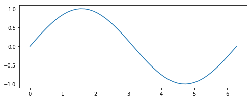


```python
#use ax and figure
fig,ax=plt.subplots(2,3,figsize=(18,6))

for i in range(2):
    for j in range(3):
        x = np.linspace(0, 2 * np.pi * (i*3+j+1), 50)
        ax[i,j].plot(x, np.sin(x)) 
```


```python
fig,ax=plt.subplots(figsize=(4,4))
x = np.random.rand(100)
y = np.random.rand(100)
size = np.random.rand(100) * 50
colour = np.random.rand(100)
scatter = ax.scatter(x, y, size, colour)
fig.colorbar(scatter)
```


    <matplotlib.colorbar.Colorbar at 0x7f60e5857ac8>


```python
fig,ax=plt.subplots(figsize=(6,3))
x = np.random.randn(1000)
ax.hist(x, 50)
```


    (array([ 1.,  0.,  1.,  1.,  1.,  2.,  3.,  3.,  3.,  6.,  8., 11., 10.,
            14., 19., 17., 26., 29., 22., 30., 40., 33., 51., 49., 45., 59.,
            57., 43., 47., 52., 39., 38., 40., 24., 27., 31., 24., 16., 11.,
            18., 15.,  9.,  7.,  5.,  4.,  4.,  1.,  2.,  1.,  1.]),
     array([-3.34936768, -3.22278804, -3.09620839, -2.96962874, -2.8430491 ,
            -2.71646945, -2.5898898 , -2.46331016, -2.33673051, -2.21015086,
            -2.08357122, -1.95699157, -1.83041193, -1.70383228, -1.57725263,
            -1.45067299, -1.32409334, -1.19751369, -1.07093405, -0.9443544 ,
            -0.81777475, -0.69119511, -0.56461546, -0.43803581, -0.31145617,
            -0.18487652, -0.05829687,  0.06828277,  0.19486242,  0.32144206,
             0.44802171,  0.57460136,  0.701181  ,  0.82776065,  0.9543403 ,
             1.08091994,  1.20749959,  1.33407924,  1.46065888,  1.58723853,
             1.71381818,  1.84039782,  1.96697747,  2.09355711,  2.22013676,
             2.34671641,  2.47329605,  2.5998757 ,  2.72645535,  2.85303499,
             2.97961464]),
     <a list of 50 Patch objects>)


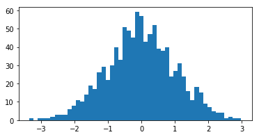


### Seaborn
use boxplot as an example
https://seaborn.pydata.org/generated/seaborn.boxplot.html


```python
import numpy as np
import pandas as pd
np.random.seed(44)
import matplotlib.pyplot as plt
import seaborn as sns
%matplotlib inline
import warnings
warnings.filterwarnings("ignore")

# Let us also get tableau colors we defined earlier:
tableau_20 = [(31, 119, 180), (174, 199, 232), (255, 127, 14), (255, 187, 120),
         (44, 160, 44), (152, 223, 138), (214, 39, 40), (255, 152, 150),
         (148, 103, 189), (197, 176, 213), (140, 86, 75), (196, 156, 148),
         (227, 119, 194), (247, 182, 210), (127, 127, 127), (199, 199, 199),
         (188, 189, 34), (219, 219, 141), (23, 190, 207), (158, 218, 229)]

# Scaling above RGB values to [0, 1] range, which is Matplotlib acceptable format:
for i in range(len(tableau_20)):
    r, g, b = tableau_20[i]
    tableau_20[i] = (r / 255., g / 255., b / 255.)
```


```python
# Loading built-in Tips dataset:
tips = sns.load_dataset("tips")
tips
```


<div>

<table border="1" class="dataframe">
  <thead>
    <tr style="text-align: right;">
      <th></th>
      <th>total_bill</th>
      <th>tip</th>
      <th>sex</th>
      <th>smoker</th>
      <th>day</th>
      <th>time</th>
      <th>size</th>
    </tr>
  </thead>
  <tbody>
    <tr>
      <th>0</th>
      <td>16.99</td>
      <td>1.01</td>
      <td>Female</td>
      <td>No</td>
      <td>Sun</td>
      <td>Dinner</td>
      <td>2</td>
    </tr>
    <tr>
      <th>1</th>
      <td>10.34</td>
      <td>1.66</td>
      <td>Male</td>
      <td>No</td>
      <td>Sun</td>
      <td>Dinner</td>
      <td>3</td>
    </tr>
    <tr>
      <th>2</th>
      <td>21.01</td>
      <td>3.50</td>
      <td>Male</td>
      <td>No</td>
      <td>Sun</td>
      <td>Dinner</td>
      <td>3</td>
    </tr>
    <tr>
      <th>3</th>
      <td>23.68</td>
      <td>3.31</td>
      <td>Male</td>
      <td>No</td>
      <td>Sun</td>
      <td>Dinner</td>
      <td>2</td>
    </tr>
    <tr>
      <th>4</th>
      <td>24.59</td>
      <td>3.61</td>
      <td>Female</td>
      <td>No</td>
      <td>Sun</td>
      <td>Dinner</td>
      <td>4</td>
    </tr>
    <tr>
      <th>5</th>
      <td>25.29</td>
      <td>4.71</td>
      <td>Male</td>
      <td>No</td>
      <td>Sun</td>
      <td>Dinner</td>
      <td>4</td>
    </tr>
    <tr>
      <th>6</th>
      <td>8.77</td>
      <td>2.00</td>
      <td>Male</td>
      <td>No</td>
      <td>Sun</td>
      <td>Dinner</td>
      <td>2</td>
    </tr>
    <tr>
      <th>7</th>
      <td>26.88</td>
      <td>3.12</td>
      <td>Male</td>
      <td>No</td>
      <td>Sun</td>
      <td>Dinner</td>
      <td>4</td>
    </tr>
    <tr>
      <th>8</th>
      <td>15.04</td>
      <td>1.96</td>
      <td>Male</td>
      <td>No</td>
      <td>Sun</td>
      <td>Dinner</td>
      <td>2</td>
    </tr>
    <tr>
      <th>9</th>
      <td>14.78</td>
      <td>3.23</td>
      <td>Male</td>
      <td>No</td>
      <td>Sun</td>
      <td>Dinner</td>
      <td>2</td>
    </tr>
    <tr>
      <th>10</th>
      <td>10.27</td>
      <td>1.71</td>
      <td>Male</td>
      <td>No</td>
      <td>Sun</td>
      <td>Dinner</td>
      <td>2</td>
    </tr>
    <tr>
      <th>11</th>
      <td>35.26</td>
      <td>5.00</td>
      <td>Female</td>
      <td>No</td>
      <td>Sun</td>
      <td>Dinner</td>
      <td>4</td>
    </tr>
    <tr>
      <th>12</th>
      <td>15.42</td>
      <td>1.57</td>
      <td>Male</td>
      <td>No</td>
      <td>Sun</td>
      <td>Dinner</td>
      <td>2</td>
    </tr>
    <tr>
      <th>13</th>
      <td>18.43</td>
      <td>3.00</td>
      <td>Male</td>
      <td>No</td>
      <td>Sun</td>
      <td>Dinner</td>
      <td>4</td>
    </tr>
    <tr>
      <th>14</th>
      <td>14.83</td>
      <td>3.02</td>
      <td>Female</td>
      <td>No</td>
      <td>Sun</td>
      <td>Dinner</td>
      <td>2</td>
    </tr>
    <tr>
      <th>15</th>
      <td>21.58</td>
      <td>3.92</td>
      <td>Male</td>
      <td>No</td>
      <td>Sun</td>
      <td>Dinner</td>
      <td>2</td>
    </tr>
    <tr>
      <th>16</th>
      <td>10.33</td>
      <td>1.67</td>
      <td>Female</td>
      <td>No</td>
      <td>Sun</td>
      <td>Dinner</td>
      <td>3</td>
    </tr>
    <tr>
      <th>17</th>
      <td>16.29</td>
      <td>3.71</td>
      <td>Male</td>
      <td>No</td>
      <td>Sun</td>
      <td>Dinner</td>
      <td>3</td>
    </tr>
    <tr>
      <th>18</th>
      <td>16.97</td>
      <td>3.50</td>
      <td>Female</td>
      <td>No</td>
      <td>Sun</td>
      <td>Dinner</td>
      <td>3</td>
    </tr>
    <tr>
      <th>19</th>
      <td>20.65</td>
      <td>3.35</td>
      <td>Male</td>
      <td>No</td>
      <td>Sat</td>
      <td>Dinner</td>
      <td>3</td>
    </tr>
    <tr>
      <th>20</th>
      <td>17.92</td>
      <td>4.08</td>
      <td>Male</td>
      <td>No</td>
      <td>Sat</td>
      <td>Dinner</td>
      <td>2</td>
    </tr>
    <tr>
      <th>21</th>
      <td>20.29</td>
      <td>2.75</td>
      <td>Female</td>
      <td>No</td>
      <td>Sat</td>
      <td>Dinner</td>
      <td>2</td>
    </tr>
    <tr>
      <th>22</th>
      <td>15.77</td>
      <td>2.23</td>
      <td>Female</td>
      <td>No</td>
      <td>Sat</td>
      <td>Dinner</td>
      <td>2</td>
    </tr>
    <tr>
      <th>23</th>
      <td>39.42</td>
      <td>7.58</td>
      <td>Male</td>
      <td>No</td>
      <td>Sat</td>
      <td>Dinner</td>
      <td>4</td>
    </tr>
    <tr>
      <th>24</th>
      <td>19.82</td>
      <td>3.18</td>
      <td>Male</td>
      <td>No</td>
      <td>Sat</td>
      <td>Dinner</td>
      <td>2</td>
    </tr>
    <tr>
      <th>25</th>
      <td>17.81</td>
      <td>2.34</td>
      <td>Male</td>
      <td>No</td>
      <td>Sat</td>
      <td>Dinner</td>
      <td>4</td>
    </tr>
    <tr>
      <th>26</th>
      <td>13.37</td>
      <td>2.00</td>
      <td>Male</td>
      <td>No</td>
      <td>Sat</td>
      <td>Dinner</td>
      <td>2</td>
    </tr>
    <tr>
      <th>27</th>
      <td>12.69</td>
      <td>2.00</td>
      <td>Male</td>
      <td>No</td>
      <td>Sat</td>
      <td>Dinner</td>
      <td>2</td>
    </tr>
    <tr>
      <th>28</th>
      <td>21.70</td>
      <td>4.30</td>
      <td>Male</td>
      <td>No</td>
      <td>Sat</td>
      <td>Dinner</td>
      <td>2</td>
    </tr>
    <tr>
      <th>29</th>
      <td>19.65</td>
      <td>3.00</td>
      <td>Female</td>
      <td>No</td>
      <td>Sat</td>
      <td>Dinner</td>
      <td>2</td>
    </tr>
    <tr>
      <th>...</th>
      <td>...</td>
      <td>...</td>
      <td>...</td>
      <td>...</td>
      <td>...</td>
      <td>...</td>
      <td>...</td>
    </tr>
    <tr>
      <th>214</th>
      <td>28.17</td>
      <td>6.50</td>
      <td>Female</td>
      <td>Yes</td>
      <td>Sat</td>
      <td>Dinner</td>
      <td>3</td>
    </tr>
    <tr>
      <th>215</th>
      <td>12.90</td>
      <td>1.10</td>
      <td>Female</td>
      <td>Yes</td>
      <td>Sat</td>
      <td>Dinner</td>
      <td>2</td>
    </tr>
    <tr>
      <th>216</th>
      <td>28.15</td>
      <td>3.00</td>
      <td>Male</td>
      <td>Yes</td>
      <td>Sat</td>
      <td>Dinner</td>
      <td>5</td>
    </tr>
    <tr>
      <th>217</th>
      <td>11.59</td>
      <td>1.50</td>
      <td>Male</td>
      <td>Yes</td>
      <td>Sat</td>
      <td>Dinner</td>
      <td>2</td>
    </tr>
    <tr>
      <th>218</th>
      <td>7.74</td>
      <td>1.44</td>
      <td>Male</td>
      <td>Yes</td>
      <td>Sat</td>
      <td>Dinner</td>
      <td>2</td>
    </tr>
    <tr>
      <th>219</th>
      <td>30.14</td>
      <td>3.09</td>
      <td>Female</td>
      <td>Yes</td>
      <td>Sat</td>
      <td>Dinner</td>
      <td>4</td>
    </tr>
    <tr>
      <th>220</th>
      <td>12.16</td>
      <td>2.20</td>
      <td>Male</td>
      <td>Yes</td>
      <td>Fri</td>
      <td>Lunch</td>
      <td>2</td>
    </tr>
    <tr>
      <th>221</th>
      <td>13.42</td>
      <td>3.48</td>
      <td>Female</td>
      <td>Yes</td>
      <td>Fri</td>
      <td>Lunch</td>
      <td>2</td>
    </tr>
    <tr>
      <th>222</th>
      <td>8.58</td>
      <td>1.92</td>
      <td>Male</td>
      <td>Yes</td>
      <td>Fri</td>
      <td>Lunch</td>
      <td>1</td>
    </tr>
    <tr>
      <th>223</th>
      <td>15.98</td>
      <td>3.00</td>
      <td>Female</td>
      <td>No</td>
      <td>Fri</td>
      <td>Lunch</td>
      <td>3</td>
    </tr>
    <tr>
      <th>224</th>
      <td>13.42</td>
      <td>1.58</td>
      <td>Male</td>
      <td>Yes</td>
      <td>Fri</td>
      <td>Lunch</td>
      <td>2</td>
    </tr>
    <tr>
      <th>225</th>
      <td>16.27</td>
      <td>2.50</td>
      <td>Female</td>
      <td>Yes</td>
      <td>Fri</td>
      <td>Lunch</td>
      <td>2</td>
    </tr>
    <tr>
      <th>226</th>
      <td>10.09</td>
      <td>2.00</td>
      <td>Female</td>
      <td>Yes</td>
      <td>Fri</td>
      <td>Lunch</td>
      <td>2</td>
    </tr>
    <tr>
      <th>227</th>
      <td>20.45</td>
      <td>3.00</td>
      <td>Male</td>
      <td>No</td>
      <td>Sat</td>
      <td>Dinner</td>
      <td>4</td>
    </tr>
    <tr>
      <th>228</th>
      <td>13.28</td>
      <td>2.72</td>
      <td>Male</td>
      <td>No</td>
      <td>Sat</td>
      <td>Dinner</td>
      <td>2</td>
    </tr>
    <tr>
      <th>229</th>
      <td>22.12</td>
      <td>2.88</td>
      <td>Female</td>
      <td>Yes</td>
      <td>Sat</td>
      <td>Dinner</td>
      <td>2</td>
    </tr>
    <tr>
      <th>230</th>
      <td>24.01</td>
      <td>2.00</td>
      <td>Male</td>
      <td>Yes</td>
      <td>Sat</td>
      <td>Dinner</td>
      <td>4</td>
    </tr>
    <tr>
      <th>231</th>
      <td>15.69</td>
      <td>3.00</td>
      <td>Male</td>
      <td>Yes</td>
      <td>Sat</td>
      <td>Dinner</td>
      <td>3</td>
    </tr>
    <tr>
      <th>232</th>
      <td>11.61</td>
      <td>3.39</td>
      <td>Male</td>
      <td>No</td>
      <td>Sat</td>
      <td>Dinner</td>
      <td>2</td>
    </tr>
    <tr>
      <th>233</th>
      <td>10.77</td>
      <td>1.47</td>
      <td>Male</td>
      <td>No</td>
      <td>Sat</td>
      <td>Dinner</td>
      <td>2</td>
    </tr>
    <tr>
      <th>234</th>
      <td>15.53</td>
      <td>3.00</td>
      <td>Male</td>
      <td>Yes</td>
      <td>Sat</td>
      <td>Dinner</td>
      <td>2</td>
    </tr>
    <tr>
      <th>235</th>
      <td>10.07</td>
      <td>1.25</td>
      <td>Male</td>
      <td>No</td>
      <td>Sat</td>
      <td>Dinner</td>
      <td>2</td>
    </tr>
    <tr>
      <th>236</th>
      <td>12.60</td>
      <td>1.00</td>
      <td>Male</td>
      <td>Yes</td>
      <td>Sat</td>
      <td>Dinner</td>
      <td>2</td>
    </tr>
    <tr>
      <th>237</th>
      <td>32.83</td>
      <td>1.17</td>
      <td>Male</td>
      <td>Yes</td>
      <td>Sat</td>
      <td>Dinner</td>
      <td>2</td>
    </tr>
    <tr>
      <th>238</th>
      <td>35.83</td>
      <td>4.67</td>
      <td>Female</td>
      <td>No</td>
      <td>Sat</td>
      <td>Dinner</td>
      <td>3</td>
    </tr>
    <tr>
      <th>239</th>
      <td>29.03</td>
      <td>5.92</td>
      <td>Male</td>
      <td>No</td>
      <td>Sat</td>
      <td>Dinner</td>
      <td>3</td>
    </tr>
    <tr>
      <th>240</th>
      <td>27.18</td>
      <td>2.00</td>
      <td>Female</td>
      <td>Yes</td>
      <td>Sat</td>
      <td>Dinner</td>
      <td>2</td>
    </tr>
    <tr>
      <th>241</th>
      <td>22.67</td>
      <td>2.00</td>
      <td>Male</td>
      <td>Yes</td>
      <td>Sat</td>
      <td>Dinner</td>
      <td>2</td>
    </tr>
    <tr>
      <th>242</th>
      <td>17.82</td>
      <td>1.75</td>
      <td>Male</td>
      <td>No</td>
      <td>Sat</td>
      <td>Dinner</td>
      <td>2</td>
    </tr>
    <tr>
      <th>243</th>
      <td>18.78</td>
      <td>3.00</td>
      <td>Female</td>
      <td>No</td>
      <td>Thur</td>
      <td>Dinner</td>
      <td>2</td>
    </tr>
  </tbody>
</table>
<p>244 rows × 7 columns</p>
</div>


```python
# Plotting basic Box Plot:
sns.boxplot(x="day", y="total_bill", data=tips)
```


    <matplotlib.axes._subplots.AxesSubplot at 0x7f60aa0c0390>


```python
sns.boxplot(x="day", y="total_bill", hue="smoker", data=tips, palette="coolwarm")
```


    <matplotlib.axes._subplots.AxesSubplot at 0x7f60aa02ae48>


```python
sns.boxplot(x="day", y="total_bill", data=tips)
sns.swarmplot(x="day", y="total_bill", data=tips, color=tableau_20[7])
```


    <matplotlib.axes._subplots.AxesSubplot at 0x7f60a9f22518>


```python
sns.violinplot(x="day", y="total_bill", data=tips)
sns.swarmplot(x="day", y="total_bill", data=tips, color=tableau_20[7])
```


    <matplotlib.axes._subplots.AxesSubplot at 0x7f60a9e4a278>


# interactive plotting
It is useful to use ipywidgets to tune the parameters to get a perfect plot
https://ipywidgets.readthedocs.io/en/stable/examples/Using%20Interact.html#Basic-interact


```python
from ipywidgets import interact, interactive, fixed, interact_manual
import ipywidgets as widgets
```


```python
def f(x):
    return x
```


```python
interact(f, x=10)
```


<p>Failed to display Jupyter Widget of type <code>interactive</code>.</p>
<p>
  If you're reading this message in the Jupyter Notebook or JupyterLab Notebook, it may mean
  that the widgets JavaScript is still loading. If this message persists, it
  likely means that the widgets JavaScript library is either not installed or
  not enabled. See the <a href="https://ipywidgets.readthedocs.io/en/stable/user_install.html">Jupyter
  Widgets Documentation</a> for setup instructions.
</p>
<p>
  If you're reading this message in another frontend (for example, a static
  rendering on GitHub or <a href="https://nbviewer.jupyter.org/">NBViewer</a>),
  it may mean that your frontend doesn't currently support widgets.
</p>


    <function __main__.f(x)>


```python
interact(f, x=True)
```


<p>Failed to display Jupyter Widget of type <code>interactive</code>.</p>
<p>
  If you're reading this message in the Jupyter Notebook or JupyterLab Notebook, it may mean
  that the widgets JavaScript is still loading. If this message persists, it
  likely means that the widgets JavaScript library is either not installed or
  not enabled. See the <a href="https://ipywidgets.readthedocs.io/en/stable/user_install.html">Jupyter
  Widgets Documentation</a> for setup instructions.
</p>
<p>
  If you're reading this message in another frontend (for example, a static
  rendering on GitHub or <a href="https://nbviewer.jupyter.org/">NBViewer</a>),
  it may mean that your frontend doesn't currently support widgets.
</p>


    <function __main__.f(x)>


```python
interact(f, x='Hi there!')
```


<p>Failed to display Jupyter Widget of type <code>interactive</code>.</p>
<p>
  If you're reading this message in the Jupyter Notebook or JupyterLab Notebook, it may mean
  that the widgets JavaScript is still loading. If this message persists, it
  likely means that the widgets JavaScript library is either not installed or
  not enabled. See the <a href="https://ipywidgets.readthedocs.io/en/stable/user_install.html">Jupyter
  Widgets Documentation</a> for setup instructions.
</p>
<p>
  If you're reading this message in another frontend (for example, a static
  rendering on GitHub or <a href="https://nbviewer.jupyter.org/">NBViewer</a>),
  it may mean that your frontend doesn't currently support widgets.
</p>


    <function __main__.f(x)>


fixed arguments


```python
def h(p, q):
    return (p, q)
```


```python
interact(h, p=5, q=fixed(20))
```


<p>Failed to display Jupyter Widget of type <code>interactive</code>.</p>
<p>
  If you're reading this message in the Jupyter Notebook or JupyterLab Notebook, it may mean
  that the widgets JavaScript is still loading. If this message persists, it
  likely means that the widgets JavaScript library is either not installed or
  not enabled. See the <a href="https://ipywidgets.readthedocs.io/en/stable/user_install.html">Jupyter
  Widgets Documentation</a> for setup instructions.
</p>
<p>
  If you're reading this message in another frontend (for example, a static
  rendering on GitHub or <a href="https://nbviewer.jupyter.org/">NBViewer</a>),
  it may mean that your frontend doesn't currently support widgets.
</p>


    <function __main__.h(p, q)>


Slider


```python
interact(f, x=widgets.IntSlider(min=-10,max=30,step=1,value=10))
```


<p>Failed to display Jupyter Widget of type <code>interactive</code>.</p>
<p>
  If you're reading this message in the Jupyter Notebook or JupyterLab Notebook, it may mean
  that the widgets JavaScript is still loading. If this message persists, it
  likely means that the widgets JavaScript library is either not installed or
  not enabled. See the <a href="https://ipywidgets.readthedocs.io/en/stable/user_install.html">Jupyter
  Widgets Documentation</a> for setup instructions.
</p>
<p>
  If you're reading this message in another frontend (for example, a static
  rendering on GitHub or <a href="https://nbviewer.jupyter.org/">NBViewer</a>),
  it may mean that your frontend doesn't currently support widgets.
</p>


    <function __main__.f(x)>


```python
interact(f, x=(-10,10,1))
```


<p>Failed to display Jupyter Widget of type <code>interactive</code>.</p>
<p>
  If you're reading this message in the Jupyter Notebook or JupyterLab Notebook, it may mean
  that the widgets JavaScript is still loading. If this message persists, it
  likely means that the widgets JavaScript library is either not installed or
  not enabled. See the <a href="https://ipywidgets.readthedocs.io/en/stable/user_install.html">Jupyter
  Widgets Documentation</a> for setup instructions.
</p>
<p>
  If you're reading this message in another frontend (for example, a static
  rendering on GitHub or <a href="https://nbviewer.jupyter.org/">NBViewer</a>),
  it may mean that your frontend doesn't currently support widgets.
</p>


    <function __main__.f(x)>


```python
widgets.FloatSlider(
    value=7.5,
    min=0,
    max=10.0,
    step=0.1,
    description='Test:',
    disabled=False,
    continuous_update=False,
    orientation='vertical',
    readout=True,
    readout_format='.1f',
)
```


<p>Failed to display Jupyter Widget of type <code>FloatSlider</code>.</p>
<p>
  If you're reading this message in the Jupyter Notebook or JupyterLab Notebook, it may mean
  that the widgets JavaScript is still loading. If this message persists, it
  likely means that the widgets JavaScript library is either not installed or
  not enabled. See the <a href="https://ipywidgets.readthedocs.io/en/stable/user_install.html">Jupyter
  Widgets Documentation</a> for setup instructions.
</p>
<p>
  If you're reading this message in another frontend (for example, a static
  rendering on GitHub or <a href="https://nbviewer.jupyter.org/">NBViewer</a>),
  it may mean that your frontend doesn't currently support widgets.
</p>


```python
widgets.IntProgress(
    value=9,
    min=0,
    max=10,
    step=1,
    description='Loading:',
    bar_style='success', # 'success', 'info', 'warning', 'danger' or ''
    orientation='horizontal'
)
```


<p>Failed to display Jupyter Widget of type <code>IntProgress</code>.</p>
<p>
  If you're reading this message in the Jupyter Notebook or JupyterLab Notebook, it may mean
  that the widgets JavaScript is still loading. If this message persists, it
  likely means that the widgets JavaScript library is either not installed or
  not enabled. See the <a href="https://ipywidgets.readthedocs.io/en/stable/user_install.html">Jupyter
  Widgets Documentation</a> for setup instructions.
</p>
<p>
  If you're reading this message in another frontend (for example, a static
  rendering on GitHub or <a href="https://nbviewer.jupyter.org/">NBViewer</a>),
  it may mean that your frontend doesn't currently support widgets.
</p>


```python
widgets.BoundedFloatText(
    value=7.5,
    min=0,
    max=10.0,
    step=0.1,
    description='Text:',
    disabled=False
)
```


<p>Failed to display Jupyter Widget of type <code>BoundedFloatText</code>.</p>
<p>
  If you're reading this message in the Jupyter Notebook or JupyterLab Notebook, it may mean
  that the widgets JavaScript is still loading. If this message persists, it
  likely means that the widgets JavaScript library is either not installed or
  not enabled. See the <a href="https://ipywidgets.readthedocs.io/en/stable/user_install.html">Jupyter
  Widgets Documentation</a> for setup instructions.
</p>
<p>
  If you're reading this message in another frontend (for example, a static
  rendering on GitHub or <a href="https://nbviewer.jupyter.org/">NBViewer</a>),
  it may mean that your frontend doesn't currently support widgets.
</p>


```python
#Dropdown
widgets.Dropdown(
    options=['1', '2', '3'],
    value='2',
    description='Number:',
    disabled=False,
)
```


<p>Failed to display Jupyter Widget of type <code>Dropdown</code>.</p>
<p>
  If you're reading this message in the Jupyter Notebook or JupyterLab Notebook, it may mean
  that the widgets JavaScript is still loading. If this message persists, it
  likely means that the widgets JavaScript library is either not installed or
  not enabled. See the <a href="https://ipywidgets.readthedocs.io/en/stable/user_install.html">Jupyter
  Widgets Documentation</a> for setup instructions.
</p>
<p>
  If you're reading this message in another frontend (for example, a static
  rendering on GitHub or <a href="https://nbviewer.jupyter.org/">NBViewer</a>),
  it may mean that your frontend doesn't currently support widgets.
</p>


```python
widgets.RadioButtons(
    options=['holiday', 'work', 'study'],
#     value='pineapple',
    description='Pizza topping:',
    disabled=False
)
```


<p>Failed to display Jupyter Widget of type <code>RadioButtons</code>.</p>
<p>
  If you're reading this message in the Jupyter Notebook or JupyterLab Notebook, it may mean
  that the widgets JavaScript is still loading. If this message persists, it
  likely means that the widgets JavaScript library is either not installed or
  not enabled. See the <a href="https://ipywidgets.readthedocs.io/en/stable/user_install.html">Jupyter
  Widgets Documentation</a> for setup instructions.
</p>
<p>
  If you're reading this message in another frontend (for example, a static
  rendering on GitHub or <a href="https://nbviewer.jupyter.org/">NBViewer</a>),
  it may mean that your frontend doesn't currently support widgets.
</p>


```python
widgets.Select(
    options=['Linux', 'Windows', 'OSX'],
    value='OSX',
    # rows=10,
    description='OS:',
    disabled=False
)
```


<p>Failed to display Jupyter Widget of type <code>Select</code>.</p>
<p>
  If you're reading this message in the Jupyter Notebook or JupyterLab Notebook, it may mean
  that the widgets JavaScript is still loading. If this message persists, it
  likely means that the widgets JavaScript library is either not installed or
  not enabled. See the <a href="https://ipywidgets.readthedocs.io/en/stable/user_install.html">Jupyter
  Widgets Documentation</a> for setup instructions.
</p>
<p>
  If you're reading this message in another frontend (for example, a static
  rendering on GitHub or <a href="https://nbviewer.jupyter.org/">NBViewer</a>),
  it may mean that your frontend doesn't currently support widgets.
</p>


```python
widgets.SelectMultiple(
    options=['Ubuntu', 'CentOS','RedHat','Raspberry','Windows10', 'Mac OS Majove'],
    description='OS:',
)
```


<p>Failed to display Jupyter Widget of type <code>SelectMultiple</code>.</p>
<p>
  If you're reading this message in the Jupyter Notebook or JupyterLab Notebook, it may mean
  that the widgets JavaScript is still loading. If this message persists, it
  likely means that the widgets JavaScript library is either not installed or
  not enabled. See the <a href="https://ipywidgets.readthedocs.io/en/stable/user_install.html">Jupyter
  Widgets Documentation</a> for setup instructions.
</p>
<p>
  If you're reading this message in another frontend (for example, a static
  rendering on GitHub or <a href="https://nbviewer.jupyter.org/">NBViewer</a>),
  it may mean that your frontend doesn't currently support widgets.
</p>


```python
import datetime
dates = [datetime.date(2015,i,1) for i in range(1,13)]
options = [(i.strftime('%b'), i) for i in dates]
widgets.SelectionRangeSlider(
    options=options,
    index=(0,11),
    description='Months (2015)',
    disabled=False
)
```


<p>Failed to display Jupyter Widget of type <code>SelectionRangeSlider</code>.</p>
<p>
  If you're reading this message in the Jupyter Notebook or JupyterLab Notebook, it may mean
  that the widgets JavaScript is still loading. If this message persists, it
  likely means that the widgets JavaScript library is either not installed or
  not enabled. See the <a href="https://ipywidgets.readthedocs.io/en/stable/user_install.html">Jupyter
  Widgets Documentation</a> for setup instructions.
</p>
<p>
  If you're reading this message in another frontend (for example, a static
  rendering on GitHub or <a href="https://nbviewer.jupyter.org/">NBViewer</a>),
  it may mean that your frontend doesn't currently support widgets.
</p>


```python
play = widgets.Play(
#     interval=10,
    value=50,
    min=0,
    max=100,
    step=1,
    description="Press play",
    disabled=False
)
slider = widgets.IntSlider()
widgets.jslink((play, 'value'), (slider, 'value'))
widgets.HBox([play, slider])
```


<p>Failed to display Jupyter Widget of type <code>HBox</code>.</p>
<p>
  If you're reading this message in the Jupyter Notebook or JupyterLab Notebook, it may mean
  that the widgets JavaScript is still loading. If this message persists, it
  likely means that the widgets JavaScript library is either not installed or
  not enabled. See the <a href="https://ipywidgets.readthedocs.io/en/stable/user_install.html">Jupyter
  Widgets Documentation</a> for setup instructions.
</p>
<p>
  If you're reading this message in another frontend (for example, a static
  rendering on GitHub or <a href="https://nbviewer.jupyter.org/">NBViewer</a>),
  it may mean that your frontend doesn't currently support widgets.
</p>


```python
widgets.DatePicker(
    description='Pick a Date',
    disabled=False
)
```


<p>Failed to display Jupyter Widget of type <code>DatePicker</code>.</p>
<p>
  If you're reading this message in the Jupyter Notebook or JupyterLab Notebook, it may mean
  that the widgets JavaScript is still loading. If this message persists, it
  likely means that the widgets JavaScript library is either not installed or
  not enabled. See the <a href="https://ipywidgets.readthedocs.io/en/stable/user_install.html">Jupyter
  Widgets Documentation</a> for setup instructions.
</p>
<p>
  If you're reading this message in another frontend (for example, a static
  rendering on GitHub or <a href="https://nbviewer.jupyter.org/">NBViewer</a>),
  it may mean that your frontend doesn't currently support widgets.
</p>


```python
widgets.ColorPicker(
    concise=False,
    description='Pick a color',
    value='blue',
    disabled=False
)
```


<p>Failed to display Jupyter Widget of type <code>ColorPicker</code>.</p>
<p>
  If you're reading this message in the Jupyter Notebook or JupyterLab Notebook, it may mean
  that the widgets JavaScript is still loading. If this message persists, it
  likely means that the widgets JavaScript library is either not installed or
  not enabled. See the <a href="https://ipywidgets.readthedocs.io/en/stable/user_install.html">Jupyter
  Widgets Documentation</a> for setup instructions.
</p>
<p>
  If you're reading this message in another frontend (for example, a static
  rendering on GitHub or <a href="https://nbviewer.jupyter.org/">NBViewer</a>),
  it may mean that your frontend doesn't currently support widgets.
</p>


**based on the above things, you can create some fancy plotting...**


```python
from mpl_toolkits.mplot3d import Axes3D
from mpl_toolkits.mplot3d.axes3d import *
```


```python
Xs = np.repeat(np.arange(0,100),100).reshape(-1,100).T.ravel()
Ys = np.repeat(np.arange(0,100),100).ravel()
Zs = np.random.random(10000).ravel()

def plot_3d_grid_surface(width,height,azim,elev,contextind,styind,featureind,savefig):
    fig = plt.figure(figsize=(width,height))
    p = 0.05
    f = -0.01

    def get_data(p):
        X = np.arange(-5, 5, 0.25)
        Y = np.arange(-5, 5, 0.25)
        X, Y = np.meshgrid(X, Y)
        R = np.sqrt(X**2 + Y**2)
        Z = np.sin(R)

        return X,Y,Z

    x, y, z = get_data(p)

    x_min, x_max = np.min(x), np.max(x)
    y_min, y_max = np.min(y), np.max(y)
    z_min, z_max = np.min(z), np.max(z)

    fig= plt.figure(figsize=(15, 10))


    ax = plt.axes(projection='3d')
    ax.tick_params(labelsize=8)
    #ax.view_init(azim=azim, elev=elev)
    #ax.plot_surface(x, y, z, rstride=10, cstride=10, alpha=1)
    ax.contourf(x, y, z, zdir='z', offset=-2, cmap=cm.coolwarm)

    surf = ax.plot_surface(x,y,z, cmap=cm.coolwarm,
                           linewidth=0, antialiased=False)


    ax.zaxis.set_major_locator(LinearLocator(10))
    ax.zaxis.set_major_formatter(FormatStrFormatter('%.02f'))
    fig.colorbar(surf, shrink=0.5, aspect=5)


    ax.set_xlabel('X')
    ax.set_xlim(x_min, x_max)
    ax.set_ylabel('Y')
    ax.set_ylim(y_min, y_max)
    ax.set_zlabel('Z')
    ax.set_zlim(-2, 1.01)
    
    ax.view_init(azim=azim,elev=elev)

interact(plot_3d_grid_surface,
    contextind=FloatSlider(min=0,max=3,step=1,value=2),
         styind=FloatSlider(min=0,max=2,step=1),
    width =FloatSlider(min=4,max=40,step=1,value=25),
         featureind=IntSlider(min=0,max=30,step=1,value=0),
    height= FloatSlider(min=4,max=30,step=1,value=16),
    azim= FloatSlider(min=0,max=180,step=2,value=45,continuous_update=False),
         savefig= RadioButtons(options=['show','save']),
    elev= FloatSlider(min=0,max=180,step=1,value=32,continuous_update=False,))
```


<p>Failed to display Jupyter Widget of type <code>interactive</code>.</p>
<p>
  If you're reading this message in the Jupyter Notebook or JupyterLab Notebook, it may mean
  that the widgets JavaScript is still loading. If this message persists, it
  likely means that the widgets JavaScript library is either not installed or
  not enabled. See the <a href="https://ipywidgets.readthedocs.io/en/stable/user_install.html">Jupyter
  Widgets Documentation</a> for setup instructions.
</p>
<p>
  If you're reading this message in another frontend (for example, a static
  rendering on GitHub or <a href="https://nbviewer.jupyter.org/">NBViewer</a>),
  it may mean that your frontend doesn't currently support widgets.
</p>


    <function __main__.plot_3d_grid_surface(width, height, azim, elev, contextind, styind, featureind, savefig)>


# display dataframe, std_plot, pdf_figure...


```python
import numpy as np
import pandas as pd
import qgrid
randn = np.random.randn
df_types = pd.DataFrame({
    'A' : 1.,
    'B' : pd.Series(['2013-01-01', '2013-01-02', '2013-01-03', '2013-01-04',
               '2013-01-05', '2013-01-06', '2013-01-07', '2013-01-08', '2013-01-09'],index=list(range(9)),dtype='datetime64[ns]'),
    'C' : pd.Series(randn(9),index=list(range(9)),dtype='float32'),
    'D' : np.array([3] * 9,dtype='int32'),
    'E' : pd.Categorical(["washington", "adams", "washington", "madison", "lincoln","jefferson", "hamilton", "roosevelt", "kennedy"]),
    'F' : ["foo", "bar", "buzz", "bippity","boppity", "foo", "foo", "bar", "zoo"] })
df_types['G'] = df_types['F'] == 'foo'
qgrid_widget = qgrid.show_grid(df_types, show_toolbar=True)
qgrid_widget
```


<p>Failed to display Jupyter Widget of type <code>QgridWidget</code>.</p>
<p>
  If you're reading this message in the Jupyter Notebook or JupyterLab Notebook, it may mean
  that the widgets JavaScript is still loading. If this message persists, it
  likely means that the widgets JavaScript library is either not installed or
  not enabled. See the <a href="https://ipywidgets.readthedocs.io/en/stable/user_install.html">Jupyter
  Widgets Documentation</a> for setup instructions.
</p>
<p>
  If you're reading this message in another frontend (for example, a static
  rendering on GitHub or <a href="https://nbviewer.jupyter.org/">NBViewer</a>),
  it may mean that your frontend doesn't currently support widgets.
</p>


```python
qgrid_widget.get_changed_df()
```


<div>

<table border="1" class="dataframe">
  <thead>
    <tr style="text-align: right;">
      <th></th>
      <th>A</th>
      <th>B</th>
      <th>C</th>
      <th>D</th>
      <th>E</th>
      <th>F</th>
      <th>G</th>
    </tr>
  </thead>
  <tbody>
    <tr>
      <th>0</th>
      <td>1.0</td>
      <td>2013-01-01</td>
      <td>0.450178</td>
      <td>3</td>
      <td>washington</td>
      <td>foo</td>
      <td>True</td>
    </tr>
    <tr>
      <th>1</th>
      <td>1.0</td>
      <td>2013-01-02</td>
      <td>0.685630</td>
      <td>3</td>
      <td>adams</td>
      <td>bar</td>
      <td>False</td>
    </tr>
    <tr>
      <th>2</th>
      <td>1.0</td>
      <td>2013-01-03</td>
      <td>0.509629</td>
      <td>3</td>
      <td>washington</td>
      <td>buzz</td>
      <td>False</td>
    </tr>
    <tr>
      <th>3</th>
      <td>1.0</td>
      <td>2013-01-04</td>
      <td>2.133462</td>
      <td>3</td>
      <td>madison</td>
      <td>bippity</td>
      <td>False</td>
    </tr>
    <tr>
      <th>4</th>
      <td>1.0</td>
      <td>2013-01-05</td>
      <td>-0.136161</td>
      <td>3</td>
      <td>lincoln</td>
      <td>boppity</td>
      <td>False</td>
    </tr>
    <tr>
      <th>5</th>
      <td>1.0</td>
      <td>2013-01-06</td>
      <td>1.195330</td>
      <td>3</td>
      <td>jefferson</td>
      <td>foo</td>
      <td>True</td>
    </tr>
    <tr>
      <th>6</th>
      <td>1.0</td>
      <td>2013-01-07</td>
      <td>-0.998227</td>
      <td>3</td>
      <td>hamilton</td>
      <td>foo</td>
      <td>True</td>
    </tr>
    <tr>
      <th>7</th>
      <td>1.0</td>
      <td>2013-01-08</td>
      <td>0.109995</td>
      <td>3</td>
      <td>roosevelt</td>
      <td>bar</td>
      <td>False</td>
    </tr>
    <tr>
      <th>8</th>
      <td>1.0</td>
      <td>2013-01-09</td>
      <td>0.493986</td>
      <td>3</td>
      <td>kennedy</td>
      <td>zoo</td>
      <td>False</td>
    </tr>
  </tbody>
</table>
</div>


```python
display_dataframe(qgrid_widget.get_changed_df(),filename='qgrid_widget_data')
```


<style  type="text/css" >
</style>  
<table id="T_62383db0_7878_11e9_9f96_33a93858c7c7" ><caption>qgrid_widget_data</caption> 
<thead>    <tr> 
        <th class="blank level0" ></th> 
        <th class="col_heading level0 col0" >A</th> 
        <th class="col_heading level0 col1" >B</th> 
        <th class="col_heading level0 col2" >C</th> 
        <th class="col_heading level0 col3" >D</th> 
        <th class="col_heading level0 col4" >E</th> 
        <th class="col_heading level0 col5" >F</th> 
        <th class="col_heading level0 col6" >G</th> 
    </tr></thead> 
<tbody>    <tr> 
        <th id="T_62383db0_7878_11e9_9f96_33a93858c7c7level0_row0" class="row_heading level0 row0" >0</th> 
        <td id="T_62383db0_7878_11e9_9f96_33a93858c7c7row0_col0" class="data row0 col0" >1</td> 
        <td id="T_62383db0_7878_11e9_9f96_33a93858c7c7row0_col1" class="data row0 col1" >2013-01-01 00:00:00</td> 
        <td id="T_62383db0_7878_11e9_9f96_33a93858c7c7row0_col2" class="data row0 col2" >0.450178</td> 
        <td id="T_62383db0_7878_11e9_9f96_33a93858c7c7row0_col3" class="data row0 col3" >3</td> 
        <td id="T_62383db0_7878_11e9_9f96_33a93858c7c7row0_col4" class="data row0 col4" >washington</td> 
        <td id="T_62383db0_7878_11e9_9f96_33a93858c7c7row0_col5" class="data row0 col5" >foo</td> 
        <td id="T_62383db0_7878_11e9_9f96_33a93858c7c7row0_col6" class="data row0 col6" >True</td> 
    </tr>    <tr> 
        <th id="T_62383db0_7878_11e9_9f96_33a93858c7c7level0_row1" class="row_heading level0 row1" >1</th> 
        <td id="T_62383db0_7878_11e9_9f96_33a93858c7c7row1_col0" class="data row1 col0" >1</td> 
        <td id="T_62383db0_7878_11e9_9f96_33a93858c7c7row1_col1" class="data row1 col1" >2013-01-02 00:00:00</td> 
        <td id="T_62383db0_7878_11e9_9f96_33a93858c7c7row1_col2" class="data row1 col2" >0.68563</td> 
        <td id="T_62383db0_7878_11e9_9f96_33a93858c7c7row1_col3" class="data row1 col3" >3</td> 
        <td id="T_62383db0_7878_11e9_9f96_33a93858c7c7row1_col4" class="data row1 col4" >adams</td> 
        <td id="T_62383db0_7878_11e9_9f96_33a93858c7c7row1_col5" class="data row1 col5" >bar</td> 
        <td id="T_62383db0_7878_11e9_9f96_33a93858c7c7row1_col6" class="data row1 col6" >False</td> 
    </tr>    <tr> 
        <th id="T_62383db0_7878_11e9_9f96_33a93858c7c7level0_row2" class="row_heading level0 row2" >2</th> 
        <td id="T_62383db0_7878_11e9_9f96_33a93858c7c7row2_col0" class="data row2 col0" >1</td> 
        <td id="T_62383db0_7878_11e9_9f96_33a93858c7c7row2_col1" class="data row2 col1" >2013-01-03 00:00:00</td> 
        <td id="T_62383db0_7878_11e9_9f96_33a93858c7c7row2_col2" class="data row2 col2" >0.509629</td> 
        <td id="T_62383db0_7878_11e9_9f96_33a93858c7c7row2_col3" class="data row2 col3" >3</td> 
        <td id="T_62383db0_7878_11e9_9f96_33a93858c7c7row2_col4" class="data row2 col4" >washington</td> 
        <td id="T_62383db0_7878_11e9_9f96_33a93858c7c7row2_col5" class="data row2 col5" >buzz</td> 
        <td id="T_62383db0_7878_11e9_9f96_33a93858c7c7row2_col6" class="data row2 col6" >False</td> 
    </tr>    <tr> 
        <th id="T_62383db0_7878_11e9_9f96_33a93858c7c7level0_row3" class="row_heading level0 row3" >3</th> 
        <td id="T_62383db0_7878_11e9_9f96_33a93858c7c7row3_col0" class="data row3 col0" >1</td> 
        <td id="T_62383db0_7878_11e9_9f96_33a93858c7c7row3_col1" class="data row3 col1" >2013-01-04 00:00:00</td> 
        <td id="T_62383db0_7878_11e9_9f96_33a93858c7c7row3_col2" class="data row3 col2" >2.13346</td> 
        <td id="T_62383db0_7878_11e9_9f96_33a93858c7c7row3_col3" class="data row3 col3" >3</td> 
        <td id="T_62383db0_7878_11e9_9f96_33a93858c7c7row3_col4" class="data row3 col4" >madison</td> 
        <td id="T_62383db0_7878_11e9_9f96_33a93858c7c7row3_col5" class="data row3 col5" >bippity</td> 
        <td id="T_62383db0_7878_11e9_9f96_33a93858c7c7row3_col6" class="data row3 col6" >False</td> 
    </tr>    <tr> 
        <th id="T_62383db0_7878_11e9_9f96_33a93858c7c7level0_row4" class="row_heading level0 row4" >4</th> 
        <td id="T_62383db0_7878_11e9_9f96_33a93858c7c7row4_col0" class="data row4 col0" >1</td> 
        <td id="T_62383db0_7878_11e9_9f96_33a93858c7c7row4_col1" class="data row4 col1" >2013-01-05 00:00:00</td> 
        <td id="T_62383db0_7878_11e9_9f96_33a93858c7c7row4_col2" class="data row4 col2" >-0.136161</td> 
        <td id="T_62383db0_7878_11e9_9f96_33a93858c7c7row4_col3" class="data row4 col3" >3</td> 
        <td id="T_62383db0_7878_11e9_9f96_33a93858c7c7row4_col4" class="data row4 col4" >lincoln</td> 
        <td id="T_62383db0_7878_11e9_9f96_33a93858c7c7row4_col5" class="data row4 col5" >boppity</td> 
        <td id="T_62383db0_7878_11e9_9f96_33a93858c7c7row4_col6" class="data row4 col6" >False</td> 
    </tr>    <tr> 
        <th id="T_62383db0_7878_11e9_9f96_33a93858c7c7level0_row5" class="row_heading level0 row5" >5</th> 
        <td id="T_62383db0_7878_11e9_9f96_33a93858c7c7row5_col0" class="data row5 col0" >1</td> 
        <td id="T_62383db0_7878_11e9_9f96_33a93858c7c7row5_col1" class="data row5 col1" >2013-01-06 00:00:00</td> 
        <td id="T_62383db0_7878_11e9_9f96_33a93858c7c7row5_col2" class="data row5 col2" >1.19533</td> 
        <td id="T_62383db0_7878_11e9_9f96_33a93858c7c7row5_col3" class="data row5 col3" >3</td> 
        <td id="T_62383db0_7878_11e9_9f96_33a93858c7c7row5_col4" class="data row5 col4" >jefferson</td> 
        <td id="T_62383db0_7878_11e9_9f96_33a93858c7c7row5_col5" class="data row5 col5" >foo</td> 
        <td id="T_62383db0_7878_11e9_9f96_33a93858c7c7row5_col6" class="data row5 col6" >True</td> 
    </tr>    <tr> 
        <th id="T_62383db0_7878_11e9_9f96_33a93858c7c7level0_row6" class="row_heading level0 row6" >6</th> 
        <td id="T_62383db0_7878_11e9_9f96_33a93858c7c7row6_col0" class="data row6 col0" >1</td> 
        <td id="T_62383db0_7878_11e9_9f96_33a93858c7c7row6_col1" class="data row6 col1" >2013-01-07 00:00:00</td> 
        <td id="T_62383db0_7878_11e9_9f96_33a93858c7c7row6_col2" class="data row6 col2" >-0.998227</td> 
        <td id="T_62383db0_7878_11e9_9f96_33a93858c7c7row6_col3" class="data row6 col3" >3</td> 
        <td id="T_62383db0_7878_11e9_9f96_33a93858c7c7row6_col4" class="data row6 col4" >hamilton</td> 
        <td id="T_62383db0_7878_11e9_9f96_33a93858c7c7row6_col5" class="data row6 col5" >foo</td> 
        <td id="T_62383db0_7878_11e9_9f96_33a93858c7c7row6_col6" class="data row6 col6" >True</td> 
    </tr>    <tr> 
        <th id="T_62383db0_7878_11e9_9f96_33a93858c7c7level0_row7" class="row_heading level0 row7" >7</th> 
        <td id="T_62383db0_7878_11e9_9f96_33a93858c7c7row7_col0" class="data row7 col0" >1</td> 
        <td id="T_62383db0_7878_11e9_9f96_33a93858c7c7row7_col1" class="data row7 col1" >2013-01-08 00:00:00</td> 
        <td id="T_62383db0_7878_11e9_9f96_33a93858c7c7row7_col2" class="data row7 col2" >0.109995</td> 
        <td id="T_62383db0_7878_11e9_9f96_33a93858c7c7row7_col3" class="data row7 col3" >3</td> 
        <td id="T_62383db0_7878_11e9_9f96_33a93858c7c7row7_col4" class="data row7 col4" >roosevelt</td> 
        <td id="T_62383db0_7878_11e9_9f96_33a93858c7c7row7_col5" class="data row7 col5" >bar</td> 
        <td id="T_62383db0_7878_11e9_9f96_33a93858c7c7row7_col6" class="data row7 col6" >False</td> 
    </tr>    <tr> 
        <th id="T_62383db0_7878_11e9_9f96_33a93858c7c7level0_row8" class="row_heading level0 row8" >8</th> 
        <td id="T_62383db0_7878_11e9_9f96_33a93858c7c7row8_col0" class="data row8 col0" >1</td> 
        <td id="T_62383db0_7878_11e9_9f96_33a93858c7c7row8_col1" class="data row8 col1" >2013-01-09 00:00:00</td> 
        <td id="T_62383db0_7878_11e9_9f96_33a93858c7c7row8_col2" class="data row8 col2" >0.493986</td> 
        <td id="T_62383db0_7878_11e9_9f96_33a93858c7c7row8_col3" class="data row8 col3" >3</td> 
        <td id="T_62383db0_7878_11e9_9f96_33a93858c7c7row8_col4" class="data row8 col4" >kennedy</td> 
        <td id="T_62383db0_7878_11e9_9f96_33a93858c7c7row8_col5" class="data row8 col5" >zoo</td> 
        <td id="T_62383db0_7878_11e9_9f96_33a93858c7c7row8_col6" class="data row8 col6" >False</td> 
    </tr></tbody> 
</table> 


<input type="button" id="button_223808505" value="Download">


```python
tips  = sns.load_dataset('tips')
sns.boxplot(x="day", y="total_bill", hue="smoker", data=tips, palette="coolwarm")
```


    <matplotlib.axes._subplots.AxesSubplot at 0x7f60a8d16cf8>


```python
ax,xlabel,ylabel,title=None,
legendtitle=None,bbox_to_anchor=None,
labelspacing=1.2,borderpad=1,handletextpad=0.5,legendsort=False,markerscale=None,
xlim=None,ylim=None,
xbins=None,ybins=None,
cbar=None,cbarlabel=None,
moveyaxis=False,sns=False,left=True,rotation=None,xticklabel=None
```


```python
fig,ax=plt.subplots(figsize=(6,4))
sns.boxplot(x="day", y="total_bill", hue="smoker", data=tips, palette="coolwarm",
           ax=ax)
ax = std_plot(ax=ax,xlabel='day',ylabel='total_bill',title='boxplot',
              ylim=[0,80])
fig.tight_layout()
#embed_pdf_figure()
```


# Basic plot
Now we try to use the following commands to get summary plot of exSEEK modules:
- mapping
- count matrix
- differetial expression


```python
def interactive_config_settings(dataset,sequencing_type,classifier,value_change,example_cancer,reads_preprocess,stage_info,saveformat):
    if sequencing_type == 'short':
        exp_mx_name = 'mirna_and_domains'
    elif sequencing_type =='long':
        exp_mx_name = 'featurecounts'
    elif sequencing_type =='domain_only':
        exp_mx_name = 'domains_long'
    elif sequencing_type =='transcript':
        exp_mx_name = 'transcript'
    elif sequencing_type =='transcript_small':
        exp_mx_name = 'transcript_small'
    elif sequencing_type =='transcript_long_bg':
        exp_mx_name = 'transcript_long_bg'
    return dataset,sequencing_type,classifier,value_change,exp_mx_name,example_cancer,reads_preprocess,stage_info,saveformat

widget =interactive(interactive_config_settings,
           dataset= ['lulab_hcc','scirep','exorbase','exosome_small','pico_3v3'],
           sequencing_type=['short','long','domain_only','transcript','transcript_small','transcript_long_bg'],
           classifier = ['random_forest','logistic_regression','linear_svm','decision_tree','logistic_regression_l1'],
           value_change = ['any','up','down'],
        example_cancer=['Normal-CRC','Normal-PAAD','Normal-PRAD','Normal-HCC'],
                   reads_preprocess=[True,False],
                   stage_info = ['No Stage','With Stage'],
                 saveformat=['.pdf','.eps'])  # if start from preprocessing
display(widget)

```


<p>Failed to display Jupyter Widget of type <code>interactive</code>.</p>
<p>
  If you're reading this message in the Jupyter Notebook or JupyterLab Notebook, it may mean
  that the widgets JavaScript is still loading. If this message persists, it
  likely means that the widgets JavaScript library is either not installed or
  not enabled. See the <a href="https://ipywidgets.readthedocs.io/en/stable/user_install.html">Jupyter
  Widgets Documentation</a> for setup instructions.
</p>
<p>
  If you're reading this message in another frontend (for example, a static
  rendering on GitHub or <a href="https://nbviewer.jupyter.org/">NBViewer</a>),
  it may mean that your frontend doesn't currently support widgets.
</p>


```python
dataset,sequencing_type,classifier_use,value_change,exp_mx_name,example_cancer,reads_preprocess,stage_info,saveformat = widget.result
dataset,sequencing_type,classifier_use,value_change,exp_mx_name,example_cancer,reads_preprocess,stage_info,saveformat
```


    ('lulab_hcc',
     'short',
     'random_forest',
     'any',
     'mirna_and_domains',
     'Normal-CRC',
     True,
     'No Stage',
     '.pdf')


```python
file_counts = 'output/'+dataset+'/summary/read_counts.txt'
file_length_path = 'output/'+dataset+'/stats/mapped_read_length_by_sample/'
file_length_path_insert = 'output/'+dataset+'/stats/mapped_insert_size_by_sample/'
save_path = 'output/'+dataset+'/plots/'

if not os.path.exists(save_path ):
    os.makedirs(save_path )
    
```


```python
#Get table
def get_counts_ratio_table(file_counts,sequencing_type='short'):
    df = pd.read_table(file_counts, index_col=0)
    if reads_preprocess == True:
        if sequencing_type == 'short':
            rna_types = [s.split('.')[0] for s in df.index.tolist() if s.endswith('.mapped')]
            rna_types = 'rRNA,miRNA,piRNA,Y_RNA,srpRNA,tRNA,snRNA,snoRNA,lncRNA,mRNA,tucpRNA,intron,promoter,enhancer,repeats,circRNA,other'.split(',')
            mapped_ratio = {}
            mapped_count = {}
            for sample_id in df.columns.tolist():
                mapped_ratio[sample_id] = {}
                mapped_count[sample_id] = {}
                clean_counts = float(df.loc['clean.unmapped', sample_id])
                for rna_type in rna_types:
                    mapped_ratio[sample_id][rna_type] = df.loc[rna_type + '.mapped', sample_id]/(
                        clean_counts - df.loc['other.unmapped', sample_id])
                    mapped_count[sample_id][rna_type] = df.loc[rna_type + '.mapped', sample_id]
                for region in ('promoter', 'enhancer', 'intron','repeats','circRNA'):
                    mapped_ratio[sample_id]['other'] -= mapped_ratio[sample_id][region]
                    mapped_count[sample_id]['other'] -= mapped_count[sample_id][region]
            mapped_count = pd.DataFrame.from_records(mapped_count)        
            mapped_ratio = pd.DataFrame.from_records(mapped_ratio)
            mapped_count = mapped_count.loc[rna_types, :]
            mapped_ratio = mapped_ratio.loc[rna_types, :]
            return df,mapped_count.T, mapped_ratio.T
        elif sequencing_type =='long':
            read_counts = pd.read_table(file_counts, index_col=0)
            read_counts = read_counts.T

            rna_types = read_counts.columns.tolist()
            rna_types.remove('clean')
            rna_types_included = list(rna_types)
            for rna_type in ('genome', 'rRNA'):
                rna_types_included.remove(rna_type)

            # percentage by clean reads
            #display(read_counts.style.set_caption('Read counts'))

            percent_by_clean = read_counts.loc[:, ['clean', 'rRNA', 'genome', 'circRNA']].copy()
            percent_by_clean = 100.0*percent_by_clean.div(percent_by_clean.loc[:, 'clean'], axis=0)
            percent_by_clean.drop(columns='clean', inplace=True)
            percent_by_clean['unmapped'] = 100 - percent_by_clean.sum(axis=1)
            #display(percent_by_clean.style.format(gradient_func).set_caption('Percentage by clean reads'))

            percent_by_mapped = read_counts.copy()
            percent_by_mapped = 100.0*percent_by_mapped.div(percent_by_mapped.loc[:, ['genome', 'circRNA']].sum(axis=1), axis=0)
            percent_by_mapped.drop(columns=['rRNA', 'genome', 'clean'], inplace=True)
            percent_by_mapped['other'] = 100.0 - percent_by_mapped.sum(axis=1)
            #display(percent_by_mapped.style.format(gradient_func).set_caption('Percentage by mapped reads'))
            return read_counts,percent_by_clean,percent_by_mapped
    else:
        if sequencing_type == 'short':
            pass
        elif sequencing_type =='long':
            read_counts = pd.read_table(file_counts, index_col=0)
            read_counts = read_counts.T

            rna_types = read_counts.columns.tolist()
            rna_types.remove('clean')
            rna_types_included = list(rna_types)
            for rna_type in ('genome', 'rRNA'):
                rna_types_included.remove(rna_type)

            # percentage by clean reads
            #display(read_counts.style.set_caption('Read counts'))

            percent_by_clean = read_counts.loc[:, ['clean', 'rRNA', 'genome', 'circRNA']].copy()
            percent_by_clean = 100.0*percent_by_clean.div(percent_by_clean.loc[:, 'clean'], axis=0)
            percent_by_clean.drop(columns='clean', inplace=True)
            percent_by_clean['unmapped'] = 100 - percent_by_clean.sum(axis=1)
            #display(percent_by_clean.style.format(gradient_func).set_caption('Percentage by clean reads'))

            percent_by_mapped = read_counts.copy()
            percent_by_mapped = 100.0*percent_by_mapped.div(percent_by_mapped.loc[:, ['genome', 'circRNA']].sum(axis=1), axis=0)
            percent_by_mapped.drop(columns=['rRNA', 'genome', 'clean'], inplace=True)
            percent_by_mapped['other'] = 100.0 - percent_by_mapped.sum(axis=1)
            #display(percent_by_mapped.style.format(gradient_func).set_caption('Percentage by mapped reads'))
            return read_counts,percent_by_clean,percent_by_mapped
        
```


```python
def get_length_table(file_length_path,sequencing_type='short'):
    length_table = {}
    for i in os.listdir(file_length_path):
        if sequencing_type =='short':
            length_table[i] = pd.read_table(file_length_path+i,index_col=0).iloc[16:52]
        elif sequencing_type =='long':
            length_table[i] = pd.read_table(file_length_path+i,index_col=0).iloc[16:152]
    sample_names = np.array(os.listdir(file_length_path))
    length_table_sum = length_table[sample_names[0]]
    for i in sample_names[1:]:
        length_table_sum += length_table[i]
    return length_table_sum/length_table_sum.sum(axis=0)
```


```python
if sequencing_type == 'short': 
    read_counts,table_count, table_ratio = get_counts_ratio_table(file_counts)
    length_table = get_length_table(file_length_path,sequencing_type=sequencing_type)
    rnanames=np.array(table_ratio.columns).astype('str')
elif sequencing_type == 'long': 
    read_counts,percent_by_clean,percent_by_mapped = \
                    get_counts_ratio_table(file_counts,sequencing_type='long')
    rnanames_1=np.array(percent_by_clean.columns).astype('str')
    rnanames_2=np.array(percent_by_mapped.columns).astype('str')
    length_table_1 = get_length_table(file_length_path,sequencing_type=sequencing_type)
    length_table_2 = get_length_table(file_length_path_insert,sequencing_type=sequencing_type)
```


```python
if sequencing_type == 'short': 
    table_percent = table_ratio*100
    display_dataframe(table_count,filename='Mapped counts',gradientfunc=False)
    display_dataframe(table_percent,filename='Percentage by clean reads',gradientfunc=True)
elif sequencing_type == 'long': 
    display_dataframe(read_counts,filename='Read counts',gradientfunc=False)
    display_dataframe(percent_by_clean,filename='Percentage by clean reads',gradientfunc=True)
    display_dataframe(percent_by_mapped,filename='Percentage by mapped reads',gradientfunc=True)
```


<style  type="text/css" >
</style>  
<table id="T_62cd4c0c_7878_11e9_9f96_33a93858c7c7" ><caption>Mapped counts</caption> 
<thead>    <tr> 
        <th class="blank level0" ></th> 
        <th class="col_heading level0 col0" >rRNA</th> 
        <th class="col_heading level0 col1" >miRNA</th> 
        <th class="col_heading level0 col2" >piRNA</th> 
        <th class="col_heading level0 col3" >Y_RNA</th> 
        <th class="col_heading level0 col4" >srpRNA</th> 
        <th class="col_heading level0 col5" >tRNA</th> 
        <th class="col_heading level0 col6" >snRNA</th> 
        <th class="col_heading level0 col7" >snoRNA</th> 
        <th class="col_heading level0 col8" >lncRNA</th> 
        <th class="col_heading level0 col9" >mRNA</th> 
        <th class="col_heading level0 col10" >tucpRNA</th> 
        <th class="col_heading level0 col11" >intron</th> 
        <th class="col_heading level0 col12" >promoter</th> 
        <th class="col_heading level0 col13" >enhancer</th> 
        <th class="col_heading level0 col14" >repeats</th> 
        <th class="col_heading level0 col15" >circRNA</th> 
        <th class="col_heading level0 col16" >other</th> 
    </tr></thead> 
<tbody>    <tr> 
        <th id="T_62cd4c0c_7878_11e9_9f96_33a93858c7c7level0_row0" class="row_heading level0 row0" >17402567-B</th> 
        <td id="T_62cd4c0c_7878_11e9_9f96_33a93858c7c7row0_col0" class="data row0 col0" >1510902</td> 
        <td id="T_62cd4c0c_7878_11e9_9f96_33a93858c7c7row0_col1" class="data row0 col1" >24813195</td> 
        <td id="T_62cd4c0c_7878_11e9_9f96_33a93858c7c7row0_col2" class="data row0 col2" >226346</td> 
        <td id="T_62cd4c0c_7878_11e9_9f96_33a93858c7c7row0_col3" class="data row0 col3" >8076876</td> 
        <td id="T_62cd4c0c_7878_11e9_9f96_33a93858c7c7row0_col4" class="data row0 col4" >19065</td> 
        <td id="T_62cd4c0c_7878_11e9_9f96_33a93858c7c7row0_col5" class="data row0 col5" >214401</td> 
        <td id="T_62cd4c0c_7878_11e9_9f96_33a93858c7c7row0_col6" class="data row0 col6" >26195</td> 
        <td id="T_62cd4c0c_7878_11e9_9f96_33a93858c7c7row0_col7" class="data row0 col7" >123875</td> 
        <td id="T_62cd4c0c_7878_11e9_9f96_33a93858c7c7row0_col8" class="data row0 col8" >136753</td> 
        <td id="T_62cd4c0c_7878_11e9_9f96_33a93858c7c7row0_col9" class="data row0 col9" >77276</td> 
        <td id="T_62cd4c0c_7878_11e9_9f96_33a93858c7c7row0_col10" class="data row0 col10" >49462</td> 
        <td id="T_62cd4c0c_7878_11e9_9f96_33a93858c7c7row0_col11" class="data row0 col11" >63319</td> 
        <td id="T_62cd4c0c_7878_11e9_9f96_33a93858c7c7row0_col12" class="data row0 col12" >211316</td> 
        <td id="T_62cd4c0c_7878_11e9_9f96_33a93858c7c7row0_col13" class="data row0 col13" >343253</td> 
        <td id="T_62cd4c0c_7878_11e9_9f96_33a93858c7c7row0_col14" class="data row0 col14" >585035</td> 
        <td id="T_62cd4c0c_7878_11e9_9f96_33a93858c7c7row0_col15" class="data row0 col15" >1257</td> 
        <td id="T_62cd4c0c_7878_11e9_9f96_33a93858c7c7row0_col16" class="data row0 col16" >605242</td> 
    </tr>    <tr> 
        <th id="T_62cd4c0c_7878_11e9_9f96_33a93858c7c7level0_row1" class="row_heading level0 row1" >249136-B</th> 
        <td id="T_62cd4c0c_7878_11e9_9f96_33a93858c7c7row1_col0" class="data row1 col0" >5919934</td> 
        <td id="T_62cd4c0c_7878_11e9_9f96_33a93858c7c7row1_col1" class="data row1 col1" >19028877</td> 
        <td id="T_62cd4c0c_7878_11e9_9f96_33a93858c7c7row1_col2" class="data row1 col2" >498510</td> 
        <td id="T_62cd4c0c_7878_11e9_9f96_33a93858c7c7row1_col3" class="data row1 col3" >7300522</td> 
        <td id="T_62cd4c0c_7878_11e9_9f96_33a93858c7c7row1_col4" class="data row1 col4" >22211</td> 
        <td id="T_62cd4c0c_7878_11e9_9f96_33a93858c7c7row1_col5" class="data row1 col5" >229186</td> 
        <td id="T_62cd4c0c_7878_11e9_9f96_33a93858c7c7row1_col6" class="data row1 col6" >100160</td> 
        <td id="T_62cd4c0c_7878_11e9_9f96_33a93858c7c7row1_col7" class="data row1 col7" >5611712</td> 
        <td id="T_62cd4c0c_7878_11e9_9f96_33a93858c7c7row1_col8" class="data row1 col8" >84373</td> 
        <td id="T_62cd4c0c_7878_11e9_9f96_33a93858c7c7row1_col9" class="data row1 col9" >118451</td> 
        <td id="T_62cd4c0c_7878_11e9_9f96_33a93858c7c7row1_col10" class="data row1 col10" >32544</td> 
        <td id="T_62cd4c0c_7878_11e9_9f96_33a93858c7c7row1_col11" class="data row1 col11" >27130</td> 
        <td id="T_62cd4c0c_7878_11e9_9f96_33a93858c7c7row1_col12" class="data row1 col12" >83902</td> 
        <td id="T_62cd4c0c_7878_11e9_9f96_33a93858c7c7row1_col13" class="data row1 col13" >825333</td> 
        <td id="T_62cd4c0c_7878_11e9_9f96_33a93858c7c7row1_col14" class="data row1 col14" >247448</td> 
        <td id="T_62cd4c0c_7878_11e9_9f96_33a93858c7c7row1_col15" class="data row1 col15" >3372</td> 
        <td id="T_62cd4c0c_7878_11e9_9f96_33a93858c7c7row1_col16" class="data row1 col16" >1261172</td> 
    </tr>    <tr> 
        <th id="T_62cd4c0c_7878_11e9_9f96_33a93858c7c7level0_row2" class="row_heading level0 row2" >3497470-B</th> 
        <td id="T_62cd4c0c_7878_11e9_9f96_33a93858c7c7row2_col0" class="data row2 col0" >1328595</td> 
        <td id="T_62cd4c0c_7878_11e9_9f96_33a93858c7c7row2_col1" class="data row2 col1" >23274518</td> 
        <td id="T_62cd4c0c_7878_11e9_9f96_33a93858c7c7row2_col2" class="data row2 col2" >136302</td> 
        <td id="T_62cd4c0c_7878_11e9_9f96_33a93858c7c7row2_col3" class="data row2 col3" >5143336</td> 
        <td id="T_62cd4c0c_7878_11e9_9f96_33a93858c7c7row2_col4" class="data row2 col4" >14547</td> 
        <td id="T_62cd4c0c_7878_11e9_9f96_33a93858c7c7row2_col5" class="data row2 col5" >197875</td> 
        <td id="T_62cd4c0c_7878_11e9_9f96_33a93858c7c7row2_col6" class="data row2 col6" >19771</td> 
        <td id="T_62cd4c0c_7878_11e9_9f96_33a93858c7c7row2_col7" class="data row2 col7" >13706</td> 
        <td id="T_62cd4c0c_7878_11e9_9f96_33a93858c7c7row2_col8" class="data row2 col8" >165582</td> 
        <td id="T_62cd4c0c_7878_11e9_9f96_33a93858c7c7row2_col9" class="data row2 col9" >71252</td> 
        <td id="T_62cd4c0c_7878_11e9_9f96_33a93858c7c7row2_col10" class="data row2 col10" >63588</td> 
        <td id="T_62cd4c0c_7878_11e9_9f96_33a93858c7c7row2_col11" class="data row2 col11" >85266</td> 
        <td id="T_62cd4c0c_7878_11e9_9f96_33a93858c7c7row2_col12" class="data row2 col12" >128635</td> 
        <td id="T_62cd4c0c_7878_11e9_9f96_33a93858c7c7row2_col13" class="data row2 col13" >423164</td> 
        <td id="T_62cd4c0c_7878_11e9_9f96_33a93858c7c7row2_col14" class="data row2 col14" >598917</td> 
        <td id="T_62cd4c0c_7878_11e9_9f96_33a93858c7c7row2_col15" class="data row2 col15" >1165</td> 
        <td id="T_62cd4c0c_7878_11e9_9f96_33a93858c7c7row2_col16" class="data row2 col16" >895820</td> 
    </tr>    <tr> 
        <th id="T_62cd4c0c_7878_11e9_9f96_33a93858c7c7level0_row3" class="row_heading level0 row3" >385247-B</th> 
        <td id="T_62cd4c0c_7878_11e9_9f96_33a93858c7c7row3_col0" class="data row3 col0" >4970007</td> 
        <td id="T_62cd4c0c_7878_11e9_9f96_33a93858c7c7row3_col1" class="data row3 col1" >21772376</td> 
        <td id="T_62cd4c0c_7878_11e9_9f96_33a93858c7c7row3_col2" class="data row3 col2" >356150</td> 
        <td id="T_62cd4c0c_7878_11e9_9f96_33a93858c7c7row3_col3" class="data row3 col3" >13548475</td> 
        <td id="T_62cd4c0c_7878_11e9_9f96_33a93858c7c7row3_col4" class="data row3 col4" >24316</td> 
        <td id="T_62cd4c0c_7878_11e9_9f96_33a93858c7c7row3_col5" class="data row3 col5" >206110</td> 
        <td id="T_62cd4c0c_7878_11e9_9f96_33a93858c7c7row3_col6" class="data row3 col6" >71353</td> 
        <td id="T_62cd4c0c_7878_11e9_9f96_33a93858c7c7row3_col7" class="data row3 col7" >2351586</td> 
        <td id="T_62cd4c0c_7878_11e9_9f96_33a93858c7c7row3_col8" class="data row3 col8" >92383</td> 
        <td id="T_62cd4c0c_7878_11e9_9f96_33a93858c7c7row3_col9" class="data row3 col9" >103906</td> 
        <td id="T_62cd4c0c_7878_11e9_9f96_33a93858c7c7row3_col10" class="data row3 col10" >52054</td> 
        <td id="T_62cd4c0c_7878_11e9_9f96_33a93858c7c7row3_col11" class="data row3 col11" >39758</td> 
        <td id="T_62cd4c0c_7878_11e9_9f96_33a93858c7c7row3_col12" class="data row3 col12" >128906</td> 
        <td id="T_62cd4c0c_7878_11e9_9f96_33a93858c7c7row3_col13" class="data row3 col13" >471177</td> 
        <td id="T_62cd4c0c_7878_11e9_9f96_33a93858c7c7row3_col14" class="data row3 col14" >397094</td> 
        <td id="T_62cd4c0c_7878_11e9_9f96_33a93858c7c7row3_col15" class="data row3 col15" >5381</td> 
        <td id="T_62cd4c0c_7878_11e9_9f96_33a93858c7c7row3_col16" class="data row3 col16" >822260</td> 
    </tr>    <tr> 
        <th id="T_62cd4c0c_7878_11e9_9f96_33a93858c7c7level0_row4" class="row_heading level0 row4" >423976-B</th> 
        <td id="T_62cd4c0c_7878_11e9_9f96_33a93858c7c7row4_col0" class="data row4 col0" >1867200</td> 
        <td id="T_62cd4c0c_7878_11e9_9f96_33a93858c7c7row4_col1" class="data row4 col1" >8097308</td> 
        <td id="T_62cd4c0c_7878_11e9_9f96_33a93858c7c7row4_col2" class="data row4 col2" >163832</td> 
        <td id="T_62cd4c0c_7878_11e9_9f96_33a93858c7c7row4_col3" class="data row4 col3" >12801587</td> 
        <td id="T_62cd4c0c_7878_11e9_9f96_33a93858c7c7row4_col4" class="data row4 col4" >17092</td> 
        <td id="T_62cd4c0c_7878_11e9_9f96_33a93858c7c7row4_col5" class="data row4 col5" >184223</td> 
        <td id="T_62cd4c0c_7878_11e9_9f96_33a93858c7c7row4_col6" class="data row4 col6" >13758</td> 
        <td id="T_62cd4c0c_7878_11e9_9f96_33a93858c7c7row4_col7" class="data row4 col7" >195326</td> 
        <td id="T_62cd4c0c_7878_11e9_9f96_33a93858c7c7row4_col8" class="data row4 col8" >49688</td> 
        <td id="T_62cd4c0c_7878_11e9_9f96_33a93858c7c7row4_col9" class="data row4 col9" >98712</td> 
        <td id="T_62cd4c0c_7878_11e9_9f96_33a93858c7c7row4_col10" class="data row4 col10" >23221</td> 
        <td id="T_62cd4c0c_7878_11e9_9f96_33a93858c7c7row4_col11" class="data row4 col11" >35896</td> 
        <td id="T_62cd4c0c_7878_11e9_9f96_33a93858c7c7row4_col12" class="data row4 col12" >50952</td> 
        <td id="T_62cd4c0c_7878_11e9_9f96_33a93858c7c7row4_col13" class="data row4 col13" >149419</td> 
        <td id="T_62cd4c0c_7878_11e9_9f96_33a93858c7c7row4_col14" class="data row4 col14" >209249</td> 
        <td id="T_62cd4c0c_7878_11e9_9f96_33a93858c7c7row4_col15" class="data row4 col15" >2400</td> 
        <td id="T_62cd4c0c_7878_11e9_9f96_33a93858c7c7row4_col16" class="data row4 col16" >332927</td> 
    </tr>    <tr> 
        <th id="T_62cd4c0c_7878_11e9_9f96_33a93858c7c7level0_row5" class="row_heading level0 row5" >497411-B</th> 
        <td id="T_62cd4c0c_7878_11e9_9f96_33a93858c7c7row5_col0" class="data row5 col0" >2301632</td> 
        <td id="T_62cd4c0c_7878_11e9_9f96_33a93858c7c7row5_col1" class="data row5 col1" >42333821</td> 
        <td id="T_62cd4c0c_7878_11e9_9f96_33a93858c7c7row5_col2" class="data row5 col2" >199732</td> 
        <td id="T_62cd4c0c_7878_11e9_9f96_33a93858c7c7row5_col3" class="data row5 col3" >9729864</td> 
        <td id="T_62cd4c0c_7878_11e9_9f96_33a93858c7c7row5_col4" class="data row5 col4" >18299</td> 
        <td id="T_62cd4c0c_7878_11e9_9f96_33a93858c7c7row5_col5" class="data row5 col5" >223140</td> 
        <td id="T_62cd4c0c_7878_11e9_9f96_33a93858c7c7row5_col6" class="data row5 col6" >36633</td> 
        <td id="T_62cd4c0c_7878_11e9_9f96_33a93858c7c7row5_col7" class="data row5 col7" >63709</td> 
        <td id="T_62cd4c0c_7878_11e9_9f96_33a93858c7c7row5_col8" class="data row5 col8" >153809</td> 
        <td id="T_62cd4c0c_7878_11e9_9f96_33a93858c7c7row5_col9" class="data row5 col9" >89206</td> 
        <td id="T_62cd4c0c_7878_11e9_9f96_33a93858c7c7row5_col10" class="data row5 col10" >39439</td> 
        <td id="T_62cd4c0c_7878_11e9_9f96_33a93858c7c7row5_col11" class="data row5 col11" >61501</td> 
        <td id="T_62cd4c0c_7878_11e9_9f96_33a93858c7c7row5_col12" class="data row5 col12" >142994</td> 
        <td id="T_62cd4c0c_7878_11e9_9f96_33a93858c7c7row5_col13" class="data row5 col13" >324591</td> 
        <td id="T_62cd4c0c_7878_11e9_9f96_33a93858c7c7row5_col14" class="data row5 col14" >557245</td> 
        <td id="T_62cd4c0c_7878_11e9_9f96_33a93858c7c7row5_col15" class="data row5 col15" >2442</td> 
        <td id="T_62cd4c0c_7878_11e9_9f96_33a93858c7c7row5_col16" class="data row5 col16" >618749</td> 
    </tr>    <tr> 
        <th id="T_62cd4c0c_7878_11e9_9f96_33a93858c7c7level0_row6" class="row_heading level0 row6" >497497-B</th> 
        <td id="T_62cd4c0c_7878_11e9_9f96_33a93858c7c7row6_col0" class="data row6 col0" >481894</td> 
        <td id="T_62cd4c0c_7878_11e9_9f96_33a93858c7c7row6_col1" class="data row6 col1" >16869685</td> 
        <td id="T_62cd4c0c_7878_11e9_9f96_33a93858c7c7row6_col2" class="data row6 col2" >56940</td> 
        <td id="T_62cd4c0c_7878_11e9_9f96_33a93858c7c7row6_col3" class="data row6 col3" >7295329</td> 
        <td id="T_62cd4c0c_7878_11e9_9f96_33a93858c7c7row6_col4" class="data row6 col4" >9987</td> 
        <td id="T_62cd4c0c_7878_11e9_9f96_33a93858c7c7row6_col5" class="data row6 col5" >57135</td> 
        <td id="T_62cd4c0c_7878_11e9_9f96_33a93858c7c7row6_col6" class="data row6 col6" >208155</td> 
        <td id="T_62cd4c0c_7878_11e9_9f96_33a93858c7c7row6_col7" class="data row6 col7" >54431</td> 
        <td id="T_62cd4c0c_7878_11e9_9f96_33a93858c7c7row6_col8" class="data row6 col8" >73183</td> 
        <td id="T_62cd4c0c_7878_11e9_9f96_33a93858c7c7row6_col9" class="data row6 col9" >49086</td> 
        <td id="T_62cd4c0c_7878_11e9_9f96_33a93858c7c7row6_col10" class="data row6 col10" >21961</td> 
        <td id="T_62cd4c0c_7878_11e9_9f96_33a93858c7c7row6_col11" class="data row6 col11" >24849</td> 
        <td id="T_62cd4c0c_7878_11e9_9f96_33a93858c7c7row6_col12" class="data row6 col12" >155705</td> 
        <td id="T_62cd4c0c_7878_11e9_9f96_33a93858c7c7row6_col13" class="data row6 col13" >159272</td> 
        <td id="T_62cd4c0c_7878_11e9_9f96_33a93858c7c7row6_col14" class="data row6 col14" >402245</td> 
        <td id="T_62cd4c0c_7878_11e9_9f96_33a93858c7c7row6_col15" class="data row6 col15" >603</td> 
        <td id="T_62cd4c0c_7878_11e9_9f96_33a93858c7c7row6_col16" class="data row6 col16" >192106</td> 
    </tr>    <tr> 
        <th id="T_62cd4c0c_7878_11e9_9f96_33a93858c7c7level0_row7" class="row_heading level0 row7" >498127-B</th> 
        <td id="T_62cd4c0c_7878_11e9_9f96_33a93858c7c7row7_col0" class="data row7 col0" >3372321</td> 
        <td id="T_62cd4c0c_7878_11e9_9f96_33a93858c7c7row7_col1" class="data row7 col1" >33473505</td> 
        <td id="T_62cd4c0c_7878_11e9_9f96_33a93858c7c7row7_col2" class="data row7 col2" >344113</td> 
        <td id="T_62cd4c0c_7878_11e9_9f96_33a93858c7c7row7_col3" class="data row7 col3" >20641518</td> 
        <td id="T_62cd4c0c_7878_11e9_9f96_33a93858c7c7row7_col4" class="data row7 col4" >35836</td> 
        <td id="T_62cd4c0c_7878_11e9_9f96_33a93858c7c7row7_col5" class="data row7 col5" >381891</td> 
        <td id="T_62cd4c0c_7878_11e9_9f96_33a93858c7c7row7_col6" class="data row7 col6" >43492</td> 
        <td id="T_62cd4c0c_7878_11e9_9f96_33a93858c7c7row7_col7" class="data row7 col7" >443366</td> 
        <td id="T_62cd4c0c_7878_11e9_9f96_33a93858c7c7row7_col8" class="data row7 col8" >279937</td> 
        <td id="T_62cd4c0c_7878_11e9_9f96_33a93858c7c7row7_col9" class="data row7 col9" >206852</td> 
        <td id="T_62cd4c0c_7878_11e9_9f96_33a93858c7c7row7_col10" class="data row7 col10" >62293</td> 
        <td id="T_62cd4c0c_7878_11e9_9f96_33a93858c7c7row7_col11" class="data row7 col11" >168524</td> 
        <td id="T_62cd4c0c_7878_11e9_9f96_33a93858c7c7row7_col12" class="data row7 col12" >326036</td> 
        <td id="T_62cd4c0c_7878_11e9_9f96_33a93858c7c7row7_col13" class="data row7 col13" >763641</td> 
        <td id="T_62cd4c0c_7878_11e9_9f96_33a93858c7c7row7_col14" class="data row7 col14" >1270992</td> 
        <td id="T_62cd4c0c_7878_11e9_9f96_33a93858c7c7row7_col15" class="data row7 col15" >4480</td> 
        <td id="T_62cd4c0c_7878_11e9_9f96_33a93858c7c7row7_col16" class="data row7 col16" >1587010</td> 
    </tr>    <tr> 
        <th id="T_62cd4c0c_7878_11e9_9f96_33a93858c7c7level0_row8" class="row_heading level0 row8" >498187-B</th> 
        <td id="T_62cd4c0c_7878_11e9_9f96_33a93858c7c7row8_col0" class="data row8 col0" >5683539</td> 
        <td id="T_62cd4c0c_7878_11e9_9f96_33a93858c7c7row8_col1" class="data row8 col1" >30241686</td> 
        <td id="T_62cd4c0c_7878_11e9_9f96_33a93858c7c7row8_col2" class="data row8 col2" >368673</td> 
        <td id="T_62cd4c0c_7878_11e9_9f96_33a93858c7c7row8_col3" class="data row8 col3" >10702704</td> 
        <td id="T_62cd4c0c_7878_11e9_9f96_33a93858c7c7row8_col4" class="data row8 col4" >26681</td> 
        <td id="T_62cd4c0c_7878_11e9_9f96_33a93858c7c7row8_col5" class="data row8 col5" >329239</td> 
        <td id="T_62cd4c0c_7878_11e9_9f96_33a93858c7c7row8_col6" class="data row8 col6" >66781</td> 
        <td id="T_62cd4c0c_7878_11e9_9f96_33a93858c7c7row8_col7" class="data row8 col7" >2790418</td> 
        <td id="T_62cd4c0c_7878_11e9_9f96_33a93858c7c7row8_col8" class="data row8 col8" >130862</td> 
        <td id="T_62cd4c0c_7878_11e9_9f96_33a93858c7c7row8_col9" class="data row8 col9" >111066</td> 
        <td id="T_62cd4c0c_7878_11e9_9f96_33a93858c7c7row8_col10" class="data row8 col10" >32967</td> 
        <td id="T_62cd4c0c_7878_11e9_9f96_33a93858c7c7row8_col11" class="data row8 col11" >51205</td> 
        <td id="T_62cd4c0c_7878_11e9_9f96_33a93858c7c7row8_col12" class="data row8 col12" >131060</td> 
        <td id="T_62cd4c0c_7878_11e9_9f96_33a93858c7c7row8_col13" class="data row8 col13" >610571</td> 
        <td id="T_62cd4c0c_7878_11e9_9f96_33a93858c7c7row8_col14" class="data row8 col14" >471963</td> 
        <td id="T_62cd4c0c_7878_11e9_9f96_33a93858c7c7row8_col15" class="data row8 col15" >4269</td> 
        <td id="T_62cd4c0c_7878_11e9_9f96_33a93858c7c7row8_col16" class="data row8 col16" >990056</td> 
    </tr>    <tr> 
        <th id="T_62cd4c0c_7878_11e9_9f96_33a93858c7c7level0_row9" class="row_heading level0 row9" >498221-B</th> 
        <td id="T_62cd4c0c_7878_11e9_9f96_33a93858c7c7row9_col0" class="data row9 col0" >755223</td> 
        <td id="T_62cd4c0c_7878_11e9_9f96_33a93858c7c7row9_col1" class="data row9 col1" >7976758</td> 
        <td id="T_62cd4c0c_7878_11e9_9f96_33a93858c7c7row9_col2" class="data row9 col2" >31683</td> 
        <td id="T_62cd4c0c_7878_11e9_9f96_33a93858c7c7row9_col3" class="data row9 col3" >3618553</td> 
        <td id="T_62cd4c0c_7878_11e9_9f96_33a93858c7c7row9_col4" class="data row9 col4" >10134</td> 
        <td id="T_62cd4c0c_7878_11e9_9f96_33a93858c7c7row9_col5" class="data row9 col5" >55847</td> 
        <td id="T_62cd4c0c_7878_11e9_9f96_33a93858c7c7row9_col6" class="data row9 col6" >58684</td> 
        <td id="T_62cd4c0c_7878_11e9_9f96_33a93858c7c7row9_col7" class="data row9 col7" >17588</td> 
        <td id="T_62cd4c0c_7878_11e9_9f96_33a93858c7c7row9_col8" class="data row9 col8" >81007</td> 
        <td id="T_62cd4c0c_7878_11e9_9f96_33a93858c7c7row9_col9" class="data row9 col9" >51786</td> 
        <td id="T_62cd4c0c_7878_11e9_9f96_33a93858c7c7row9_col10" class="data row9 col10" >27683</td> 
        <td id="T_62cd4c0c_7878_11e9_9f96_33a93858c7c7row9_col11" class="data row9 col11" >58015</td> 
        <td id="T_62cd4c0c_7878_11e9_9f96_33a93858c7c7row9_col12" class="data row9 col12" >113550</td> 
        <td id="T_62cd4c0c_7878_11e9_9f96_33a93858c7c7row9_col13" class="data row9 col13" >285355</td> 
        <td id="T_62cd4c0c_7878_11e9_9f96_33a93858c7c7row9_col14" class="data row9 col14" >498017</td> 
        <td id="T_62cd4c0c_7878_11e9_9f96_33a93858c7c7row9_col15" class="data row9 col15" >2243</td> 
        <td id="T_62cd4c0c_7878_11e9_9f96_33a93858c7c7row9_col16" class="data row9 col16" >560490</td> 
    </tr>    <tr> 
        <th id="T_62cd4c0c_7878_11e9_9f96_33a93858c7c7level0_row10" class="row_heading level0 row10" >507450-B</th> 
        <td id="T_62cd4c0c_7878_11e9_9f96_33a93858c7c7row10_col0" class="data row10 col0" >1504046</td> 
        <td id="T_62cd4c0c_7878_11e9_9f96_33a93858c7c7row10_col1" class="data row10 col1" >18991202</td> 
        <td id="T_62cd4c0c_7878_11e9_9f96_33a93858c7c7row10_col2" class="data row10 col2" >143139</td> 
        <td id="T_62cd4c0c_7878_11e9_9f96_33a93858c7c7row10_col3" class="data row10 col3" >14746296</td> 
        <td id="T_62cd4c0c_7878_11e9_9f96_33a93858c7c7row10_col4" class="data row10 col4" >13360</td> 
        <td id="T_62cd4c0c_7878_11e9_9f96_33a93858c7c7row10_col5" class="data row10 col5" >96161</td> 
        <td id="T_62cd4c0c_7878_11e9_9f96_33a93858c7c7row10_col6" class="data row10 col6" >42794</td> 
        <td id="T_62cd4c0c_7878_11e9_9f96_33a93858c7c7row10_col7" class="data row10 col7" >73493</td> 
        <td id="T_62cd4c0c_7878_11e9_9f96_33a93858c7c7row10_col8" class="data row10 col8" >63828</td> 
        <td id="T_62cd4c0c_7878_11e9_9f96_33a93858c7c7row10_col9" class="data row10 col9" >48620</td> 
        <td id="T_62cd4c0c_7878_11e9_9f96_33a93858c7c7row10_col10" class="data row10 col10" >14444</td> 
        <td id="T_62cd4c0c_7878_11e9_9f96_33a93858c7c7row10_col11" class="data row10 col11" >26383</td> 
        <td id="T_62cd4c0c_7878_11e9_9f96_33a93858c7c7row10_col12" class="data row10 col12" >218887</td> 
        <td id="T_62cd4c0c_7878_11e9_9f96_33a93858c7c7row10_col13" class="data row10 col13" >148972</td> 
        <td id="T_62cd4c0c_7878_11e9_9f96_33a93858c7c7row10_col14" class="data row10 col14" >584722</td> 
        <td id="T_62cd4c0c_7878_11e9_9f96_33a93858c7c7row10_col15" class="data row10 col15" >1379</td> 
        <td id="T_62cd4c0c_7878_11e9_9f96_33a93858c7c7row10_col16" class="data row10 col16" >92102</td> 
    </tr>    <tr> 
        <th id="T_62cd4c0c_7878_11e9_9f96_33a93858c7c7level0_row11" class="row_heading level0 row11" >507468-B</th> 
        <td id="T_62cd4c0c_7878_11e9_9f96_33a93858c7c7row11_col0" class="data row11 col0" >4791864</td> 
        <td id="T_62cd4c0c_7878_11e9_9f96_33a93858c7c7row11_col1" class="data row11 col1" >20808644</td> 
        <td id="T_62cd4c0c_7878_11e9_9f96_33a93858c7c7row11_col2" class="data row11 col2" >431974</td> 
        <td id="T_62cd4c0c_7878_11e9_9f96_33a93858c7c7row11_col3" class="data row11 col3" >14496105</td> 
        <td id="T_62cd4c0c_7878_11e9_9f96_33a93858c7c7row11_col4" class="data row11 col4" >25058</td> 
        <td id="T_62cd4c0c_7878_11e9_9f96_33a93858c7c7row11_col5" class="data row11 col5" >263311</td> 
        <td id="T_62cd4c0c_7878_11e9_9f96_33a93858c7c7row11_col6" class="data row11 col6" >57169</td> 
        <td id="T_62cd4c0c_7878_11e9_9f96_33a93858c7c7row11_col7" class="data row11 col7" >1404902</td> 
        <td id="T_62cd4c0c_7878_11e9_9f96_33a93858c7c7row11_col8" class="data row11 col8" >104897</td> 
        <td id="T_62cd4c0c_7878_11e9_9f96_33a93858c7c7row11_col9" class="data row11 col9" >109340</td> 
        <td id="T_62cd4c0c_7878_11e9_9f96_33a93858c7c7row11_col10" class="data row11 col10" >50981</td> 
        <td id="T_62cd4c0c_7878_11e9_9f96_33a93858c7c7row11_col11" class="data row11 col11" >41384</td> 
        <td id="T_62cd4c0c_7878_11e9_9f96_33a93858c7c7row11_col12" class="data row11 col12" >204559</td> 
        <td id="T_62cd4c0c_7878_11e9_9f96_33a93858c7c7row11_col13" class="data row11 col13" >395887</td> 
        <td id="T_62cd4c0c_7878_11e9_9f96_33a93858c7c7row11_col14" class="data row11 col14" >572996</td> 
        <td id="T_62cd4c0c_7878_11e9_9f96_33a93858c7c7row11_col15" class="data row11 col15" >3479</td> 
        <td id="T_62cd4c0c_7878_11e9_9f96_33a93858c7c7row11_col16" class="data row11 col16" >556420</td> 
    </tr>    <tr> 
        <th id="T_62cd4c0c_7878_11e9_9f96_33a93858c7c7level0_row12" class="row_heading level0 row12" >507511-B</th> 
        <td id="T_62cd4c0c_7878_11e9_9f96_33a93858c7c7row12_col0" class="data row12 col0" >6720904</td> 
        <td id="T_62cd4c0c_7878_11e9_9f96_33a93858c7c7row12_col1" class="data row12 col1" >14350391</td> 
        <td id="T_62cd4c0c_7878_11e9_9f96_33a93858c7c7row12_col2" class="data row12 col2" >1048779</td> 
        <td id="T_62cd4c0c_7878_11e9_9f96_33a93858c7c7row12_col3" class="data row12 col3" >11898263</td> 
        <td id="T_62cd4c0c_7878_11e9_9f96_33a93858c7c7row12_col4" class="data row12 col4" >20993</td> 
        <td id="T_62cd4c0c_7878_11e9_9f96_33a93858c7c7row12_col5" class="data row12 col5" >281846</td> 
        <td id="T_62cd4c0c_7878_11e9_9f96_33a93858c7c7row12_col6" class="data row12 col6" >74111</td> 
        <td id="T_62cd4c0c_7878_11e9_9f96_33a93858c7c7row12_col7" class="data row12 col7" >4272243</td> 
        <td id="T_62cd4c0c_7878_11e9_9f96_33a93858c7c7row12_col8" class="data row12 col8" >80627</td> 
        <td id="T_62cd4c0c_7878_11e9_9f96_33a93858c7c7row12_col9" class="data row12 col9" >112331</td> 
        <td id="T_62cd4c0c_7878_11e9_9f96_33a93858c7c7row12_col10" class="data row12 col10" >21575</td> 
        <td id="T_62cd4c0c_7878_11e9_9f96_33a93858c7c7row12_col11" class="data row12 col11" >34412</td> 
        <td id="T_62cd4c0c_7878_11e9_9f96_33a93858c7c7row12_col12" class="data row12 col12" >144428</td> 
        <td id="T_62cd4c0c_7878_11e9_9f96_33a93858c7c7row12_col13" class="data row12 col13" >631897</td> 
        <td id="T_62cd4c0c_7878_11e9_9f96_33a93858c7c7row12_col14" class="data row12 col14" >473552</td> 
        <td id="T_62cd4c0c_7878_11e9_9f96_33a93858c7c7row12_col15" class="data row12 col15" >3852</td> 
        <td id="T_62cd4c0c_7878_11e9_9f96_33a93858c7c7row12_col16" class="data row12 col16" >1199266</td> 
    </tr>    <tr> 
        <th id="T_62cd4c0c_7878_11e9_9f96_33a93858c7c7level0_row13" class="row_heading level0 row13" >507599-B</th> 
        <td id="T_62cd4c0c_7878_11e9_9f96_33a93858c7c7row13_col0" class="data row13 col0" >2136355</td> 
        <td id="T_62cd4c0c_7878_11e9_9f96_33a93858c7c7row13_col1" class="data row13 col1" >12802769</td> 
        <td id="T_62cd4c0c_7878_11e9_9f96_33a93858c7c7row13_col2" class="data row13 col2" >206001</td> 
        <td id="T_62cd4c0c_7878_11e9_9f96_33a93858c7c7row13_col3" class="data row13 col3" >18560401</td> 
        <td id="T_62cd4c0c_7878_11e9_9f96_33a93858c7c7row13_col4" class="data row13 col4" >21880</td> 
        <td id="T_62cd4c0c_7878_11e9_9f96_33a93858c7c7row13_col5" class="data row13 col5" >272768</td> 
        <td id="T_62cd4c0c_7878_11e9_9f96_33a93858c7c7row13_col6" class="data row13 col6" >33216</td> 
        <td id="T_62cd4c0c_7878_11e9_9f96_33a93858c7c7row13_col7" class="data row13 col7" >257293</td> 
        <td id="T_62cd4c0c_7878_11e9_9f96_33a93858c7c7row13_col8" class="data row13 col8" >81349</td> 
        <td id="T_62cd4c0c_7878_11e9_9f96_33a93858c7c7row13_col9" class="data row13 col9" >79850</td> 
        <td id="T_62cd4c0c_7878_11e9_9f96_33a93858c7c7row13_col10" class="data row13 col10" >32311</td> 
        <td id="T_62cd4c0c_7878_11e9_9f96_33a93858c7c7row13_col11" class="data row13 col11" >38249</td> 
        <td id="T_62cd4c0c_7878_11e9_9f96_33a93858c7c7row13_col12" class="data row13 col12" >165730</td> 
        <td id="T_62cd4c0c_7878_11e9_9f96_33a93858c7c7row13_col13" class="data row13 col13" >243697</td> 
        <td id="T_62cd4c0c_7878_11e9_9f96_33a93858c7c7row13_col14" class="data row13 col14" >531685</td> 
        <td id="T_62cd4c0c_7878_11e9_9f96_33a93858c7c7row13_col15" class="data row13 col15" >2080</td> 
        <td id="T_62cd4c0c_7878_11e9_9f96_33a93858c7c7row13_col16" class="data row13 col16" >407996</td> 
    </tr>    <tr> 
        <th id="T_62cd4c0c_7878_11e9_9f96_33a93858c7c7level0_row14" class="row_heading level0 row14" >507867-B</th> 
        <td id="T_62cd4c0c_7878_11e9_9f96_33a93858c7c7row14_col0" class="data row14 col0" >5844148</td> 
        <td id="T_62cd4c0c_7878_11e9_9f96_33a93858c7c7row14_col1" class="data row14 col1" >17254834</td> 
        <td id="T_62cd4c0c_7878_11e9_9f96_33a93858c7c7row14_col2" class="data row14 col2" >780107</td> 
        <td id="T_62cd4c0c_7878_11e9_9f96_33a93858c7c7row14_col3" class="data row14 col3" >22518505</td> 
        <td id="T_62cd4c0c_7878_11e9_9f96_33a93858c7c7row14_col4" class="data row14 col4" >28019</td> 
        <td id="T_62cd4c0c_7878_11e9_9f96_33a93858c7c7row14_col5" class="data row14 col5" >177981</td> 
        <td id="T_62cd4c0c_7878_11e9_9f96_33a93858c7c7row14_col6" class="data row14 col6" >60860</td> 
        <td id="T_62cd4c0c_7878_11e9_9f96_33a93858c7c7row14_col7" class="data row14 col7" >4099109</td> 
        <td id="T_62cd4c0c_7878_11e9_9f96_33a93858c7c7row14_col8" class="data row14 col8" >67737</td> 
        <td id="T_62cd4c0c_7878_11e9_9f96_33a93858c7c7row14_col9" class="data row14 col9" >118964</td> 
        <td id="T_62cd4c0c_7878_11e9_9f96_33a93858c7c7row14_col10" class="data row14 col10" >18378</td> 
        <td id="T_62cd4c0c_7878_11e9_9f96_33a93858c7c7row14_col11" class="data row14 col11" >23854</td> 
        <td id="T_62cd4c0c_7878_11e9_9f96_33a93858c7c7row14_col12" class="data row14 col12" >116185</td> 
        <td id="T_62cd4c0c_7878_11e9_9f96_33a93858c7c7row14_col13" class="data row14 col13" >714971</td> 
        <td id="T_62cd4c0c_7878_11e9_9f96_33a93858c7c7row14_col14" class="data row14 col14" >357887</td> 
        <td id="T_62cd4c0c_7878_11e9_9f96_33a93858c7c7row14_col15" class="data row14 col15" >3196</td> 
        <td id="T_62cd4c0c_7878_11e9_9f96_33a93858c7c7row14_col16" class="data row14 col16" >1079563</td> 
    </tr>    <tr> 
        <th id="T_62cd4c0c_7878_11e9_9f96_33a93858c7c7level0_row15" class="row_heading level0 row15" >507887-B</th> 
        <td id="T_62cd4c0c_7878_11e9_9f96_33a93858c7c7row15_col0" class="data row15 col0" >2991399</td> 
        <td id="T_62cd4c0c_7878_11e9_9f96_33a93858c7c7row15_col1" class="data row15 col1" >8496418</td> 
        <td id="T_62cd4c0c_7878_11e9_9f96_33a93858c7c7row15_col2" class="data row15 col2" >394986</td> 
        <td id="T_62cd4c0c_7878_11e9_9f96_33a93858c7c7row15_col3" class="data row15 col3" >18962723</td> 
        <td id="T_62cd4c0c_7878_11e9_9f96_33a93858c7c7row15_col4" class="data row15 col4" >21419</td> 
        <td id="T_62cd4c0c_7878_11e9_9f96_33a93858c7c7row15_col5" class="data row15 col5" >188069</td> 
        <td id="T_62cd4c0c_7878_11e9_9f96_33a93858c7c7row15_col6" class="data row15 col6" >43239</td> 
        <td id="T_62cd4c0c_7878_11e9_9f96_33a93858c7c7row15_col7" class="data row15 col7" >1426248</td> 
        <td id="T_62cd4c0c_7878_11e9_9f96_33a93858c7c7row15_col8" class="data row15 col8" >44524</td> 
        <td id="T_62cd4c0c_7878_11e9_9f96_33a93858c7c7row15_col9" class="data row15 col9" >66662</td> 
        <td id="T_62cd4c0c_7878_11e9_9f96_33a93858c7c7row15_col10" class="data row15 col10" >17281</td> 
        <td id="T_62cd4c0c_7878_11e9_9f96_33a93858c7c7row15_col11" class="data row15 col11" >16951</td> 
        <td id="T_62cd4c0c_7878_11e9_9f96_33a93858c7c7row15_col12" class="data row15 col12" >145384</td> 
        <td id="T_62cd4c0c_7878_11e9_9f96_33a93858c7c7row15_col13" class="data row15 col13" >277411</td> 
        <td id="T_62cd4c0c_7878_11e9_9f96_33a93858c7c7row15_col14" class="data row15 col14" >400185</td> 
        <td id="T_62cd4c0c_7878_11e9_9f96_33a93858c7c7row15_col15" class="data row15 col15" >2185</td> 
        <td id="T_62cd4c0c_7878_11e9_9f96_33a93858c7c7row15_col16" class="data row15 col16" >393355</td> 
    </tr>    <tr> 
        <th id="T_62cd4c0c_7878_11e9_9f96_33a93858c7c7level0_row16" class="row_heading level0 row16" >507909-B</th> 
        <td id="T_62cd4c0c_7878_11e9_9f96_33a93858c7c7row16_col0" class="data row16 col0" >3187562</td> 
        <td id="T_62cd4c0c_7878_11e9_9f96_33a93858c7c7row16_col1" class="data row16 col1" >8359932</td> 
        <td id="T_62cd4c0c_7878_11e9_9f96_33a93858c7c7row16_col2" class="data row16 col2" >663203</td> 
        <td id="T_62cd4c0c_7878_11e9_9f96_33a93858c7c7row16_col3" class="data row16 col3" >21538687</td> 
        <td id="T_62cd4c0c_7878_11e9_9f96_33a93858c7c7row16_col4" class="data row16 col4" >27167</td> 
        <td id="T_62cd4c0c_7878_11e9_9f96_33a93858c7c7row16_col5" class="data row16 col5" >971279</td> 
        <td id="T_62cd4c0c_7878_11e9_9f96_33a93858c7c7row16_col6" class="data row16 col6" >31851</td> 
        <td id="T_62cd4c0c_7878_11e9_9f96_33a93858c7c7row16_col7" class="data row16 col7" >272677</td> 
        <td id="T_62cd4c0c_7878_11e9_9f96_33a93858c7c7row16_col8" class="data row16 col8" >101189</td> 
        <td id="T_62cd4c0c_7878_11e9_9f96_33a93858c7c7row16_col9" class="data row16 col9" >465472</td> 
        <td id="T_62cd4c0c_7878_11e9_9f96_33a93858c7c7row16_col10" class="data row16 col10" >49878</td> 
        <td id="T_62cd4c0c_7878_11e9_9f96_33a93858c7c7row16_col11" class="data row16 col11" >33381</td> 
        <td id="T_62cd4c0c_7878_11e9_9f96_33a93858c7c7row16_col12" class="data row16 col12" >160272</td> 
        <td id="T_62cd4c0c_7878_11e9_9f96_33a93858c7c7row16_col13" class="data row16 col13" >477512</td> 
        <td id="T_62cd4c0c_7878_11e9_9f96_33a93858c7c7row16_col14" class="data row16 col14" >374387</td> 
        <td id="T_62cd4c0c_7878_11e9_9f96_33a93858c7c7row16_col15" class="data row16 col15" >67550</td> 
        <td id="T_62cd4c0c_7878_11e9_9f96_33a93858c7c7row16_col16" class="data row16 col16" >888629</td> 
    </tr>    <tr> 
        <th id="T_62cd4c0c_7878_11e9_9f96_33a93858c7c7level0_row17" class="row_heading level0 row17" >508877-B</th> 
        <td id="T_62cd4c0c_7878_11e9_9f96_33a93858c7c7row17_col0" class="data row17 col0" >2657104</td> 
        <td id="T_62cd4c0c_7878_11e9_9f96_33a93858c7c7row17_col1" class="data row17 col1" >17565535</td> 
        <td id="T_62cd4c0c_7878_11e9_9f96_33a93858c7c7row17_col2" class="data row17 col2" >318326</td> 
        <td id="T_62cd4c0c_7878_11e9_9f96_33a93858c7c7row17_col3" class="data row17 col3" >11580231</td> 
        <td id="T_62cd4c0c_7878_11e9_9f96_33a93858c7c7row17_col4" class="data row17 col4" >25192</td> 
        <td id="T_62cd4c0c_7878_11e9_9f96_33a93858c7c7row17_col5" class="data row17 col5" >356419</td> 
        <td id="T_62cd4c0c_7878_11e9_9f96_33a93858c7c7row17_col6" class="data row17 col6" >28471</td> 
        <td id="T_62cd4c0c_7878_11e9_9f96_33a93858c7c7row17_col7" class="data row17 col7" >733025</td> 
        <td id="T_62cd4c0c_7878_11e9_9f96_33a93858c7c7row17_col8" class="data row17 col8" >67861</td> 
        <td id="T_62cd4c0c_7878_11e9_9f96_33a93858c7c7row17_col9" class="data row17 col9" >55286</td> 
        <td id="T_62cd4c0c_7878_11e9_9f96_33a93858c7c7row17_col10" class="data row17 col10" >15594</td> 
        <td id="T_62cd4c0c_7878_11e9_9f96_33a93858c7c7row17_col11" class="data row17 col11" >24847</td> 
        <td id="T_62cd4c0c_7878_11e9_9f96_33a93858c7c7row17_col12" class="data row17 col12" >85761</td> 
        <td id="T_62cd4c0c_7878_11e9_9f96_33a93858c7c7row17_col13" class="data row17 col13" >233372</td> 
        <td id="T_62cd4c0c_7878_11e9_9f96_33a93858c7c7row17_col14" class="data row17 col14" >282042</td> 
        <td id="T_62cd4c0c_7878_11e9_9f96_33a93858c7c7row17_col15" class="data row17 col15" >2780</td> 
        <td id="T_62cd4c0c_7878_11e9_9f96_33a93858c7c7row17_col16" class="data row17 col16" >387476</td> 
    </tr>    <tr> 
        <th id="T_62cd4c0c_7878_11e9_9f96_33a93858c7c7level0_row18" class="row_heading level0 row18" >508897-B</th> 
        <td id="T_62cd4c0c_7878_11e9_9f96_33a93858c7c7row18_col0" class="data row18 col0" >3179931</td> 
        <td id="T_62cd4c0c_7878_11e9_9f96_33a93858c7c7row18_col1" class="data row18 col1" >11801923</td> 
        <td id="T_62cd4c0c_7878_11e9_9f96_33a93858c7c7row18_col2" class="data row18 col2" >490760</td> 
        <td id="T_62cd4c0c_7878_11e9_9f96_33a93858c7c7row18_col3" class="data row18 col3" >11833718</td> 
        <td id="T_62cd4c0c_7878_11e9_9f96_33a93858c7c7row18_col4" class="data row18 col4" >12882</td> 
        <td id="T_62cd4c0c_7878_11e9_9f96_33a93858c7c7row18_col5" class="data row18 col5" >183415</td> 
        <td id="T_62cd4c0c_7878_11e9_9f96_33a93858c7c7row18_col6" class="data row18 col6" >24645</td> 
        <td id="T_62cd4c0c_7878_11e9_9f96_33a93858c7c7row18_col7" class="data row18 col7" >3166877</td> 
        <td id="T_62cd4c0c_7878_11e9_9f96_33a93858c7c7row18_col8" class="data row18 col8" >44320</td> 
        <td id="T_62cd4c0c_7878_11e9_9f96_33a93858c7c7row18_col9" class="data row18 col9" >57280</td> 
        <td id="T_62cd4c0c_7878_11e9_9f96_33a93858c7c7row18_col10" class="data row18 col10" >14784</td> 
        <td id="T_62cd4c0c_7878_11e9_9f96_33a93858c7c7row18_col11" class="data row18 col11" >16220</td> 
        <td id="T_62cd4c0c_7878_11e9_9f96_33a93858c7c7row18_col12" class="data row18 col12" >71422</td> 
        <td id="T_62cd4c0c_7878_11e9_9f96_33a93858c7c7row18_col13" class="data row18 col13" >507823</td> 
        <td id="T_62cd4c0c_7878_11e9_9f96_33a93858c7c7row18_col14" class="data row18 col14" >230519</td> 
        <td id="T_62cd4c0c_7878_11e9_9f96_33a93858c7c7row18_col15" class="data row18 col15" >1003</td> 
        <td id="T_62cd4c0c_7878_11e9_9f96_33a93858c7c7row18_col16" class="data row18 col16" >725826</td> 
    </tr>    <tr> 
        <th id="T_62cd4c0c_7878_11e9_9f96_33a93858c7c7level0_row19" class="row_heading level0 row19" >511030-B</th> 
        <td id="T_62cd4c0c_7878_11e9_9f96_33a93858c7c7row19_col0" class="data row19 col0" >944661</td> 
        <td id="T_62cd4c0c_7878_11e9_9f96_33a93858c7c7row19_col1" class="data row19 col1" >16684355</td> 
        <td id="T_62cd4c0c_7878_11e9_9f96_33a93858c7c7row19_col2" class="data row19 col2" >157639</td> 
        <td id="T_62cd4c0c_7878_11e9_9f96_33a93858c7c7row19_col3" class="data row19 col3" >5090171</td> 
        <td id="T_62cd4c0c_7878_11e9_9f96_33a93858c7c7row19_col4" class="data row19 col4" >11474</td> 
        <td id="T_62cd4c0c_7878_11e9_9f96_33a93858c7c7row19_col5" class="data row19 col5" >261690</td> 
        <td id="T_62cd4c0c_7878_11e9_9f96_33a93858c7c7row19_col6" class="data row19 col6" >14550</td> 
        <td id="T_62cd4c0c_7878_11e9_9f96_33a93858c7c7row19_col7" class="data row19 col7" >68113</td> 
        <td id="T_62cd4c0c_7878_11e9_9f96_33a93858c7c7row19_col8" class="data row19 col8" >71753</td> 
        <td id="T_62cd4c0c_7878_11e9_9f96_33a93858c7c7row19_col9" class="data row19 col9" >48445</td> 
        <td id="T_62cd4c0c_7878_11e9_9f96_33a93858c7c7row19_col10" class="data row19 col10" >34899</td> 
        <td id="T_62cd4c0c_7878_11e9_9f96_33a93858c7c7row19_col11" class="data row19 col11" >29164</td> 
        <td id="T_62cd4c0c_7878_11e9_9f96_33a93858c7c7row19_col12" class="data row19 col12" >95174</td> 
        <td id="T_62cd4c0c_7878_11e9_9f96_33a93858c7c7row19_col13" class="data row19 col13" >171018</td> 
        <td id="T_62cd4c0c_7878_11e9_9f96_33a93858c7c7row19_col14" class="data row19 col14" >279147</td> 
        <td id="T_62cd4c0c_7878_11e9_9f96_33a93858c7c7row19_col15" class="data row19 col15" >1019</td> 
        <td id="T_62cd4c0c_7878_11e9_9f96_33a93858c7c7row19_col16" class="data row19 col16" >342387</td> 
    </tr>    <tr> 
        <th id="T_62cd4c0c_7878_11e9_9f96_33a93858c7c7level0_row20" class="row_heading level0 row20" >511485-B</th> 
        <td id="T_62cd4c0c_7878_11e9_9f96_33a93858c7c7row20_col0" class="data row20 col0" >1225104</td> 
        <td id="T_62cd4c0c_7878_11e9_9f96_33a93858c7c7row20_col1" class="data row20 col1" >13012149</td> 
        <td id="T_62cd4c0c_7878_11e9_9f96_33a93858c7c7row20_col2" class="data row20 col2" >107662</td> 
        <td id="T_62cd4c0c_7878_11e9_9f96_33a93858c7c7row20_col3" class="data row20 col3" >17088989</td> 
        <td id="T_62cd4c0c_7878_11e9_9f96_33a93858c7c7row20_col4" class="data row20 col4" >9395</td> 
        <td id="T_62cd4c0c_7878_11e9_9f96_33a93858c7c7row20_col5" class="data row20 col5" >160816</td> 
        <td id="T_62cd4c0c_7878_11e9_9f96_33a93858c7c7row20_col6" class="data row20 col6" >8021</td> 
        <td id="T_62cd4c0c_7878_11e9_9f96_33a93858c7c7row20_col7" class="data row20 col7" >95563</td> 
        <td id="T_62cd4c0c_7878_11e9_9f96_33a93858c7c7row20_col8" class="data row20 col8" >36014</td> 
        <td id="T_62cd4c0c_7878_11e9_9f96_33a93858c7c7row20_col9" class="data row20 col9" >75692</td> 
        <td id="T_62cd4c0c_7878_11e9_9f96_33a93858c7c7row20_col10" class="data row20 col10" >13275</td> 
        <td id="T_62cd4c0c_7878_11e9_9f96_33a93858c7c7row20_col11" class="data row20 col11" >21489</td> 
        <td id="T_62cd4c0c_7878_11e9_9f96_33a93858c7c7row20_col12" class="data row20 col12" >55237</td> 
        <td id="T_62cd4c0c_7878_11e9_9f96_33a93858c7c7row20_col13" class="data row20 col13" >103021</td> 
        <td id="T_62cd4c0c_7878_11e9_9f96_33a93858c7c7row20_col14" class="data row20 col14" >197553</td> 
        <td id="T_62cd4c0c_7878_11e9_9f96_33a93858c7c7row20_col15" class="data row20 col15" >1324</td> 
        <td id="T_62cd4c0c_7878_11e9_9f96_33a93858c7c7row20_col16" class="data row20 col16" >204605</td> 
    </tr>    <tr> 
        <th id="T_62cd4c0c_7878_11e9_9f96_33a93858c7c7level0_row21" class="row_heading level0 row21" >515058-B</th> 
        <td id="T_62cd4c0c_7878_11e9_9f96_33a93858c7c7row21_col0" class="data row21 col0" >1559805</td> 
        <td id="T_62cd4c0c_7878_11e9_9f96_33a93858c7c7row21_col1" class="data row21 col1" >21367942</td> 
        <td id="T_62cd4c0c_7878_11e9_9f96_33a93858c7c7row21_col2" class="data row21 col2" >750818</td> 
        <td id="T_62cd4c0c_7878_11e9_9f96_33a93858c7c7row21_col3" class="data row21 col3" >14904101</td> 
        <td id="T_62cd4c0c_7878_11e9_9f96_33a93858c7c7row21_col4" class="data row21 col4" >17240</td> 
        <td id="T_62cd4c0c_7878_11e9_9f96_33a93858c7c7row21_col5" class="data row21 col5" >204592</td> 
        <td id="T_62cd4c0c_7878_11e9_9f96_33a93858c7c7row21_col6" class="data row21 col6" >18374</td> 
        <td id="T_62cd4c0c_7878_11e9_9f96_33a93858c7c7row21_col7" class="data row21 col7" >313544</td> 
        <td id="T_62cd4c0c_7878_11e9_9f96_33a93858c7c7row21_col8" class="data row21 col8" >100307</td> 
        <td id="T_62cd4c0c_7878_11e9_9f96_33a93858c7c7row21_col9" class="data row21 col9" >63487</td> 
        <td id="T_62cd4c0c_7878_11e9_9f96_33a93858c7c7row21_col10" class="data row21 col10" >31030</td> 
        <td id="T_62cd4c0c_7878_11e9_9f96_33a93858c7c7row21_col11" class="data row21 col11" >36924</td> 
        <td id="T_62cd4c0c_7878_11e9_9f96_33a93858c7c7row21_col12" class="data row21 col12" >169546</td> 
        <td id="T_62cd4c0c_7878_11e9_9f96_33a93858c7c7row21_col13" class="data row21 col13" >245592</td> 
        <td id="T_62cd4c0c_7878_11e9_9f96_33a93858c7c7row21_col14" class="data row21 col14" >417079</td> 
        <td id="T_62cd4c0c_7878_11e9_9f96_33a93858c7c7row21_col15" class="data row21 col15" >1485</td> 
        <td id="T_62cd4c0c_7878_11e9_9f96_33a93858c7c7row21_col16" class="data row21 col16" >346262</td> 
    </tr>    <tr> 
        <th id="T_62cd4c0c_7878_11e9_9f96_33a93858c7c7level0_row22" class="row_heading level0 row22" >515292-B</th> 
        <td id="T_62cd4c0c_7878_11e9_9f96_33a93858c7c7row22_col0" class="data row22 col0" >1175035</td> 
        <td id="T_62cd4c0c_7878_11e9_9f96_33a93858c7c7row22_col1" class="data row22 col1" >14007293</td> 
        <td id="T_62cd4c0c_7878_11e9_9f96_33a93858c7c7row22_col2" class="data row22 col2" >1251001</td> 
        <td id="T_62cd4c0c_7878_11e9_9f96_33a93858c7c7row22_col3" class="data row22 col3" >19027957</td> 
        <td id="T_62cd4c0c_7878_11e9_9f96_33a93858c7c7row22_col4" class="data row22 col4" >16840</td> 
        <td id="T_62cd4c0c_7878_11e9_9f96_33a93858c7c7row22_col5" class="data row22 col5" >279489</td> 
        <td id="T_62cd4c0c_7878_11e9_9f96_33a93858c7c7row22_col6" class="data row22 col6" >37188</td> 
        <td id="T_62cd4c0c_7878_11e9_9f96_33a93858c7c7row22_col7" class="data row22 col7" >2699595</td> 
        <td id="T_62cd4c0c_7878_11e9_9f96_33a93858c7c7row22_col8" class="data row22 col8" >38200</td> 
        <td id="T_62cd4c0c_7878_11e9_9f96_33a93858c7c7row22_col9" class="data row22 col9" >40494</td> 
        <td id="T_62cd4c0c_7878_11e9_9f96_33a93858c7c7row22_col10" class="data row22 col10" >11048</td> 
        <td id="T_62cd4c0c_7878_11e9_9f96_33a93858c7c7row22_col11" class="data row22 col11" >15718</td> 
        <td id="T_62cd4c0c_7878_11e9_9f96_33a93858c7c7row22_col12" class="data row22 col12" >124470</td> 
        <td id="T_62cd4c0c_7878_11e9_9f96_33a93858c7c7row22_col13" class="data row22 col13" >488825</td> 
        <td id="T_62cd4c0c_7878_11e9_9f96_33a93858c7c7row22_col14" class="data row22 col14" >256604</td> 
        <td id="T_62cd4c0c_7878_11e9_9f96_33a93858c7c7row22_col15" class="data row22 col15" >1065</td> 
        <td id="T_62cd4c0c_7878_11e9_9f96_33a93858c7c7row22_col16" class="data row22 col16" >723494</td> 
    </tr>    <tr> 
        <th id="T_62cd4c0c_7878_11e9_9f96_33a93858c7c7level0_row23" class="row_heading level0 row23" >5474594-B</th> 
        <td id="T_62cd4c0c_7878_11e9_9f96_33a93858c7c7row23_col0" class="data row23 col0" >1135993</td> 
        <td id="T_62cd4c0c_7878_11e9_9f96_33a93858c7c7row23_col1" class="data row23 col1" >14754472</td> 
        <td id="T_62cd4c0c_7878_11e9_9f96_33a93858c7c7row23_col2" class="data row23 col2" >598612</td> 
        <td id="T_62cd4c0c_7878_11e9_9f96_33a93858c7c7row23_col3" class="data row23 col3" >26478745</td> 
        <td id="T_62cd4c0c_7878_11e9_9f96_33a93858c7c7row23_col4" class="data row23 col4" >6302</td> 
        <td id="T_62cd4c0c_7878_11e9_9f96_33a93858c7c7row23_col5" class="data row23 col5" >594608</td> 
        <td id="T_62cd4c0c_7878_11e9_9f96_33a93858c7c7row23_col6" class="data row23 col6" >24434</td> 
        <td id="T_62cd4c0c_7878_11e9_9f96_33a93858c7c7row23_col7" class="data row23 col7" >455206</td> 
        <td id="T_62cd4c0c_7878_11e9_9f96_33a93858c7c7row23_col8" class="data row23 col8" >35357</td> 
        <td id="T_62cd4c0c_7878_11e9_9f96_33a93858c7c7row23_col9" class="data row23 col9" >35102</td> 
        <td id="T_62cd4c0c_7878_11e9_9f96_33a93858c7c7row23_col10" class="data row23 col10" >11042</td> 
        <td id="T_62cd4c0c_7878_11e9_9f96_33a93858c7c7row23_col11" class="data row23 col11" >16294</td> 
        <td id="T_62cd4c0c_7878_11e9_9f96_33a93858c7c7row23_col12" class="data row23 col12" >122637</td> 
        <td id="T_62cd4c0c_7878_11e9_9f96_33a93858c7c7row23_col13" class="data row23 col13" >156229</td> 
        <td id="T_62cd4c0c_7878_11e9_9f96_33a93858c7c7row23_col14" class="data row23 col14" >321766</td> 
        <td id="T_62cd4c0c_7878_11e9_9f96_33a93858c7c7row23_col15" class="data row23 col15" >1169</td> 
        <td id="T_62cd4c0c_7878_11e9_9f96_33a93858c7c7row23_col16" class="data row23 col16" >228305</td> 
    </tr>    <tr> 
        <th id="T_62cd4c0c_7878_11e9_9f96_33a93858c7c7level0_row24" class="row_heading level0 row24" >6474170-B</th> 
        <td id="T_62cd4c0c_7878_11e9_9f96_33a93858c7c7row24_col0" class="data row24 col0" >1193494</td> 
        <td id="T_62cd4c0c_7878_11e9_9f96_33a93858c7c7row24_col1" class="data row24 col1" >8924571</td> 
        <td id="T_62cd4c0c_7878_11e9_9f96_33a93858c7c7row24_col2" class="data row24 col2" >268584</td> 
        <td id="T_62cd4c0c_7878_11e9_9f96_33a93858c7c7row24_col3" class="data row24 col3" >16874630</td> 
        <td id="T_62cd4c0c_7878_11e9_9f96_33a93858c7c7row24_col4" class="data row24 col4" >6698</td> 
        <td id="T_62cd4c0c_7878_11e9_9f96_33a93858c7c7row24_col5" class="data row24 col5" >241812</td> 
        <td id="T_62cd4c0c_7878_11e9_9f96_33a93858c7c7row24_col6" class="data row24 col6" >15710</td> 
        <td id="T_62cd4c0c_7878_11e9_9f96_33a93858c7c7row24_col7" class="data row24 col7" >361496</td> 
        <td id="T_62cd4c0c_7878_11e9_9f96_33a93858c7c7row24_col8" class="data row24 col8" >42322</td> 
        <td id="T_62cd4c0c_7878_11e9_9f96_33a93858c7c7row24_col9" class="data row24 col9" >33007</td> 
        <td id="T_62cd4c0c_7878_11e9_9f96_33a93858c7c7row24_col10" class="data row24 col10" >12692</td> 
        <td id="T_62cd4c0c_7878_11e9_9f96_33a93858c7c7row24_col11" class="data row24 col11" >26137</td> 
        <td id="T_62cd4c0c_7878_11e9_9f96_33a93858c7c7row24_col12" class="data row24 col12" >68942</td> 
        <td id="T_62cd4c0c_7878_11e9_9f96_33a93858c7c7row24_col13" class="data row24 col13" >178730</td> 
        <td id="T_62cd4c0c_7878_11e9_9f96_33a93858c7c7row24_col14" class="data row24 col14" >274534</td> 
        <td id="T_62cd4c0c_7878_11e9_9f96_33a93858c7c7row24_col15" class="data row24 col15" >1013</td> 
        <td id="T_62cd4c0c_7878_11e9_9f96_33a93858c7c7row24_col16" class="data row24 col16" >386970</td> 
    </tr>    <tr> 
        <th id="T_62cd4c0c_7878_11e9_9f96_33a93858c7c7level0_row25" class="row_heading level0 row25" >8397116-B</th> 
        <td id="T_62cd4c0c_7878_11e9_9f96_33a93858c7c7row25_col0" class="data row25 col0" >1374336</td> 
        <td id="T_62cd4c0c_7878_11e9_9f96_33a93858c7c7row25_col1" class="data row25 col1" >35517505</td> 
        <td id="T_62cd4c0c_7878_11e9_9f96_33a93858c7c7row25_col2" class="data row25 col2" >321857</td> 
        <td id="T_62cd4c0c_7878_11e9_9f96_33a93858c7c7row25_col3" class="data row25 col3" >9813792</td> 
        <td id="T_62cd4c0c_7878_11e9_9f96_33a93858c7c7row25_col4" class="data row25 col4" >13502</td> 
        <td id="T_62cd4c0c_7878_11e9_9f96_33a93858c7c7row25_col5" class="data row25 col5" >150651</td> 
        <td id="T_62cd4c0c_7878_11e9_9f96_33a93858c7c7row25_col6" class="data row25 col6" >12888</td> 
        <td id="T_62cd4c0c_7878_11e9_9f96_33a93858c7c7row25_col7" class="data row25 col7" >138033</td> 
        <td id="T_62cd4c0c_7878_11e9_9f96_33a93858c7c7row25_col8" class="data row25 col8" >90360</td> 
        <td id="T_62cd4c0c_7878_11e9_9f96_33a93858c7c7row25_col9" class="data row25 col9" >52970</td> 
        <td id="T_62cd4c0c_7878_11e9_9f96_33a93858c7c7row25_col10" class="data row25 col10" >35952</td> 
        <td id="T_62cd4c0c_7878_11e9_9f96_33a93858c7c7row25_col11" class="data row25 col11" >32808</td> 
        <td id="T_62cd4c0c_7878_11e9_9f96_33a93858c7c7row25_col12" class="data row25 col12" >88800</td> 
        <td id="T_62cd4c0c_7878_11e9_9f96_33a93858c7c7row25_col13" class="data row25 col13" >206862</td> 
        <td id="T_62cd4c0c_7878_11e9_9f96_33a93858c7c7row25_col14" class="data row25 col14" >303378</td> 
        <td id="T_62cd4c0c_7878_11e9_9f96_33a93858c7c7row25_col15" class="data row25 col15" >892</td> 
        <td id="T_62cd4c0c_7878_11e9_9f96_33a93858c7c7row25_col16" class="data row25 col16" >362123</td> 
    </tr>    <tr> 
        <th id="T_62cd4c0c_7878_11e9_9f96_33a93858c7c7level0_row26" class="row_heading level0 row26" >CXD</th> 
        <td id="T_62cd4c0c_7878_11e9_9f96_33a93858c7c7row26_col0" class="data row26 col0" >2042923</td> 
        <td id="T_62cd4c0c_7878_11e9_9f96_33a93858c7c7row26_col1" class="data row26 col1" >12504615</td> 
        <td id="T_62cd4c0c_7878_11e9_9f96_33a93858c7c7row26_col2" class="data row26 col2" >73662</td> 
        <td id="T_62cd4c0c_7878_11e9_9f96_33a93858c7c7row26_col3" class="data row26 col3" >6177471</td> 
        <td id="T_62cd4c0c_7878_11e9_9f96_33a93858c7c7row26_col4" class="data row26 col4" >14115</td> 
        <td id="T_62cd4c0c_7878_11e9_9f96_33a93858c7c7row26_col5" class="data row26 col5" >148510</td> 
        <td id="T_62cd4c0c_7878_11e9_9f96_33a93858c7c7row26_col6" class="data row26 col6" >12138</td> 
        <td id="T_62cd4c0c_7878_11e9_9f96_33a93858c7c7row26_col7" class="data row26 col7" >99458</td> 
        <td id="T_62cd4c0c_7878_11e9_9f96_33a93858c7c7row26_col8" class="data row26 col8" >39742</td> 
        <td id="T_62cd4c0c_7878_11e9_9f96_33a93858c7c7row26_col9" class="data row26 col9" >36538</td> 
        <td id="T_62cd4c0c_7878_11e9_9f96_33a93858c7c7row26_col10" class="data row26 col10" >15016</td> 
        <td id="T_62cd4c0c_7878_11e9_9f96_33a93858c7c7row26_col11" class="data row26 col11" >12845</td> 
        <td id="T_62cd4c0c_7878_11e9_9f96_33a93858c7c7row26_col12" class="data row26 col12" >48386</td> 
        <td id="T_62cd4c0c_7878_11e9_9f96_33a93858c7c7row26_col13" class="data row26 col13" >98787</td> 
        <td id="T_62cd4c0c_7878_11e9_9f96_33a93858c7c7row26_col14" class="data row26 col14" >163118</td> 
        <td id="T_62cd4c0c_7878_11e9_9f96_33a93858c7c7row26_col15" class="data row26 col15" >1150</td> 
        <td id="T_62cd4c0c_7878_11e9_9f96_33a93858c7c7row26_col16" class="data row26 col16" >162729</td> 
    </tr>    <tr> 
        <th id="T_62cd4c0c_7878_11e9_9f96_33a93858c7c7level0_row27" class="row_heading level0 row27" >LY</th> 
        <td id="T_62cd4c0c_7878_11e9_9f96_33a93858c7c7row27_col0" class="data row27 col0" >2571325</td> 
        <td id="T_62cd4c0c_7878_11e9_9f96_33a93858c7c7row27_col1" class="data row27 col1" >12148842</td> 
        <td id="T_62cd4c0c_7878_11e9_9f96_33a93858c7c7row27_col2" class="data row27 col2" >78917</td> 
        <td id="T_62cd4c0c_7878_11e9_9f96_33a93858c7c7row27_col3" class="data row27 col3" >5228212</td> 
        <td id="T_62cd4c0c_7878_11e9_9f96_33a93858c7c7row27_col4" class="data row27 col4" >13533</td> 
        <td id="T_62cd4c0c_7878_11e9_9f96_33a93858c7c7row27_col5" class="data row27 col5" >150546</td> 
        <td id="T_62cd4c0c_7878_11e9_9f96_33a93858c7c7row27_col6" class="data row27 col6" >10907</td> 
        <td id="T_62cd4c0c_7878_11e9_9f96_33a93858c7c7row27_col7" class="data row27 col7" >156871</td> 
        <td id="T_62cd4c0c_7878_11e9_9f96_33a93858c7c7row27_col8" class="data row27 col8" >46565</td> 
        <td id="T_62cd4c0c_7878_11e9_9f96_33a93858c7c7row27_col9" class="data row27 col9" >48511</td> 
        <td id="T_62cd4c0c_7878_11e9_9f96_33a93858c7c7row27_col10" class="data row27 col10" >29393</td> 
        <td id="T_62cd4c0c_7878_11e9_9f96_33a93858c7c7row27_col11" class="data row27 col11" >16017</td> 
        <td id="T_62cd4c0c_7878_11e9_9f96_33a93858c7c7row27_col12" class="data row27 col12" >34289</td> 
        <td id="T_62cd4c0c_7878_11e9_9f96_33a93858c7c7row27_col13" class="data row27 col13" >119523</td> 
        <td id="T_62cd4c0c_7878_11e9_9f96_33a93858c7c7row27_col14" class="data row27 col14" >140750</td> 
        <td id="T_62cd4c0c_7878_11e9_9f96_33a93858c7c7row27_col15" class="data row27 col15" >2420</td> 
        <td id="T_62cd4c0c_7878_11e9_9f96_33a93858c7c7row27_col16" class="data row27 col16" >240541</td> 
    </tr>    <tr> 
        <th id="T_62cd4c0c_7878_11e9_9f96_33a93858c7c7level0_row28" class="row_heading level0 row28" >Normal-1</th> 
        <td id="T_62cd4c0c_7878_11e9_9f96_33a93858c7c7row28_col0" class="data row28 col0" >444350</td> 
        <td id="T_62cd4c0c_7878_11e9_9f96_33a93858c7c7row28_col1" class="data row28 col1" >14558927</td> 
        <td id="T_62cd4c0c_7878_11e9_9f96_33a93858c7c7row28_col2" class="data row28 col2" >102159</td> 
        <td id="T_62cd4c0c_7878_11e9_9f96_33a93858c7c7row28_col3" class="data row28 col3" >26054956</td> 
        <td id="T_62cd4c0c_7878_11e9_9f96_33a93858c7c7row28_col4" class="data row28 col4" >7138</td> 
        <td id="T_62cd4c0c_7878_11e9_9f96_33a93858c7c7row28_col5" class="data row28 col5" >128308</td> 
        <td id="T_62cd4c0c_7878_11e9_9f96_33a93858c7c7row28_col6" class="data row28 col6" >5901</td> 
        <td id="T_62cd4c0c_7878_11e9_9f96_33a93858c7c7row28_col7" class="data row28 col7" >29823</td> 
        <td id="T_62cd4c0c_7878_11e9_9f96_33a93858c7c7row28_col8" class="data row28 col8" >24138</td> 
        <td id="T_62cd4c0c_7878_11e9_9f96_33a93858c7c7row28_col9" class="data row28 col9" >33029</td> 
        <td id="T_62cd4c0c_7878_11e9_9f96_33a93858c7c7row28_col10" class="data row28 col10" >6721</td> 
        <td id="T_62cd4c0c_7878_11e9_9f96_33a93858c7c7row28_col11" class="data row28 col11" >11690</td> 
        <td id="T_62cd4c0c_7878_11e9_9f96_33a93858c7c7row28_col12" class="data row28 col12" >86919</td> 
        <td id="T_62cd4c0c_7878_11e9_9f96_33a93858c7c7row28_col13" class="data row28 col13" >87995</td> 
        <td id="T_62cd4c0c_7878_11e9_9f96_33a93858c7c7row28_col14" class="data row28 col14" >258097</td> 
        <td id="T_62cd4c0c_7878_11e9_9f96_33a93858c7c7row28_col15" class="data row28 col15" >2598</td> 
        <td id="T_62cd4c0c_7878_11e9_9f96_33a93858c7c7row28_col16" class="data row28 col16" >160903</td> 
    </tr>    <tr> 
        <th id="T_62cd4c0c_7878_11e9_9f96_33a93858c7c7level0_row29" class="row_heading level0 row29" >Normal-2</th> 
        <td id="T_62cd4c0c_7878_11e9_9f96_33a93858c7c7row29_col0" class="data row29 col0" >726797</td> 
        <td id="T_62cd4c0c_7878_11e9_9f96_33a93858c7c7row29_col1" class="data row29 col1" >12991060</td> 
        <td id="T_62cd4c0c_7878_11e9_9f96_33a93858c7c7row29_col2" class="data row29 col2" >223073</td> 
        <td id="T_62cd4c0c_7878_11e9_9f96_33a93858c7c7row29_col3" class="data row29 col3" >27552902</td> 
        <td id="T_62cd4c0c_7878_11e9_9f96_33a93858c7c7row29_col4" class="data row29 col4" >7484</td> 
        <td id="T_62cd4c0c_7878_11e9_9f96_33a93858c7c7row29_col5" class="data row29 col5" >169879</td> 
        <td id="T_62cd4c0c_7878_11e9_9f96_33a93858c7c7row29_col6" class="data row29 col6" >5541</td> 
        <td id="T_62cd4c0c_7878_11e9_9f96_33a93858c7c7row29_col7" class="data row29 col7" >179831</td> 
        <td id="T_62cd4c0c_7878_11e9_9f96_33a93858c7c7row29_col8" class="data row29 col8" >21229</td> 
        <td id="T_62cd4c0c_7878_11e9_9f96_33a93858c7c7row29_col9" class="data row29 col9" >33783</td> 
        <td id="T_62cd4c0c_7878_11e9_9f96_33a93858c7c7row29_col10" class="data row29 col10" >4046</td> 
        <td id="T_62cd4c0c_7878_11e9_9f96_33a93858c7c7row29_col11" class="data row29 col11" >10843</td> 
        <td id="T_62cd4c0c_7878_11e9_9f96_33a93858c7c7row29_col12" class="data row29 col12" >70833</td> 
        <td id="T_62cd4c0c_7878_11e9_9f96_33a93858c7c7row29_col13" class="data row29 col13" >105497</td> 
        <td id="T_62cd4c0c_7878_11e9_9f96_33a93858c7c7row29_col14" class="data row29 col14" >234650</td> 
        <td id="T_62cd4c0c_7878_11e9_9f96_33a93858c7c7row29_col15" class="data row29 col15" >2125</td> 
        <td id="T_62cd4c0c_7878_11e9_9f96_33a93858c7c7row29_col16" class="data row29 col16" >232722</td> 
    </tr>    <tr> 
        <th id="T_62cd4c0c_7878_11e9_9f96_33a93858c7c7level0_row30" class="row_heading level0 row30" >Normal-3</th> 
        <td id="T_62cd4c0c_7878_11e9_9f96_33a93858c7c7row30_col0" class="data row30 col0" >637576</td> 
        <td id="T_62cd4c0c_7878_11e9_9f96_33a93858c7c7row30_col1" class="data row30 col1" >16248081</td> 
        <td id="T_62cd4c0c_7878_11e9_9f96_33a93858c7c7row30_col2" class="data row30 col2" >194982</td> 
        <td id="T_62cd4c0c_7878_11e9_9f96_33a93858c7c7row30_col3" class="data row30 col3" >23750100</td> 
        <td id="T_62cd4c0c_7878_11e9_9f96_33a93858c7c7row30_col4" class="data row30 col4" >10103</td> 
        <td id="T_62cd4c0c_7878_11e9_9f96_33a93858c7c7row30_col5" class="data row30 col5" >147804</td> 
        <td id="T_62cd4c0c_7878_11e9_9f96_33a93858c7c7row30_col6" class="data row30 col6" >5560</td> 
        <td id="T_62cd4c0c_7878_11e9_9f96_33a93858c7c7row30_col7" class="data row30 col7" >37441</td> 
        <td id="T_62cd4c0c_7878_11e9_9f96_33a93858c7c7row30_col8" class="data row30 col8" >30378</td> 
        <td id="T_62cd4c0c_7878_11e9_9f96_33a93858c7c7row30_col9" class="data row30 col9" >39198</td> 
        <td id="T_62cd4c0c_7878_11e9_9f96_33a93858c7c7row30_col10" class="data row30 col10" >11331</td> 
        <td id="T_62cd4c0c_7878_11e9_9f96_33a93858c7c7row30_col11" class="data row30 col11" >13317</td> 
        <td id="T_62cd4c0c_7878_11e9_9f96_33a93858c7c7row30_col12" class="data row30 col12" >104410</td> 
        <td id="T_62cd4c0c_7878_11e9_9f96_33a93858c7c7row30_col13" class="data row30 col13" >108034</td> 
        <td id="T_62cd4c0c_7878_11e9_9f96_33a93858c7c7row30_col14" class="data row30 col14" >298496</td> 
        <td id="T_62cd4c0c_7878_11e9_9f96_33a93858c7c7row30_col15" class="data row30 col15" >2722</td> 
        <td id="T_62cd4c0c_7878_11e9_9f96_33a93858c7c7row30_col16" class="data row30 col16" >168994</td> 
    </tr>    <tr> 
        <th id="T_62cd4c0c_7878_11e9_9f96_33a93858c7c7level0_row31" class="row_heading level0 row31" >Normal-4</th> 
        <td id="T_62cd4c0c_7878_11e9_9f96_33a93858c7c7row31_col0" class="data row31 col0" >809128</td> 
        <td id="T_62cd4c0c_7878_11e9_9f96_33a93858c7c7row31_col1" class="data row31 col1" >18963669</td> 
        <td id="T_62cd4c0c_7878_11e9_9f96_33a93858c7c7row31_col2" class="data row31 col2" >229286</td> 
        <td id="T_62cd4c0c_7878_11e9_9f96_33a93858c7c7row31_col3" class="data row31 col3" >25930644</td> 
        <td id="T_62cd4c0c_7878_11e9_9f96_33a93858c7c7row31_col4" class="data row31 col4" >8304</td> 
        <td id="T_62cd4c0c_7878_11e9_9f96_33a93858c7c7row31_col5" class="data row31 col5" >179096</td> 
        <td id="T_62cd4c0c_7878_11e9_9f96_33a93858c7c7row31_col6" class="data row31 col6" >11172</td> 
        <td id="T_62cd4c0c_7878_11e9_9f96_33a93858c7c7row31_col7" class="data row31 col7" >70435</td> 
        <td id="T_62cd4c0c_7878_11e9_9f96_33a93858c7c7row31_col8" class="data row31 col8" >38332</td> 
        <td id="T_62cd4c0c_7878_11e9_9f96_33a93858c7c7row31_col9" class="data row31 col9" >42706</td> 
        <td id="T_62cd4c0c_7878_11e9_9f96_33a93858c7c7row31_col10" class="data row31 col10" >14419</td> 
        <td id="T_62cd4c0c_7878_11e9_9f96_33a93858c7c7row31_col11" class="data row31 col11" >13902</td> 
        <td id="T_62cd4c0c_7878_11e9_9f96_33a93858c7c7row31_col12" class="data row31 col12" >185056</td> 
        <td id="T_62cd4c0c_7878_11e9_9f96_33a93858c7c7row31_col13" class="data row31 col13" >119192</td> 
        <td id="T_62cd4c0c_7878_11e9_9f96_33a93858c7c7row31_col14" class="data row31 col14" >405560</td> 
        <td id="T_62cd4c0c_7878_11e9_9f96_33a93858c7c7row31_col15" class="data row31 col15" >2409</td> 
        <td id="T_62cd4c0c_7878_11e9_9f96_33a93858c7c7row31_col16" class="data row31 col16" >53325</td> 
    </tr>    <tr> 
        <th id="T_62cd4c0c_7878_11e9_9f96_33a93858c7c7level0_row32" class="row_heading level0 row32" >Normal-5</th> 
        <td id="T_62cd4c0c_7878_11e9_9f96_33a93858c7c7row32_col0" class="data row32 col0" >1034032</td> 
        <td id="T_62cd4c0c_7878_11e9_9f96_33a93858c7c7row32_col1" class="data row32 col1" >13839709</td> 
        <td id="T_62cd4c0c_7878_11e9_9f96_33a93858c7c7row32_col2" class="data row32 col2" >139597</td> 
        <td id="T_62cd4c0c_7878_11e9_9f96_33a93858c7c7row32_col3" class="data row32 col3" >23721300</td> 
        <td id="T_62cd4c0c_7878_11e9_9f96_33a93858c7c7row32_col4" class="data row32 col4" >8392</td> 
        <td id="T_62cd4c0c_7878_11e9_9f96_33a93858c7c7row32_col5" class="data row32 col5" >169856</td> 
        <td id="T_62cd4c0c_7878_11e9_9f96_33a93858c7c7row32_col6" class="data row32 col6" >9587</td> 
        <td id="T_62cd4c0c_7878_11e9_9f96_33a93858c7c7row32_col7" class="data row32 col7" >195465</td> 
        <td id="T_62cd4c0c_7878_11e9_9f96_33a93858c7c7row32_col8" class="data row32 col8" >28531</td> 
        <td id="T_62cd4c0c_7878_11e9_9f96_33a93858c7c7row32_col9" class="data row32 col9" >50170</td> 
        <td id="T_62cd4c0c_7878_11e9_9f96_33a93858c7c7row32_col10" class="data row32 col10" >6741</td> 
        <td id="T_62cd4c0c_7878_11e9_9f96_33a93858c7c7row32_col11" class="data row32 col11" >14227</td> 
        <td id="T_62cd4c0c_7878_11e9_9f96_33a93858c7c7row32_col12" class="data row32 col12" >83921</td> 
        <td id="T_62cd4c0c_7878_11e9_9f96_33a93858c7c7row32_col13" class="data row32 col13" >117070</td> 
        <td id="T_62cd4c0c_7878_11e9_9f96_33a93858c7c7row32_col14" class="data row32 col14" >270130</td> 
        <td id="T_62cd4c0c_7878_11e9_9f96_33a93858c7c7row32_col15" class="data row32 col15" >5253</td> 
        <td id="T_62cd4c0c_7878_11e9_9f96_33a93858c7c7row32_col16" class="data row32 col16" >368896</td> 
    </tr>    <tr> 
        <th id="T_62cd4c0c_7878_11e9_9f96_33a93858c7c7level0_row33" class="row_heading level0 row33" >Normal-6</th> 
        <td id="T_62cd4c0c_7878_11e9_9f96_33a93858c7c7row33_col0" class="data row33 col0" >968744</td> 
        <td id="T_62cd4c0c_7878_11e9_9f96_33a93858c7c7row33_col1" class="data row33 col1" >18614681</td> 
        <td id="T_62cd4c0c_7878_11e9_9f96_33a93858c7c7row33_col2" class="data row33 col2" >127286</td> 
        <td id="T_62cd4c0c_7878_11e9_9f96_33a93858c7c7row33_col3" class="data row33 col3" >31837270</td> 
        <td id="T_62cd4c0c_7878_11e9_9f96_33a93858c7c7row33_col4" class="data row33 col4" >9099</td> 
        <td id="T_62cd4c0c_7878_11e9_9f96_33a93858c7c7row33_col5" class="data row33 col5" >214911</td> 
        <td id="T_62cd4c0c_7878_11e9_9f96_33a93858c7c7row33_col6" class="data row33 col6" >8387</td> 
        <td id="T_62cd4c0c_7878_11e9_9f96_33a93858c7c7row33_col7" class="data row33 col7" >53161</td> 
        <td id="T_62cd4c0c_7878_11e9_9f96_33a93858c7c7row33_col8" class="data row33 col8" >42275</td> 
        <td id="T_62cd4c0c_7878_11e9_9f96_33a93858c7c7row33_col9" class="data row33 col9" >71802</td> 
        <td id="T_62cd4c0c_7878_11e9_9f96_33a93858c7c7row33_col10" class="data row33 col10" >11816</td> 
        <td id="T_62cd4c0c_7878_11e9_9f96_33a93858c7c7row33_col11" class="data row33 col11" >18933</td> 
        <td id="T_62cd4c0c_7878_11e9_9f96_33a93858c7c7row33_col12" class="data row33 col12" >97735</td> 
        <td id="T_62cd4c0c_7878_11e9_9f96_33a93858c7c7row33_col13" class="data row33 col13" >144910</td> 
        <td id="T_62cd4c0c_7878_11e9_9f96_33a93858c7c7row33_col14" class="data row33 col14" >345696</td> 
        <td id="T_62cd4c0c_7878_11e9_9f96_33a93858c7c7row33_col15" class="data row33 col15" >5382</td> 
        <td id="T_62cd4c0c_7878_11e9_9f96_33a93858c7c7row33_col16" class="data row33 col16" >378230</td> 
    </tr>    <tr> 
        <th id="T_62cd4c0c_7878_11e9_9f96_33a93858c7c7level0_row34" class="row_heading level0 row34" >Normal-7</th> 
        <td id="T_62cd4c0c_7878_11e9_9f96_33a93858c7c7row34_col0" class="data row34 col0" >1539912</td> 
        <td id="T_62cd4c0c_7878_11e9_9f96_33a93858c7c7row34_col1" class="data row34 col1" >18217422</td> 
        <td id="T_62cd4c0c_7878_11e9_9f96_33a93858c7c7row34_col2" class="data row34 col2" >323080</td> 
        <td id="T_62cd4c0c_7878_11e9_9f96_33a93858c7c7row34_col3" class="data row34 col3" >26223899</td> 
        <td id="T_62cd4c0c_7878_11e9_9f96_33a93858c7c7row34_col4" class="data row34 col4" >11449</td> 
        <td id="T_62cd4c0c_7878_11e9_9f96_33a93858c7c7row34_col5" class="data row34 col5" >294697</td> 
        <td id="T_62cd4c0c_7878_11e9_9f96_33a93858c7c7row34_col6" class="data row34 col6" >13704</td> 
        <td id="T_62cd4c0c_7878_11e9_9f96_33a93858c7c7row34_col7" class="data row34 col7" >361670</td> 
        <td id="T_62cd4c0c_7878_11e9_9f96_33a93858c7c7row34_col8" class="data row34 col8" >35397</td> 
        <td id="T_62cd4c0c_7878_11e9_9f96_33a93858c7c7row34_col9" class="data row34 col9" >48793</td> 
        <td id="T_62cd4c0c_7878_11e9_9f96_33a93858c7c7row34_col10" class="data row34 col10" >8573</td> 
        <td id="T_62cd4c0c_7878_11e9_9f96_33a93858c7c7row34_col11" class="data row34 col11" >14955</td> 
        <td id="T_62cd4c0c_7878_11e9_9f96_33a93858c7c7row34_col12" class="data row34 col12" >82858</td> 
        <td id="T_62cd4c0c_7878_11e9_9f96_33a93858c7c7row34_col13" class="data row34 col13" >152707</td> 
        <td id="T_62cd4c0c_7878_11e9_9f96_33a93858c7c7row34_col14" class="data row34 col14" >298479</td> 
        <td id="T_62cd4c0c_7878_11e9_9f96_33a93858c7c7row34_col15" class="data row34 col15" >3713</td> 
        <td id="T_62cd4c0c_7878_11e9_9f96_33a93858c7c7row34_col16" class="data row34 col16" >470899</td> 
    </tr>    <tr> 
        <th id="T_62cd4c0c_7878_11e9_9f96_33a93858c7c7level0_row35" class="row_heading level0 row35" >Normal-8</th> 
        <td id="T_62cd4c0c_7878_11e9_9f96_33a93858c7c7row35_col0" class="data row35 col0" >3078062</td> 
        <td id="T_62cd4c0c_7878_11e9_9f96_33a93858c7c7row35_col1" class="data row35 col1" >38556783</td> 
        <td id="T_62cd4c0c_7878_11e9_9f96_33a93858c7c7row35_col2" class="data row35 col2" >139178</td> 
        <td id="T_62cd4c0c_7878_11e9_9f96_33a93858c7c7row35_col3" class="data row35 col3" >8311694</td> 
        <td id="T_62cd4c0c_7878_11e9_9f96_33a93858c7c7row35_col4" class="data row35 col4" >15764</td> 
        <td id="T_62cd4c0c_7878_11e9_9f96_33a93858c7c7row35_col5" class="data row35 col5" >125883</td> 
        <td id="T_62cd4c0c_7878_11e9_9f96_33a93858c7c7row35_col6" class="data row35 col6" >17946</td> 
        <td id="T_62cd4c0c_7878_11e9_9f96_33a93858c7c7row35_col7" class="data row35 col7" >47911</td> 
        <td id="T_62cd4c0c_7878_11e9_9f96_33a93858c7c7row35_col8" class="data row35 col8" >118457</td> 
        <td id="T_62cd4c0c_7878_11e9_9f96_33a93858c7c7row35_col9" class="data row35 col9" >68070</td> 
        <td id="T_62cd4c0c_7878_11e9_9f96_33a93858c7c7row35_col10" class="data row35 col10" >49638</td> 
        <td id="T_62cd4c0c_7878_11e9_9f96_33a93858c7c7row35_col11" class="data row35 col11" >47192</td> 
        <td id="T_62cd4c0c_7878_11e9_9f96_33a93858c7c7row35_col12" class="data row35 col12" >105764</td> 
        <td id="T_62cd4c0c_7878_11e9_9f96_33a93858c7c7row35_col13" class="data row35 col13" >264083</td> 
        <td id="T_62cd4c0c_7878_11e9_9f96_33a93858c7c7row35_col14" class="data row35 col14" >408781</td> 
        <td id="T_62cd4c0c_7878_11e9_9f96_33a93858c7c7row35_col15" class="data row35 col15" >1575</td> 
        <td id="T_62cd4c0c_7878_11e9_9f96_33a93858c7c7row35_col16" class="data row35 col16" >517366</td> 
    </tr>    <tr> 
        <th id="T_62cd4c0c_7878_11e9_9f96_33a93858c7c7level0_row36" class="row_heading level0 row36" >SH325716-B</th> 
        <td id="T_62cd4c0c_7878_11e9_9f96_33a93858c7c7row36_col0" class="data row36 col0" >2393400</td> 
        <td id="T_62cd4c0c_7878_11e9_9f96_33a93858c7c7row36_col1" class="data row36 col1" >22593469</td> 
        <td id="T_62cd4c0c_7878_11e9_9f96_33a93858c7c7row36_col2" class="data row36 col2" >563740</td> 
        <td id="T_62cd4c0c_7878_11e9_9f96_33a93858c7c7row36_col3" class="data row36 col3" >18551412</td> 
        <td id="T_62cd4c0c_7878_11e9_9f96_33a93858c7c7row36_col4" class="data row36 col4" >28597</td> 
        <td id="T_62cd4c0c_7878_11e9_9f96_33a93858c7c7row36_col5" class="data row36 col5" >382541</td> 
        <td id="T_62cd4c0c_7878_11e9_9f96_33a93858c7c7row36_col6" class="data row36 col6" >39987</td> 
        <td id="T_62cd4c0c_7878_11e9_9f96_33a93858c7c7row36_col7" class="data row36 col7" >1305887</td> 
        <td id="T_62cd4c0c_7878_11e9_9f96_33a93858c7c7row36_col8" class="data row36 col8" >67580</td> 
        <td id="T_62cd4c0c_7878_11e9_9f96_33a93858c7c7row36_col9" class="data row36 col9" >69934</td> 
        <td id="T_62cd4c0c_7878_11e9_9f96_33a93858c7c7row36_col10" class="data row36 col10" >20445</td> 
        <td id="T_62cd4c0c_7878_11e9_9f96_33a93858c7c7row36_col11" class="data row36 col11" >27374</td> 
        <td id="T_62cd4c0c_7878_11e9_9f96_33a93858c7c7row36_col12" class="data row36 col12" >102735</td> 
        <td id="T_62cd4c0c_7878_11e9_9f96_33a93858c7c7row36_col13" class="data row36 col13" >325429</td> 
        <td id="T_62cd4c0c_7878_11e9_9f96_33a93858c7c7row36_col14" class="data row36 col14" >339152</td> 
        <td id="T_62cd4c0c_7878_11e9_9f96_33a93858c7c7row36_col15" class="data row36 col15" >4406</td> 
        <td id="T_62cd4c0c_7878_11e9_9f96_33a93858c7c7row36_col16" class="data row36 col16" >587890</td> 
    </tr>    <tr> 
        <th id="T_62cd4c0c_7878_11e9_9f96_33a93858c7c7level0_row37" class="row_heading level0 row37" >SH327409-B</th> 
        <td id="T_62cd4c0c_7878_11e9_9f96_33a93858c7c7row37_col0" class="data row37 col0" >2387580</td> 
        <td id="T_62cd4c0c_7878_11e9_9f96_33a93858c7c7row37_col1" class="data row37 col1" >16889973</td> 
        <td id="T_62cd4c0c_7878_11e9_9f96_33a93858c7c7row37_col2" class="data row37 col2" >128689</td> 
        <td id="T_62cd4c0c_7878_11e9_9f96_33a93858c7c7row37_col3" class="data row37 col3" >22378230</td> 
        <td id="T_62cd4c0c_7878_11e9_9f96_33a93858c7c7row37_col4" class="data row37 col4" >17119</td> 
        <td id="T_62cd4c0c_7878_11e9_9f96_33a93858c7c7row37_col5" class="data row37 col5" >218949</td> 
        <td id="T_62cd4c0c_7878_11e9_9f96_33a93858c7c7row37_col6" class="data row37 col6" >16588</td> 
        <td id="T_62cd4c0c_7878_11e9_9f96_33a93858c7c7row37_col7" class="data row37 col7" >107547</td> 
        <td id="T_62cd4c0c_7878_11e9_9f96_33a93858c7c7row37_col8" class="data row37 col8" >49250</td> 
        <td id="T_62cd4c0c_7878_11e9_9f96_33a93858c7c7row37_col9" class="data row37 col9" >39836</td> 
        <td id="T_62cd4c0c_7878_11e9_9f96_33a93858c7c7row37_col10" class="data row37 col10" >14304</td> 
        <td id="T_62cd4c0c_7878_11e9_9f96_33a93858c7c7row37_col11" class="data row37 col11" >22520</td> 
        <td id="T_62cd4c0c_7878_11e9_9f96_33a93858c7c7row37_col12" class="data row37 col12" >114886</td> 
        <td id="T_62cd4c0c_7878_11e9_9f96_33a93858c7c7row37_col13" class="data row37 col13" >161368</td> 
        <td id="T_62cd4c0c_7878_11e9_9f96_33a93858c7c7row37_col14" class="data row37 col14" >339901</td> 
        <td id="T_62cd4c0c_7878_11e9_9f96_33a93858c7c7row37_col15" class="data row37 col15" >2895</td> 
        <td id="T_62cd4c0c_7878_11e9_9f96_33a93858c7c7row37_col16" class="data row37 col16" >203205</td> 
    </tr>    <tr> 
        <th id="T_62cd4c0c_7878_11e9_9f96_33a93858c7c7level0_row38" class="row_heading level0 row38" >SH327412-B</th> 
        <td id="T_62cd4c0c_7878_11e9_9f96_33a93858c7c7row38_col0" class="data row38 col0" >1794636</td> 
        <td id="T_62cd4c0c_7878_11e9_9f96_33a93858c7c7row38_col1" class="data row38 col1" >14430294</td> 
        <td id="T_62cd4c0c_7878_11e9_9f96_33a93858c7c7row38_col2" class="data row38 col2" >796994</td> 
        <td id="T_62cd4c0c_7878_11e9_9f96_33a93858c7c7row38_col3" class="data row38 col3" >27639650</td> 
        <td id="T_62cd4c0c_7878_11e9_9f96_33a93858c7c7row38_col4" class="data row38 col4" >25350</td> 
        <td id="T_62cd4c0c_7878_11e9_9f96_33a93858c7c7row38_col5" class="data row38 col5" >547516</td> 
        <td id="T_62cd4c0c_7878_11e9_9f96_33a93858c7c7row38_col6" class="data row38 col6" >10859</td> 
        <td id="T_62cd4c0c_7878_11e9_9f96_33a93858c7c7row38_col7" class="data row38 col7" >54601</td> 
        <td id="T_62cd4c0c_7878_11e9_9f96_33a93858c7c7row38_col8" class="data row38 col8" >35345</td> 
        <td id="T_62cd4c0c_7878_11e9_9f96_33a93858c7c7row38_col9" class="data row38 col9" >47637</td> 
        <td id="T_62cd4c0c_7878_11e9_9f96_33a93858c7c7row38_col10" class="data row38 col10" >15810</td> 
        <td id="T_62cd4c0c_7878_11e9_9f96_33a93858c7c7row38_col11" class="data row38 col11" >15848</td> 
        <td id="T_62cd4c0c_7878_11e9_9f96_33a93858c7c7row38_col12" class="data row38 col12" >148825</td> 
        <td id="T_62cd4c0c_7878_11e9_9f96_33a93858c7c7row38_col13" class="data row38 col13" >125530</td> 
        <td id="T_62cd4c0c_7878_11e9_9f96_33a93858c7c7row38_col14" class="data row38 col14" >404165</td> 
        <td id="T_62cd4c0c_7878_11e9_9f96_33a93858c7c7row38_col15" class="data row38 col15" >2899</td> 
        <td id="T_62cd4c0c_7878_11e9_9f96_33a93858c7c7row38_col16" class="data row38 col16" >184814</td> 
    </tr>    <tr> 
        <th id="T_62cd4c0c_7878_11e9_9f96_33a93858c7c7level0_row39" class="row_heading level0 row39" >SH327428-B</th> 
        <td id="T_62cd4c0c_7878_11e9_9f96_33a93858c7c7row39_col0" class="data row39 col0" >2106291</td> 
        <td id="T_62cd4c0c_7878_11e9_9f96_33a93858c7c7row39_col1" class="data row39 col1" >16989424</td> 
        <td id="T_62cd4c0c_7878_11e9_9f96_33a93858c7c7row39_col2" class="data row39 col2" >832753</td> 
        <td id="T_62cd4c0c_7878_11e9_9f96_33a93858c7c7row39_col3" class="data row39 col3" >23840346</td> 
        <td id="T_62cd4c0c_7878_11e9_9f96_33a93858c7c7row39_col4" class="data row39 col4" >18382</td> 
        <td id="T_62cd4c0c_7878_11e9_9f96_33a93858c7c7row39_col5" class="data row39 col5" >274927</td> 
        <td id="T_62cd4c0c_7878_11e9_9f96_33a93858c7c7row39_col6" class="data row39 col6" >20290</td> 
        <td id="T_62cd4c0c_7878_11e9_9f96_33a93858c7c7row39_col7" class="data row39 col7" >1400312</td> 
        <td id="T_62cd4c0c_7878_11e9_9f96_33a93858c7c7row39_col8" class="data row39 col8" >54690</td> 
        <td id="T_62cd4c0c_7878_11e9_9f96_33a93858c7c7row39_col9" class="data row39 col9" >53428</td> 
        <td id="T_62cd4c0c_7878_11e9_9f96_33a93858c7c7row39_col10" class="data row39 col10" >15947</td> 
        <td id="T_62cd4c0c_7878_11e9_9f96_33a93858c7c7row39_col11" class="data row39 col11" >22837</td> 
        <td id="T_62cd4c0c_7878_11e9_9f96_33a93858c7c7row39_col12" class="data row39 col12" >118016</td> 
        <td id="T_62cd4c0c_7878_11e9_9f96_33a93858c7c7row39_col13" class="data row39 col13" >321363</td> 
        <td id="T_62cd4c0c_7878_11e9_9f96_33a93858c7c7row39_col14" class="data row39 col14" >329038</td> 
        <td id="T_62cd4c0c_7878_11e9_9f96_33a93858c7c7row39_col15" class="data row39 col15" >2773</td> 
        <td id="T_62cd4c0c_7878_11e9_9f96_33a93858c7c7row39_col16" class="data row39 col16" >564781</td> 
    </tr>    <tr> 
        <th id="T_62cd4c0c_7878_11e9_9f96_33a93858c7c7level0_row40" class="row_heading level0 row40" >mix1_combined_R1</th> 
        <td id="T_62cd4c0c_7878_11e9_9f96_33a93858c7c7row40_col0" class="data row40 col0" >746436</td> 
        <td id="T_62cd4c0c_7878_11e9_9f96_33a93858c7c7row40_col1" class="data row40 col1" >20434722</td> 
        <td id="T_62cd4c0c_7878_11e9_9f96_33a93858c7c7row40_col2" class="data row40 col2" >230246</td> 
        <td id="T_62cd4c0c_7878_11e9_9f96_33a93858c7c7row40_col3" class="data row40 col3" >37952744</td> 
        <td id="T_62cd4c0c_7878_11e9_9f96_33a93858c7c7row40_col4" class="data row40 col4" >10302</td> 
        <td id="T_62cd4c0c_7878_11e9_9f96_33a93858c7c7row40_col5" class="data row40 col5" >215416</td> 
        <td id="T_62cd4c0c_7878_11e9_9f96_33a93858c7c7row40_col6" class="data row40 col6" >8518</td> 
        <td id="T_62cd4c0c_7878_11e9_9f96_33a93858c7c7row40_col7" class="data row40 col7" >106363</td> 
        <td id="T_62cd4c0c_7878_11e9_9f96_33a93858c7c7row40_col8" class="data row40 col8" >34369</td> 
        <td id="T_62cd4c0c_7878_11e9_9f96_33a93858c7c7row40_col9" class="data row40 col9" >73798</td> 
        <td id="T_62cd4c0c_7878_11e9_9f96_33a93858c7c7row40_col10" class="data row40 col10" >8508</td> 
        <td id="T_62cd4c0c_7878_11e9_9f96_33a93858c7c7row40_col11" class="data row40 col11" >16606</td> 
        <td id="T_62cd4c0c_7878_11e9_9f96_33a93858c7c7row40_col12" class="data row40 col12" >113141</td> 
        <td id="T_62cd4c0c_7878_11e9_9f96_33a93858c7c7row40_col13" class="data row40 col13" >120633</td> 
        <td id="T_62cd4c0c_7878_11e9_9f96_33a93858c7c7row40_col14" class="data row40 col14" >332845</td> 
        <td id="T_62cd4c0c_7878_11e9_9f96_33a93858c7c7row40_col15" class="data row40 col15" >3575</td> 
        <td id="T_62cd4c0c_7878_11e9_9f96_33a93858c7c7row40_col16" class="data row40 col16" >247834</td> 
    </tr>    <tr> 
        <th id="T_62cd4c0c_7878_11e9_9f96_33a93858c7c7level0_row41" class="row_heading level0 row41" >mix2_combined_R1</th> 
        <td id="T_62cd4c0c_7878_11e9_9f96_33a93858c7c7row41_col0" class="data row41 col0" >1017023</td> 
        <td id="T_62cd4c0c_7878_11e9_9f96_33a93858c7c7row41_col1" class="data row41 col1" >27118351</td> 
        <td id="T_62cd4c0c_7878_11e9_9f96_33a93858c7c7row41_col2" class="data row41 col2" >322937</td> 
        <td id="T_62cd4c0c_7878_11e9_9f96_33a93858c7c7row41_col3" class="data row41 col3" >37803411</td> 
        <td id="T_62cd4c0c_7878_11e9_9f96_33a93858c7c7row41_col4" class="data row41 col4" >13748</td> 
        <td id="T_62cd4c0c_7878_11e9_9f96_33a93858c7c7row41_col5" class="data row41 col5" >248852</td> 
        <td id="T_62cd4c0c_7878_11e9_9f96_33a93858c7c7row41_col6" class="data row41 col6" >12310</td> 
        <td id="T_62cd4c0c_7878_11e9_9f96_33a93858c7c7row41_col7" class="data row41 col7" >36363</td> 
        <td id="T_62cd4c0c_7878_11e9_9f96_33a93858c7c7row41_col8" class="data row41 col8" >51976</td> 
        <td id="T_62cd4c0c_7878_11e9_9f96_33a93858c7c7row41_col9" class="data row41 col9" >81000</td> 
        <td id="T_62cd4c0c_7878_11e9_9f96_33a93858c7c7row41_col10" class="data row41 col10" >20394</td> 
        <td id="T_62cd4c0c_7878_11e9_9f96_33a93858c7c7row41_col11" class="data row41 col11" >21038</td> 
        <td id="T_62cd4c0c_7878_11e9_9f96_33a93858c7c7row41_col12" class="data row41 col12" >212496</td> 
        <td id="T_62cd4c0c_7878_11e9_9f96_33a93858c7c7row41_col13" class="data row41 col13" >157976</td> 
        <td id="T_62cd4c0c_7878_11e9_9f96_33a93858c7c7row41_col14" class="data row41 col14" >508433</td> 
        <td id="T_62cd4c0c_7878_11e9_9f96_33a93858c7c7row41_col15" class="data row41 col15" >4392</td> 
        <td id="T_62cd4c0c_7878_11e9_9f96_33a93858c7c7row41_col16" class="data row41 col16" >155349</td> 
    </tr>    <tr> 
        <th id="T_62cd4c0c_7878_11e9_9f96_33a93858c7c7level0_row42" class="row_heading level0 row42" >mix3_combined_R1</th> 
        <td id="T_62cd4c0c_7878_11e9_9f96_33a93858c7c7row42_col0" class="data row42 col0" >1035323</td> 
        <td id="T_62cd4c0c_7878_11e9_9f96_33a93858c7c7row42_col1" class="data row42 col1" >17649260</td> 
        <td id="T_62cd4c0c_7878_11e9_9f96_33a93858c7c7row42_col2" class="data row42 col2" >151348</td> 
        <td id="T_62cd4c0c_7878_11e9_9f96_33a93858c7c7row42_col3" class="data row42 col3" >28777465</td> 
        <td id="T_62cd4c0c_7878_11e9_9f96_33a93858c7c7row42_col4" class="data row42 col4" >9481</td> 
        <td id="T_62cd4c0c_7878_11e9_9f96_33a93858c7c7row42_col5" class="data row42 col5" >205122</td> 
        <td id="T_62cd4c0c_7878_11e9_9f96_33a93858c7c7row42_col6" class="data row42 col6" >10200</td> 
        <td id="T_62cd4c0c_7878_11e9_9f96_33a93858c7c7row42_col7" class="data row42 col7" >130995</td> 
        <td id="T_62cd4c0c_7878_11e9_9f96_33a93858c7c7row42_col8" class="data row42 col8" >38426</td> 
        <td id="T_62cd4c0c_7878_11e9_9f96_33a93858c7c7row42_col9" class="data row42 col9" >105297</td> 
        <td id="T_62cd4c0c_7878_11e9_9f96_33a93858c7c7row42_col10" class="data row42 col10" >10310</td> 
        <td id="T_62cd4c0c_7878_11e9_9f96_33a93858c7c7row42_col11" class="data row42 col11" >18693</td> 
        <td id="T_62cd4c0c_7878_11e9_9f96_33a93858c7c7row42_col12" class="data row42 col12" >97450</td> 
        <td id="T_62cd4c0c_7878_11e9_9f96_33a93858c7c7row42_col13" class="data row42 col13" >130918</td> 
        <td id="T_62cd4c0c_7878_11e9_9f96_33a93858c7c7row42_col14" class="data row42 col14" >319743</td> 
        <td id="T_62cd4c0c_7878_11e9_9f96_33a93858c7c7row42_col15" class="data row42 col15" >6323</td> 
        <td id="T_62cd4c0c_7878_11e9_9f96_33a93858c7c7row42_col16" class="data row42 col16" >357694</td> 
    </tr></tbody> 
</table> 


<style  type="text/css" >
</style>  
<table id="T_62d149ec_7878_11e9_9f96_33a93858c7c7" ><caption>Percentage by clean reads</caption> 
<thead>    <tr> 
        <th class="blank level0" ></th> 
        <th class="col_heading level0 col0" >rRNA</th> 
        <th class="col_heading level0 col1" >miRNA</th> 
        <th class="col_heading level0 col2" >piRNA</th> 
        <th class="col_heading level0 col3" >Y_RNA</th> 
        <th class="col_heading level0 col4" >srpRNA</th> 
        <th class="col_heading level0 col5" >tRNA</th> 
        <th class="col_heading level0 col6" >snRNA</th> 
        <th class="col_heading level0 col7" >snoRNA</th> 
        <th class="col_heading level0 col8" >lncRNA</th> 
        <th class="col_heading level0 col9" >mRNA</th> 
        <th class="col_heading level0 col10" >tucpRNA</th> 
        <th class="col_heading level0 col11" >intron</th> 
        <th class="col_heading level0 col12" >promoter</th> 
        <th class="col_heading level0 col13" >enhancer</th> 
        <th class="col_heading level0 col14" >repeats</th> 
        <th class="col_heading level0 col15" >circRNA</th> 
        <th class="col_heading level0 col16" >other</th> 
    </tr></thead> 
<tbody>    <tr> 
        <th id="T_62d149ec_7878_11e9_9f96_33a93858c7c7level0_row0" class="row_heading level0 row0" >17402567-B</th> 
        <td id="T_62d149ec_7878_11e9_9f96_33a93858c7c7row0_col0" class="data row0 col0" ><span style="background: linear-gradient(90deg, #d65f5f 4.074294715682614%, transparent 0%)">4.074</span></td> 
        <td id="T_62d149ec_7878_11e9_9f96_33a93858c7c7row0_col1" class="data row0 col1" ><span style="background: linear-gradient(90deg, #d65f5f 66.91120222734648%, transparent 0%)">66.911</span></td> 
        <td id="T_62d149ec_7878_11e9_9f96_33a93858c7c7row0_col2" class="data row0 col2" ><span style="background: linear-gradient(90deg, #d65f5f 0.6103640816650563%, transparent 0%)">0.610</span></td> 
        <td id="T_62d149ec_7878_11e9_9f96_33a93858c7c7row0_col3" class="data row0 col3" ><span style="background: linear-gradient(90deg, #d65f5f 21.780084483324348%, transparent 0%)">21.780</span></td> 
        <td id="T_62d149ec_7878_11e9_9f96_33a93858c7c7row0_col4" class="data row0 col4" ><span style="background: linear-gradient(90deg, #d65f5f 0.051410633353115576%, transparent 0%)">0.051</span></td> 
        <td id="T_62d149ec_7878_11e9_9f96_33a93858c7c7row0_col5" class="data row0 col5" ><span style="background: linear-gradient(90deg, #d65f5f 0.578153223264691%, transparent 0%)">0.578</span></td> 
        <td id="T_62d149ec_7878_11e9_9f96_33a93858c7c7row0_col6" class="data row0 col6" ><span style="background: linear-gradient(90deg, #d65f5f 0.07063737428192302%, transparent 0%)">0.071</span></td> 
        <td id="T_62d149ec_7878_11e9_9f96_33a93858c7c7row0_col7" class="data row0 col7" ><span style="background: linear-gradient(90deg, #d65f5f 0.33404102840897937%, transparent 0%)">0.334</span></td> 
        <td id="T_62d149ec_7878_11e9_9f96_33a93858c7c7row0_col8" class="data row0 col8" ><span style="background: linear-gradient(90deg, #d65f5f 0.3687678123754846%, transparent 0%)">0.369</span></td> 
        <td id="T_62d149ec_7878_11e9_9f96_33a93858c7c7row0_col9" class="data row0 col9" ><span style="background: linear-gradient(90deg, #d65f5f 0.2083822765798772%, transparent 0%)">0.208</span></td> 
        <td id="T_62d149ec_7878_11e9_9f96_33a93858c7c7row0_col10" class="data row0 col10" ><span style="background: linear-gradient(90deg, #d65f5f 0.1333791107742881%, transparent 0%)">0.133</span></td> 
        <td id="T_62d149ec_7878_11e9_9f96_33a93858c7c7row0_col11" class="data row0 col11" ><span style="background: linear-gradient(90deg, #d65f5f 0.1707458637967965%, transparent 0%)">0.171</span></td> 
        <td id="T_62d149ec_7878_11e9_9f96_33a93858c7c7row0_col12" class="data row0 col12" ><span style="background: linear-gradient(90deg, #d65f5f 0.5698342196510344%, transparent 0%)">0.570</span></td> 
        <td id="T_62d149ec_7878_11e9_9f96_33a93858c7c7row0_col13" class="data row0 col13" ><span style="background: linear-gradient(90deg, #d65f5f 0.9256152179573554%, transparent 0%)">0.926</span></td> 
        <td id="T_62d149ec_7878_11e9_9f96_33a93858c7c7row0_col14" class="data row0 col14" ><span style="background: linear-gradient(90deg, #d65f5f 1.577603980264357%, transparent 0%)">1.578</span></td> 
        <td id="T_62d149ec_7878_11e9_9f96_33a93858c7c7row0_col15" class="data row0 col15" ><span style="background: linear-gradient(90deg, #d65f5f 0.003389623190394245%, transparent 0%)">0.003</span></td> 
        <td id="T_62d149ec_7878_11e9_9f96_33a93858c7c7row0_col16" class="data row0 col16" ><span style="background: linear-gradient(90deg, #d65f5f 1.6320941280832084%, transparent 0%)">1.632</span></td> 
    </tr>    <tr> 
        <th id="T_62d149ec_7878_11e9_9f96_33a93858c7c7level0_row1" class="row_heading level0 row1" >249136-B</th> 
        <td id="T_62d149ec_7878_11e9_9f96_33a93858c7c7row1_col0" class="data row1 col0" ><span style="background: linear-gradient(90deg, #d65f5f 14.301140985287612%, transparent 0%)">14.301</span></td> 
        <td id="T_62d149ec_7878_11e9_9f96_33a93858c7c7row1_col1" class="data row1 col1" ><span style="background: linear-gradient(90deg, #d65f5f 45.96920384056592%, transparent 0%)">45.969</span></td> 
        <td id="T_62d149ec_7878_11e9_9f96_33a93858c7c7row1_col2" class="data row1 col2" ><span style="background: linear-gradient(90deg, #d65f5f 1.2042806207933612%, transparent 0%)">1.204</span></td> 
        <td id="T_62d149ec_7878_11e9_9f96_33a93858c7c7row1_col3" class="data row1 col3" ><span style="background: linear-gradient(90deg, #d65f5f 17.636310537954287%, transparent 0%)">17.636</span></td> 
        <td id="T_62d149ec_7878_11e9_9f96_33a93858c7c7row1_col4" class="data row1 col4" ><span style="background: linear-gradient(90deg, #d65f5f 0.05365644995775681%, transparent 0%)">0.054</span></td> 
        <td id="T_62d149ec_7878_11e9_9f96_33a93858c7c7row1_col5" class="data row1 col5" ><span style="background: linear-gradient(90deg, #d65f5f 0.5536584188023256%, transparent 0%)">0.554</span></td> 
        <td id="T_62d149ec_7878_11e9_9f96_33a93858c7c7row1_col6" class="data row1 col6" ><span style="background: linear-gradient(90deg, #d65f5f 0.24196254233347989%, transparent 0%)">0.242</span></td> 
        <td id="T_62d149ec_7878_11e9_9f96_33a93858c7c7row1_col7" class="data row1 col7" ><span style="background: linear-gradient(90deg, #d65f5f 13.556550542764548%, transparent 0%)">13.557</span></td> 
        <td id="T_62d149ec_7878_11e9_9f96_33a93858c7c7row1_col8" class="data row1 col8" ><span style="background: linear-gradient(90deg, #d65f5f 0.20382493594551415%, transparent 0%)">0.204</span></td> 
        <td id="T_62d149ec_7878_11e9_9f96_33a93858c7c7row1_col9" class="data row1 col9" ><span style="background: linear-gradient(90deg, #d65f5f 0.2861492122797826%, transparent 0%)">0.286</span></td> 
        <td id="T_62d149ec_7878_11e9_9f96_33a93858c7c7row1_col10" class="data row1 col10" ><span style="background: linear-gradient(90deg, #d65f5f 0.07861850017672493%, transparent 0%)">0.079</span></td> 
        <td id="T_62d149ec_7878_11e9_9f96_33a93858c7c7row1_col11" class="data row1 col11" ><span style="background: linear-gradient(90deg, #d65f5f 0.06553957441600748%, transparent 0%)">0.066</span></td> 
        <td id="T_62d149ec_7878_11e9_9f96_33a93858c7c7row1_col12" class="data row1 col12" ><span style="background: linear-gradient(90deg, #d65f5f 0.20268711288801547%, transparent 0%)">0.203</span></td> 
        <td id="T_62d149ec_7878_11e9_9f96_33a93858c7c7row1_col13" class="data row1 col13" ><span style="background: linear-gradient(90deg, #d65f5f 1.9938066189268966%, transparent 0%)">1.994</span></td> 
        <td id="T_62d149ec_7878_11e9_9f96_33a93858c7c7row1_col14" class="data row1 col14" ><span style="background: linear-gradient(90deg, #d65f5f 0.5977750317026251%, transparent 0%)">0.598</span></td> 
        <td id="T_62d149ec_7878_11e9_9f96_33a93858c7c7row1_col15" class="data row1 col15" ><span style="background: linear-gradient(90deg, #d65f5f 0.008145943418016116%, transparent 0%)">0.008</span></td> 
        <td id="T_62d149ec_7878_11e9_9f96_33a93858c7c7row1_col16" class="data row1 col16" ><span style="background: linear-gradient(90deg, #d65f5f 3.046689131787135%, transparent 0%)">3.047</span></td> 
    </tr>    <tr> 
        <th id="T_62d149ec_7878_11e9_9f96_33a93858c7c7level0_row2" class="row_heading level0 row2" >3497470-B</th> 
        <td id="T_62d149ec_7878_11e9_9f96_33a93858c7c7row2_col0" class="data row2 col0" ><span style="background: linear-gradient(90deg, #d65f5f 4.080195960701356%, transparent 0%)">4.080</span></td> 
        <td id="T_62d149ec_7878_11e9_9f96_33a93858c7c7row2_col1" class="data row2 col1" ><span style="background: linear-gradient(90deg, #d65f5f 71.47745876724734%, transparent 0%)">71.477</span></td> 
        <td id="T_62d149ec_7878_11e9_9f96_33a93858c7c7row2_col2" class="data row2 col2" ><span style="background: linear-gradient(90deg, #d65f5f 0.41859172271122214%, transparent 0%)">0.419</span></td> 
        <td id="T_62d149ec_7878_11e9_9f96_33a93858c7c7row2_col3" class="data row2 col3" ><span style="background: linear-gradient(90deg, #d65f5f 15.795497327424734%, transparent 0%)">15.795</span></td> 
        <td id="T_62d149ec_7878_11e9_9f96_33a93858c7c7row2_col4" class="data row2 col4" ><span style="background: linear-gradient(90deg, #d65f5f 0.04467472076917542%, transparent 0%)">0.045</span></td> 
        <td id="T_62d149ec_7878_11e9_9f96_33a93858c7c7row2_col5" class="data row2 col5" ><span style="background: linear-gradient(90deg, #d65f5f 0.6076861464357315%, transparent 0%)">0.608</span></td> 
        <td id="T_62d149ec_7878_11e9_9f96_33a93858c7c7row2_col6" class="data row2 col6" ><span style="background: linear-gradient(90deg, #d65f5f 0.060717942141154%, transparent 0%)">0.061</span></td> 
        <td id="T_62d149ec_7878_11e9_9f96_33a93858c7c7row2_col7" class="data row2 col7" ><span style="background: linear-gradient(90deg, #d65f5f 0.04209195867617504%, transparent 0%)">0.042</span></td> 
        <td id="T_62d149ec_7878_11e9_9f96_33a93858c7c7row2_col8" class="data row2 col8" ><span style="background: linear-gradient(90deg, #d65f5f 0.5085123815495706%, transparent 0%)">0.509</span></td> 
        <td id="T_62d149ec_7878_11e9_9f96_33a93858c7c7row2_col9" class="data row2 col9" ><span style="background: linear-gradient(90deg, #d65f5f 0.21881922074965884%, transparent 0%)">0.219</span></td> 
        <td id="T_62d149ec_7878_11e9_9f96_33a93858c7c7row2_col10" class="data row2 col10" ><span style="background: linear-gradient(90deg, #d65f5f 0.19528261114115122%, transparent 0%)">0.195</span></td> 
        <td id="T_62d149ec_7878_11e9_9f96_33a93858c7c7row2_col11" class="data row2 col11" ><span style="background: linear-gradient(90deg, #d65f5f 0.261857066137658%, transparent 0%)">0.262</span></td> 
        <td id="T_62d149ec_7878_11e9_9f96_33a93858c7c7row2_col12" class="data row2 col12" ><span style="background: linear-gradient(90deg, #d65f5f 0.3950458999204564%, transparent 0%)">0.395</span></td> 
        <td id="T_62d149ec_7878_11e9_9f96_33a93858c7c7row2_col13" class="data row2 col13" ><span style="background: linear-gradient(90deg, #d65f5f 1.2995623523453186%, transparent 0%)">1.300</span></td> 
        <td id="T_62d149ec_7878_11e9_9f96_33a93858c7c7row2_col14" class="data row2 col14" ><span style="background: linear-gradient(90deg, #d65f5f 1.839310492810355%, transparent 0%)">1.839</span></td> 
        <td id="T_62d149ec_7878_11e9_9f96_33a93858c7c7row2_col15" class="data row2 col15" ><span style="background: linear-gradient(90deg, #d65f5f 0.0035777857768673513%, transparent 0%)">0.004</span></td> 
        <td id="T_62d149ec_7878_11e9_9f96_33a93858c7c7row2_col16" class="data row2 col16" ><span style="background: linear-gradient(90deg, #d65f5f 2.75111764346207%, transparent 0%)">2.751</span></td> 
    </tr>    <tr> 
        <th id="T_62d149ec_7878_11e9_9f96_33a93858c7c7level0_row3" class="row_heading level0 row3" >385247-B</th> 
        <td id="T_62d149ec_7878_11e9_9f96_33a93858c7c7row3_col0" class="data row3 col0" ><span style="background: linear-gradient(90deg, #d65f5f 10.943947864427004%, transparent 0%)">10.944</span></td> 
        <td id="T_62d149ec_7878_11e9_9f96_33a93858c7c7row3_col1" class="data row3 col1" ><span style="background: linear-gradient(90deg, #d65f5f 47.942738879181015%, transparent 0%)">47.943</span></td> 
        <td id="T_62d149ec_7878_11e9_9f96_33a93858c7c7row3_col2" class="data row3 col2" ><span style="background: linear-gradient(90deg, #d65f5f 0.7842417589986649%, transparent 0%)">0.784</span></td> 
        <td id="T_62d149ec_7878_11e9_9f96_33a93858c7c7row3_col3" class="data row3 col3" ><span style="background: linear-gradient(90deg, #d65f5f 29.83372136950565%, transparent 0%)">29.834</span></td> 
        <td id="T_62d149ec_7878_11e9_9f96_33a93858c7c7row3_col4" class="data row3 col4" ><span style="background: linear-gradient(90deg, #d65f5f 0.05354379506334841%, transparent 0%)">0.054</span></td> 
        <td id="T_62d149ec_7878_11e9_9f96_33a93858c7c7row3_col5" class="data row3 col5" ><span style="background: linear-gradient(90deg, #d65f5f 0.4538539069134208%, transparent 0%)">0.454</span></td> 
        <td id="T_62d149ec_7878_11e9_9f96_33a93858c7c7row3_col6" class="data row3 col6" ><span style="background: linear-gradient(90deg, #d65f5f 0.15711919761289272%, transparent 0%)">0.157</span></td> 
        <td id="T_62d149ec_7878_11e9_9f96_33a93858c7c7row3_col7" class="data row3 col7" ><span style="background: linear-gradient(90deg, #d65f5f 5.178188799878238%, transparent 0%)">5.178</span></td> 
        <td id="T_62d149ec_7878_11e9_9f96_33a93858c7c7row3_col8" class="data row3 col8" ><span style="background: linear-gradient(90deg, #d65f5f 0.20342722566776264%, transparent 0%)">0.203</span></td> 
        <td id="T_62d149ec_7878_11e9_9f96_33a93858c7c7row3_col9" class="data row3 col9" ><span style="background: linear-gradient(90deg, #d65f5f 0.22880085416401877%, transparent 0%)">0.229</span></td> 
        <td id="T_62d149ec_7878_11e9_9f96_33a93858c7c7row3_col10" class="data row3 col10" ><span style="background: linear-gradient(90deg, #d65f5f 0.11462282892858769%, transparent 0%)">0.115</span></td> 
        <td id="T_62d149ec_7878_11e9_9f96_33a93858c7c7row3_col11" class="data row3 col11" ><span style="background: linear-gradient(90deg, #d65f5f 0.08754705560653916%, transparent 0%)">0.088</span></td> 
        <td id="T_62d149ec_7878_11e9_9f96_33a93858c7c7row3_col12" class="data row3 col12" ><span style="background: linear-gradient(90deg, #d65f5f 0.28385081618835295%, transparent 0%)">0.284</span></td> 
        <td id="T_62d149ec_7878_11e9_9f96_33a93858c7c7row3_col13" class="data row3 col13" ><span style="background: linear-gradient(90deg, #d65f5f 1.0375310382695886%, transparent 0%)">1.038</span></td> 
        <td id="T_62d149ec_7878_11e9_9f96_33a93858c7c7row3_col14" class="data row3 col14" ><span style="background: linear-gradient(90deg, #d65f5f 0.8744003848036386%, transparent 0%)">0.874</span></td> 
        <td id="T_62d149ec_7878_11e9_9f96_33a93858c7c7row3_col15" class="data row3 col15" ><span style="background: linear-gradient(90deg, #d65f5f 0.011848953826117694%, transparent 0%)">0.012</span></td> 
        <td id="T_62d149ec_7878_11e9_9f96_33a93858c7c7row3_col16" class="data row3 col16" ><span style="background: linear-gradient(90deg, #d65f5f 1.8106152709651608%, transparent 0%)">1.811</span></td> 
    </tr>    <tr> 
        <th id="T_62d149ec_7878_11e9_9f96_33a93858c7c7level0_row4" class="row_heading level0 row4" >423976-B</th> 
        <td id="T_62d149ec_7878_11e9_9f96_33a93858c7c7row4_col0" class="data row4 col0" ><span style="background: linear-gradient(90deg, #d65f5f 7.686231182173805%, transparent 0%)">7.686</span></td> 
        <td id="T_62d149ec_7878_11e9_9f96_33a93858c7c7row4_col1" class="data row4 col1" ><span style="background: linear-gradient(90deg, #d65f5f 33.33214505209159%, transparent 0%)">33.332</span></td> 
        <td id="T_62d149ec_7878_11e9_9f96_33a93858c7c7row4_col2" class="data row4 col2" ><span style="background: linear-gradient(90deg, #d65f5f 0.6744058628095003%, transparent 0%)">0.674</span></td> 
        <td id="T_62d149ec_7878_11e9_9f96_33a93858c7c7row4_col3" class="data row4 col3" ><span style="background: linear-gradient(90deg, #d65f5f 52.697063614348124%, transparent 0%)">52.697</span></td> 
        <td id="T_62d149ec_7878_11e9_9f96_33a93858c7c7row4_col4" class="data row4 col4" ><span style="background: linear-gradient(90deg, #d65f5f 0.0703583244246544%, transparent 0%)">0.070</span></td> 
        <td id="T_62d149ec_7878_11e9_9f96_33a93858c7c7row4_col5" class="data row4 col5" ><span style="background: linear-gradient(90deg, #d65f5f 0.7583443482613565%, transparent 0%)">0.758</span></td> 
        <td id="T_62d149ec_7878_11e9_9f96_33a93858c7c7row4_col6" class="data row4 col6" ><span style="background: linear-gradient(90deg, #d65f5f 0.05663408772726393%, transparent 0%)">0.057</span></td> 
        <td id="T_62d149ec_7878_11e9_9f96_33a93858c7c7row4_col7" class="data row4 col7" ><span style="background: linear-gradient(90deg, #d65f5f 0.8040492672928881%, transparent 0%)">0.804</span></td> 
        <td id="T_62d149ec_7878_11e9_9f96_33a93858c7c7row4_col8" class="data row4 col8" ><span style="background: linear-gradient(90deg, #d65f5f 0.20453805429512212%, transparent 0%)">0.205</span></td> 
        <td id="T_62d149ec_7878_11e9_9f96_33a93858c7c7row4_col9" class="data row4 col9" ><span style="background: linear-gradient(90deg, #d65f5f 0.4063427873043812%, transparent 0%)">0.406</span></td> 
        <td id="T_62d149ec_7878_11e9_9f96_33a93858c7c7row4_col10" class="data row4 col10" ><span style="background: linear-gradient(90deg, #d65f5f 0.09558803249853146%, transparent 0%)">0.096</span></td> 
        <td id="T_62d149ec_7878_11e9_9f96_33a93858c7c7row4_col11" class="data row4 col11" ><span style="background: linear-gradient(90deg, #d65f5f 0.1477640073453893%, transparent 0%)">0.148</span></td> 
        <td id="T_62d149ec_7878_11e9_9f96_33a93858c7c7row4_col12" class="data row4 col12" ><span style="background: linear-gradient(90deg, #d65f5f 0.20974124421278906%, transparent 0%)">0.210</span></td> 
        <td id="T_62d149ec_7878_11e9_9f96_33a93858c7c7row4_col13" class="data row4 col13" ><span style="background: linear-gradient(90deg, #d65f5f 0.6150755018258504%, transparent 0%)">0.615</span></td> 
        <td id="T_62d149ec_7878_11e9_9f96_33a93858c7c7row4_col14" class="data row4 col14" ><span style="background: linear-gradient(90deg, #d65f5f 0.8613625688938982%, transparent 0%)">0.861</span></td> 
        <td id="T_62d149ec_7878_11e9_9f96_33a93858c7c7row4_col15" class="data row4 col15" ><span style="background: linear-gradient(90deg, #d65f5f 0.009879474527215689%, transparent 0%)">0.010</span></td> 
        <td id="T_62d149ec_7878_11e9_9f96_33a93858c7c7row4_col16" class="data row4 col16" ><span style="background: linear-gradient(90deg, #d65f5f 1.37047658996764%, transparent 0%)">1.370</span></td> 
    </tr>    <tr> 
        <th id="T_62d149ec_7878_11e9_9f96_33a93858c7c7level0_row5" class="row_heading level0 row5" >497411-B</th> 
        <td id="T_62d149ec_7878_11e9_9f96_33a93858c7c7row5_col0" class="data row5 col0" ><span style="background: linear-gradient(90deg, #d65f5f 4.045274527360991%, transparent 0%)">4.045</span></td> 
        <td id="T_62d149ec_7878_11e9_9f96_33a93858c7c7row5_col1" class="data row5 col1" ><span style="background: linear-gradient(90deg, #d65f5f 74.4045649943865%, transparent 0%)">74.405</span></td> 
        <td id="T_62d149ec_7878_11e9_9f96_33a93858c7c7row5_col2" class="data row5 col2" ><span style="background: linear-gradient(90deg, #d65f5f 0.3510425523710417%, transparent 0%)">0.351</span></td> 
        <td id="T_62d149ec_7878_11e9_9f96_33a93858c7c7row5_col3" class="data row5 col3" ><span style="background: linear-gradient(90deg, #d65f5f 17.100896665447266%, transparent 0%)">17.101</span></td> 
        <td id="T_62d149ec_7878_11e9_9f96_33a93858c7c7row5_col4" class="data row5 col4" ><span style="background: linear-gradient(90deg, #d65f5f 0.032161735054161034%, transparent 0%)">0.032</span></td> 
        <td id="T_62d149ec_7878_11e9_9f96_33a93858c7c7row5_col5" class="data row5 col5" ><span style="background: linear-gradient(90deg, #d65f5f 0.392183701840838%, transparent 0%)">0.392</span></td> 
        <td id="T_62d149ec_7878_11e9_9f96_33a93858c7c7row5_col6" class="data row5 col6" ><span style="background: linear-gradient(90deg, #d65f5f 0.06438498498492165%, transparent 0%)">0.064</span></td> 
        <td id="T_62d149ec_7878_11e9_9f96_33a93858c7c7row5_col7" class="data row5 col7" ><span style="background: linear-gradient(90deg, #d65f5f 0.11197289352235344%, transparent 0%)">0.112</span></td> 
        <td id="T_62d149ec_7878_11e9_9f96_33a93858c7c7row5_col8" class="data row5 col8" ><span style="background: linear-gradient(90deg, #d65f5f 0.2703297615686898%, transparent 0%)">0.270</span></td> 
        <td id="T_62d149ec_7878_11e9_9f96_33a93858c7c7row5_col9" class="data row5 col9" ><span style="background: linear-gradient(90deg, #d65f5f 0.15678560234119293%, transparent 0%)">0.157</span></td> 
        <td id="T_62d149ec_7878_11e9_9f96_33a93858c7c7row5_col10" class="data row5 col10" ><span style="background: linear-gradient(90deg, #d65f5f 0.06931672052030477%, transparent 0%)">0.069</span></td> 
        <td id="T_62d149ec_7878_11e9_9f96_33a93858c7c7row5_col11" class="data row5 col11" ><span style="background: linear-gradient(90deg, #d65f5f 0.10809218359287164%, transparent 0%)">0.108</span></td> 
        <td id="T_62d149ec_7878_11e9_9f96_33a93858c7c7row5_col12" class="data row5 col12" ><span style="background: linear-gradient(90deg, #d65f5f 0.2513216646994209%, transparent 0%)">0.251</span></td> 
        <td id="T_62d149ec_7878_11e9_9f96_33a93858c7c7row5_col13" class="data row5 col13" ><span style="background: linear-gradient(90deg, #d65f5f 0.5704907231523682%, transparent 0%)">0.570</span></td> 
        <td id="T_62d149ec_7878_11e9_9f96_33a93858c7c7row5_col14" class="data row5 col14" ><span style="background: linear-gradient(90deg, #d65f5f 0.9793959260208737%, transparent 0%)">0.979</span></td> 
        <td id="T_62d149ec_7878_11e9_9f96_33a93858c7c7row5_col15" class="data row5 col15" ><span style="background: linear-gradient(90deg, #d65f5f 0.004291980818747541%, transparent 0%)">0.004</span></td> 
        <td id="T_62d149ec_7878_11e9_9f96_33a93858c7c7row5_col16" class="data row5 col16" ><span style="background: linear-gradient(90deg, #d65f5f 1.0874933823174535%, transparent 0%)">1.087</span></td> 
    </tr>    <tr> 
        <th id="T_62d149ec_7878_11e9_9f96_33a93858c7c7level0_row6" class="row_heading level0 row6" >497497-B</th> 
        <td id="T_62d149ec_7878_11e9_9f96_33a93858c7c7row6_col0" class="data row6 col0" ><span style="background: linear-gradient(90deg, #d65f5f 1.8454486625328206%, transparent 0%)">1.845</span></td> 
        <td id="T_62d149ec_7878_11e9_9f96_33a93858c7c7row6_col1" class="data row6 col1" ><span style="background: linear-gradient(90deg, #d65f5f 64.60370459188115%, transparent 0%)">64.604</span></td> 
        <td id="T_62d149ec_7878_11e9_9f96_33a93858c7c7row6_col2" class="data row6 col2" ><span style="background: linear-gradient(90deg, #d65f5f 0.21805593521525232%, transparent 0%)">0.218</span></td> 
        <td id="T_62d149ec_7878_11e9_9f96_33a93858c7c7row6_col3" class="data row6 col3" ><span style="background: linear-gradient(90deg, #d65f5f 27.938001190691104%, transparent 0%)">27.938</span></td> 
        <td id="T_62d149ec_7878_11e9_9f96_33a93858c7c7row6_col4" class="data row6 col4" ><span style="background: linear-gradient(90deg, #d65f5f 0.0382459540743717%, transparent 0%)">0.038</span></td> 
        <td id="T_62d149ec_7878_11e9_9f96_33a93858c7c7row6_col5" class="data row6 col5" ><span style="background: linear-gradient(90deg, #d65f5f 0.2188027021166744%, transparent 0%)">0.219</span></td> 
        <td id="T_62d149ec_7878_11e9_9f96_33a93858c7c7row6_col6" class="data row6 col6" ><span style="background: linear-gradient(90deg, #d65f5f 0.7971449454641877%, transparent 0%)">0.797</span></td> 
        <td id="T_62d149ec_7878_11e9_9f96_33a93858c7c7row6_col7" class="data row6 col7" ><span style="background: linear-gradient(90deg, #d65f5f 0.20844753441695468%, transparent 0%)">0.208</span></td> 
        <td id="T_62d149ec_7878_11e9_9f96_33a93858c7c7row6_col8" class="data row6 col8" ><span style="background: linear-gradient(90deg, #d65f5f 0.28025970331678624%, transparent 0%)">0.280</span></td> 
        <td id="T_62d149ec_7878_11e9_9f96_33a93858c7c7row6_col9" class="data row6 col9" ><span style="background: linear-gradient(90deg, #d65f5f 0.1879784621702823%, transparent 0%)">0.188</span></td> 
        <td id="T_62d149ec_7878_11e9_9f96_33a93858c7c7row6_col10" class="data row6 col10" ><span style="background: linear-gradient(90deg, #d65f5f 0.0841012713955419%, transparent 0%)">0.084</span></td> 
        <td id="T_62d149ec_7878_11e9_9f96_33a93858c7c7row6_col11" class="data row6 col11" ><span style="background: linear-gradient(90deg, #d65f5f 0.09516108068429584%, transparent 0%)">0.095</span></td> 
        <td id="T_62d149ec_7878_11e9_9f96_33a93858c7c7row6_col12" class="data row6 col12" ><span style="background: linear-gradient(90deg, #d65f5f 0.5962837968509107%, transparent 0%)">0.596</span></td> 
        <td id="T_62d149ec_7878_11e9_9f96_33a93858c7c7row6_col13" class="data row6 col13" ><span style="background: linear-gradient(90deg, #d65f5f 0.609943886786155%, transparent 0%)">0.610</span></td> 
        <td id="T_62d149ec_7878_11e9_9f96_33a93858c7c7row6_col14" class="data row6 col14" ><span style="background: linear-gradient(90deg, #d65f5f 1.540426934679648%, transparent 0%)">1.540</span></td> 
        <td id="T_62d149ec_7878_11e9_9f96_33a93858c7c7row6_col15" class="data row6 col15" ><span style="background: linear-gradient(90deg, #d65f5f 0.0023092330336283305%, transparent 0%)">0.002</span></td> 
        <td id="T_62d149ec_7878_11e9_9f96_33a93858c7c7row6_col16" class="data row6 col16" ><span style="background: linear-gradient(90deg, #d65f5f 0.7356841146902225%, transparent 0%)">0.736</span></td> 
    </tr>    <tr> 
        <th id="T_62d149ec_7878_11e9_9f96_33a93858c7c7level0_row7" class="row_heading level0 row7" >498127-B</th> 
        <td id="T_62d149ec_7878_11e9_9f96_33a93858c7c7row7_col0" class="data row7 col0" ><span style="background: linear-gradient(90deg, #d65f5f 5.3186311468285545%, transparent 0%)">5.319</span></td> 
        <td id="T_62d149ec_7878_11e9_9f96_33a93858c7c7row7_col1" class="data row7 col1" ><span style="background: linear-gradient(90deg, #d65f5f 52.79249107262368%, transparent 0%)">52.792</span></td> 
        <td id="T_62d149ec_7878_11e9_9f96_33a93858c7c7row7_col2" class="data row7 col2" ><span style="background: linear-gradient(90deg, #d65f5f 0.5427152752743925%, transparent 0%)">0.543</span></td> 
        <td id="T_62d149ec_7878_11e9_9f96_33a93858c7c7row7_col3" class="data row7 col3" ><span style="background: linear-gradient(90deg, #d65f5f 32.55461759204484%, transparent 0%)">32.555</span></td> 
        <td id="T_62d149ec_7878_11e9_9f96_33a93858c7c7row7_col4" class="data row7 col4" ><span style="background: linear-gradient(90deg, #d65f5f 0.05651848260522889%, transparent 0%)">0.057</span></td> 
        <td id="T_62d149ec_7878_11e9_9f96_33a93858c7c7row7_col5" class="data row7 col5" ><span style="background: linear-gradient(90deg, #d65f5f 0.6022965688300442%, transparent 0%)">0.602</span></td> 
        <td id="T_62d149ec_7878_11e9_9f96_33a93858c7c7row7_col6" class="data row7 col6" ><span style="background: linear-gradient(90deg, #d65f5f 0.06859308643449645%, transparent 0%)">0.069</span></td> 
        <td id="T_62d149ec_7878_11e9_9f96_33a93858c7c7row7_col7" class="data row7 col7" ><span style="background: linear-gradient(90deg, #d65f5f 0.6992514108368655%, transparent 0%)">0.699</span></td> 
        <td id="T_62d149ec_7878_11e9_9f96_33a93858c7c7row7_col8" class="data row7 col8" ><span style="background: linear-gradient(90deg, #d65f5f 0.4415005710754537%, transparent 0%)">0.442</span></td> 
        <td id="T_62d149ec_7878_11e9_9f96_33a93858c7c7row7_col9" class="data row7 col9" ><span style="background: linear-gradient(90deg, #d65f5f 0.3262351033557541%, transparent 0%)">0.326</span></td> 
        <td id="T_62d149ec_7878_11e9_9f96_33a93858c7c7row7_col10" class="data row7 col10" ><span style="background: linear-gradient(90deg, #d65f5f 0.09824494466256063%, transparent 0%)">0.098</span></td> 
        <td id="T_62d149ec_7878_11e9_9f96_33a93858c7c7row7_col11" class="data row7 col11" ><span style="background: linear-gradient(90deg, #d65f5f 0.2657863813640918%, transparent 0%)">0.266</span></td> 
        <td id="T_62d149ec_7878_11e9_9f96_33a93858c7c7row7_col12" class="data row7 col12" ><span style="background: linear-gradient(90deg, #d65f5f 0.5142052682966404%, transparent 0%)">0.514</span></td> 
        <td id="T_62d149ec_7878_11e9_9f96_33a93858c7c7row7_col13" class="data row7 col13" ><span style="background: linear-gradient(90deg, #d65f5f 1.2043707605519476%, transparent 0%)">1.204</span></td> 
        <td id="T_62d149ec_7878_11e9_9f96_33a93858c7c7row7_col14" class="data row7 col14" ><span style="background: linear-gradient(90deg, #d65f5f 2.0045356413490643%, transparent 0%)">2.005</span></td> 
        <td id="T_62d149ec_7878_11e9_9f96_33a93858c7c7row7_col15" class="data row7 col15" ><span style="background: linear-gradient(90deg, #d65f5f 0.007065598896959076%, transparent 0%)">0.007</span></td> 
        <td id="T_62d149ec_7878_11e9_9f96_33a93858c7c7row7_col16" class="data row7 col16" ><span style="background: linear-gradient(90deg, #d65f5f 2.502941094969424%, transparent 0%)">2.503</span></td> 
    </tr>    <tr> 
        <th id="T_62d149ec_7878_11e9_9f96_33a93858c7c7level0_row8" class="row_heading level0 row8" >498187-B</th> 
        <td id="T_62d149ec_7878_11e9_9f96_33a93858c7c7row8_col0" class="data row8 col0" ><span style="background: linear-gradient(90deg, #d65f5f 10.775760308237526%, transparent 0%)">10.776</span></td> 
        <td id="T_62d149ec_7878_11e9_9f96_33a93858c7c7row8_col1" class="data row8 col1" ><span style="background: linear-gradient(90deg, #d65f5f 57.3370147812802%, transparent 0%)">57.337</span></td> 
        <td id="T_62d149ec_7878_11e9_9f96_33a93858c7c7row8_col2" class="data row8 col2" ><span style="background: linear-gradient(90deg, #d65f5f 0.698989112262422%, transparent 0%)">0.699</span></td> 
        <td id="T_62d149ec_7878_11e9_9f96_33a93858c7c7row8_col3" class="data row8 col3" ><span style="background: linear-gradient(90deg, #d65f5f 20.291894355614524%, transparent 0%)">20.292</span></td> 
        <td id="T_62d149ec_7878_11e9_9f96_33a93858c7c7row8_col4" class="data row8 col4" ><span style="background: linear-gradient(90deg, #d65f5f 0.05058609799001739%, transparent 0%)">0.051</span></td> 
        <td id="T_62d149ec_7878_11e9_9f96_33a93858c7c7row8_col5" class="data row8 col5" ><span style="background: linear-gradient(90deg, #d65f5f 0.6242238415402472%, transparent 0%)">0.624</span></td> 
        <td id="T_62d149ec_7878_11e9_9f96_33a93858c7c7row8_col6" class="data row8 col6" ><span style="background: linear-gradient(90deg, #d65f5f 0.12661407780335637%, transparent 0%)">0.127</span></td> 
        <td id="T_62d149ec_7878_11e9_9f96_33a93858c7c7row8_col7" class="data row8 col7" ><span style="background: linear-gradient(90deg, #d65f5f 5.2905197849071754%, transparent 0%)">5.291</span></td> 
        <td id="T_62d149ec_7878_11e9_9f96_33a93858c7c7row8_col8" class="data row8 col8" ><span style="background: linear-gradient(90deg, #d65f5f 0.24810906469658767%, transparent 0%)">0.248</span></td> 
        <td id="T_62d149ec_7878_11e9_9f96_33a93858c7c7row8_col9" class="data row8 col9" ><span style="background: linear-gradient(90deg, #d65f5f 0.2105766485273892%, transparent 0%)">0.211</span></td> 
        <td id="T_62d149ec_7878_11e9_9f96_33a93858c7c7row8_col10" class="data row8 col10" ><span style="background: linear-gradient(90deg, #d65f5f 0.06250410001262709%, transparent 0%)">0.063</span></td> 
        <td id="T_62d149ec_7878_11e9_9f96_33a93858c7c7row8_col11" class="data row8 col11" ><span style="background: linear-gradient(90deg, #d65f5f 0.09708261113072375%, transparent 0%)">0.097</span></td> 
        <td id="T_62d149ec_7878_11e9_9f96_33a93858c7c7row8_col12" class="data row8 col12" ><span style="background: linear-gradient(90deg, #d65f5f 0.24848446469666352%, transparent 0%)">0.248</span></td> 
        <td id="T_62d149ec_7878_11e9_9f96_33a93858c7c7row8_col13" class="data row8 col13" ><span style="background: linear-gradient(90deg, #d65f5f 1.1576179466985086%, transparent 0%)">1.158</span></td> 
        <td id="T_62d149ec_7878_11e9_9f96_33a93858c7c7row8_col14" class="data row8 col14" ><span style="background: linear-gradient(90deg, #d65f5f 0.894822778968651%, transparent 0%)">0.895</span></td> 
        <td id="T_62d149ec_7878_11e9_9f96_33a93858c7c7row8_col15" class="data row8 col15" ><span style="background: linear-gradient(90deg, #d65f5f 0.008093851516786637%, transparent 0%)">0.008</span></td> 
        <td id="T_62d149ec_7878_11e9_9f96_33a93858c7c7row8_col16" class="data row8 col16" ><span style="background: linear-gradient(90deg, #d65f5f 1.8771061741165873%, transparent 0%)">1.877</span></td> 
    </tr>    <tr> 
        <th id="T_62d149ec_7878_11e9_9f96_33a93858c7c7level0_row9" class="row_heading level0 row9" >498221-B</th> 
        <td id="T_62d149ec_7878_11e9_9f96_33a93858c7c7row9_col0" class="data row9 col0" ><span style="background: linear-gradient(90deg, #d65f5f 5.317492214110415%, transparent 0%)">5.317</span></td> 
        <td id="T_62d149ec_7878_11e9_9f96_33a93858c7c7row9_col1" class="data row9 col1" ><span style="background: linear-gradient(90deg, #d65f5f 56.16400527902747%, transparent 0%)">56.164</span></td> 
        <td id="T_62d149ec_7878_11e9_9f96_33a93858c7c7row9_col2" class="data row9 col2" ><span style="background: linear-gradient(90deg, #d65f5f 0.22307862157225122%, transparent 0%)">0.223</span></td> 
        <td id="T_62d149ec_7878_11e9_9f96_33a93858c7c7row9_col3" class="data row9 col3" ><span style="background: linear-gradient(90deg, #d65f5f 25.4780738984987%, transparent 0%)">25.478</span></td> 
        <td id="T_62d149ec_7878_11e9_9f96_33a93858c7c7row9_col4" class="data row9 col4" ><span style="background: linear-gradient(90deg, #d65f5f 0.07135305214194343%, transparent 0%)">0.071</span></td> 
        <td id="T_62d149ec_7878_11e9_9f96_33a93858c7c7row9_col5" class="data row9 col5" ><span style="background: linear-gradient(90deg, #d65f5f 0.3932162919845189%, transparent 0%)">0.393</span></td> 
        <td id="T_62d149ec_7878_11e9_9f96_33a93858c7c7row9_col6" class="data row9 col6" ><span style="background: linear-gradient(90deg, #d65f5f 0.4131914852869359%, transparent 0%)">0.413</span></td> 
        <td id="T_62d149ec_7878_11e9_9f96_33a93858c7c7row9_col7" class="data row9 col7" ><span style="background: linear-gradient(90deg, #d65f5f 0.12383634113602732%, transparent 0%)">0.124</span></td> 
        <td id="T_62d149ec_7878_11e9_9f96_33a93858c7c7row9_col8" class="data row9 col8" ><span style="background: linear-gradient(90deg, #d65f5f 0.5703667549696478%, transparent 0%)">0.570</span></td> 
        <td id="T_62d149ec_7878_11e9_9f96_33a93858c7c7row9_col9" class="data row9 col9" ><span style="background: linear-gradient(90deg, #d65f5f 0.36462296805039296%, transparent 0%)">0.365</span></td> 
        <td id="T_62d149ec_7878_11e9_9f96_33a93858c7c7row9_col10" class="data row9 col10" ><span style="background: linear-gradient(90deg, #d65f5f 0.19491479597843103%, transparent 0%)">0.195</span></td> 
        <td id="T_62d149ec_7878_11e9_9f96_33a93858c7c7row9_col11" class="data row9 col11" ><span style="background: linear-gradient(90deg, #d65f5f 0.40848108545636946%, transparent 0%)">0.408</span></td> 
        <td id="T_62d149ec_7878_11e9_9f96_33a93858c7c7row9_col12" class="data row9 col12" ><span style="background: linear-gradient(90deg, #d65f5f 0.7995005990445704%, transparent 0%)">0.800</span></td> 
        <td id="T_62d149ec_7878_11e9_9f96_33a93858c7c7row9_col13" class="data row9 col13" ><span style="background: linear-gradient(90deg, #d65f5f 2.009172113081139%, transparent 0%)">2.009</span></td> 
        <td id="T_62d149ec_7878_11e9_9f96_33a93858c7c7row9_col14" class="data row9 col14" ><span style="background: linear-gradient(90deg, #d65f5f 3.5065159826893866%, transparent 0%)">3.507</span></td> 
        <td id="T_62d149ec_7878_11e9_9f96_33a93858c7c7row9_col15" class="data row9 col15" ><span style="background: linear-gradient(90deg, #d65f5f 0.015792865201734667%, transparent 0%)">0.016</span></td> 
        <td id="T_62d149ec_7878_11e9_9f96_33a93858c7c7row9_col16" class="data row9 col16" ><span style="background: linear-gradient(90deg, #d65f5f 3.946385651770067%, transparent 0%)">3.946</span></td> 
    </tr>    <tr> 
        <th id="T_62d149ec_7878_11e9_9f96_33a93858c7c7level0_row10" class="row_heading level0 row10" >507450-B</th> 
        <td id="T_62d149ec_7878_11e9_9f96_33a93858c7c7row10_col0" class="data row10 col0" ><span style="background: linear-gradient(90deg, #d65f5f 4.085990295852509%, transparent 0%)">4.086</span></td> 
        <td id="T_62d149ec_7878_11e9_9f96_33a93858c7c7row10_col1" class="data row10 col1" ><span style="background: linear-gradient(90deg, #d65f5f 51.592748545306975%, transparent 0%)">51.593</span></td> 
        <td id="T_62d149ec_7878_11e9_9f96_33a93858c7c7row10_col2" class="data row10 col2" ><span style="background: linear-gradient(90deg, #d65f5f 0.3888608227128907%, transparent 0%)">0.389</span></td> 
        <td id="T_62d149ec_7878_11e9_9f96_33a93858c7c7row10_col3" class="data row10 col3" ><span style="background: linear-gradient(90deg, #d65f5f 40.06075768677865%, transparent 0%)">40.061</span></td> 
        <td id="T_62d149ec_7878_11e9_9f96_33a93858c7c7row10_col4" class="data row10 col4" ><span style="background: linear-gradient(90deg, #d65f5f 0.03629465478621634%, transparent 0%)">0.036</span></td> 
        <td id="T_62d149ec_7878_11e9_9f96_33a93858c7c7row10_col5" class="data row10 col5" ><span style="background: linear-gradient(90deg, #d65f5f 0.26123729782165783%, transparent 0%)">0.261</span></td> 
        <td id="T_62d149ec_7878_11e9_9f96_33a93858c7c7row10_col6" class="data row10 col6" ><span style="background: linear-gradient(90deg, #d65f5f 0.11625699527854354%, transparent 0%)">0.116</span></td> 
        <td id="T_62d149ec_7878_11e9_9f96_33a93858c7c7row10_col7" class="data row10 col7" ><span style="background: linear-gradient(90deg, #d65f5f 0.1996559179792962%, transparent 0%)">0.200</span></td> 
        <td id="T_62d149ec_7878_11e9_9f96_33a93858c7c7row10_col8" class="data row10 col8" ><span style="background: linear-gradient(90deg, #d65f5f 0.17339934324061498%, transparent 0%)">0.173</span></td> 
        <td id="T_62d149ec_7878_11e9_9f96_33a93858c7c7row10_col9" class="data row10 col9" ><span style="background: linear-gradient(90deg, #d65f5f 0.13208429009774236%, transparent 0%)">0.132</span></td> 
        <td id="T_62d149ec_7878_11e9_9f96_33a93858c7c7row10_col10" class="data row10 col10" ><span style="background: linear-gradient(90deg, #d65f5f 0.03923952048893029%, transparent 0%)">0.039</span></td> 
        <td id="T_62d149ec_7878_11e9_9f96_33a93858c7c7row10_col11" class="data row10 col11" ><span style="background: linear-gradient(90deg, #d65f5f 0.07167379320544502%, transparent 0%)">0.072</span></td> 
        <td id="T_62d149ec_7878_11e9_9f96_33a93858c7c7row10_col12" class="data row10 col12" ><span style="background: linear-gradient(90deg, #d65f5f 0.5946428220202497%, transparent 0%)">0.595</span></td> 
        <td id="T_62d149ec_7878_11e9_9f96_33a93858c7c7row10_col13" class="data row10 col13" ><span style="background: linear-gradient(90deg, #d65f5f 0.40470713419253135%, transparent 0%)">0.405</span></td> 
        <td id="T_62d149ec_7878_11e9_9f96_33a93858c7c7row10_col14" class="data row10 col14" ><span style="background: linear-gradient(90deg, #d65f5f 1.58849424669955%, transparent 0%)">1.588</span></td> 
        <td id="T_62d149ec_7878_11e9_9f96_33a93858c7c7row10_col15" class="data row10 col15" ><span style="background: linear-gradient(90deg, #d65f5f 0.0037462821070503236%, transparent 0%)">0.004</span></td> 
        <td id="T_62d149ec_7878_11e9_9f96_33a93858c7c7row10_col16" class="data row10 col16" ><span style="background: linear-gradient(90deg, #d65f5f 0.2502103514311452%, transparent 0%)">0.250</span></td> 
    </tr>    <tr> 
        <th id="T_62d149ec_7878_11e9_9f96_33a93858c7c7level0_row11" class="row_heading level0 row11" >507468-B</th> 
        <td id="T_62d149ec_7878_11e9_9f96_33a93858c7c7row11_col0" class="data row11 col0" ><span style="background: linear-gradient(90deg, #d65f5f 10.812218785770519%, transparent 0%)">10.812</span></td> 
        <td id="T_62d149ec_7878_11e9_9f96_33a93858c7c7row11_col1" class="data row11 col1" ><span style="background: linear-gradient(90deg, #d65f5f 46.95200272027983%, transparent 0%)">46.952</span></td> 
        <td id="T_62d149ec_7878_11e9_9f96_33a93858c7c7row11_col2" class="data row11 col2" ><span style="background: linear-gradient(90deg, #d65f5f 0.9746932295583584%, transparent 0%)">0.975</span></td> 
        <td id="T_62d149ec_7878_11e9_9f96_33a93858c7c7row11_col3" class="data row11 col3" ><span style="background: linear-gradient(90deg, #d65f5f 32.70857829051533%, transparent 0%)">32.709</span></td> 
        <td id="T_62d149ec_7878_11e9_9f96_33a93858c7c7row11_col4" class="data row11 col4" ><span style="background: linear-gradient(90deg, #d65f5f 0.056540122660792884%, transparent 0%)">0.057</span></td> 
        <td id="T_62d149ec_7878_11e9_9f96_33a93858c7c7row11_col5" class="data row11 col5" ><span style="background: linear-gradient(90deg, #d65f5f 0.5941270747041278%, transparent 0%)">0.594</span></td> 
        <td id="T_62d149ec_7878_11e9_9f96_33a93858c7c7row11_col6" class="data row11 col6" ><span style="background: linear-gradient(90deg, #d65f5f 0.1289944238325033%, transparent 0%)">0.129</span></td> 
        <td id="T_62d149ec_7878_11e9_9f96_33a93858c7c7row11_col7" class="data row11 col7" ><span style="background: linear-gradient(90deg, #d65f5f 3.1699789051956757%, transparent 0%)">3.170</span></td> 
        <td id="T_62d149ec_7878_11e9_9f96_33a93858c7c7row11_col8" class="data row11 col8" ><span style="background: linear-gradient(90deg, #d65f5f 0.23668645728905702%, transparent 0%)">0.237</span></td> 
        <td id="T_62d149ec_7878_11e9_9f96_33a93858c7c7row11_col9" class="data row11 col9" ><span style="background: linear-gradient(90deg, #d65f5f 0.24671150976658526%, transparent 0%)">0.247</span></td> 
        <td id="T_62d149ec_7878_11e9_9f96_33a93858c7c7row11_col10" class="data row11 col10" ><span style="background: linear-gradient(90deg, #d65f5f 0.11503200548207686%, transparent 0%)">0.115</span></td> 
        <td id="T_62d149ec_7878_11e9_9f96_33a93858c7c7row11_col11" class="data row11 col11" ><span style="background: linear-gradient(90deg, #d65f5f 0.09337762136620052%, transparent 0%)">0.093</span></td> 
        <td id="T_62d149ec_7878_11e9_9f96_33a93858c7c7row11_col12" class="data row11 col12" ><span style="background: linear-gradient(90deg, #d65f5f 0.4615608169594194%, transparent 0%)">0.462</span></td> 
        <td id="T_62d149ec_7878_11e9_9f96_33a93858c7c7row11_col13" class="data row11 col13" ><span style="background: linear-gradient(90deg, #d65f5f 0.8932676007587721%, transparent 0%)">0.893</span></td> 
        <td id="T_62d149ec_7878_11e9_9f96_33a93858c7c7row11_col14" class="data row11 col14" ><span style="background: linear-gradient(90deg, #d65f5f 1.2928910577118555%, transparent 0%)">1.293</span></td> 
        <td id="T_62d149ec_7878_11e9_9f96_33a93858c7c7row11_col15" class="data row11 col15" ><span style="background: linear-gradient(90deg, #d65f5f 0.00784991167439135%, transparent 0%)">0.008</span></td> 
        <td id="T_62d149ec_7878_11e9_9f96_33a93858c7c7row11_col16" class="data row11 col16" ><span style="background: linear-gradient(90deg, #d65f5f 1.2554894664745142%, transparent 0%)">1.255</span></td> 
    </tr>    <tr> 
        <th id="T_62d149ec_7878_11e9_9f96_33a93858c7c7level0_row12" class="row_heading level0 row12" >507511-B</th> 
        <td id="T_62d149ec_7878_11e9_9f96_33a93858c7c7row12_col0" class="data row12 col0" ><span style="background: linear-gradient(90deg, #d65f5f 16.246048112291504%, transparent 0%)">16.246</span></td> 
        <td id="T_62d149ec_7878_11e9_9f96_33a93858c7c7row12_col1" class="data row12 col1" ><span style="background: linear-gradient(90deg, #d65f5f 34.68836076459282%, transparent 0%)">34.688</span></td> 
        <td id="T_62d149ec_7878_11e9_9f96_33a93858c7c7row12_col2" class="data row12 col2" ><span style="background: linear-gradient(90deg, #d65f5f 2.535152130302854%, transparent 0%)">2.535</span></td> 
        <td id="T_62d149ec_7878_11e9_9f96_33a93858c7c7row12_col3" class="data row12 col3" ><span style="background: linear-gradient(90deg, #d65f5f 28.760975182906623%, transparent 0%)">28.761</span></td> 
        <td id="T_62d149ec_7878_11e9_9f96_33a93858c7c7row12_col4" class="data row12 col4" ><span style="background: linear-gradient(90deg, #d65f5f 0.05074515095310624%, transparent 0%)">0.051</span></td> 
        <td id="T_62d149ec_7878_11e9_9f96_33a93858c7c7row12_col5" class="data row12 col5" ><span style="background: linear-gradient(90deg, #d65f5f 0.6812898497370162%, transparent 0%)">0.681</span></td> 
        <td id="T_62d149ec_7878_11e9_9f96_33a93858c7c7row12_col6" class="data row12 col6" ><span style="background: linear-gradient(90deg, #d65f5f 0.1791441853134691%, transparent 0%)">0.179</span></td> 
        <td id="T_62d149ec_7878_11e9_9f96_33a93858c7c7row12_col7" class="data row12 col7" ><span style="background: linear-gradient(90deg, #d65f5f 10.327043106909516%, transparent 0%)">10.327</span></td> 
        <td id="T_62d149ec_7878_11e9_9f96_33a93858c7c7row12_col8" class="data row12 col8" ><span style="background: linear-gradient(90deg, #d65f5f 0.1948949309720429%, transparent 0%)">0.195</span></td> 
        <td id="T_62d149ec_7878_11e9_9f96_33a93858c7c7row12_col9" class="data row12 col9" ><span style="background: linear-gradient(90deg, #d65f5f 0.2715311557049196%, transparent 0%)">0.272</span></td> 
        <td id="T_62d149ec_7878_11e9_9f96_33a93858c7c7row12_col10" class="data row12 col10" ><span style="background: linear-gradient(90deg, #d65f5f 0.05215198551008751%, transparent 0%)">0.052</span></td> 
        <td id="T_62d149ec_7878_11e9_9f96_33a93858c7c7row12_col11" class="data row12 col11" ><span style="background: linear-gradient(90deg, #d65f5f 0.08318211473340123%, transparent 0%)">0.083</span></td> 
        <td id="T_62d149ec_7878_11e9_9f96_33a93858c7c7row12_col12" class="data row12 col12" ><span style="background: linear-gradient(90deg, #d65f5f 0.3491173563499847%, transparent 0%)">0.349</span></td> 
        <td id="T_62d149ec_7878_11e9_9f96_33a93858c7c7row12_col13" class="data row12 col13" ><span style="background: linear-gradient(90deg, #d65f5f 1.5274476564481005%, transparent 0%)">1.527</span></td> 
        <td id="T_62d149ec_7878_11e9_9f96_33a93858c7c7row12_col14" class="data row12 col14" ><span style="background: linear-gradient(90deg, #d65f5f 1.1446895500474141%, transparent 0%)">1.145</span></td> 
        <td id="T_62d149ec_7878_11e9_9f96_33a93858c7c7row12_col15" class="data row12 col15" ><span style="background: linear-gradient(90deg, #d65f5f 0.00931121428435027%, transparent 0%)">0.009</span></td> 
        <td id="T_62d149ec_7878_11e9_9f96_33a93858c7c7row12_col16" class="data row12 col16" ><span style="background: linear-gradient(90deg, #d65f5f 2.898915552942787%, transparent 0%)">2.899</span></td> 
    </tr>    <tr> 
        <th id="T_62d149ec_7878_11e9_9f96_33a93858c7c7level0_row13" class="row_heading level0 row13" >507599-B</th> 
        <td id="T_62d149ec_7878_11e9_9f96_33a93858c7c7row13_col0" class="data row13 col0" ><span style="background: linear-gradient(90deg, #d65f5f 5.9552239346840565%, transparent 0%)">5.955</span></td> 
        <td id="T_62d149ec_7878_11e9_9f96_33a93858c7c7row13_col1" class="data row13 col1" ><span style="background: linear-gradient(90deg, #d65f5f 35.68852385443012%, transparent 0%)">35.689</span></td> 
        <td id="T_62d149ec_7878_11e9_9f96_33a93858c7c7row13_col2" class="data row13 col2" ><span style="background: linear-gradient(90deg, #d65f5f 0.5742407445245993%, transparent 0%)">0.574</span></td> 
        <td id="T_62d149ec_7878_11e9_9f96_33a93858c7c7row13_col3" class="data row13 col3" ><span style="background: linear-gradient(90deg, #d65f5f 51.738285197232614%, transparent 0%)">51.738</span></td> 
        <td id="T_62d149ec_7878_11e9_9f96_33a93858c7c7row13_col4" class="data row13 col4" ><span style="background: linear-gradient(90deg, #d65f5f 0.06099187620544672%, transparent 0%)">0.061</span></td> 
        <td id="T_62d149ec_7878_11e9_9f96_33a93858c7c7row13_col5" class="data row13 col5" ><span style="background: linear-gradient(90deg, #d65f5f 0.7603579565268416%, transparent 0%)">0.760</span></td> 
        <td id="T_62d149ec_7878_11e9_9f96_33a93858c7c7row13_col6" class="data row13 col6" ><span style="background: linear-gradient(90deg, #d65f5f 0.09259168921572754%, transparent 0%)">0.093</span></td> 
        <td id="T_62d149ec_7878_11e9_9f96_33a93858c7c7row13_col7" class="data row13 col7" ><span style="background: linear-gradient(90deg, #d65f5f 0.7172204206822672%, transparent 0%)">0.717</span></td> 
        <td id="T_62d149ec_7878_11e9_9f96_33a93858c7c7row13_col8" class="data row13 col8" ><span style="background: linear-gradient(90deg, #d65f5f 0.22676545417901675%, transparent 0%)">0.227</span></td> 
        <td id="T_62d149ec_7878_11e9_9f96_33a93858c7c7row13_col9" class="data row13 col9" ><span style="background: linear-gradient(90deg, #d65f5f 0.22258689739510612%, transparent 0%)">0.223</span></td> 
        <td id="T_62d149ec_7878_11e9_9f96_33a93858c7c7row13_col10" class="data row13 col10" ><span style="background: linear-gradient(90deg, #d65f5f 0.09006894479315307%, transparent 0%)">0.090</span></td> 
        <td id="T_62d149ec_7878_11e9_9f96_33a93858c7c7row13_col11" class="data row13 col11" ><span style="background: linear-gradient(90deg, #d65f5f 0.10662149328071902%, transparent 0%)">0.107</span></td> 
        <td id="T_62d149ec_7878_11e9_9f96_33a93858c7c7row13_col12" class="data row13 col12" ><span style="background: linear-gradient(90deg, #d65f5f 0.4619827990643824%, transparent 0%)">0.462</span></td> 
        <td id="T_62d149ec_7878_11e9_9f96_33a93858c7c7row13_col13" class="data row13 col13" ><span style="background: linear-gradient(90deg, #d65f5f 0.6793207155227948%, transparent 0%)">0.679</span></td> 
        <td id="T_62d149ec_7878_11e9_9f96_33a93858c7c7row13_col14" class="data row13 col14" ><span style="background: linear-gradient(90deg, #d65f5f 1.4821053793552534%, transparent 0%)">1.482</span></td> 
        <td id="T_62d149ec_7878_11e9_9f96_33a93858c7c7row13_col15" class="data row13 col15" ><span style="background: linear-gradient(90deg, #d65f5f 0.005798130827574461%, transparent 0%)">0.006</span></td> 
        <td id="T_62d149ec_7878_11e9_9f96_33a93858c7c7row13_col16" class="data row13 col16" ><span style="background: linear-gradient(90deg, #d65f5f 1.1373145120803219%, transparent 0%)">1.137</span></td> 
    </tr>    <tr> 
        <th id="T_62d149ec_7878_11e9_9f96_33a93858c7c7level0_row14" class="row_heading level0 row14" >507867-B</th> 
        <td id="T_62d149ec_7878_11e9_9f96_33a93858c7c7row14_col0" class="data row14 col0" ><span style="background: linear-gradient(90deg, #d65f5f 10.971979767761137%, transparent 0%)">10.972</span></td> 
        <td id="T_62d149ec_7878_11e9_9f96_33a93858c7c7row14_col1" class="data row14 col1" ><span style="background: linear-gradient(90deg, #d65f5f 32.394745914045465%, transparent 0%)">32.395</span></td> 
        <td id="T_62d149ec_7878_11e9_9f96_33a93858c7c7row14_col2" class="data row14 col2" ><span style="background: linear-gradient(90deg, #d65f5f 1.464596416909503%, transparent 0%)">1.465</span></td> 
        <td id="T_62d149ec_7878_11e9_9f96_33a93858c7c7row14_col3" class="data row14 col3" ><span style="background: linear-gradient(90deg, #d65f5f 42.276920649550284%, transparent 0%)">42.277</span></td> 
        <td id="T_62d149ec_7878_11e9_9f96_33a93858c7c7row14_col4" class="data row14 col4" ><span style="background: linear-gradient(90deg, #d65f5f 0.05260371590741701%, transparent 0%)">0.053</span></td> 
        <td id="T_62d149ec_7878_11e9_9f96_33a93858c7c7row14_col5" class="data row14 col5" ><span style="background: linear-gradient(90deg, #d65f5f 0.3341468989228019%, transparent 0%)">0.334</span></td> 
        <td id="T_62d149ec_7878_11e9_9f96_33a93858c7c7row14_col6" class="data row14 col6" ><span style="background: linear-gradient(90deg, #d65f5f 0.11426040009013168%, transparent 0%)">0.114</span></td> 
        <td id="T_62d149ec_7878_11e9_9f96_33a93858c7c7row14_col7" class="data row14 col7" ><span style="background: linear-gradient(90deg, #d65f5f 7.695790902942154%, transparent 0%)">7.696</span></td> 
        <td id="T_62d149ec_7878_11e9_9f96_33a93858c7c7row14_col8" class="data row14 col8" ><span style="background: linear-gradient(90deg, #d65f5f 0.1271714873628861%, transparent 0%)">0.127</span></td> 
        <td id="T_62d149ec_7878_11e9_9f96_33a93858c7c7row14_col9" class="data row14 col9" ><span style="background: linear-gradient(90deg, #d65f5f 0.22334660263428235%, transparent 0%)">0.223</span></td> 
        <td id="T_62d149ec_7878_11e9_9f96_33a93858c7c7row14_col10" class="data row14 col10" ><span style="background: linear-gradient(90deg, #d65f5f 0.03450341164732895%, transparent 0%)">0.035</span></td> 
        <td id="T_62d149ec_7878_11e9_9f96_33a93858c7c7row14_col11" class="data row14 col11" ><span style="background: linear-gradient(90deg, #d65f5f 0.04478421925320409%, transparent 0%)">0.045</span></td> 
        <td id="T_62d149ec_7878_11e9_9f96_33a93858c7c7row14_col12" class="data row14 col12" ><span style="background: linear-gradient(90deg, #d65f5f 0.21812922419441252%, transparent 0%)">0.218</span></td> 
        <td id="T_62d149ec_7878_11e9_9f96_33a93858c7c7row14_col13" class="data row14 col13" ><span style="background: linear-gradient(90deg, #d65f5f 1.3423081254163904%, transparent 0%)">1.342</span></td> 
        <td id="T_62d149ec_7878_11e9_9f96_33a93858c7c7row14_col14" class="data row14 col14" ><span style="background: linear-gradient(90deg, #d65f5f 0.6719078509210804%, transparent 0%)">0.672</span></td> 
        <td id="T_62d149ec_7878_11e9_9f96_33a93858c7c7row14_col15" class="data row14 col15" ><span style="background: linear-gradient(90deg, #d65f5f 0.006000266820375629%, transparent 0%)">0.006</span></td> 
        <td id="T_62d149ec_7878_11e9_9f96_33a93858c7c7row14_col16" class="data row14 col16" ><span style="background: linear-gradient(90deg, #d65f5f 2.026804145621144%, transparent 0%)">2.027</span></td> 
    </tr>    <tr> 
        <th id="T_62d149ec_7878_11e9_9f96_33a93858c7c7level0_row15" class="row_heading level0 row15" >507887-B</th> 
        <td id="T_62d149ec_7878_11e9_9f96_33a93858c7c7row15_col0" class="data row15 col0" ><span style="background: linear-gradient(90deg, #d65f5f 8.827196201040714%, transparent 0%)">8.827</span></td> 
        <td id="T_62d149ec_7878_11e9_9f96_33a93858c7c7row15_col1" class="data row15 col1" ><span style="background: linear-gradient(90deg, #d65f5f 25.071730214543074%, transparent 0%)">25.072</span></td> 
        <td id="T_62d149ec_7878_11e9_9f96_33a93858c7c7row15_col2" class="data row15 col2" ><span style="background: linear-gradient(90deg, #d65f5f 1.165547932142876%, transparent 0%)">1.166</span></td> 
        <td id="T_62d149ec_7878_11e9_9f96_33a93858c7c7row15_col3" class="data row15 col3" ><span style="background: linear-gradient(90deg, #d65f5f 55.9563189086402%, transparent 0%)">55.956</span></td> 
        <td id="T_62d149ec_7878_11e9_9f96_33a93858c7c7row15_col4" class="data row15 col4" ><span style="background: linear-gradient(90deg, #d65f5f 0.06320444562229614%, transparent 0%)">0.063</span></td> 
        <td id="T_62d149ec_7878_11e9_9f96_33a93858c7c7row15_col5" class="data row15 col5" ><span style="background: linear-gradient(90deg, #d65f5f 0.5549650723068124%, transparent 0%)">0.555</span></td> 
        <td id="T_62d149ec_7878_11e9_9f96_33a93858c7c7row15_col6" class="data row15 col6" ><span style="background: linear-gradient(90deg, #d65f5f 0.12759218564183497%, transparent 0%)">0.128</span></td> 
        <td id="T_62d149ec_7878_11e9_9f96_33a93858c7c7row15_col7" class="data row15 col7" ><span style="background: linear-gradient(90deg, #d65f5f 4.208656527377965%, transparent 0%)">4.209</span></td> 
        <td id="T_62d149ec_7878_11e9_9f96_33a93858c7c7row15_col8" class="data row15 col8" ><span style="background: linear-gradient(90deg, #d65f5f 0.1313840392589343%, transparent 0%)">0.131</span></td> 
        <td id="T_62d149ec_7878_11e9_9f96_33a93858c7c7row15_col9" class="data row15 col9" ><span style="background: linear-gradient(90deg, #d65f5f 0.19671015239149844%, transparent 0%)">0.197</span></td> 
        <td id="T_62d149ec_7878_11e9_9f96_33a93858c7c7row15_col10" class="data row15 col10" ><span style="background: linear-gradient(90deg, #d65f5f 0.05099379171758251%, transparent 0%)">0.051</span></td> 
        <td id="T_62d149ec_7878_11e9_9f96_33a93858c7c7row15_col11" class="data row15 col11" ><span style="background: linear-gradient(90deg, #d65f5f 0.05002000829840525%, transparent 0%)">0.050</span></td> 
        <td id="T_62d149ec_7878_11e9_9f96_33a93858c7c7row15_col12" class="data row15 col12" ><span style="background: linear-gradient(90deg, #d65f5f 0.4290076624656568%, transparent 0%)">0.429</span></td> 
        <td id="T_62d149ec_7878_11e9_9f96_33a93858c7c7row15_col13" class="data row15 col13" ><span style="background: linear-gradient(90deg, #d65f5f 0.8186007033254025%, transparent 0%)">0.819</span></td> 
        <td id="T_62d149ec_7878_11e9_9f96_33a93858c7c7row15_col14" class="data row15 col14" ><span style="background: linear-gradient(90deg, #d65f5f 1.180889447283187%, transparent 0%)">1.181</span></td> 
        <td id="T_62d149ec_7878_11e9_9f96_33a93858c7c7row15_col15" class="data row15 col15" ><span style="background: linear-gradient(90deg, #d65f5f 0.0064476265784918566%, transparent 0%)">0.006</span></td> 
        <td id="T_62d149ec_7878_11e9_9f96_33a93858c7c7row15_col16" class="data row15 col16" ><span style="background: linear-gradient(90deg, #d65f5f 1.1607350813650634%, transparent 0%)">1.161</span></td> 
    </tr>    <tr> 
        <th id="T_62d149ec_7878_11e9_9f96_33a93858c7c7level0_row16" class="row_heading level0 row16" >507909-B</th> 
        <td id="T_62d149ec_7878_11e9_9f96_33a93858c7c7row16_col0" class="data row16 col0" ><span style="background: linear-gradient(90deg, #d65f5f 8.461664084814302%, transparent 0%)">8.462</span></td> 
        <td id="T_62d149ec_7878_11e9_9f96_33a93858c7c7row16_col1" class="data row16 col1" ><span style="background: linear-gradient(90deg, #d65f5f 22.192175824623895%, transparent 0%)">22.192</span></td> 
        <td id="T_62d149ec_7878_11e9_9f96_33a93858c7c7row16_col2" class="data row16 col2" ><span style="background: linear-gradient(90deg, #d65f5f 1.760530777453458%, transparent 0%)">1.761</span></td> 
        <td id="T_62d149ec_7878_11e9_9f96_33a93858c7c7row16_col3" class="data row16 col3" ><span style="background: linear-gradient(90deg, #d65f5f 57.176341737653004%, transparent 0%)">57.176</span></td> 
        <td id="T_62d149ec_7878_11e9_9f96_33a93858c7c7row16_col4" class="data row16 col4" ><span style="background: linear-gradient(90deg, #d65f5f 0.07211719432975738%, transparent 0%)">0.072</span></td> 
        <td id="T_62d149ec_7878_11e9_9f96_33a93858c7c7row16_col5" class="data row16 col5" ><span style="background: linear-gradient(90deg, #d65f5f 2.578345654338441%, transparent 0%)">2.578</span></td> 
        <td id="T_62d149ec_7878_11e9_9f96_33a93858c7c7row16_col6" class="data row16 col6" ><span style="background: linear-gradient(90deg, #d65f5f 0.0845512848896493%, transparent 0%)">0.085</span></td> 
        <td id="T_62d149ec_7878_11e9_9f96_33a93858c7c7row16_col7" class="data row16 col7" ><span style="background: linear-gradient(90deg, #d65f5f 0.7238451134926659%, transparent 0%)">0.724</span></td> 
        <td id="T_62d149ec_7878_11e9_9f96_33a93858c7c7row16_col8" class="data row16 col8" ><span style="background: linear-gradient(90deg, #d65f5f 0.26861511307961206%, transparent 0%)">0.269</span></td> 
        <td id="T_62d149ec_7878_11e9_9f96_33a93858c7c7row16_col9" class="data row16 col9" ><span style="background: linear-gradient(90deg, #d65f5f 1.2356364220952196%, transparent 0%)">1.236</span></td> 
        <td id="T_62d149ec_7878_11e9_9f96_33a93858c7c7row16_col10" class="data row16 col10" ><span style="background: linear-gradient(90deg, #d65f5f 0.1324055441815305%, transparent 0%)">0.132</span></td> 
        <td id="T_62d149ec_7878_11e9_9f96_33a93858c7c7row16_col11" class="data row16 col11" ><span style="background: linear-gradient(90deg, #d65f5f 0.08861280464981895%, transparent 0%)">0.089</span></td> 
        <td id="T_62d149ec_7878_11e9_9f96_33a93858c7c7row16_col12" class="data row16 col12" ><span style="background: linear-gradient(90deg, #d65f5f 0.42545614052412406%, transparent 0%)">0.425</span></td> 
        <td id="T_62d149ec_7878_11e9_9f96_33a93858c7c7row16_col13" class="data row16 col13" ><span style="background: linear-gradient(90deg, #d65f5f 1.2675976625608683%, transparent 0%)">1.268</span></td> 
        <td id="T_62d149ec_7878_11e9_9f96_33a93858c7c7row16_col14" class="data row16 col14" ><span style="background: linear-gradient(90deg, #d65f5f 0.9938432669611984%, transparent 0%)">0.994</span></td> 
        <td id="T_62d149ec_7878_11e9_9f96_33a93858c7c7row16_col15" class="data row16 col15" ><span style="background: linear-gradient(90deg, #d65f5f 0.1793174247055292%, transparent 0%)">0.179</span></td> 
        <td id="T_62d149ec_7878_11e9_9f96_33a93858c7c7row16_col16" class="data row16 col16" ><span style="background: linear-gradient(90deg, #d65f5f 2.3589439496469247%, transparent 0%)">2.359</span></td> 
    </tr>    <tr> 
        <th id="T_62d149ec_7878_11e9_9f96_33a93858c7c7level0_row17" class="row_heading level0 row17" >508877-B</th> 
        <td id="T_62d149ec_7878_11e9_9f96_33a93858c7c7row17_col0" class="data row17 col0" ><span style="background: linear-gradient(90deg, #d65f5f 7.71980342901583%, transparent 0%)">7.720</span></td> 
        <td id="T_62d149ec_7878_11e9_9f96_33a93858c7c7row17_col1" class="data row17 col1" ><span style="background: linear-gradient(90deg, #d65f5f 51.033936694046446%, transparent 0%)">51.034</span></td> 
        <td id="T_62d149ec_7878_11e9_9f96_33a93858c7c7row17_col2" class="data row17 col2" ><span style="background: linear-gradient(90deg, #d65f5f 0.9248468055239437%, transparent 0%)">0.925</span></td> 
        <td id="T_62d149ec_7878_11e9_9f96_33a93858c7c7row17_col3" class="data row17 col3" ><span style="background: linear-gradient(90deg, #d65f5f 33.644564526866624%, transparent 0%)">33.645</span></td> 
        <td id="T_62d149ec_7878_11e9_9f96_33a93858c7c7row17_col4" class="data row17 col4" ><span style="background: linear-gradient(90deg, #d65f5f 0.07319144752473625%, transparent 0%)">0.073</span></td> 
        <td id="T_62d149ec_7878_11e9_9f96_33a93858c7c7row17_col5" class="data row17 col5" ><span style="background: linear-gradient(90deg, #d65f5f 1.0355201069910673%, transparent 0%)">1.036</span></td> 
        <td id="T_62d149ec_7878_11e9_9f96_33a93858c7c7row17_col6" class="data row17 col6" ><span style="background: linear-gradient(90deg, #d65f5f 0.08271807329615616%, transparent 0%)">0.083</span></td> 
        <td id="T_62d149ec_7878_11e9_9f96_33a93858c7c7row17_col7" class="data row17 col7" ><span style="background: linear-gradient(90deg, #d65f5f 2.129690410519998%, transparent 0%)">2.130</span></td> 
        <td id="T_62d149ec_7878_11e9_9f96_33a93858c7c7row17_col8" class="data row17 col8" ><span style="background: linear-gradient(90deg, #d65f5f 0.19715960703700092%, transparent 0%)">0.197</span></td> 
        <td id="T_62d149ec_7878_11e9_9f96_33a93858c7c7row17_col9" class="data row17 col9" ><span style="background: linear-gradient(90deg, #d65f5f 0.16062489551653575%, transparent 0%)">0.161</span></td> 
        <td id="T_62d149ec_7878_11e9_9f96_33a93858c7c7row17_col10" class="data row17 col10" ><span style="background: linear-gradient(90deg, #d65f5f 0.045305947630229326%, transparent 0%)">0.045</span></td> 
        <td id="T_62d149ec_7878_11e9_9f96_33a93858c7c7row17_col11" class="data row17 col11" ><span style="background: linear-gradient(90deg, #d65f5f 0.07218910355061614%, transparent 0%)">0.072</span></td> 
        <td id="T_62d149ec_7878_11e9_9f96_33a93858c7c7row17_col12" class="data row17 col12" ><span style="background: linear-gradient(90deg, #d65f5f 0.24916527989714615%, transparent 0%)">0.249</span></td> 
        <td id="T_62d149ec_7878_11e9_9f96_33a93858c7c7row17_col13" class="data row17 col13" ><span style="background: linear-gradient(90deg, #d65f5f 0.678026138922783%, transparent 0%)">0.678</span></td> 
        <td id="T_62d149ec_7878_11e9_9f96_33a93858c7c7row17_col14" class="data row17 col14" ><span style="background: linear-gradient(90deg, #d65f5f 0.8194292728950326%, transparent 0%)">0.819</span></td> 
        <td id="T_62d149ec_7878_11e9_9f96_33a93858c7c7row17_col15" class="data row17 col15" ><span style="background: linear-gradient(90deg, #d65f5f 0.008076858690011382%, transparent 0%)">0.008</span></td> 
        <td id="T_62d149ec_7878_11e9_9f96_33a93858c7c7row17_col16" class="data row17 col16" ><span style="background: linear-gradient(90deg, #d65f5f 1.1257514020758455%, transparent 0%)">1.126</span></td> 
    </tr>    <tr> 
        <th id="T_62d149ec_7878_11e9_9f96_33a93858c7c7level0_row18" class="row_heading level0 row18" >508897-B</th> 
        <td id="T_62d149ec_7878_11e9_9f96_33a93858c7c7row18_col0" class="data row18 col0" ><span style="background: linear-gradient(90deg, #d65f5f 9.825717042624886%, transparent 0%)">9.826</span></td> 
        <td id="T_62d149ec_7878_11e9_9f96_33a93858c7c7row18_col1" class="data row18 col1" ><span style="background: linear-gradient(90deg, #d65f5f 36.4669409357771%, transparent 0%)">36.467</span></td> 
        <td id="T_62d149ec_7878_11e9_9f96_33a93858c7c7row18_col2" class="data row18 col2" ><span style="background: linear-gradient(90deg, #d65f5f 1.5164067697816677%, transparent 0%)">1.516</span></td> 
        <td id="T_62d149ec_7878_11e9_9f96_33a93858c7c7row18_col3" class="data row18 col3" ><span style="background: linear-gradient(90deg, #d65f5f 36.56518478866896%, transparent 0%)">36.565</span></td> 
        <td id="T_62d149ec_7878_11e9_9f96_33a93858c7c7row18_col4" class="data row18 col4" ><span style="background: linear-gradient(90deg, #d65f5f 0.03980428724494141%, transparent 0%)">0.040</span></td> 
        <td id="T_62d149ec_7878_11e9_9f96_33a93858c7c7row18_col5" class="data row18 col5" ><span style="background: linear-gradient(90deg, #d65f5f 0.5667367912615222%, transparent 0%)">0.567</span></td> 
        <td id="T_62d149ec_7878_11e9_9f96_33a93858c7c7row18_col6" class="data row18 col6" ><span style="background: linear-gradient(90deg, #d65f5f 0.07615095941248107%, transparent 0%)">0.076</span></td> 
        <td id="T_62d149ec_7878_11e9_9f96_33a93858c7c7row18_col7" class="data row18 col7" ><span style="background: linear-gradient(90deg, #d65f5f 9.78538128997037%, transparent 0%)">9.785</span></td> 
        <td id="T_62d149ec_7878_11e9_9f96_33a93858c7c7row18_col8" class="data row18 col8" ><span style="background: linear-gradient(90deg, #d65f5f 0.13694504042041633%, transparent 0%)">0.137</span></td> 
        <td id="T_62d149ec_7878_11e9_9f96_33a93858c7c7row18_col9" class="data row18 col9" ><span style="background: linear-gradient(90deg, #d65f5f 0.17699034104876912%, transparent 0%)">0.177</span></td> 
        <td id="T_62d149ec_7878_11e9_9f96_33a93858c7c7row18_col10" class="data row18 col10" ><span style="background: linear-gradient(90deg, #d65f5f 0.04568130590197281%, transparent 0%)">0.046</span></td> 
        <td id="T_62d149ec_7878_11e9_9f96_33a93858c7c7row18_col11" class="data row18 col11" ><span style="background: linear-gradient(90deg, #d65f5f 0.05011842408887981%, transparent 0%)">0.050</span></td> 
        <td id="T_62d149ec_7878_11e9_9f96_33a93858c7c7row18_col12" class="data row18 col12" ><span style="background: linear-gradient(90deg, #d65f5f 0.22068792141035593%, transparent 0%)">0.221</span></td> 
        <td id="T_62d149ec_7878_11e9_9f96_33a93858c7c7row18_col13" class="data row18 col13" ><span style="background: linear-gradient(90deg, #d65f5f 1.5691299923604938%, transparent 0%)">1.569</span></td> 
        <td id="T_62d149ec_7878_11e9_9f96_33a93858c7c7row18_col14" class="data row18 col14" ><span style="background: linear-gradient(90deg, #d65f5f 0.7122841555206216%, transparent 0%)">0.712</span></td> 
        <td id="T_62d149ec_7878_11e9_9f96_33a93858c7c7row18_col15" class="data row18 col15" ><span style="background: linear-gradient(90deg, #d65f5f 0.0030991849174566237%, transparent 0%)">0.003</span></td> 
        <td id="T_62d149ec_7878_11e9_9f96_33a93858c7c7row18_col16" class="data row18 col16" ><span style="background: linear-gradient(90deg, #d65f5f 2.242740769589105%, transparent 0%)">2.243</span></td> 
    </tr>    <tr> 
        <th id="T_62d149ec_7878_11e9_9f96_33a93858c7c7level0_row19" class="row_heading level0 row19" >511030-B</th> 
        <td id="T_62d149ec_7878_11e9_9f96_33a93858c7c7row19_col0" class="data row19 col0" ><span style="background: linear-gradient(90deg, #d65f5f 3.886588715821283%, transparent 0%)">3.887</span></td> 
        <td id="T_62d149ec_7878_11e9_9f96_33a93858c7c7row19_col1" class="data row19 col1" ><span style="background: linear-gradient(90deg, #d65f5f 68.64391128008502%, transparent 0%)">68.644</span></td> 
        <td id="T_62d149ec_7878_11e9_9f96_33a93858c7c7row19_col2" class="data row19 col2" ><span style="background: linear-gradient(90deg, #d65f5f 0.6485691254040881%, transparent 0%)">0.649</span></td> 
        <td id="T_62d149ec_7878_11e9_9f96_33a93858c7c7row19_col3" class="data row19 col3" ><span style="background: linear-gradient(90deg, #d65f5f 20.94232869802049%, transparent 0%)">20.942</span></td> 
        <td id="T_62d149ec_7878_11e9_9f96_33a93858c7c7row19_col4" class="data row19 col4" ><span style="background: linear-gradient(90deg, #d65f5f 0.047207113372239776%, transparent 0%)">0.047</span></td> 
        <td id="T_62d149ec_7878_11e9_9f96_33a93858c7c7row19_col5" class="data row19 col5" ><span style="background: linear-gradient(90deg, #d65f5f 1.0766628462943546%, transparent 0%)">1.077</span></td> 
        <td id="T_62d149ec_7878_11e9_9f96_33a93858c7c7row19_col6" class="data row19 col6" ><span style="background: linear-gradient(90deg, #d65f5f 0.05986260236762146%, transparent 0%)">0.060</span></td> 
        <td id="T_62d149ec_7878_11e9_9f96_33a93858c7c7row19_col7" class="data row19 col7" ><span style="background: linear-gradient(90deg, #d65f5f 0.2802351501763437%, transparent 0%)">0.280</span></td> 
        <td id="T_62d149ec_7878_11e9_9f96_33a93858c7c7row19_col8" class="data row19 col8" ><span style="background: linear-gradient(90deg, #d65f5f 0.295211086438759%, transparent 0%)">0.295</span></td> 
        <td id="T_62d149ec_7878_11e9_9f96_33a93858c7c7row19_col9" class="data row19 col9" ><span style="background: linear-gradient(90deg, #d65f5f 0.19931572314085375%, transparent 0%)">0.199</span></td> 
        <td id="T_62d149ec_7878_11e9_9f96_33a93858c7c7row19_col10" class="data row19 col10" ><span style="background: linear-gradient(90deg, #d65f5f 0.14358384605000837%, transparent 0%)">0.144</span></td> 
        <td id="T_62d149ec_7878_11e9_9f96_33a93858c7c7row19_col11" class="data row19 col11" ><span style="background: linear-gradient(90deg, #d65f5f 0.11998851790029638%, transparent 0%)">0.120</span></td> 
        <td id="T_62d149ec_7878_11e9_9f96_33a93858c7c7row19_col12" class="data row19 col12" ><span style="background: linear-gradient(90deg, #d65f5f 0.3915713620437117%, transparent 0%)">0.392</span></td> 
        <td id="T_62d149ec_7878_11e9_9f96_33a93858c7c7row19_col13" class="data row19 col13" ><span style="background: linear-gradient(90deg, #d65f5f 0.7036139197048721%, transparent 0%)">0.704</span></td> 
        <td id="T_62d149ec_7878_11e9_9f96_33a93858c7c7row19_col14" class="data row19 col14" ><span style="background: linear-gradient(90deg, #d65f5f 1.1484856263308887%, transparent 0%)">1.148</span></td> 
        <td id="T_62d149ec_7878_11e9_9f96_33a93858c7c7row19_col15" class="data row19 col15" ><span style="background: linear-gradient(90deg, #d65f5f 0.004192439299835483%, transparent 0%)">0.004</span></td> 
        <td id="T_62d149ec_7878_11e9_9f96_33a93858c7c7row19_col16" class="data row19 col16" ><span style="background: linear-gradient(90deg, #d65f5f 1.4086719475493341%, transparent 0%)">1.409</span></td> 
    </tr>    <tr> 
        <th id="T_62d149ec_7878_11e9_9f96_33a93858c7c7level0_row20" class="row_heading level0 row20" >511485-B</th> 
        <td id="T_62d149ec_7878_11e9_9f96_33a93858c7c7row20_col0" class="data row20 col0" ><span style="background: linear-gradient(90deg, #d65f5f 3.779329464430567%, transparent 0%)">3.779</span></td> 
        <td id="T_62d149ec_7878_11e9_9f96_33a93858c7c7row20_col1" class="data row20 col1" ><span style="background: linear-gradient(90deg, #d65f5f 40.141243609734964%, transparent 0%)">40.141</span></td> 
        <td id="T_62d149ec_7878_11e9_9f96_33a93858c7c7row20_col2" class="data row20 col2" ><span style="background: linear-gradient(90deg, #d65f5f 0.3321270429282116%, transparent 0%)">0.332</span></td> 
        <td id="T_62d149ec_7878_11e9_9f96_33a93858c7c7row20_col3" class="data row20 col3" ><span style="background: linear-gradient(90deg, #d65f5f 52.7179077409182%, transparent 0%)">52.718</span></td> 
        <td id="T_62d149ec_7878_11e9_9f96_33a93858c7c7row20_col4" class="data row20 col4" ><span style="background: linear-gradient(90deg, #d65f5f 0.02898268254640029%, transparent 0%)">0.029</span></td> 
        <td id="T_62d149ec_7878_11e9_9f96_33a93858c7c7row20_col5" class="data row20 col5" ><span style="background: linear-gradient(90deg, #d65f5f 0.4961020837021723%, transparent 0%)">0.496</span></td> 
        <td id="T_62d149ec_7878_11e9_9f96_33a93858c7c7row20_col6" class="data row20 col6" ><span style="background: linear-gradient(90deg, #d65f5f 0.024744023065958135%, transparent 0%)">0.025</span></td> 
        <td id="T_62d149ec_7878_11e9_9f96_33a93858c7c7row20_col7" class="data row20 col7" ><span style="background: linear-gradient(90deg, #d65f5f 0.29480277724126136%, transparent 0%)">0.295</span></td> 
        <td id="T_62d149ec_7878_11e9_9f96_33a93858c7c7row20_col8" class="data row20 col8" ><span style="background: linear-gradient(90deg, #d65f5f 0.11109976894369984%, transparent 0%)">0.111</span></td> 
        <td id="T_62d149ec_7878_11e9_9f96_33a93858c7c7row20_col9" class="data row20 col9" ><span style="background: linear-gradient(90deg, #d65f5f 0.2335026298352454%, transparent 0%)">0.234</span></td> 
        <td id="T_62d149ec_7878_11e9_9f96_33a93858c7c7row20_col10" class="data row20 col10" ><span style="background: linear-gradient(90deg, #d65f5f 0.04095211397588758%, transparent 0%)">0.041</span></td> 
        <td id="T_62d149ec_7878_11e9_9f96_33a93858c7c7row20_col11" class="data row20 col11" ><span style="background: linear-gradient(90deg, #d65f5f 0.06629152370831248%, transparent 0%)">0.066</span></td> 
        <td id="T_62d149ec_7878_11e9_9f96_33a93858c7c7row20_col12" class="data row20 col12" ><span style="background: linear-gradient(90deg, #d65f5f 0.17040089790479113%, transparent 0%)">0.170</span></td> 
        <td id="T_62d149ec_7878_11e9_9f96_33a93858c7c7row20_col13" class="data row20 col13" ><span style="background: linear-gradient(90deg, #d65f5f 0.3178099987879408%, transparent 0%)">0.318</span></td> 
        <td id="T_62d149ec_7878_11e9_9f96_33a93858c7c7row20_col14" class="data row20 col14" ><span style="background: linear-gradient(90deg, #d65f5f 0.6094322389663668%, transparent 0%)">0.609</span></td> 
        <td id="T_62d149ec_7878_11e9_9f96_33a93858c7c7row20_col15" class="data row20 col15" ><span style="background: linear-gradient(90deg, #d65f5f 0.004084414230062158%, transparent 0%)">0.004</span></td> 
        <td id="T_62d149ec_7878_11e9_9f96_33a93858c7c7row20_col16" class="data row20 col16" ><span style="background: linear-gradient(90deg, #d65f5f 0.6311869890799605%, transparent 0%)">0.631</span></td> 
    </tr>    <tr> 
        <th id="T_62d149ec_7878_11e9_9f96_33a93858c7c7level0_row21" class="row_heading level0 row21" >515058-B</th> 
        <td id="T_62d149ec_7878_11e9_9f96_33a93858c7c7row21_col0" class="data row21 col0" ><span style="background: linear-gradient(90deg, #d65f5f 3.846799043349178%, transparent 0%)">3.847</span></td> 
        <td id="T_62d149ec_7878_11e9_9f96_33a93858c7c7row21_col1" class="data row21 col1" ><span style="background: linear-gradient(90deg, #d65f5f 52.697727500514944%, transparent 0%)">52.698</span></td> 
        <td id="T_62d149ec_7878_11e9_9f96_33a93858c7c7row21_col2" class="data row21 col2" ><span style="background: linear-gradient(90deg, #d65f5f 1.851671179493169%, transparent 0%)">1.852</span></td> 
        <td id="T_62d149ec_7878_11e9_9f96_33a93858c7c7row21_col3" class="data row21 col3" ><span style="background: linear-gradient(90deg, #d65f5f 36.75656987173366%, transparent 0%)">36.757</span></td> 
        <td id="T_62d149ec_7878_11e9_9f96_33a93858c7c7row21_col4" class="data row21 col4" ><span style="background: linear-gradient(90deg, #d65f5f 0.04251737589464056%, transparent 0%)">0.043</span></td> 
        <td id="T_62d149ec_7878_11e9_9f96_33a93858c7c7row21_col5" class="data row21 col5" ><span style="background: linear-gradient(90deg, #d65f5f 0.5045658334707831%, transparent 0%)">0.505</span></td> 
        <td id="T_62d149ec_7878_11e9_9f96_33a93858c7c7row21_col6" class="data row21 col6" ><span style="background: linear-gradient(90deg, #d65f5f 0.045314052476109375%, transparent 0%)">0.045</span></td> 
        <td id="T_62d149ec_7878_11e9_9f96_33a93858c7c7row21_col7" class="data row21 col7" ><span style="background: linear-gradient(90deg, #d65f5f 0.7732638113404398%, transparent 0%)">0.773</span></td> 
        <td id="T_62d149ec_7878_11e9_9f96_33a93858c7c7row21_col8" class="data row21 col8" ><span style="background: linear-gradient(90deg, #d65f5f 0.24737763479487884%, transparent 0%)">0.247</span></td> 
        <td id="T_62d149ec_7878_11e9_9f96_33a93858c7c7row21_col9" class="data row21 col9" ><span style="background: linear-gradient(90deg, #d65f5f 0.1565719630755827%, transparent 0%)">0.157</span></td> 
        <td id="T_62d149ec_7878_11e9_9f96_33a93858c7c7row21_col10" class="data row21 col10" ><span style="background: linear-gradient(90deg, #d65f5f 0.07652634420015642%, transparent 0%)">0.077</span></td> 
        <td id="T_62d149ec_7878_11e9_9f96_33a93858c7c7row21_col11" class="data row21 col11" ><span style="background: linear-gradient(90deg, #d65f5f 0.09106215704951903%, transparent 0%)">0.091</span></td> 
        <td id="T_62d149ec_7878_11e9_9f96_33a93858c7c7row21_col12" class="data row21 col12" ><span style="background: linear-gradient(90deg, #d65f5f 0.418135209595866%, transparent 0%)">0.418</span></td> 
        <td id="T_62d149ec_7878_11e9_9f96_33a93858c7c7row21_col13" class="data row21 col13" ><span style="background: linear-gradient(90deg, #d65f5f 0.6056802425009609%, transparent 0%)">0.606</span></td> 
        <td id="T_62d149ec_7878_11e9_9f96_33a93858c7c7row21_col14" class="data row21 col14" ><span style="background: linear-gradient(90deg, #d65f5f 1.0286023561926212%, transparent 0%)">1.029</span></td> 
        <td id="T_62d149ec_7878_11e9_9f96_33a93858c7c7row21_col15" class="data row21 col15" ><span style="background: linear-gradient(90deg, #d65f5f 0.0036623145709710693%, transparent 0%)">0.004</span></td> 
        <td id="T_62d149ec_7878_11e9_9f96_33a93858c7c7row21_col16" class="data row21 col16" ><span style="background: linear-gradient(90deg, #d65f5f 0.8539531097465216%, transparent 0%)">0.854</span></td> 
    </tr>    <tr> 
        <th id="T_62d149ec_7878_11e9_9f96_33a93858c7c7level0_row22" class="row_heading level0 row22" >515292-B</th> 
        <td id="T_62d149ec_7878_11e9_9f96_33a93858c7c7row22_col0" class="data row22 col0" ><span style="background: linear-gradient(90deg, #d65f5f 2.9233859832320572%, transparent 0%)">2.923</span></td> 
        <td id="T_62d149ec_7878_11e9_9f96_33a93858c7c7row22_col1" class="data row22 col1" ><span style="background: linear-gradient(90deg, #d65f5f 34.848939835174704%, transparent 0%)">34.849</span></td> 
        <td id="T_62d149ec_7878_11e9_9f96_33a93858c7c7row22_col2" class="data row22 col2" ><span style="background: linear-gradient(90deg, #d65f5f 3.1123828553271062%, transparent 0%)">3.112</span></td> 
        <td id="T_62d149ec_7878_11e9_9f96_33a93858c7c7row22_col3" class="data row22 col3" ><span style="background: linear-gradient(90deg, #d65f5f 47.33991990310272%, transparent 0%)">47.340</span></td> 
        <td id="T_62d149ec_7878_11e9_9f96_33a93858c7c7row22_col4" class="data row22 col4" ><span style="background: linear-gradient(90deg, #d65f5f 0.04189647113288356%, transparent 0%)">0.042</span></td> 
        <td id="T_62d149ec_7878_11e9_9f96_33a93858c7c7row22_col5" class="data row22 col5" ><span style="background: linear-gradient(90deg, #d65f5f 0.6953445855379153%, transparent 0%)">0.695</span></td> 
        <td id="T_62d149ec_7878_11e9_9f96_33a93858c7c7row22_col6" class="data row22 col6" ><span style="background: linear-gradient(90deg, #d65f5f 0.09252054444713029%, transparent 0%)">0.093</span></td> 
        <td id="T_62d149ec_7878_11e9_9f96_33a93858c7c7row22_col7" class="data row22 col7" ><span style="background: linear-gradient(90deg, #d65f5f 6.71636009429791%, transparent 0%)">6.716</span></td> 
        <td id="T_62d149ec_7878_11e9_9f96_33a93858c7c7row22_col8" class="data row22 col8" ><span style="background: linear-gradient(90deg, #d65f5f 0.09503831337744371%, transparent 0%)">0.095</span></td> 
        <td id="T_62d149ec_7878_11e9_9f96_33a93858c7c7row22_col9" class="data row22 col9" ><span style="background: linear-gradient(90deg, #d65f5f 0.10074558800801586%, transparent 0%)">0.101</span></td> 
        <td id="T_62d149ec_7878_11e9_9f96_33a93858c7c7row22_col10" class="data row22 col10" ><span style="background: linear-gradient(90deg, #d65f5f 0.02748647346057587%, transparent 0%)">0.027</span></td> 
        <td id="T_62d149ec_7878_11e9_9f96_33a93858c7c7row22_col11" class="data row22 col11" ><span style="background: linear-gradient(90deg, #d65f5f 0.0391050316666665%, transparent 0%)">0.039</span></td> 
        <td id="T_62d149ec_7878_11e9_9f96_33a93858c7c7row22_col12" class="data row22 col12" ><span style="background: linear-gradient(90deg, #d65f5f 0.30967065094477536%, transparent 0%)">0.310</span></td> 
        <td id="T_62d149ec_7878_11e9_9f96_33a93858c7c7row22_col13" class="data row22 col13" ><span style="background: linear-gradient(90deg, #d65f5f 1.216154542846307%, transparent 0%)">1.216</span></td> 
        <td id="T_62d149ec_7878_11e9_9f96_33a93858c7c7row22_col14" class="data row22 col14" ><span style="background: linear-gradient(90deg, #d65f5f 0.6384086745001458%, transparent 0%)">0.638</span></td> 
        <td id="T_62d149ec_7878_11e9_9f96_33a93858c7c7row22_col15" class="data row22 col15" ><span style="background: linear-gradient(90deg, #d65f5f 0.0026496283703397266%, transparent 0%)">0.003</span></td> 
        <td id="T_62d149ec_7878_11e9_9f96_33a93858c7c7row22_col16" class="data row22 col16" ><span style="background: linear-gradient(90deg, #d65f5f 1.7999908245733054%, transparent 0%)">1.800</span></td> 
    </tr>    <tr> 
        <th id="T_62d149ec_7878_11e9_9f96_33a93858c7c7level0_row23" class="row_heading level0 row23" >5474594-B</th> 
        <td id="T_62d149ec_7878_11e9_9f96_33a93858c7c7row23_col0" class="data row23 col0" ><span style="background: linear-gradient(90deg, #d65f5f 2.5257606382814335%, transparent 0%)">2.526</span></td> 
        <td id="T_62d149ec_7878_11e9_9f96_33a93858c7c7row23_col1" class="data row23 col1" ><span style="background: linear-gradient(90deg, #d65f5f 32.8050125451702%, transparent 0%)">32.805</span></td> 
        <td id="T_62d149ec_7878_11e9_9f96_33a93858c7c7row23_col2" class="data row23 col2" ><span style="background: linear-gradient(90deg, #d65f5f 1.3309506548041452%, transparent 0%)">1.331</span></td> 
        <td id="T_62d149ec_7878_11e9_9f96_33a93858c7c7row23_col3" class="data row23 col3" ><span style="background: linear-gradient(90deg, #d65f5f 58.87269716634813%, transparent 0%)">58.873</span></td> 
        <td id="T_62d149ec_7878_11e9_9f96_33a93858c7c7row23_col4" class="data row23 col4" ><span style="background: linear-gradient(90deg, #d65f5f 0.014011832416616646%, transparent 0%)">0.014</span></td> 
        <td id="T_62d149ec_7878_11e9_9f96_33a93858c7c7row23_col5" class="data row23 col5" ><span style="background: linear-gradient(90deg, #d65f5f 1.3220481830497606%, transparent 0%)">1.322</span></td> 
        <td id="T_62d149ec_7878_11e9_9f96_33a93858c7c7row23_col6" class="data row23 col6" ><span style="background: linear-gradient(90deg, #d65f5f 0.05432642228937022%, transparent 0%)">0.054</span></td> 
        <td id="T_62d149ec_7878_11e9_9f96_33a93858c7c7row23_col7" class="data row23 col7" ><span style="background: linear-gradient(90deg, #d65f5f 1.012102536819803%, transparent 0%)">1.012</span></td> 
        <td id="T_62d149ec_7878_11e9_9f96_33a93858c7c7row23_col8" class="data row23 col8" ><span style="background: linear-gradient(90deg, #d65f5f 0.07861256089405184%, transparent 0%)">0.079</span></td> 
        <td id="T_62d149ec_7878_11e9_9f96_33a93858c7c7row23_col9" class="data row23 col9" ><span style="background: linear-gradient(90deg, #d65f5f 0.07804559528531854%, transparent 0%)">0.078</span></td> 
        <td id="T_62d149ec_7878_11e9_9f96_33a93858c7c7row23_col10" class="data row23 col10" ><span style="background: linear-gradient(90deg, #d65f5f 0.024550722555423832%, transparent 0%)">0.025</span></td> 
        <td id="T_62d149ec_7878_11e9_9f96_33a93858c7c7row23_col11" class="data row23 col11" ><span style="background: linear-gradient(90deg, #d65f5f 0.03622799070078572%, transparent 0%)">0.036</span></td> 
        <td id="T_62d149ec_7878_11e9_9f96_33a93858c7c7row23_col12" class="data row23 col12" ><span style="background: linear-gradient(90deg, #d65f5f 0.27267043669892344%, transparent 0%)">0.273</span></td> 
        <td id="T_62d149ec_7878_11e9_9f96_33a93858c7c7row23_col13" class="data row23 col13" ><span style="background: linear-gradient(90deg, #d65f5f 0.34735870622272325%, transparent 0%)">0.347</span></td> 
        <td id="T_62d149ec_7878_11e9_9f96_33a93858c7c7row23_col14" class="data row23 col14" ><span style="background: linear-gradient(90deg, #d65f5f 0.715412768861484%, transparent 0%)">0.715</span></td> 
        <td id="T_62d149ec_7878_11e9_9f96_33a93858c7c7row23_col15" class="data row23 col15" ><span style="background: linear-gradient(90deg, #d65f5f 0.0025991482219969624%, transparent 0%)">0.003</span></td> 
        <td id="T_62d149ec_7878_11e9_9f96_33a93858c7c7row23_col16" class="data row23 col16" ><span style="background: linear-gradient(90deg, #d65f5f 0.5076120913798259%, transparent 0%)">0.508</span></td> 
    </tr>    <tr> 
        <th id="T_62d149ec_7878_11e9_9f96_33a93858c7c7level0_row24" class="row_heading level0 row24" >6474170-B</th> 
        <td id="T_62d149ec_7878_11e9_9f96_33a93858c7c7row24_col0" class="data row24 col0" ><span style="background: linear-gradient(90deg, #d65f5f 4.1281169168833465%, transparent 0%)">4.128</span></td> 
        <td id="T_62d149ec_7878_11e9_9f96_33a93858c7c7row24_col1" class="data row24 col1" ><span style="background: linear-gradient(90deg, #d65f5f 30.86875386137385%, transparent 0%)">30.869</span></td> 
        <td id="T_62d149ec_7878_11e9_9f96_33a93858c7c7row24_col2" class="data row24 col2" ><span style="background: linear-gradient(90deg, #d65f5f 0.9289918122790702%, transparent 0%)">0.929</span></td> 
        <td id="T_62d149ec_7878_11e9_9f96_33a93858c7c7row24_col3" class="data row24 col3" ><span style="background: linear-gradient(90deg, #d65f5f 58.366816732339856%, transparent 0%)">58.367</span></td> 
        <td id="T_62d149ec_7878_11e9_9f96_33a93858c7c7row24_col4" class="data row24 col4" ><span style="background: linear-gradient(90deg, #d65f5f 0.023167378394264783%, transparent 0%)">0.023</span></td> 
        <td id="T_62d149ec_7878_11e9_9f96_33a93858c7c7row24_col5" class="data row24 col5" ><span style="background: linear-gradient(90deg, #d65f5f 0.8363914757052785%, transparent 0%)">0.836</span></td> 
        <td id="T_62d149ec_7878_11e9_9f96_33a93858c7c7row24_col6" class="data row24 col6" ><span style="background: linear-gradient(90deg, #d65f5f 0.054338536066572074%, transparent 0%)">0.054</span></td> 
        <td id="T_62d149ec_7878_11e9_9f96_33a93858c7c7row24_col7" class="data row24 col7" ><span style="background: linear-gradient(90deg, #d65f5f 1.2503604986582773%, transparent 0%)">1.250</span></td> 
        <td id="T_62d149ec_7878_11e9_9f96_33a93858c7c7row24_col8" class="data row24 col8" ><span style="background: linear-gradient(90deg, #d65f5f 0.14638545661422428%, transparent 0%)">0.146</span></td> 
        <td id="T_62d149ec_7878_11e9_9f96_33a93858c7c7row24_col9" class="data row24 col9" ><span style="background: linear-gradient(90deg, #d65f5f 0.1141662673424153%, transparent 0%)">0.114</span></td> 
        <td id="T_62d149ec_7878_11e9_9f96_33a93858c7c7row24_col10" class="data row24 col10" ><span style="background: linear-gradient(90deg, #d65f5f 0.043899726273515766%, transparent 0%)">0.044</span></td> 
        <td id="T_62d149ec_7878_11e9_9f96_33a93858c7c7row24_col11" class="data row24 col11" ><span style="background: linear-gradient(90deg, #d65f5f 0.09040396672005056%, transparent 0%)">0.090</span></td> 
        <td id="T_62d149ec_7878_11e9_9f96_33a93858c7c7row24_col12" class="data row24 col12" ><span style="background: linear-gradient(90deg, #d65f5f 0.23846004796318343%, transparent 0%)">0.238</span></td> 
        <td id="T_62d149ec_7878_11e9_9f96_33a93858c7c7row24_col13" class="data row24 col13" ><span style="background: linear-gradient(90deg, #d65f5f 0.6182002896994543%, transparent 0%)">0.618</span></td> 
        <td id="T_62d149ec_7878_11e9_9f96_33a93858c7c7row24_col14" class="data row24 col14" ><span style="background: linear-gradient(90deg, #d65f5f 0.9495719707511329%, transparent 0%)">0.950</span></td> 
        <td id="T_62d149ec_7878_11e9_9f96_33a93858c7c7row24_col15" class="data row24 col15" ><span style="background: linear-gradient(90deg, #d65f5f 0.003503815215495704%, transparent 0%)">0.004</span></td> 
        <td id="T_62d149ec_7878_11e9_9f96_33a93858c7c7row24_col16" class="data row24 col16" ><span style="background: linear-gradient(90deg, #d65f5f 1.3384712477200122%, transparent 0%)">1.338</span></td> 
    </tr>    <tr> 
        <th id="T_62d149ec_7878_11e9_9f96_33a93858c7c7level0_row25" class="row_heading level0 row25" >8397116-B</th> 
        <td id="T_62d149ec_7878_11e9_9f96_33a93858c7c7row25_col0" class="data row25 col0" ><span style="background: linear-gradient(90deg, #d65f5f 2.832706563011106%, transparent 0%)">2.833</span></td> 
        <td id="T_62d149ec_7878_11e9_9f96_33a93858c7c7row25_col1" class="data row25 col1" ><span style="background: linear-gradient(90deg, #d65f5f 73.20674821534165%, transparent 0%)">73.207</span></td> 
        <td id="T_62d149ec_7878_11e9_9f96_33a93858c7c7row25_col2" class="data row25 col2" ><span style="background: linear-gradient(90deg, #d65f5f 0.6633941308756124%, transparent 0%)">0.663</span></td> 
        <td id="T_62d149ec_7878_11e9_9f96_33a93858c7c7row25_col3" class="data row25 col3" ><span style="background: linear-gradient(90deg, #d65f5f 20.227653940830983%, transparent 0%)">20.228</span></td> 
        <td id="T_62d149ec_7878_11e9_9f96_33a93858c7c7row25_col4" class="data row25 col4" ><span style="background: linear-gradient(90deg, #d65f5f 0.027829587534471886%, transparent 0%)">0.028</span></td> 
        <td id="T_62d149ec_7878_11e9_9f96_33a93858c7c7row25_col5" class="data row25 col5" ><span style="background: linear-gradient(90deg, #d65f5f 0.31051364180534174%, transparent 0%)">0.311</span></td> 
        <td id="T_62d149ec_7878_11e9_9f96_33a93858c7c7row25_col6" class="data row25 col6" ><span style="background: linear-gradient(90deg, #d65f5f 0.026564044152294006%, transparent 0%)">0.027</span></td> 
        <td id="T_62d149ec_7878_11e9_9f96_33a93858c7c7row25_col7" class="data row25 col7" ><span style="background: linear-gradient(90deg, #d65f5f 0.28450610695791423%, transparent 0%)">0.285</span></td> 
        <td id="T_62d149ec_7878_11e9_9f96_33a93858c7c7row25_col8" class="data row25 col8" ><span style="background: linear-gradient(90deg, #d65f5f 0.1862451140286535%, transparent 0%)">0.186</span></td> 
        <td id="T_62d149ec_7878_11e9_9f96_33a93858c7c7row25_col9" class="data row25 col9" ><span style="background: linear-gradient(90deg, #d65f5f 0.1091788810325119%, transparent 0%)">0.109</span></td> 
        <td id="T_62d149ec_7878_11e9_9f96_33a93858c7c7row25_col10" class="data row25 col10" ><span style="background: linear-gradient(90deg, #d65f5f 0.07410230566133412%, transparent 0%)">0.074</span></td> 
        <td id="T_62d149ec_7878_11e9_9f96_33a93858c7c7row25_col11" class="data row25 col11" ><span style="background: linear-gradient(90deg, #d65f5f 0.06762206397799983%, transparent 0%)">0.068</span></td> 
        <td id="T_62d149ec_7878_11e9_9f96_33a93858c7c7row25_col12" class="data row25 col12" ><span style="background: linear-gradient(90deg, #d65f5f 0.18302972693386932%, transparent 0%)">0.183</span></td> 
        <td id="T_62d149ec_7878_11e9_9f96_33a93858c7c7row25_col13" class="data row25 col13" ><span style="background: linear-gradient(90deg, #d65f5f 0.4263726956418252%, transparent 0%)">0.426</span></td> 
        <td id="T_62d149ec_7878_11e9_9f96_33a93858c7c7row25_col14" class="data row25 col14" ><span style="background: linear-gradient(90deg, #d65f5f 0.6253062218214348%, transparent 0%)">0.625</span></td> 
        <td id="T_62d149ec_7878_11e9_9f96_33a93858c7c7row25_col15" class="data row25 col15" ><span style="background: linear-gradient(90deg, #d65f5f 0.0018385418516330117%, transparent 0%)">0.002</span></td> 
        <td id="T_62d149ec_7878_11e9_9f96_33a93858c7c7row25_col16" class="data row25 col16" ><span style="background: linear-gradient(90deg, #d65f5f 0.7463882185413689%, transparent 0%)">0.746</span></td> 
    </tr>    <tr> 
        <th id="T_62d149ec_7878_11e9_9f96_33a93858c7c7level0_row26" class="row_heading level0 row26" >CXD</th> 
        <td id="T_62d149ec_7878_11e9_9f96_33a93858c7c7row26_col0" class="data row26 col0" ><span style="background: linear-gradient(90deg, #d65f5f 9.43560965180549%, transparent 0%)">9.436</span></td> 
        <td id="T_62d149ec_7878_11e9_9f96_33a93858c7c7row26_col1" class="data row26 col1" ><span style="background: linear-gradient(90deg, #d65f5f 57.754827757145875%, transparent 0%)">57.755</span></td> 
        <td id="T_62d149ec_7878_11e9_9f96_33a93858c7c7row26_col2" class="data row26 col2" ><span style="background: linear-gradient(90deg, #d65f5f 0.3402212800831436%, transparent 0%)">0.340</span></td> 
        <td id="T_62d149ec_7878_11e9_9f96_33a93858c7c7row26_col3" class="data row26 col3" ><span style="background: linear-gradient(90deg, #d65f5f 28.531767957651127%, transparent 0%)">28.532</span></td> 
        <td id="T_62d149ec_7878_11e9_9f96_33a93858c7c7row26_col4" class="data row26 col4" ><span style="background: linear-gradient(90deg, #d65f5f 0.06519268236503994%, transparent 0%)">0.065</span></td> 
        <td id="T_62d149ec_7878_11e9_9f96_33a93858c7c7row26_col5" class="data row26 col5" ><span style="background: linear-gradient(90deg, #d65f5f 0.6859203158364918%, transparent 0%)">0.686</span></td> 
        <td id="T_62d149ec_7878_11e9_9f96_33a93858c7c7row26_col6" class="data row26 col6" ><span style="background: linear-gradient(90deg, #d65f5f 0.056061550021031165%, transparent 0%)">0.056</span></td> 
        <td id="T_62d149ec_7878_11e9_9f96_33a93858c7c7row26_col7" class="data row26 col7" ><span style="background: linear-gradient(90deg, #d65f5f 0.45936477525059466%, transparent 0%)">0.459</span></td> 
        <td id="T_62d149ec_7878_11e9_9f96_33a93858c7c7row26_col8" class="data row26 col8" ><span style="background: linear-gradient(90deg, #d65f5f 0.18355562044289178%, transparent 0%)">0.184</span></td> 
        <td id="T_62d149ec_7878_11e9_9f96_33a93858c7c7row26_col9" class="data row26 col9" ><span style="background: linear-gradient(90deg, #d65f5f 0.1687573665075331%, transparent 0%)">0.169</span></td> 
        <td id="T_62d149ec_7878_11e9_9f96_33a93858c7c7row26_col10" class="data row26 col10" ><span style="background: linear-gradient(90deg, #d65f5f 0.06935411394923414%, transparent 0%)">0.069</span></td> 
        <td id="T_62d149ec_7878_11e9_9f96_33a93858c7c7row26_col11" class="data row26 col11" ><span style="background: linear-gradient(90deg, #d65f5f 0.05932695749053759%, transparent 0%)">0.059</span></td> 
        <td id="T_62d149ec_7878_11e9_9f96_33a93858c7c7row26_col12" class="data row26 col12" ><span style="background: linear-gradient(90deg, #d65f5f 0.22347949903753617%, transparent 0%)">0.223</span></td> 
        <td id="T_62d149ec_7878_11e9_9f96_33a93858c7c7row26_col13" class="data row26 col13" ><span style="background: linear-gradient(90deg, #d65f5f 0.45626564029721584%, transparent 0%)">0.456</span></td> 
        <td id="T_62d149ec_7878_11e9_9f96_33a93858c7c7row26_col14" class="data row26 col14" ><span style="background: linear-gradient(90deg, #d65f5f 0.7533900079362795%, transparent 0%)">0.753</span></td> 
        <td id="T_62d149ec_7878_11e9_9f96_33a93858c7c7row26_col15" class="data row26 col15" ><span style="background: linear-gradient(90deg, #d65f5f 0.005311483154076936%, transparent 0%)">0.005</span></td> 
        <td id="T_62d149ec_7878_11e9_9f96_33a93858c7c7row26_col16" class="data row26 col16" ><span style="background: linear-gradient(90deg, #d65f5f 0.7515933410259004%, transparent 0%)">0.752</span></td> 
    </tr>    <tr> 
        <th id="T_62d149ec_7878_11e9_9f96_33a93858c7c7level0_row27" class="row_heading level0 row27" >LY</th> 
        <td id="T_62d149ec_7878_11e9_9f96_33a93858c7c7row27_col0" class="data row27 col0" ><span style="background: linear-gradient(90deg, #d65f5f 12.222775106261958%, transparent 0%)">12.223</span></td> 
        <td id="T_62d149ec_7878_11e9_9f96_33a93858c7c7row27_col1" class="data row27 col1" ><span style="background: linear-gradient(90deg, #d65f5f 57.74943407290394%, transparent 0%)">57.749</span></td> 
        <td id="T_62d149ec_7878_11e9_9f96_33a93858c7c7row27_col2" class="data row27 col2" ><span style="background: linear-gradient(90deg, #d65f5f 0.3751313984272213%, transparent 0%)">0.375</span></td> 
        <td id="T_62d149ec_7878_11e9_9f96_33a93858c7c7row27_col3" class="data row27 col3" ><span style="background: linear-gradient(90deg, #d65f5f 24.852268571207468%, transparent 0%)">24.852</span></td> 
        <td id="T_62d149ec_7878_11e9_9f96_33a93858c7c7row27_col4" class="data row27 col4" ><span style="background: linear-gradient(90deg, #d65f5f 0.06432901928501573%, transparent 0%)">0.064</span></td> 
        <td id="T_62d149ec_7878_11e9_9f96_33a93858c7c7row27_col5" class="data row27 col5" ><span style="background: linear-gradient(90deg, #d65f5f 0.7156193406696207%, transparent 0%)">0.716</span></td> 
        <td id="T_62d149ec_7878_11e9_9f96_33a93858c7c7row27_col6" class="data row27 col6" ><span style="background: linear-gradient(90deg, #d65f5f 0.051846346954974254%, transparent 0%)">0.052</span></td> 
        <td id="T_62d149ec_7878_11e9_9f96_33a93858c7c7row27_col7" class="data row27 col7" ><span style="background: linear-gradient(90deg, #d65f5f 0.745685183201042%, transparent 0%)">0.746</span></td> 
        <td id="T_62d149ec_7878_11e9_9f96_33a93858c7c7row27_col8" class="data row27 col8" ><span style="background: linear-gradient(90deg, #d65f5f 0.22134639643883522%, transparent 0%)">0.221</span></td> 
        <td id="T_62d149ec_7878_11e9_9f96_33a93858c7c7row27_col9" class="data row27 col9" ><span style="background: linear-gradient(90deg, #d65f5f 0.23059669360344326%, transparent 0%)">0.231</span></td> 
        <td id="T_62d149ec_7878_11e9_9f96_33a93858c7c7row27_col10" class="data row27 col10" ><span style="background: linear-gradient(90deg, #d65f5f 0.13971941652586028%, transparent 0%)">0.140</span></td> 
        <td id="T_62d149ec_7878_11e9_9f96_33a93858c7c7row27_col11" class="data row27 col11" ><span style="background: linear-gradient(90deg, #d65f5f 0.07613669562462846%, transparent 0%)">0.076</span></td> 
        <td id="T_62d149ec_7878_11e9_9f96_33a93858c7c7row27_col12" class="data row27 col12" ><span style="background: linear-gradient(90deg, #d65f5f 0.16299251771698103%, transparent 0%)">0.163</span></td> 
        <td id="T_62d149ec_7878_11e9_9f96_33a93858c7c7row27_col13" class="data row27 col13" ><span style="background: linear-gradient(90deg, #d65f5f 0.5681517307325009%, transparent 0%)">0.568</span></td> 
        <td id="T_62d149ec_7878_11e9_9f96_33a93858c7c7row27_col14" class="data row27 col14" ><span style="background: linear-gradient(90deg, #d65f5f 0.6690541243158179%, transparent 0%)">0.669</span></td> 
        <td id="T_62d149ec_7878_11e9_9f96_33a93858c7c7row27_col15" class="data row27 col15" ><span style="background: linear-gradient(90deg, #d65f5f 0.011503452794630758%, transparent 0%)">0.012</span></td> 
        <td id="T_62d149ec_7878_11e9_9f96_33a93858c7c7row27_col16" class="data row27 col16" ><span style="background: linear-gradient(90deg, #d65f5f 1.1434099333360652%, transparent 0%)">1.143</span></td> 
    </tr>    <tr> 
        <th id="T_62d149ec_7878_11e9_9f96_33a93858c7c7level0_row28" class="row_heading level0 row28" >Normal-1</th> 
        <td id="T_62d149ec_7878_11e9_9f96_33a93858c7c7row28_col0" class="data row28 col0" ><span style="background: linear-gradient(90deg, #d65f5f 1.0578842049258002%, transparent 0%)">1.058</span></td> 
        <td id="T_62d149ec_7878_11e9_9f96_33a93858c7c7row28_col1" class="data row28 col1" ><span style="background: linear-gradient(90deg, #d65f5f 34.66109803976092%, transparent 0%)">34.661</span></td> 
        <td id="T_62d149ec_7878_11e9_9f96_33a93858c7c7row28_col2" class="data row28 col2" ><span style="background: linear-gradient(90deg, #d65f5f 0.24321456620010087%, transparent 0%)">0.243</span></td> 
        <td id="T_62d149ec_7878_11e9_9f96_33a93858c7c7row28_col3" class="data row28 col3" ><span style="background: linear-gradient(90deg, #d65f5f 62.03021584885048%, transparent 0%)">62.030</span></td> 
        <td id="T_62d149ec_7878_11e9_9f96_33a93858c7c7row28_col4" class="data row28 col4" ><span style="background: linear-gradient(90deg, #d65f5f 0.01699376044730587%, transparent 0%)">0.017</span></td> 
        <td id="T_62d149ec_7878_11e9_9f96_33a93858c7c7row28_col5" class="data row28 col5" ><span style="background: linear-gradient(90deg, #d65f5f 0.30546867686647816%, transparent 0%)">0.305</span></td> 
        <td id="T_62d149ec_7878_11e9_9f96_33a93858c7c7row28_col6" class="data row28 col6" ><span style="background: linear-gradient(90deg, #d65f5f 0.01404877842526645%, transparent 0%)">0.014</span></td> 
        <td id="T_62d149ec_7878_11e9_9f96_33a93858c7c7row28_col7" class="data row28 col7" ><span style="background: linear-gradient(90deg, #d65f5f 0.071000969153825%, transparent 0%)">0.071</span></td> 
        <td id="T_62d149ec_7878_11e9_9f96_33a93858c7c7row28_col8" class="data row28 col8" ><span style="background: linear-gradient(90deg, #d65f5f 0.05746643172836496%, transparent 0%)">0.057</span></td> 
        <td id="T_62d149ec_7878_11e9_9f96_33a93858c7c7row28_col9" class="data row28 col9" ><span style="background: linear-gradient(90deg, #d65f5f 0.07863363880835886%, transparent 0%)">0.079</span></td> 
        <td id="T_62d149ec_7878_11e9_9f96_33a93858c7c7row28_col10" class="data row28 col10" ><span style="background: linear-gradient(90deg, #d65f5f 0.016000989628235183%, transparent 0%)">0.016</span></td> 
        <td id="T_62d149ec_7878_11e9_9f96_33a93858c7c7row28_col11" class="data row28 col11" ><span style="background: linear-gradient(90deg, #d65f5f 0.027830913369151805%, transparent 0%)">0.028</span></td> 
        <td id="T_62d149ec_7878_11e9_9f96_33a93858c7c7row28_col12" class="data row28 col12" ><span style="background: linear-gradient(90deg, #d65f5f 0.20693200676931614%, transparent 0%)">0.207</span></td> 
        <td id="T_62d149ec_7878_11e9_9f96_33a93858c7c7row28_col13" class="data row28 col13" ><span style="background: linear-gradient(90deg, #d65f5f 0.20949368878687025%, transparent 0%)">0.209</span></td> 
        <td id="T_62d149ec_7878_11e9_9f96_33a93858c7c7row28_col14" class="data row28 col14" ><span style="background: linear-gradient(90deg, #d65f5f 0.6144632376251474%, transparent 0%)">0.614</span></td> 
        <td id="T_62d149ec_7878_11e9_9f96_33a93858c7c7row28_col15" class="data row28 col15" ><span style="background: linear-gradient(90deg, #d65f5f 0.006185176469893618%, transparent 0%)">0.006</span></td> 
        <td id="T_62d149ec_7878_11e9_9f96_33a93858c7c7row28_col16" class="data row28 col16" ><span style="background: linear-gradient(90deg, #d65f5f 0.3830690721844853%, transparent 0%)">0.383</span></td> 
    </tr>    <tr> 
        <th id="T_62d149ec_7878_11e9_9f96_33a93858c7c7level0_row29" class="row_heading level0 row29" >Normal-2</th> 
        <td id="T_62d149ec_7878_11e9_9f96_33a93858c7c7row29_col0" class="data row29 col0" ><span style="background: linear-gradient(90deg, #d65f5f 1.7072065295046932%, transparent 0%)">1.707</span></td> 
        <td id="T_62d149ec_7878_11e9_9f96_33a93858c7c7row29_col1" class="data row29 col1" ><span style="background: linear-gradient(90deg, #d65f5f 30.51529169381167%, transparent 0%)">30.515</span></td> 
        <td id="T_62d149ec_7878_11e9_9f96_33a93858c7c7row29_col2" class="data row29 col2" ><span style="background: linear-gradient(90deg, #d65f5f 0.5239863155134108%, transparent 0%)">0.524</span></td> 
        <td id="T_62d149ec_7878_11e9_9f96_33a93858c7c7row29_col3" class="data row29 col3" ><span style="background: linear-gradient(90deg, #d65f5f 64.72026466978113%, transparent 0%)">64.720</span></td> 
        <td id="T_62d149ec_7878_11e9_9f96_33a93858c7c7row29_col4" class="data row29 col4" ><span style="background: linear-gradient(90deg, #d65f5f 0.01757950798753039%, transparent 0%)">0.018</span></td> 
        <td id="T_62d149ec_7878_11e9_9f96_33a93858c7c7row29_col5" class="data row29 col5" ><span style="background: linear-gradient(90deg, #d65f5f 0.39903650954218%, transparent 0%)">0.399</span></td> 
        <td id="T_62d149ec_7878_11e9_9f96_33a93858c7c7row29_col6" class="data row29 col6" ><span style="background: linear-gradient(90deg, #d65f5f 0.01301550691594146%, transparent 0%)">0.013</span></td> 
        <td id="T_62d149ec_7878_11e9_9f96_33a93858c7c7row29_col7" class="data row29 col7" ><span style="background: linear-gradient(90deg, #d65f5f 0.4224132149793663%, transparent 0%)">0.422</span></td> 
        <td id="T_62d149ec_7878_11e9_9f96_33a93858c7c7row29_col8" class="data row29 col8" ><span style="background: linear-gradient(90deg, #d65f5f 0.04986576363806555%, transparent 0%)">0.050</span></td> 
        <td id="T_62d149ec_7878_11e9_9f96_33a93858c7c7row29_col9" class="data row29 col9" ><span style="background: linear-gradient(90deg, #d65f5f 0.07935442521950015%, transparent 0%)">0.079</span></td> 
        <td id="T_62d149ec_7878_11e9_9f96_33a93858c7c7row29_col10" class="data row29 col10" ><span style="background: linear-gradient(90deg, #d65f5f 0.00950383342030304%, transparent 0%)">0.010</span></td> 
        <td id="T_62d149ec_7878_11e9_9f96_33a93858c7c7row29_col11" class="data row29 col11" ><span style="background: linear-gradient(90deg, #d65f5f 0.02546961586167718%, transparent 0%)">0.025</span></td> 
        <td id="T_62d149ec_7878_11e9_9f96_33a93858c7c7row29_col12" class="data row29 col12" ><span style="background: linear-gradient(90deg, #d65f5f 0.1663828553288001%, transparent 0%)">0.166</span></td> 
        <td id="T_62d149ec_7878_11e9_9f96_33a93858c7c7row29_col13" class="data row29 col13" ><span style="background: linear-gradient(90deg, #d65f5f 0.24780670151797077%, transparent 0%)">0.248</span></td> 
        <td id="T_62d149ec_7878_11e9_9f96_33a93858c7c7row29_col14" class="data row29 col14" ><span style="background: linear-gradient(90deg, #d65f5f 0.5511800573588997%, transparent 0%)">0.551</span></td> 
        <td id="T_62d149ec_7878_11e9_9f96_33a93858c7c7row29_col15" class="data row29 col15" ><span style="background: linear-gradient(90deg, #d65f5f 0.004991509149318824%, transparent 0%)">0.005</span></td> 
        <td id="T_62d149ec_7878_11e9_9f96_33a93858c7c7row29_col16" class="data row29 col16" ><span style="background: linear-gradient(90deg, #d65f5f 0.5466512904695412%, transparent 0%)">0.547</span></td> 
    </tr>    <tr> 
        <th id="T_62d149ec_7878_11e9_9f96_33a93858c7c7level0_row30" class="row_heading level0 row30" >Normal-3</th> 
        <td id="T_62d149ec_7878_11e9_9f96_33a93858c7c7row30_col0" class="data row30 col0" ><span style="background: linear-gradient(90deg, #d65f5f 1.5249903446729898%, transparent 0%)">1.525</span></td> 
        <td id="T_62d149ec_7878_11e9_9f96_33a93858c7c7row30_col1" class="data row30 col1" ><span style="background: linear-gradient(90deg, #d65f5f 38.863079294805104%, transparent 0%)">38.863</span></td> 
        <td id="T_62d149ec_7878_11e9_9f96_33a93858c7c7row30_col2" class="data row30 col2" ><span style="background: linear-gradient(90deg, #d65f5f 0.4663689777924967%, transparent 0%)">0.466</span></td> 
        <td id="T_62d149ec_7878_11e9_9f96_33a93858c7c7row30_col3" class="data row30 col3" ><span style="background: linear-gradient(90deg, #d65f5f 56.80683273055757%, transparent 0%)">56.807</span></td> 
        <td id="T_62d149ec_7878_11e9_9f96_33a93858c7c7row30_col4" class="data row30 col4" ><span style="background: linear-gradient(90deg, #d65f5f 0.024164926929858114%, transparent 0%)">0.024</span></td> 
        <td id="T_62d149ec_7878_11e9_9f96_33a93858c7c7row30_col5" class="data row30 col5" ><span style="background: linear-gradient(90deg, #d65f5f 0.353525968518336%, transparent 0%)">0.354</span></td> 
        <td id="T_62d149ec_7878_11e9_9f96_33a93858c7c7row30_col6" class="data row30 col6" ><span style="background: linear-gradient(90deg, #d65f5f 0.013298722530932507%, transparent 0%)">0.013</span></td> 
        <td id="T_62d149ec_7878_11e9_9f96_33a93858c7c7row30_col7" class="data row30 col7" ><span style="background: linear-gradient(90deg, #d65f5f 0.08955350184903668%, transparent 0%)">0.090</span></td> 
        <td id="T_62d149ec_7878_11e9_9f96_33a93858c7c7row30_col8" class="data row30 col8" ><span style="background: linear-gradient(90deg, #d65f5f 0.07265981889292583%, transparent 0%)">0.073</span></td> 
        <td id="T_62d149ec_7878_11e9_9f96_33a93858c7c7row30_col9" class="data row30 col9" ><span style="background: linear-gradient(90deg, #d65f5f 0.09375599384307416%, transparent 0%)">0.094</span></td> 
        <td id="T_62d149ec_7878_11e9_9f96_33a93858c7c7row30_col10" class="data row30 col10" ><span style="background: linear-gradient(90deg, #d65f5f 0.02710212679820076%, transparent 0%)">0.027</span></td> 
        <td id="T_62d149ec_7878_11e9_9f96_33a93858c7c7row30_col11" class="data row30 col11" ><span style="background: linear-gradient(90deg, #d65f5f 0.0318523539468396%, transparent 0%)">0.032</span></td> 
        <td id="T_62d149ec_7878_11e9_9f96_33a93858c7c7row30_col12" class="data row30 col12" ><span style="background: linear-gradient(90deg, #d65f5f 0.24973374450623434%, transparent 0%)">0.250</span></td> 
        <td id="T_62d149ec_7878_11e9_9f96_33a93858c7c7row30_col13" class="data row30 col13" ><span style="background: linear-gradient(90deg, #d65f5f 0.2584018327170436%, transparent 0%)">0.258</span></td> 
        <td id="T_62d149ec_7878_11e9_9f96_33a93858c7c7row30_col14" class="data row30 col14" ><span style="background: linear-gradient(90deg, #d65f5f 0.7139596188117319%, transparent 0%)">0.714</span></td> 
        <td id="T_62d149ec_7878_11e9_9f96_33a93858c7c7row30_col15" class="data row30 col15" ><span style="background: linear-gradient(90deg, #d65f5f 0.006510633584388179%, transparent 0%)">0.007</span></td> 
        <td id="T_62d149ec_7878_11e9_9f96_33a93858c7c7row30_col16" class="data row30 col16" ><span style="background: linear-gradient(90deg, #d65f5f 0.40420940924323884%, transparent 0%)">0.404</span></td> 
    </tr>    <tr> 
        <th id="T_62d149ec_7878_11e9_9f96_33a93858c7c7level0_row31" class="row_heading level0 row31" >Normal-4</th> 
        <td id="T_62d149ec_7878_11e9_9f96_33a93858c7c7row31_col0" class="data row31 col0" ><span style="background: linear-gradient(90deg, #d65f5f 1.7187464652050854%, transparent 0%)">1.719</span></td> 
        <td id="T_62d149ec_7878_11e9_9f96_33a93858c7c7row31_col1" class="data row31 col1" ><span style="background: linear-gradient(90deg, #d65f5f 40.28254993161682%, transparent 0%)">40.283</span></td> 
        <td id="T_62d149ec_7878_11e9_9f96_33a93858c7c7row31_col2" class="data row31 col2" ><span style="background: linear-gradient(90deg, #d65f5f 0.48704840522267573%, transparent 0%)">0.487</span></td> 
        <td id="T_62d149ec_7878_11e9_9f96_33a93858c7c7row31_col3" class="data row31 col3" ><span style="background: linear-gradient(90deg, #d65f5f 55.081770394166874%, transparent 0%)">55.082</span></td> 
        <td id="T_62d149ec_7878_11e9_9f96_33a93858c7c7row31_col4" class="data row31 col4" ><span style="background: linear-gradient(90deg, #d65f5f 0.017639323626253235%, transparent 0%)">0.018</span></td> 
        <td id="T_62d149ec_7878_11e9_9f96_33a93858c7c7row31_col5" class="data row31 col5" ><span style="background: linear-gradient(90deg, #d65f5f 0.380435007727294%, transparent 0%)">0.380</span></td> 
        <td id="T_62d149ec_7878_11e9_9f96_33a93858c7c7row31_col6" class="data row31 col6" ><span style="background: linear-gradient(90deg, #d65f5f 0.02373151776884648%, transparent 0%)">0.024</span></td> 
        <td id="T_62d149ec_7878_11e9_9f96_33a93858c7c7row31_col7" class="data row31 col7" ><span style="background: linear-gradient(90deg, #d65f5f 0.14961774561839436%, transparent 0%)">0.150</span></td> 
        <td id="T_62d149ec_7878_11e9_9f96_33a93858c7c7row31_col8" class="data row31 col8" ><span style="background: linear-gradient(90deg, #d65f5f 0.08142468126704468%, transparent 0%)">0.081</span></td> 
        <td id="T_62d149ec_7878_11e9_9f96_33a93858c7c7row31_col9" class="data row31 col9" ><span style="background: linear-gradient(90deg, #d65f5f 0.0907159145933009%, transparent 0%)">0.091</span></td> 
        <td id="T_62d149ec_7878_11e9_9f96_33a93858c7c7row31_col10" class="data row31 col10" ><span style="background: linear-gradient(90deg, #d65f5f 0.030628782197368185%, transparent 0%)">0.031</span></td> 
        <td id="T_62d149ec_7878_11e9_9f96_33a93858c7c7row31_col11" class="data row31 col11" ><span style="background: linear-gradient(90deg, #d65f5f 0.029530572862737532%, transparent 0%)">0.030</span></td> 
        <td id="T_62d149ec_7878_11e9_9f96_33a93858c7c7row31_col12" class="data row31 col12" ><span style="background: linear-gradient(90deg, #d65f5f 0.3930952159176203%, transparent 0%)">0.393</span></td> 
        <td id="T_62d149ec_7878_11e9_9f96_33a93858c7c7row31_col13" class="data row31 col13" ><span style="background: linear-gradient(90deg, #d65f5f 0.2531871702384845%, transparent 0%)">0.253</span></td> 
        <td id="T_62d149ec_7878_11e9_9f96_33a93858c7c7row31_col14" class="data row31 col14" ><span style="background: linear-gradient(90deg, #d65f5f 0.8614889318236106%, transparent 0%)">0.861</span></td> 
        <td id="T_62d149ec_7878_11e9_9f96_33a93858c7c7row31_col15" class="data row31 col15" ><span style="background: linear-gradient(90deg, #d65f5f 0.005117188176257712%, transparent 0%)">0.005</span></td> 
        <td id="T_62d149ec_7878_11e9_9f96_33a93858c7c7row31_col16" class="data row31 col16" ><span style="background: linear-gradient(90deg, #d65f5f 0.11327275197133366%, transparent 0%)">0.113</span></td> 
    </tr>    <tr> 
        <th id="T_62d149ec_7878_11e9_9f96_33a93858c7c7level0_row32" class="row_heading level0 row32" >Normal-5</th> 
        <td id="T_62d149ec_7878_11e9_9f96_33a93858c7c7row32_col0" class="data row32 col0" ><span style="background: linear-gradient(90deg, #d65f5f 2.5810228256947196%, transparent 0%)">2.581</span></td> 
        <td id="T_62d149ec_7878_11e9_9f96_33a93858c7c7row32_col1" class="data row32 col1" ><span style="background: linear-gradient(90deg, #d65f5f 34.54497039740805%, transparent 0%)">34.545</span></td> 
        <td id="T_62d149ec_7878_11e9_9f96_33a93858c7c7row32_col2" class="data row32 col2" ><span style="background: linear-gradient(90deg, #d65f5f 0.348444770953419%, transparent 0%)">0.348</span></td> 
        <td id="T_62d149ec_7878_11e9_9f96_33a93858c7c7row32_col3" class="data row32 col3" ><span style="background: linear-gradient(90deg, #d65f5f 59.210176044022%, transparent 0%)">59.210</span></td> 
        <td id="T_62d149ec_7878_11e9_9f96_33a93858c7c7row32_col4" class="data row32 col4" ><span style="background: linear-gradient(90deg, #d65f5f 0.02094707277263188%, transparent 0%)">0.021</span></td> 
        <td id="T_62d149ec_7878_11e9_9f96_33a93858c7c7row32_col5" class="data row32 col5" ><span style="background: linear-gradient(90deg, #d65f5f 0.42397354538467114%, transparent 0%)">0.424</span></td> 
        <td id="T_62d149ec_7878_11e9_9f96_33a93858c7c7row32_col6" class="data row32 col6" ><span style="background: linear-gradient(90deg, #d65f5f 0.023929884017066475%, transparent 0%)">0.024</span></td> 
        <td id="T_62d149ec_7878_11e9_9f96_33a93858c7c7row32_col7" class="data row32 col7" ><span style="background: linear-gradient(90deg, #d65f5f 0.48789556476435775%, transparent 0%)">0.488</span></td> 
        <td id="T_62d149ec_7878_11e9_9f96_33a93858c7c7row32_col8" class="data row32 col8" ><span style="background: linear-gradient(90deg, #d65f5f 0.07121555448950907%, transparent 0%)">0.071</span></td> 
        <td id="T_62d149ec_7878_11e9_9f96_33a93858c7c7row32_col9" class="data row32 col9" ><span style="background: linear-gradient(90deg, #d65f5f 0.12522815073914936%, transparent 0%)">0.125</span></td> 
        <td id="T_62d149ec_7878_11e9_9f96_33a93858c7c7row32_col10" class="data row32 col10" ><span style="background: linear-gradient(90deg, #d65f5f 0.016826050710237312%, transparent 0%)">0.017</span></td> 
        <td id="T_62d149ec_7878_11e9_9f96_33a93858c7c7row32_col11" class="data row32 col11" ><span style="background: linear-gradient(90deg, #d65f5f 0.035511678305080285%, transparent 0%)">0.036</span></td> 
        <td id="T_62d149ec_7878_11e9_9f96_33a93858c7c7row32_col12" class="data row32 col12" ><span style="background: linear-gradient(90deg, #d65f5f 0.209473223802674%, transparent 0%)">0.209</span></td> 
        <td id="T_62d149ec_7878_11e9_9f96_33a93858c7c7row32_col13" class="data row32 col13" ><span style="background: linear-gradient(90deg, #d65f5f 0.292215658900383%, transparent 0%)">0.292</span></td> 
        <td id="T_62d149ec_7878_11e9_9f96_33a93858c7c7row32_col14" class="data row32 col14" ><span style="background: linear-gradient(90deg, #d65f5f 0.6742651058235284%, transparent 0%)">0.674</span></td> 
        <td id="T_62d149ec_7878_11e9_9f96_33a93858c7c7row32_col15" class="data row32 col15" ><span style="background: linear-gradient(90deg, #d65f5f 0.013111889093736328%, transparent 0%)">0.013</span></td> 
        <td id="T_62d149ec_7878_11e9_9f96_33a93858c7c7row32_col16" class="data row32 col16" ><span style="background: linear-gradient(90deg, #d65f5f 0.920792583118781%, transparent 0%)">0.921</span></td> 
    </tr>    <tr> 
        <th id="T_62d149ec_7878_11e9_9f96_33a93858c7c7level0_row33" class="row_heading level0 row33" >Normal-6</th> 
        <td id="T_62d149ec_7878_11e9_9f96_33a93858c7c7row33_col0" class="data row33 col0" ><span style="background: linear-gradient(90deg, #d65f5f 1.829533866066678%, transparent 0%)">1.830</span></td> 
        <td id="T_62d149ec_7878_11e9_9f96_33a93858c7c7row33_col1" class="data row33 col1" ><span style="background: linear-gradient(90deg, #d65f5f 35.1549937811516%, transparent 0%)">35.155</span></td> 
        <td id="T_62d149ec_7878_11e9_9f96_33a93858c7c7row33_col2" class="data row33 col2" ><span style="background: linear-gradient(90deg, #d65f5f 0.2403876025824812%, transparent 0%)">0.240</span></td> 
        <td id="T_62d149ec_7878_11e9_9f96_33a93858c7c7row33_col3" class="data row33 col3" ><span style="background: linear-gradient(90deg, #d65f5f 60.1266832807312%, transparent 0%)">60.127</span></td> 
        <td id="T_62d149ec_7878_11e9_9f96_33a93858c7c7row33_col4" class="data row33 col4" ><span style="background: linear-gradient(90deg, #d65f5f 0.017184032775780494%, transparent 0%)">0.017</span></td> 
        <td id="T_62d149ec_7878_11e9_9f96_33a93858c7c7row33_col5" class="data row33 col5" ><span style="background: linear-gradient(90deg, #d65f5f 0.405872916570586%, transparent 0%)">0.406</span></td> 
        <td id="T_62d149ec_7878_11e9_9f96_33a93858c7c7row33_col6" class="data row33 col6" ><span style="background: linear-gradient(90deg, #d65f5f 0.015839376073246623%, transparent 0%)">0.016</span></td> 
        <td id="T_62d149ec_7878_11e9_9f96_33a93858c7c7row33_col7" class="data row33 col7" ><span style="background: linear-gradient(90deg, #d65f5f 0.10039788618455511%, transparent 0%)">0.100</span></td> 
        <td id="T_62d149ec_7878_11e9_9f96_33a93858c7c7row33_col8" class="data row33 col8" ><span style="background: linear-gradient(90deg, #d65f5f 0.07983899171294873%, transparent 0%)">0.080</span></td> 
        <td id="T_62d149ec_7878_11e9_9f96_33a93858c7c7row33_col9" class="data row33 col9" ><span style="background: linear-gradient(90deg, #d65f5f 0.13560258504963085%, transparent 0%)">0.136</span></td> 
        <td id="T_62d149ec_7878_11e9_9f96_33a93858c7c7row33_col10" class="data row33 col10" ><span style="background: linear-gradient(90deg, #d65f5f 0.022315257861152033%, transparent 0%)">0.022</span></td> 
        <td id="T_62d149ec_7878_11e9_9f96_33a93858c7c7row33_col11" class="data row33 col11" ><span style="background: linear-gradient(90deg, #d65f5f 0.03575615919813739%, transparent 0%)">0.036</span></td> 
        <td id="T_62d149ec_7878_11e9_9f96_33a93858c7c7row33_col12" class="data row33 col12" ><span style="background: linear-gradient(90deg, #d65f5f 0.18457868373897207%, transparent 0%)">0.185</span></td> 
        <td id="T_62d149ec_7878_11e9_9f96_33a93858c7c7row33_col13" class="data row33 col13" ><span style="background: linear-gradient(90deg, #d65f5f 0.2736716330957635%, transparent 0%)">0.274</span></td> 
        <td id="T_62d149ec_7878_11e9_9f96_33a93858c7c7row33_col14" class="data row33 col14" ><span style="background: linear-gradient(90deg, #d65f5f 0.6528686003358847%, transparent 0%)">0.653</span></td> 
        <td id="T_62d149ec_7878_11e9_9f96_33a93858c7c7row33_col15" class="data row33 col15" ><span style="background: linear-gradient(90deg, #d65f5f 0.010164244905951273%, transparent 0%)">0.010</span></td> 
        <td id="T_62d149ec_7878_11e9_9f96_33a93858c7c7row33_col16" class="data row33 col16" ><span style="background: linear-gradient(90deg, #d65f5f 0.7143111019654308%, transparent 0%)">0.714</span></td> 
    </tr>    <tr> 
        <th id="T_62d149ec_7878_11e9_9f96_33a93858c7c7level0_row34" class="row_heading level0 row34" >Normal-7</th> 
        <td id="T_62d149ec_7878_11e9_9f96_33a93858c7c7row34_col0" class="data row34 col0" ><span style="background: linear-gradient(90deg, #d65f5f 3.201333360858058%, transparent 0%)">3.201</span></td> 
        <td id="T_62d149ec_7878_11e9_9f96_33a93858c7c7row34_col1" class="data row34 col1" ><span style="background: linear-gradient(90deg, #d65f5f 37.872320494566914%, transparent 0%)">37.872</span></td> 
        <td id="T_62d149ec_7878_11e9_9f96_33a93858c7c7row34_col2" class="data row34 col2" ><span style="background: linear-gradient(90deg, #d65f5f 0.6716531738346225%, transparent 0%)">0.672</span></td> 
        <td id="T_62d149ec_7878_11e9_9f96_33a93858c7c7row34_col3" class="data row34 col3" ><span style="background: linear-gradient(90deg, #d65f5f 54.51703910383987%, transparent 0%)">54.517</span></td> 
        <td id="T_62d149ec_7878_11e9_9f96_33a93858c7c7row34_col4" class="data row34 col4" ><span style="background: linear-gradient(90deg, #d65f5f 0.023801402709027468%, transparent 0%)">0.024</span></td> 
        <td id="T_62d149ec_7878_11e9_9f96_33a93858c7c7row34_col5" class="data row34 col5" ><span style="background: linear-gradient(90deg, #d65f5f 0.6126475652146273%, transparent 0%)">0.613</span></td> 
        <td id="T_62d149ec_7878_11e9_9f96_33a93858c7c7row34_col6" class="data row34 col6" ><span style="background: linear-gradient(90deg, #d65f5f 0.028489337297974707%, transparent 0%)">0.028</span></td> 
        <td id="T_62d149ec_7878_11e9_9f96_33a93858c7c7row34_col7" class="data row34 col7" ><span style="background: linear-gradient(90deg, #d65f5f 0.7518781830530146%, transparent 0%)">0.752</span></td> 
        <td id="T_62d149ec_7878_11e9_9f96_33a93858c7c7row34_col8" class="data row34 col8" ><span style="background: linear-gradient(90deg, #d65f5f 0.07358706015297801%, transparent 0%)">0.074</span></td> 
        <td id="T_62d149ec_7878_11e9_9f96_33a93858c7c7row34_col9" class="data row34 col9" ><span style="background: linear-gradient(90deg, #d65f5f 0.10143609419002333%, transparent 0%)">0.101</span></td> 
        <td id="T_62d149ec_7878_11e9_9f96_33a93858c7c7row34_col10" class="data row34 col10" ><span style="background: linear-gradient(90deg, #d65f5f 0.017822467064764824%, transparent 0%)">0.018</span></td> 
        <td id="T_62d149ec_7878_11e9_9f96_33a93858c7c7row34_col11" class="data row34 col11" ><span style="background: linear-gradient(90deg, #d65f5f 0.031090049568827473%, transparent 0%)">0.031</span></td> 
        <td id="T_62d149ec_7878_11e9_9f96_33a93858c7c7row34_col12" class="data row34 col12" ><span style="background: linear-gradient(90deg, #d65f5f 0.17225405063015092%, transparent 0%)">0.172</span></td> 
        <td id="T_62d149ec_7878_11e9_9f96_33a93858c7c7row34_col13" class="data row34 col13" ><span style="background: linear-gradient(90deg, #d65f5f 0.3174636041128009%, transparent 0%)">0.317</span></td> 
        <td id="T_62d149ec_7878_11e9_9f96_33a93858c7c7row34_col14" class="data row34 col14" ><span style="background: linear-gradient(90deg, #d65f5f 0.6205099903212341%, transparent 0%)">0.621</span></td> 
        <td id="T_62d149ec_7878_11e9_9f96_33a93858c7c7row34_col15" class="data row34 col15" ><span style="background: linear-gradient(90deg, #d65f5f 0.007718980544905143%, transparent 0%)">0.008</span></td> 
        <td id="T_62d149ec_7878_11e9_9f96_33a93858c7c7row34_col16" class="data row34 col16" ><span style="background: linear-gradient(90deg, #d65f5f 0.9789550820402069%, transparent 0%)">0.979</span></td> 
    </tr>    <tr> 
        <th id="T_62d149ec_7878_11e9_9f96_33a93858c7c7level0_row35" class="row_heading level0 row35" >Normal-8</th> 
        <td id="T_62d149ec_7878_11e9_9f96_33a93858c7c7row35_col0" class="data row35 col0" ><span style="background: linear-gradient(90deg, #d65f5f 5.933711064203138%, transparent 0%)">5.934</span></td> 
        <td id="T_62d149ec_7878_11e9_9f96_33a93858c7c7row35_col1" class="data row35 col1" ><span style="background: linear-gradient(90deg, #d65f5f 74.32755087037864%, transparent 0%)">74.328</span></td> 
        <td id="T_62d149ec_7878_11e9_9f96_33a93858c7c7row35_col2" class="data row35 col2" ><span style="background: linear-gradient(90deg, #d65f5f 0.2682993515054812%, transparent 0%)">0.268</span></td> 
        <td id="T_62d149ec_7878_11e9_9f96_33a93858c7c7row35_col3" class="data row35 col3" ><span style="background: linear-gradient(90deg, #d65f5f 16.022806119587855%, transparent 0%)">16.023</span></td> 
        <td id="T_62d149ec_7878_11e9_9f96_33a93858c7c7row35_col4" class="data row35 col4" ><span style="background: linear-gradient(90deg, #d65f5f 0.03038893343152226%, transparent 0%)">0.030</span></td> 
        <td id="T_62d149ec_7878_11e9_9f96_33a93858c7c7row35_col5" class="data row35 col5" ><span style="background: linear-gradient(90deg, #d65f5f 0.24267001441006827%, transparent 0%)">0.243</span></td> 
        <td id="T_62d149ec_7878_11e9_9f96_33a93858c7c7row35_col6" class="data row35 col6" ><span style="background: linear-gradient(90deg, #d65f5f 0.03459526765808795%, transparent 0%)">0.035</span></td> 
        <td id="T_62d149ec_7878_11e9_9f96_33a93858c7c7row35_col7" class="data row35 col7" ><span style="background: linear-gradient(90deg, #d65f5f 0.09236007292804256%, transparent 0%)">0.092</span></td> 
        <td id="T_62d149ec_7878_11e9_9f96_33a93858c7c7row35_col8" class="data row35 col8" ><span style="background: linear-gradient(90deg, #d65f5f 0.2283545982934428%, transparent 0%)">0.228</span></td> 
        <td id="T_62d149ec_7878_11e9_9f96_33a93858c7c7row35_col9" class="data row35 col9" ><span style="background: linear-gradient(90deg, #d65f5f 0.13122143483149706%, transparent 0%)">0.131</span></td> 
        <td id="T_62d149ec_7878_11e9_9f96_33a93858c7c7row35_col10" class="data row35 col10" ><span style="background: linear-gradient(90deg, #d65f5f 0.09568928429801457%, transparent 0%)">0.096</span></td> 
        <td id="T_62d149ec_7878_11e9_9f96_33a93858c7c7row35_col11" class="data row35 col11" ><span style="background: linear-gradient(90deg, #d65f5f 0.09097402604037036%, transparent 0%)">0.091</span></td> 
        <td id="T_62d149ec_7878_11e9_9f96_33a93858c7c7row35_col12" class="data row35 col12" ><span style="background: linear-gradient(90deg, #d65f5f 0.20388576220829233%, transparent 0%)">0.204</span></td> 
        <td id="T_62d149ec_7878_11e9_9f96_33a93858c7c7row35_col13" class="data row35 col13" ><span style="background: linear-gradient(90deg, #d65f5f 0.5090840337095085%, transparent 0%)">0.509</span></td> 
        <td id="T_62d149ec_7878_11e9_9f96_33a93858c7c7row35_col14" class="data row35 col14" ><span style="background: linear-gradient(90deg, #d65f5f 0.7880245240466316%, transparent 0%)">0.788</span></td> 
        <td id="T_62d149ec_7878_11e9_9f96_33a93858c7c7row35_col15" class="data row35 col15" ><span style="background: linear-gradient(90deg, #d65f5f 0.0030361945035934763%, transparent 0%)">0.003</span></td> 
        <td id="T_62d149ec_7878_11e9_9f96_33a93858c7c7row35_col16" class="data row35 col16" ><span style="background: linear-gradient(90deg, #d65f5f 0.9973484479658042%, transparent 0%)">0.997</span></td> 
    </tr>    <tr> 
        <th id="T_62d149ec_7878_11e9_9f96_33a93858c7c7level0_row36" class="row_heading level0 row36" >SH325716-B</th> 
        <td id="T_62d149ec_7878_11e9_9f96_33a93858c7c7row36_col0" class="data row36 col0" ><span style="background: linear-gradient(90deg, #d65f5f 5.048943360829338%, transparent 0%)">5.049</span></td> 
        <td id="T_62d149ec_7878_11e9_9f96_33a93858c7c7row36_col1" class="data row36 col1" ><span style="background: linear-gradient(90deg, #d65f5f 47.661546463463466%, transparent 0%)">47.662</span></td> 
        <td id="T_62d149ec_7878_11e9_9f96_33a93858c7c7row36_col2" class="data row36 col2" ><span style="background: linear-gradient(90deg, #d65f5f 1.1892250899281067%, transparent 0%)">1.189</span></td> 
        <td id="T_62d149ec_7878_11e9_9f96_33a93858c7c7row36_col3" class="data row36 col3" ><span style="background: linear-gradient(90deg, #d65f5f 39.13471565614177%, transparent 0%)">39.135</span></td> 
        <td id="T_62d149ec_7878_11e9_9f96_33a93858c7c7row36_col4" class="data row36 col4" ><span style="background: linear-gradient(90deg, #d65f5f 0.06032616081291743%, transparent 0%)">0.060</span></td> 
        <td id="T_62d149ec_7878_11e9_9f96_33a93858c7c7row36_col5" class="data row36 col5" ><span style="background: linear-gradient(90deg, #d65f5f 0.8069807981093907%, transparent 0%)">0.807</span></td> 
        <td id="T_62d149ec_7878_11e9_9f96_33a93858c7c7row36_col6" class="data row36 col6" ><span style="background: linear-gradient(90deg, #d65f5f 0.08435368019114345%, transparent 0%)">0.084</span></td> 
        <td id="T_62d149ec_7878_11e9_9f96_33a93858c7c7row36_col7" class="data row36 col7" ><span style="background: linear-gradient(90deg, #d65f5f 2.7548046706122427%, transparent 0%)">2.755</span></td> 
        <td id="T_62d149ec_7878_11e9_9f96_33a93858c7c7row36_col8" class="data row36 col8" ><span style="background: linear-gradient(90deg, #d65f5f 0.1425618752924069%, transparent 0%)">0.143</span></td> 
        <td id="T_62d149ec_7878_11e9_9f96_33a93858c7c7row36_col9" class="data row36 col9" ><span style="background: linear-gradient(90deg, #d65f5f 0.14752770326574702%, transparent 0%)">0.148</span></td> 
        <td id="T_62d149ec_7878_11e9_9f96_33a93858c7c7row36_col10" class="data row36 col10" ><span style="background: linear-gradient(90deg, #d65f5f 0.04312929180753565%, transparent 0%)">0.043</span></td> 
        <td id="T_62d149ec_7878_11e9_9f96_33a93858c7c7row36_col11" class="data row36 col11" ><span style="background: linear-gradient(90deg, #d65f5f 0.05774620855658991%, transparent 0%)">0.058</span></td> 
        <td id="T_62d149ec_7878_11e9_9f96_33a93858c7c7row36_col12" class="data row36 col12" ><span style="background: linear-gradient(90deg, #d65f5f 0.21672231811431525%, transparent 0%)">0.217</span></td> 
        <td id="T_62d149ec_7878_11e9_9f96_33a93858c7c7row36_col13" class="data row36 col13" ><span style="background: linear-gradient(90deg, #d65f5f 0.6865014577468582%, transparent 0%)">0.687</span></td> 
        <td id="T_62d149ec_7878_11e9_9f96_33a93858c7c7row36_col14" class="data row36 col14" ><span style="background: linear-gradient(90deg, #d65f5f 0.7154505050187983%, transparent 0%)">0.715</span></td> 
        <td id="T_62d149ec_7878_11e9_9f96_33a93858c7c7row36_col15" class="data row36 col15" ><span style="background: linear-gradient(90deg, #d65f5f 0.00929457861110306%, transparent 0%)">0.009</span></td> 
        <td id="T_62d149ec_7878_11e9_9f96_33a93858c7c7row36_col16" class="data row36 col16" ><span style="background: linear-gradient(90deg, #d65f5f 1.2401701814982702%, transparent 0%)">1.240</span></td> 
    </tr>    <tr> 
        <th id="T_62d149ec_7878_11e9_9f96_33a93858c7c7level0_row37" class="row_heading level0 row37" >SH327409-B</th> 
        <td id="T_62d149ec_7878_11e9_9f96_33a93858c7c7row37_col0" class="data row37 col0" ><span style="background: linear-gradient(90deg, #d65f5f 5.540549195643639%, transparent 0%)">5.541</span></td> 
        <td id="T_62d149ec_7878_11e9_9f96_33a93858c7c7row37_col1" class="data row37 col1" ><span style="background: linear-gradient(90deg, #d65f5f 39.19438356812872%, transparent 0%)">39.194</span></td> 
        <td id="T_62d149ec_7878_11e9_9f96_33a93858c7c7row37_col2" class="data row37 col2" ><span style="background: linear-gradient(90deg, #d65f5f 0.29863197691310206%, transparent 0%)">0.299</span></td> 
        <td id="T_62d149ec_7878_11e9_9f96_33a93858c7c7row37_col3" class="data row37 col3" ><span style="background: linear-gradient(90deg, #d65f5f 51.930274263659584%, transparent 0%)">51.930</span></td> 
        <td id="T_62d149ec_7878_11e9_9f96_33a93858c7c7row37_col4" class="data row37 col4" ><span style="background: linear-gradient(90deg, #d65f5f 0.03972585701012048%, transparent 0%)">0.040</span></td> 
        <td id="T_62d149ec_7878_11e9_9f96_33a93858c7c7row37_col5" class="data row37 col5" ><span style="background: linear-gradient(90deg, #d65f5f 0.5080867262403685%, transparent 0%)">0.508</span></td> 
        <td id="T_62d149ec_7878_11e9_9f96_33a93858c7c7row37_col6" class="data row37 col6" ><span style="background: linear-gradient(90deg, #d65f5f 0.03849363374518829%, transparent 0%)">0.038</span></td> 
        <td id="T_62d149ec_7878_11e9_9f96_33a93858c7c7row37_col7" class="data row37 col7" ><span style="background: linear-gradient(90deg, #d65f5f 0.24957046228561405%, transparent 0%)">0.250</span></td> 
        <td id="T_62d149ec_7878_11e9_9f96_33a93858c7c7row37_col8" class="data row37 col8" ><span style="background: linear-gradient(90deg, #d65f5f 0.1142881276796795%, transparent 0%)">0.114</span></td> 
        <td id="T_62d149ec_7878_11e9_9f96_33a93858c7c7row37_col9" class="data row37 col9" ><span style="background: linear-gradient(90deg, #d65f5f 0.09244227115223781%, transparent 0%)">0.092</span></td> 
        <td id="T_62d149ec_7878_11e9_9f96_33a93858c7c7row37_col10" class="data row37 col10" ><span style="background: linear-gradient(90deg, #d65f5f 0.033193449306195645%, transparent 0%)">0.033</span></td> 
        <td id="T_62d149ec_7878_11e9_9f96_33a93858c7c7row37_col11" class="data row37 col11" ><span style="background: linear-gradient(90deg, #d65f5f 0.05225926163139863%, transparent 0%)">0.052</span></td> 
        <td id="T_62d149ec_7878_11e9_9f96_33a93858c7c7row37_col12" class="data row37 col12" ><span style="background: linear-gradient(90deg, #d65f5f 0.2666011337382266%, transparent 0%)">0.267</span></td> 
        <td id="T_62d149ec_7878_11e9_9f96_33a93858c7c7row37_col13" class="data row37 col13" ><span style="background: linear-gradient(90deg, #d65f5f 0.37446592055664%, transparent 0%)">0.374</span></td> 
        <td id="T_62d149ec_7878_11e9_9f96_33a93858c7c7row37_col14" class="data row37 col14" ><span style="background: linear-gradient(90deg, #d65f5f 0.7887644443949389%, transparent 0%)">0.789</span></td> 
        <td id="T_62d149ec_7878_11e9_9f96_33a93858c7c7row37_col15" class="data row37 col15" ><span style="background: linear-gradient(90deg, #d65f5f 0.006718053393556795%, transparent 0%)">0.007</span></td> 
        <td id="T_62d149ec_7878_11e9_9f96_33a93858c7c7row37_col16" class="data row37 col16" ><span style="background: linear-gradient(90deg, #d65f5f 0.47155165452079756%, transparent 0%)">0.472</span></td> 
    </tr>    <tr> 
        <th id="T_62d149ec_7878_11e9_9f96_33a93858c7c7level0_row38" class="row_heading level0 row38" >SH327412-B</th> 
        <td id="T_62d149ec_7878_11e9_9f96_33a93858c7c7row38_col0" class="data row38 col0" ><span style="background: linear-gradient(90deg, #d65f5f 3.8777139699027927%, transparent 0%)">3.878</span></td> 
        <td id="T_62d149ec_7878_11e9_9f96_33a93858c7c7row38_col1" class="data row38 col1" ><span style="background: linear-gradient(90deg, #d65f5f 31.179889756811107%, transparent 0%)">31.180</span></td> 
        <td id="T_62d149ec_7878_11e9_9f96_33a93858c7c7row38_col2" class="data row38 col2" ><span style="background: linear-gradient(90deg, #d65f5f 1.7220844604302523%, transparent 0%)">1.722</span></td> 
        <td id="T_62d149ec_7878_11e9_9f96_33a93858c7c7row38_col3" class="data row38 col3" ><span style="background: linear-gradient(90deg, #d65f5f 59.72166886668033%, transparent 0%)">59.722</span></td> 
        <td id="T_62d149ec_7878_11e9_9f96_33a93858c7c7row38_col4" class="data row38 col4" ><span style="background: linear-gradient(90deg, #d65f5f 0.054774366020204544%, transparent 0%)">0.055</span></td> 
        <td id="T_62d149ec_7878_11e9_9f96_33a93858c7c7row38_col5" class="data row38 col5" ><span style="background: linear-gradient(90deg, #d65f5f 1.1830312341585132%, transparent 0%)">1.183</span></td> 
        <td id="T_62d149ec_7878_11e9_9f96_33a93858c7c7row38_col6" class="data row38 col6" ><span style="background: linear-gradient(90deg, #d65f5f 0.02346330732202766%, transparent 0%)">0.023</span></td> 
        <td id="T_62d149ec_7878_11e9_9f96_33a93858c7c7row38_col7" class="data row38 col7" ><span style="background: linear-gradient(90deg, #d65f5f 0.11797771830647685%, transparent 0%)">0.118</span></td> 
        <td id="T_62d149ec_7878_11e9_9f96_33a93858c7c7row38_col8" class="data row38 col8" ><span style="background: linear-gradient(90deg, #d65f5f 0.07637080737609979%, transparent 0%)">0.076</span></td> 
        <td id="T_62d149ec_7878_11e9_9f96_33a93858c7c7row38_col9" class="data row38 col9" ><span style="background: linear-gradient(90deg, #d65f5f 0.10293043290352995%, transparent 0%)">0.103</span></td> 
        <td id="T_62d149ec_7878_11e9_9f96_33a93858c7c7row38_col10" class="data row38 col10" ><span style="background: linear-gradient(90deg, #d65f5f 0.03416105431082579%, transparent 0%)">0.034</span></td> 
        <td id="T_62d149ec_7878_11e9_9f96_33a93858c7c7row38_col11" class="data row38 col11" ><span style="background: linear-gradient(90deg, #d65f5f 0.034243161841743655%, transparent 0%)">0.034</span></td> 
        <td id="T_62d149ec_7878_11e9_9f96_33a93858c7c7row38_col12" class="data row38 col12" ><span style="background: linear-gradient(90deg, #d65f5f 0.32156982339080636%, transparent 0%)">0.322</span></td> 
        <td id="T_62d149ec_7878_11e9_9f96_33a93858c7c7row38_col13" class="data row38 col13" ><span style="background: linear-gradient(90deg, #d65f5f 0.27123574621365987%, transparent 0%)">0.271</span></td> 
        <td id="T_62d149ec_7878_11e9_9f96_33a93858c7c7row38_col14" class="data row38 col14" ><span style="background: linear-gradient(90deg, #d65f5f 0.8732892166688745%, transparent 0%)">0.873</span></td> 
        <td id="T_62d149ec_7878_11e9_9f96_33a93858c7c7row38_col15" class="data row38 col15" ><span style="background: linear-gradient(90deg, #d65f5f 0.006263940319233649%, transparent 0%)">0.006</span></td> 
        <td id="T_62d149ec_7878_11e9_9f96_33a93858c7c7row38_col16" class="data row38 col16" ><span style="background: linear-gradient(90deg, #d65f5f 0.39933213734351414%, transparent 0%)">0.399</span></td> 
    </tr>    <tr> 
        <th id="T_62d149ec_7878_11e9_9f96_33a93858c7c7level0_row39" class="row_heading level0 row39" >SH327428-B</th> 
        <td id="T_62d149ec_7878_11e9_9f96_33a93858c7c7row39_col0" class="data row39 col0" ><span style="background: linear-gradient(90deg, #d65f5f 4.484752861019676%, transparent 0%)">4.485</span></td> 
        <td id="T_62d149ec_7878_11e9_9f96_33a93858c7c7row39_col1" class="data row39 col1" ><span style="background: linear-gradient(90deg, #d65f5f 36.17418860502958%, transparent 0%)">36.174</span></td> 
        <td id="T_62d149ec_7878_11e9_9f96_33a93858c7c7row39_col2" class="data row39 col2" ><span style="background: linear-gradient(90deg, #d65f5f 1.7731127366886714%, transparent 0%)">1.773</span></td> 
        <td id="T_62d149ec_7878_11e9_9f96_33a93858c7c7row39_col3" class="data row39 col3" ><span style="background: linear-gradient(90deg, #d65f5f 50.76129553380754%, transparent 0%)">50.761</span></td> 
        <td id="T_62d149ec_7878_11e9_9f96_33a93858c7c7row39_col4" class="data row39 col4" ><span style="background: linear-gradient(90deg, #d65f5f 0.03913928659015478%, transparent 0%)">0.039</span></td> 
        <td id="T_62d149ec_7878_11e9_9f96_33a93858c7c7row39_col5" class="data row39 col5" ><span style="background: linear-gradient(90deg, #d65f5f 0.585379536740914%, transparent 0%)">0.585</span></td> 
        <td id="T_62d149ec_7878_11e9_9f96_33a93858c7c7row39_col6" class="data row39 col6" ><span style="background: linear-gradient(90deg, #d65f5f 0.04320183467056035%, transparent 0%)">0.043</span></td> 
        <td id="T_62d149ec_7878_11e9_9f96_33a93858c7c7row39_col7" class="data row39 col7" ><span style="background: linear-gradient(90deg, #d65f5f 2.981569616126255%, transparent 0%)">2.982</span></td> 
        <td id="T_62d149ec_7878_11e9_9f96_33a93858c7c7row39_col8" class="data row39 col8" ><span style="background: linear-gradient(90deg, #d65f5f 0.11644693632986425%, transparent 0%)">0.116</span></td> 
        <td id="T_62d149ec_7878_11e9_9f96_33a93858c7c7row39_col9" class="data row39 col9" ><span style="background: linear-gradient(90deg, #d65f5f 0.11375986312364211%, transparent 0%)">0.114</span></td> 
        <td id="T_62d149ec_7878_11e9_9f96_33a93858c7c7row39_col10" class="data row39 col10" ><span style="background: linear-gradient(90deg, #d65f5f 0.03395464058607324%, transparent 0%)">0.034</span></td> 
        <td id="T_62d149ec_7878_11e9_9f96_33a93858c7c7row39_col11" class="data row39 col11" ><span style="background: linear-gradient(90deg, #d65f5f 0.048624953098648935%, transparent 0%)">0.049</span></td> 
        <td id="T_62d149ec_7878_11e9_9f96_33a93858c7c7row39_col12" class="data row39 col12" ><span style="background: linear-gradient(90deg, #d65f5f 0.25128179992512817%, transparent 0%)">0.251</span></td> 
        <td id="T_62d149ec_7878_11e9_9f96_33a93858c7c7row39_col13" class="data row39 col13" ><span style="background: linear-gradient(90deg, #d65f5f 0.6842519071086883%, transparent 0%)">0.684</span></td> 
        <td id="T_62d149ec_7878_11e9_9f96_33a93858c7c7row39_col14" class="data row39 col14" ><span style="background: linear-gradient(90deg, #d65f5f 0.7005936558073849%, transparent 0%)">0.701</span></td> 
        <td id="T_62d149ec_7878_11e9_9f96_33a93858c7c7row39_col15" class="data row39 col15" ><span style="background: linear-gradient(90deg, #d65f5f 0.005904321712245632%, transparent 0%)">0.006</span></td> 
        <td id="T_62d149ec_7878_11e9_9f96_33a93858c7c7row39_col16" class="data row39 col16" ><span style="background: linear-gradient(90deg, #d65f5f 1.20254191163498%, transparent 0%)">1.203</span></td> 
    </tr>    <tr> 
        <th id="T_62d149ec_7878_11e9_9f96_33a93858c7c7level0_row40" class="row_heading level0 row40" >mix1_combined_R1</th> 
        <td id="T_62d149ec_7878_11e9_9f96_33a93858c7c7row40_col0" class="data row40 col0" ><span style="background: linear-gradient(90deg, #d65f5f 1.2306042450237782%, transparent 0%)">1.231</span></td> 
        <td id="T_62d149ec_7878_11e9_9f96_33a93858c7c7row40_col1" class="data row40 col1" ><span style="background: linear-gradient(90deg, #d65f5f 33.689500022883124%, transparent 0%)">33.690</span></td> 
        <td id="T_62d149ec_7878_11e9_9f96_33a93858c7c7row40_col2" class="data row40 col2" ><span style="background: linear-gradient(90deg, #d65f5f 0.37959276481807525%, transparent 0%)">0.380</span></td> 
        <td id="T_62d149ec_7878_11e9_9f96_33a93858c7c7row40_col3" class="data row40 col3" ><span style="background: linear-gradient(90deg, #d65f5f 62.57041176564464%, transparent 0%)">62.570</span></td> 
        <td id="T_62d149ec_7878_11e9_9f96_33a93858c7c7row40_col4" class="data row40 col4" ><span style="background: linear-gradient(90deg, #d65f5f 0.01698428925217294%, transparent 0%)">0.017</span></td> 
        <td id="T_62d149ec_7878_11e9_9f96_33a93858c7c7row40_col5" class="data row40 col5" ><span style="background: linear-gradient(90deg, #d65f5f 0.355143433658133%, transparent 0%)">0.355</span></td> 
        <td id="T_62d149ec_7878_11e9_9f96_33a93858c7c7row40_col6" class="data row40 col6" ><span style="background: linear-gradient(90deg, #d65f5f 0.014043115496991759%, transparent 0%)">0.014</span></td> 
        <td id="T_62d149ec_7878_11e9_9f96_33a93858c7c7row40_col7" class="data row40 col7" ><span style="background: linear-gradient(90deg, #d65f5f 0.17535429603269953%, transparent 0%)">0.175</span></td> 
        <td id="T_62d149ec_7878_11e9_9f96_33a93858c7c7row40_col8" class="data row40 col8" ><span style="background: linear-gradient(90deg, #d65f5f 0.0566621080671648%, transparent 0%)">0.057</span></td> 
        <td id="T_62d149ec_7878_11e9_9f96_33a93858c7c7row40_col9" class="data row40 col9" ><span style="background: linear-gradient(90deg, #d65f5f 0.12166633452066188%, transparent 0%)">0.122</span></td> 
        <td id="T_62d149ec_7878_11e9_9f96_33a93858c7c7row40_col10" class="data row40 col10" ><span style="background: linear-gradient(90deg, #d65f5f 0.01402662909701877%, transparent 0%)">0.014</span></td> 
        <td id="T_62d149ec_7878_11e9_9f96_33a93858c7c7row40_col11" class="data row40 col11" ><span style="background: linear-gradient(90deg, #d65f5f 0.027377315795145005%, transparent 0%)">0.027</span></td> 
        <td id="T_62d149ec_7878_11e9_9f96_33a93858c7c7row40_col12" class="data row40 col12" ><span style="background: linear-gradient(90deg, #d65f5f 0.18652877793439127%, transparent 0%)">0.187</span></td> 
        <td id="T_62d149ec_7878_11e9_9f96_33a93858c7c7row40_col13" class="data row40 col13" ><span style="background: linear-gradient(90deg, #d65f5f 0.19888038879415434%, transparent 0%)">0.199</span></td> 
        <td id="T_62d149ec_7878_11e9_9f96_33a93858c7c7row40_col14" class="data row40 col14" ><span style="background: linear-gradient(90deg, #d65f5f 0.5487415799009419%, transparent 0%)">0.549</span></td> 
        <td id="T_62d149ec_7878_11e9_9f96_33a93858c7c7row40_col15" class="data row40 col15" ><span style="background: linear-gradient(90deg, #d65f5f 0.005893887990343454%, transparent 0%)">0.006</span></td> 
        <td id="T_62d149ec_7878_11e9_9f96_33a93858c7c7row40_col16" class="data row40 col16" ><span style="background: linear-gradient(90deg, #d65f5f 0.4085890450905676%, transparent 0%)">0.409</span></td> 
    </tr>    <tr> 
        <th id="T_62d149ec_7878_11e9_9f96_33a93858c7c7level0_row41" class="row_heading level0 row41" >mix2_combined_R1</th> 
        <td id="T_62d149ec_7878_11e9_9f96_33a93858c7c7row41_col0" class="data row41 col0" ><span style="background: linear-gradient(90deg, #d65f5f 1.5003426442511791%, transparent 0%)">1.500</span></td> 
        <td id="T_62d149ec_7878_11e9_9f96_33a93858c7c7row41_col1" class="data row41 col1" ><span style="background: linear-gradient(90deg, #d65f5f 40.00579971846419%, transparent 0%)">40.006</span></td> 
        <td id="T_62d149ec_7878_11e9_9f96_33a93858c7c7row41_col2" class="data row41 col2" ><span style="background: linear-gradient(90deg, #d65f5f 0.476406288261468%, transparent 0%)">0.476</span></td> 
        <td id="T_62d149ec_7878_11e9_9f96_33a93858c7c7row41_col3" class="data row41 col3" ><span style="background: linear-gradient(90deg, #d65f5f 55.76871872263863%, transparent 0%)">55.769</span></td> 
        <td id="T_62d149ec_7878_11e9_9f96_33a93858c7c7row41_col4" class="data row41 col4" ><span style="background: linear-gradient(90deg, #d65f5f 0.020281459389969756%, transparent 0%)">0.020</span></td> 
        <td id="T_62d149ec_7878_11e9_9f96_33a93858c7c7row41_col5" class="data row41 col5" ><span style="background: linear-gradient(90deg, #d65f5f 0.3671138879919082%, transparent 0%)">0.367</span></td> 
        <td id="T_62d149ec_7878_11e9_9f96_33a93858c7c7row41_col6" class="data row41 col6" ><span style="background: linear-gradient(90deg, #d65f5f 0.018160078927155057%, transparent 0%)">0.018</span></td> 
        <td id="T_62d149ec_7878_11e9_9f96_33a93858c7c7row41_col7" class="data row41 col7" ><span style="background: linear-gradient(90deg, #d65f5f 0.05364378148075867%, transparent 0%)">0.054</span></td> 
        <td id="T_62d149ec_7878_11e9_9f96_33a93858c7c7row41_col8" class="data row41 col8" ><span style="background: linear-gradient(90deg, #d65f5f 0.07667654446123567%, transparent 0%)">0.077</span></td> 
        <td id="T_62d149ec_7878_11e9_9f96_33a93858c7c7row41_col9" class="data row41 col9" ><span style="background: linear-gradient(90deg, #d65f5f 0.11949361438664172%, transparent 0%)">0.119</span></td> 
        <td id="T_62d149ec_7878_11e9_9f96_33a93858c7c7row41_col10" class="data row41 col10" ><span style="background: linear-gradient(90deg, #d65f5f 0.030085836688903345%, transparent 0%)">0.030</span></td> 
        <td id="T_62d149ec_7878_11e9_9f96_33a93858c7c7row41_col11" class="data row41 col11" ><span style="background: linear-gradient(90deg, #d65f5f 0.03103588468476751%, transparent 0%)">0.031</span></td> 
        <td id="T_62d149ec_7878_11e9_9f96_33a93858c7c7row41_col12" class="data row41 col12" ><span style="background: linear-gradient(90deg, #d65f5f 0.3134804331198002%, transparent 0%)">0.313</span></td> 
        <td id="T_62d149ec_7878_11e9_9f96_33a93858c7c7row41_col13" class="data row41 col13" ><span style="background: linear-gradient(90deg, #d65f5f 0.23305090402893966%, transparent 0%)">0.233</span></td> 
        <td id="T_62d149ec_7878_11e9_9f96_33a93858c7c7row41_col14" class="data row41 col14" ><span style="background: linear-gradient(90deg, #d65f5f 0.7500555165857211%, transparent 0%)">0.750</span></td> 
        <td id="T_62d149ec_7878_11e9_9f96_33a93858c7c7row41_col15" class="data row41 col15" ><span style="background: linear-gradient(90deg, #d65f5f 0.006479209313409017%, transparent 0%)">0.006</span></td> 
        <td id="T_62d149ec_7878_11e9_9f96_33a93858c7c7row41_col16" class="data row41 col16" ><span style="background: linear-gradient(90deg, #d65f5f 0.22917547532531352%, transparent 0%)">0.229</span></td> 
    </tr>    <tr> 
        <th id="T_62d149ec_7878_11e9_9f96_33a93858c7c7level0_row42" class="row_heading level0 row42" >mix3_combined_R1</th> 
        <td id="T_62d149ec_7878_11e9_9f96_33a93858c7c7row42_col0" class="data row42 col0" ><span style="background: linear-gradient(90deg, #d65f5f 2.1105760731509866%, transparent 0%)">2.111</span></td> 
        <td id="T_62d149ec_7878_11e9_9f96_33a93858c7c7row42_col1" class="data row42 col1" ><span style="background: linear-gradient(90deg, #d65f5f 35.97921215390827%, transparent 0%)">35.979</span></td> 
        <td id="T_62d149ec_7878_11e9_9f96_33a93858c7c7row42_col2" class="data row42 col2" ><span style="background: linear-gradient(90deg, #d65f5f 0.308533151025579%, transparent 0%)">0.309</span></td> 
        <td id="T_62d149ec_7878_11e9_9f96_33a93858c7c7row42_col3" class="data row42 col3" ><span style="background: linear-gradient(90deg, #d65f5f 58.66481192337073%, transparent 0%)">58.665</span></td> 
        <td id="T_62d149ec_7878_11e9_9f96_33a93858c7c7row42_col4" class="data row42 col4" ><span style="background: linear-gradient(90deg, #d65f5f 0.019327660787546014%, transparent 0%)">0.019</span></td> 
        <td id="T_62d149ec_7878_11e9_9f96_33a93858c7c7row42_col5" class="data row42 col5" ><span style="background: linear-gradient(90deg, #d65f5f 0.4181550929293338%, transparent 0%)">0.418</span></td> 
        <td id="T_62d149ec_7878_11e9_9f96_33a93858c7c7row42_col6" class="data row42 col6" ><span style="background: linear-gradient(90deg, #d65f5f 0.02079339099598875%, transparent 0%)">0.021</span></td> 
        <td id="T_62d149ec_7878_11e9_9f96_33a93858c7c7row42_col7" class="data row42 col7" ><span style="background: linear-gradient(90deg, #d65f5f 0.2670421817176026%, transparent 0%)">0.267</span></td> 
        <td id="T_62d149ec_7878_11e9_9f96_33a93858c7c7row42_col8" class="data row42 col8" ><span style="background: linear-gradient(90deg, #d65f5f 0.07833400415802586%, transparent 0%)">0.078</span></td> 
        <td id="T_62d149ec_7878_11e9_9f96_33a93858c7c7row42_col9" class="data row42 col9" ><span style="background: linear-gradient(90deg, #d65f5f 0.21465506781417915%, transparent 0%)">0.215</span></td> 
        <td id="T_62d149ec_7878_11e9_9f96_33a93858c7c7row42_col10" class="data row42 col10" ><span style="background: linear-gradient(90deg, #d65f5f 0.021017633447906275%, transparent 0%)">0.021</span></td> 
        <td id="T_62d149ec_7878_11e9_9f96_33a93858c7c7row42_col11" class="data row42 col11" ><span style="background: linear-gradient(90deg, #d65f5f 0.038106946851766445%, transparent 0%)">0.038</span></td> 
        <td id="T_62d149ec_7878_11e9_9f96_33a93858c7c7row42_col12" class="data row42 col12" ><span style="background: linear-gradient(90deg, #d65f5f 0.19865842672148076%, transparent 0%)">0.199</span></td> 
        <td id="T_62d149ec_7878_11e9_9f96_33a93858c7c7row42_col13" class="data row42 col13" ><span style="background: linear-gradient(90deg, #d65f5f 0.26688521200126036%, transparent 0%)">0.267</span></td> 
        <td id="T_62d149ec_7878_11e9_9f96_33a93858c7c7row42_col14" class="data row42 col14" ><span style="background: linear-gradient(90deg, #d65f5f 0.6518177663951403%, transparent 0%)">0.652</span></td> 
        <td id="T_62d149ec_7878_11e9_9f96_33a93858c7c7row42_col15" class="data row42 col15" ><span style="background: linear-gradient(90deg, #d65f5f 0.01288986384976832%, transparent 0%)">0.013</span></td> 
        <td id="T_62d149ec_7878_11e9_9f96_33a93858c7c7row42_col16" class="data row42 col16" ><span style="background: linear-gradient(90deg, #d65f5f 0.7291834508744311%, transparent 0%)">0.729</span></td> 
    </tr></tbody> 
</table> 


## pie plot of RNA ratio


```python
from bokeh.io import output_file, show
from bokeh.palettes import Category20
from bokeh.plotting import figure
from bokeh.transform import cumsum
```


```python
def plot_pie(data, rnanames):
    '''
    data: table_ratio
    rnanames: rna type names
    adjustment: merge RNA with small percent together
    '''
    x = np.array(rnanames)
    y = np.array(data.loc[:,x].mean())+10e-8
    z_ = np.array([x[i] + str(' {:.2f}'.format(y[i]*100)+'%') for i in range(y.shape[0])])
    z = np.array([float('{:.10f}'.format(y[i]*100)) for i in range(y.shape[0])])
    labels = rnanames
    dataframe = pd.DataFrame(np.concatenate((x.reshape(-1,1),z.reshape(-1,1),z_.reshape(-1,1)),axis=1))
    dataframe.columns=['rna','percent','label']
    dataframe["percent"] = pd.to_numeric(dataframe["percent"])
    dataframe['angle'] = dataframe['percent']/dataframe['percent'].sum() * 2*pi
    dataframe['color'] = Category20[len(x)]
    p = figure(plot_height=500,width=750, title="Pie Chart", toolbar_location=None,
               tools="hover", tooltips="@label", x_range=(-0.5, 1.0))
    p.wedge(x=0.14, y=1, radius=0.45,
            start_angle=cumsum('angle', include_zero=True), end_angle=cumsum('angle'),
            line_color="black", fill_color='color', legend="label", source=dataframe)
    p.axis.axis_label=None
    p.axis.visible=False
    p.grid.grid_line_color = None
    show(p)
def plot_for_pie(sequencing_type=sequencing_type,by_sample=False):
    if by_sample:
        if sequencing_type == 'short': 
            for i in range(table_ratio.shape[0]):
                plot_pie(pd.DataFrame(table_ratio.iloc[i]).T, rnanames)
        elif sequencing_type == 'long': 
            for i in range(percent_by_mapped.shape[0]):
                plot_pie(pd.DataFrame(percent_by_mapped.iloc[i]/100.).T, rnanames_2)
    else:
        if sequencing_type == 'short': 
            plot_pie(table_ratio, rnanames)
        elif sequencing_type == 'long': 
            plot_pie(percent_by_mapped/100. , rnanames_2)
            
plot_for_pie(sequencing_type=sequencing_type,by_sample=False)
```


  <div class="bk-root" id="cc7a6f5a-a0b4-43a0-bea3-b2c545eae9ac"></div>


## boxplot of rna ratio


```python
def plot_ratio_boxplot(data, rnanames, points_show = True, width=20, height=10, savefig=False):
    '''
    data: table_ratio
    rnanames: rna type names
    points_show: plot scatter points too
    '''
    fig, ax = plt.subplots(figsize=(width, height))
    sns.boxplot(data = data,ax=ax,boxprops=dict(alpha=.001),color='gray',width=0.65,saturation=0.01)
    if points_show:
        sns.stripplot(data = data,ax=ax,size=2, edgecolor='black')
    
    ax = std_plot(ax,'type','percentage','boxplot',ylim=[0,np.ceil(np.max(np.max(data))*10)/10],
                 xticklabel=rnanames,rotation=90,legendscale=False,legend_adj=False)

    fig.tight_layout()
    if savefig:
        fig.savefig(save_path+'rna_ratio_box_plot.png', bbox_inches='tight')
    #embed_pdf_figure()

if sequencing_type == 'long': 
    plot_ratio_boxplot(percent_by_mapped/100, rnanames_2, points_show = True, 
               width=7, height=5, savefig=1)
else: 
    plot_ratio_boxplot(table_ratio, rnanames, points_show = True, width=4, height=4, savefig=1)
```


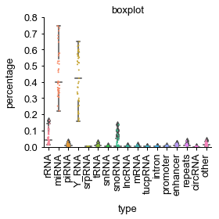


## line plot of rna length


```python
def plot_length_line(data, rnanames, width=7, height=20, savefig=False):
    '''
    data: length_table
    rnanames: rna type names
    '''
    data=data.fillna(0)
    length = np.array(data.T)
    fig,ax=plt.subplots(length.shape[0],1,figsize=(width, height))
    for i in range(length.shape[0]):
        ax[i].plot(length[i],label=data.columns[i], color=Category20c[20][i],linewidth=1)
        ax[i].legend(loc='upper right')
        std_plot(ax[i],'','',ylim=[0,max(length[i])],ybins=5,row=length.shape[0])
        legend = ax[i].legend(prop=fontlegend,
              bbox_to_anchor=None,
              borderpad=1,
              edgecolor="#000000",fancybox=False)
        ax[i].legend_.get_frame()._linewidth=0.5
        legend.get_title().set_fontweight('normal')
        legend.get_title().set_fontsize(6.5)
    if savefig:
        fig.savefig(save_path+'rna_length_line_plot'+saveformat, bbox_inches='tight')
    fig.tight_layout()
    #embed_pdf_figure()
```


```python
if sequencing_type == 'long': 
    plot_length_line(length_table_1, rnanames_1, width=7, height=length_table_1.shape[1], savefig=1)
    plot_length_line(length_table_2, rnanames_2, width=7, height=length_table_2.shape[1], savefig=1)
else: 
    plot_length_line(length_table, rnanames, width=7, height=length_table.shape[1], savefig=1)
```


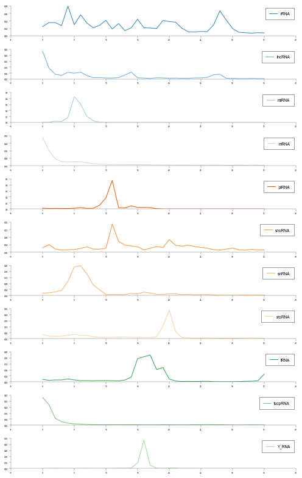


## 3D barplot of rna length


```python
from mpl_toolkits.mplot3d import Axes3D
def plot_3d(data, width=7, height=5,  azim = 45, elev = 32,savefig=False):
    '''
    data: length_table
    '''
    #data = length_table
    data=data.fillna(0)
    fig = plt.figure(figsize=(width,height))
    ax1 = fig.gca(projection="3d")
    num = data.shape[1]
    count_ = data.shape[0]
    xpos = np.repeat(np.arange(1,count_+1),num).reshape(count_,-1).T.ravel()
    ypos = np.repeat(range(num),count_).ravel()
    num_elements = len(xpos)
    zpos = np.zeros(count_*num)
    dx = np.ones(count_*num)/5
    dy = np.ones(count_*num)/5
    dz = np.array(data.T).ravel()
    
    for i in range(num):
        ax1.bar3d(xpos[count_*i:count_*(i+1)], ypos[count_*i:count_*(i+1)], zpos[count_*i:count_*(i+1)],
                  dx[count_*i:count_*(i+1)], dy[count_*i:count_*(i+1)],dz[count_*i:count_*(i+1)], color=(np.array(Category20c[20]))[:num][i],alpha=0.9)
    plt.xticks(range(count_), [str(i+16) for i in range(count_)], size=6.5,color='red',weight='normal',family='Arial',rotation=-azim)
    ax1.set_yticks(range(num))
    ax1.set_yticklabels(data.columns, color='blue',weight='normal',family='Arial', size=6.5)
    fig.canvas.draw()
    ax1.set_zticks(ax1.get_zticks())
    ax1.set_zticklabels(ax1.get_zticklabels(),weight='normal',family='Arial', size=6.5)
    for color,tick in zip((Category20c[20])[:num],ax1.yaxis.get_major_ticks()):
        tick.label1.set_color(color)
    ax1.view_init(azim=azim,elev=elev)  
    ax1.xaxis.pane.fill = False
    ax1.yaxis.pane.fill = False
    ax1.zaxis.pane.fill = False
    ax1.xaxis.pane.set_edgecolor('w')
    ax1.yaxis.pane.set_edgecolor('w')
    ax1.zaxis.pane.set_edgecolor('w')
    fig.tight_layout()
    if savefig:
        fig.savefig(save_path+'rna_length_3D_barplot'+saveformat, bbox_inches='tight')
```


```python
if sequencing_type == 'long': 
    plot_3d(length_table_1,width=7, height=5, savefig=1, azim = 45, elev = 32)
    embed_pdf_figure()
    plot_3d(length_table_2,width=7, height=5, savefig=1, azim = 45, elev = 32)
    #embed_pdf_figure()
else:
    plot_3d(length_table,width=7, height=5, savefig=True, azim = 45, elev = 32)
    #embed_pdf_figure()
```


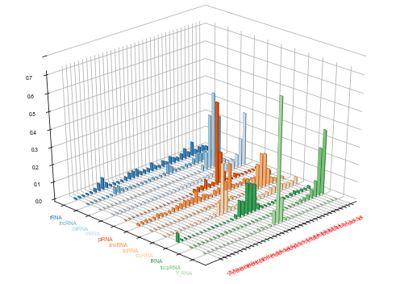


## stack bar plot of rna counts and ratio


```python
from matplotlib.colors import LinearSegmentedColormap
def stack_bar_ratio(table, ax,statistics = 'ratio',savefig=1):   
    
    table.plot(kind='bar', stacked=True,ax=ax,width=0.5,
                legend=True,colormap=matplotlib.colors.ListedColormap ( Category20c[20]))
    #ax.legend(bbox_to_anchor=(1,1),fontsize='large')#, loc="lower right",
    #ax.set_title('Stacked Bar plot',fontsize=40)
    if savefig:
        fig.savefig(save_path+statistics+'_stack_barplot'+saveformat, bbox_inches='tight')
    return ax
```


```python
@contextmanager
def embed_pdf_data(width=640, height=480, title='Image'):
    try:
        data = BytesIO()
        yield data
    finally:
        data = data.getvalue()

        data = 'data:application/pdf;base64,'+ str(b64encode(data), encoding='utf-8')
        display(HTML('<object width="{}" height="{}" data="{}"></object>'.format(width, height, data)))
        plt.close()
```


```python
fig,ax=plt.subplots(figsize=(14,4))
if sequencing_type == 'long': 
    ax = stack_bar_ratio(percent_by_mapped/100.,ax=ax)
else:
    ax = stack_bar_ratio(table_ratio,ax=ax)

std_plot(ax,'sample','percentage',legendtitle='type',legendsort=False,ylim=[0,1],bbox_to_anchor=(1,1),borderpad=0.2,ncol=2)
fig.tight_layout()
with embed_pdf_data(title='Clustermap') as data:
    fig.savefig(data, format='pdf')

#embed_pdf_figure()
```


<object width="640" height="480" data="data:application/pdf;base64,JVBERi0xLjQKJazcIKu6CjEgMCBvYmoKPDwgL1BhZ2VzIDIgMCBSIC9UeXBlIC9DYXRhbG9nID4+CmVuZG9iago4IDAgb2JqCjw8IC9FeHRHU3RhdGUgNCAwIFIgL0ZvbnQgMyAwIFIgL1BhdHRlcm4gNSAwIFIKL1Byb2NTZXQgWyAvUERGIC9UZXh0IC9JbWFnZUIgL0ltYWdlQyAvSW1hZ2VJIF0gL1NoYWRpbmcgNiAwIFIKL1hPYmplY3QgNyAwIFIgPj4KZW5kb2JqCjEwIDAgb2JqCjw8IC9Bbm5vdHMgWyBdIC9Db250ZW50cyA5IDAgUgovR3JvdXAgPDwgL0NTIC9EZXZpY2VSR0IgL1MgL1RyYW5zcGFyZW5jeSAvVHlwZSAvR3JvdXAgPj4KL01lZGlhQm94IFsgMCAwIDEwMDggMjg4IF0gL1BhcmVudCAyIDAgUiAvUmVzb3VyY2VzIDggMCBSIC9UeXBlIC9QYWdlID4+CmVuZG9iago5IDAgb2JqCjw8IC9GaWx0ZXIgL0ZsYXRlRGVjb2RlIC9MZW5ndGggMTEgMCBSID4+CnN0cmVhbQp4nM2dUY80uXWe7+dX9GVy4VaRLLLISylOFBiBAdsCEsMwDGW1XklY7iorJU7+fQ5ZXeR7yMOZzffVIAeCoG8eTZ/i213NYtV5pso8/vhmHt89tscf6b//9vinxz/T//7uYR6/pv9+97bRT/nNbFukf3x//sPGSP/cXv/7+7e3f337xS/pl/9Mv/LrN5+ePvhg/cP48HT06iOlZ3z99P3rJ3vY50E/9d++SK33Px5jmWPfntbt7iBgwnN//PTt478+fnhsT5Ms/UoM9qAf/Jbi5oiEt+157MYcYT+28Pjpu/VvPobffHsL7hlDcsb1DPa5HyGkHqOBYJ7bbvcjEYUXIq6Z/u7x/zlVpBHFfQuhpYrpGZLZd9diAaGEaQ/elg8ZXopYR64UnzbFaFLLZbbwTFswybdgiOpHk9xeIsCLEetIZox/euP8YXs0uz+N3dLev1GIQnpuLh7eFw6vRq4km6Pvu40OJgqzm6ej8W6mZwMU/NPu4Tgqh1cjV5JtT/QlcdsRezYfn95vu997NkBl39viURP313aqJFc4nsYf0Zme6/DPg6aD7ei5EMXnvkez2cLx1cCVZIv70x3Wx71nSzTX0fEq9GidBDoApC2enxm8FrmOZHYzTx8P5/rEb015/X6YPvMjCvEZd5oWy2yBr0auJJuhIW12i33yt/Z47jQbhv6xISqfT0w+mJq5vxq5kmwuPDd6z/c++9t9fwa7W9MXIojKfOHDliqHVyNXks072pjxqc/+lkYZXUztYPc9Q2Xfi363lcOrkSvJdmw0uQW399nfHnT89WWK6NkA0YRJX7+90v7aTpXkisczBGO2PvvbFJ6W9rGjz/6IQv2YaHVVOLwauY5sbtuftDyKvs/+tIqnGcHZPkUCKespmipj+XTwtciVJLP2udHKtx2gKZnbaJV/pAjRAIXw9McefSgcXo1cSTaXno6+RP3A5vbjmYw9XJ/8EVEEWl+546iR24sRK0lGm6QVlIFTUEfrXIqxxz73Iyqr4Eg7YflO4auRK8l2uOdBMxyciLpon263du9zPyJaOB6OvlZl3YGvRq4kW9po9Z6C6XO/SzQgHxKcjCIK2zNal2KqvL8auY5s+xafJtDG+vy/00aPwxxwNooolEklGVcy4KuRK8lmPa3gaZro8//u3DPF4OFsFBFlOI4jHGWmx1cjV5Jtt0+f6Oy/HwF2b540P1g4G2UoPY/NRlvmDPZq4Eqy0dbjFkOfJndaENI+uMEJKUOJBpfOUxh8MWAlyY7juVnnIkSL/hncdvh+BEBEi2WzeVOvzOGrkSvJlnbaWDRw4PabpXNLT8Ns2Rii4dJpQDlAsxd3rCOZN+a5exvhfJQOxE9aQNnQ539EdAyzkdYhBcOLAStJZiOt3wn0s1E6e3nag2bDPvsjolMZT8suUwP3FwNWkmz3dApJX/9+Lur9Xq4GHEef+xk6np5OBup6kb0auJJsdKq1pcPAuag/DM3itJ/1uZ+hSDveYWpvh70auJJscXs6A5f9fYy00k8WzkYZinRu5re6ooLXAlWSK9FuZEPwfeYPG52huH3rJ2xIIp3HbKEeldlrgetIFsxe0L71eT9YR8v8eMC5KEPlHG2nT6pwfDVwJdmceZbLh77vj4G2T18hDyejDNGqxCZfZwv2auBKsu3pSfN2Mn3uDzTXHUe0cDaKiFbBdHhz3tbM/dXIlWSjk38XfQh99qfF+zMl2r/67I+oXL3aQr3Egy8GrCRZdE9a9O5wLhqSpUEeR+pzP6Jg6YMKqe6Q8GLAOpIdG50cG2/gTJT2L/rW0NlLn/sRUYRjpwNBqry/GrmSbIYOSDYlOBM9bKBF/tFnyA7KVQJaCfuaC16JXEkuV9q0pU/bc+3uGWkt7CEZIDpvoX/ZOlfgq5EryeYtLdzTDr5IabmEELc+9TNULlzZs2mBLwasJFlIT5r7TOwzP03xtBI0Hs5CGaKdcA/u/Kbhq4EryRYDrdxjcqgq+eee6GDcz0IZis/Dh6OuOtirgX9Btt2ksB2RljP0Q6BzCW/Tbixli+4Vxp3ZFr/5GH7zTRaR8sJaapROq5+0VjYmPtBlYlhHPlFIykt9qWFLM+fu91BbT70IwzoSimJSXnpMwEtH2NJBrWTpVZDqSCj7SXntM3Vu6Z9x381WpYxeh3ElKUVTKa/Nps7tttMH7OtlciiDWElGwVnKK7+pU5p+nnTKE8yZu9VgXElC0V3Ka9epc+toJV2mlnJmAHUYV5JS9JjyUntq2NIpO5V0e+kNQxXGdWSUfaa89p86p6L0UlcvN0MZxEoyil5TXntQnZd/xlAUlAfzoxhXklI0nPLaiOrcWvM0ZtvqOQTUYVxJStF1yms3qvPy7fM0Sl/Nol6HcSUpBe8pLx2pRm059Mcy0T6YO8W4koSi/5TXvlTn5YBPiwNna8peh3EdKWUXKi/VqYbtVrSBSGccD2ZUMa4ko+hE5bVDBZxOJinXKbJAGcBKMkpyVF67VMCTeSZaBQ2KFVAlCUVHKq+dqs7LWUYoZ/51F+51GFeSUrSl8tqu6rwufCKdQteUvQ7jSlKK3lR+x7Nq3NI46Uji66od6jCuI6VsUOW1cdU5nYc8aXlQLoUzE4txJSlFlyqv3avOLc2oxhzR1vS9DuNKUopWVV5bWJ3bjcYZQqqnYFCHcSUpJcEqr30s4KnsmOe3D6oAVZJQ9Kzy2ssCTmE2F5wffS3kSlJKylVeCVqAyylX3FKy9ePtVRjXkVGUr/JS1eqYRljaDKGuUKEK40oyShpWXkpbHVv657HT+dQgczGuJKPoY+W1vwWcvnl00hhT/YShDnIlKUUzK69NLuDJ0XePjhOj4YVcSUrB0srvOF2N282VFx7mdMBeVRhVklD0tfJK7+rYbnQ6QnvkVpP3KozryCh7W3nteQEvC3VD5xrlPBrrIFeSUjS48tr4Ak5p3J7SeQeJXgawkoyiyZXX5lfn5VqVoZnGnRZcq8O4kpSS1JWXCljHlmIddjf1uwdVGFeSUdK78lIG69ia4xl8OdtijhhiHQllyyu/Y4U1bukEmc6O91DNo16HcSUpRecrrwyxRumAYbZjq+s2rIFcSULR/MprU6zzcrwP9ij3LGIGGeNKUkoSWF47Y8BTeKadwtSPspdBrCSjaIPltT3WeTlKBOOMfzCpDLGSjKIVltcWWefl+k2gL2pdnUIdxr8gZcCxH02OKyl7kJpy8ZuP4TffZDUsLzwyoKnMPj7WpQGUAKwjnyiG5aVGBphOFH3YQ1kYYBHAOhJKXlheSWQDPsrFqVkua1hHQtkKy2uLDHlpx4VU3QhWB7iSlJIWlpcSGcfRbS5VeZBXaVxJRtEMy2uTDHlZ2tCybrizFuNKUopmWF6bZJynbQv1qt1Qp3ElKUU3LC9VMsD70x9uC8P9thjXkVFUw/JSJENMY00hpmq5YBXgSjKKZlhem2TII020VOhMD3WAK0kpmmF5bZJxTsOmwo/JMGtcSUrRDMtrkww5BT7oqFk/S6wDXElK0Q7L79hkwOmAUq7lpMdgmQFXklK0w/LaJkNOpyK7OepKgdUBriOl7IflpU4GOJZ/nVdDWBXgSjJKelheymSIaQFgaP1TVnCsCnAlGQU/LC9lMsS0pqVFqh0lM8BKEop2WF7bZMjrAo/20MdgmQFXklK0w/LaJkNuinJ1nI4d1gGuJKVoh+V3bDLghuaXbXfVB8U6wHWklO2wvLbJOKcvq9nrnYl4ncaVpBTtsLy2yZDvz2JIjHf+YlxJStEOy2ubDLmjailuwz3AGFeSUvDD8lImQxzp5LL8EeyDS2aAlSQU7bC8tsmQx7IXH/UvJ1gd4EpSin5YXvpkjJeVOx0zyjzK6gDXkVI2xPLaKOM8bVS4eku8TuNKUoqOWF47ZchjWSm4umeyOsCVpBQdsbx2ypBTGp9SGu8hhlxJStERy2unDPleZtu0Ta4ZcCUpBUssv+OUMU7nkL5egWRVGlWSULTE8koq4/jwtJaryXmVxnVklB2xvHbKOE92s7vgmjWuJKUkieWlUsZxsK/V21ClcSUZRUcsr50yzmMydEx5TK5Z40pSipZYXltlwP1WVnz7ZJshV5JSEsXyUitDXO7/kWyoN6TBKsB1ZJQ9sfyOV8b4YdIWhruTMa4kpeiK5ZVZ1il9CY3xvnzzWA3gShKKnlhee2XI6bQrbac0weoAV5JSEsXy2itDftBME2M9PcYygJVklESxvNTKENMyiE466vkUqwJcSUbRE8trr4zzlIqW9Jh8s8a/IOVRb7FGC+Sqx/lrwJQylW7anrZXyMUvPvgvvsmqWF54ZZ0GOlJGehvPpU4rgVhDOlETy0uprOM9liO+qZcnoQhiDflESWxSzZo8hpw+NWOtG1QzoBryyX5YXvtkwMNWuo7lu8w9M+QqMop+2KSZdZ8MeLlNREjHqJkBVpFQdMPy2iUDHg46P0xhVMwAq0goemGTX9Y9MuD0Ye30AYd6Fz6og1xFRtELy0uNrONyNyw6h9rrNxGqINeQULbC8toiA17+MsuE03HAOshVZBSdsLx2yICXiwC0St3OO7f1OshVZBSNsMks6wYZ8EDZk9vr2QfWQa4io+iD5bU/Brz+ZdYe65IO6yBXkVG0wfI79ljndO5EH53bh+c+Mq4io+iC5bU7BjzQmS+delTDHusg15BRdsHyUh3rmGYWOrNItb+DVZCrSCiaYHltjnVevnW0+rH104I6jKvIKKlgeW2OdV4OgkWlO28P1cowrCKh6IHltTcGvJz52mjOTxfqIFeRUbTA8toaA+5peUfjs9WzgjrIVWQUHbD8jjPWOX2ksaxh6y4MdZBryCgbYJNJ1o0x4KE0bdxR+8lYB7mKjKL/lde+GHA6kdroROq8vxfUQa4io2h/5bUtBpxOkxOtSWufBusgV5FR0r/y2hbrvHxcns4yQlWPWhmGVSQU3a+8dsU6L+f5mw+hPiwC6jCuIqNofuWlKYa8zCz2MNt4pzLkGjLK3tfkj3VPDHg5Q6Qz/TA8bJJxFRlF6yuvLTHg5fKUoXGed2nrdZCryCg6X3ntiHVeThZdcKbOnlCHcRUZReMrrw2xzsv37ihtjPo97XUYV5FRML4mbwz8sM4pCX2ch32gNgZQRTrR9hqdsSaBAaYg8TCh/q0yVkGuIaFsek3GWDfDOrf1ORFbTMPTKRlXkVE0vSZhrJthnZfPK5jDhsEYY1xFRtHzmnyx7oUBp8/LlVuZn9l7HeQqMoqWV15bYcApS4ghndYj1EGuIqNoeeW1FQY80Fl+Kj88uC2GXENG2fGaXDFwwjov69Hg0za6YshVZBQtr7xywi5a90day1W1qpdArCKdaHfltQ0GPJS/v6aN1E8Q6iBXkVGSu/LaBeu8LEQt7cEbd8QYVpFQdLvy2gUDTlm2aPdjvCUZchUZRbNrMsS6CQacYtULwzU71EH+BRkTCm2+2mzmCP6t/P710xly8ZuP4TffZMErL2wwoL48QXGvlx+xBGAd+UTBKy91MIZ32hlrE5kXaVhHQsnwyisdbMTH69bBQ5EL60goG155bYRxTqeQR125DnUaV5JSkrzyUgnj2HoT6iptqNK4koyS5pWXUtiAw3He0GKscnElGUXPK6+9sIHTeVSsd2Mb6lxcSUrR9cpLNYxhX27HWu+rx6s0riOj7HrltRs28HLbp/pEuqHOxZWkFG2vvLbDOI/B1VbNUObCSjKKtlde22GcU7VQn6Q81GlcSUrR98prP4zzSIuDat0MdRpXklI0vvI7hhjnB3356rdyqHNxJSlF5yuvHTHODxdebiCv07iOlLL3lZeaGMM0jVor2GONK8koel957Ylx7qw5n28+1GlcSUpJ/cprU4zzEA7v6g2uWJmGlWQU3a+8dsWQ05mxca6eGbM6wJWkFO2vvLbFBu6PdKqeQ52LK0kp+l/5HV+Mcdp3rR/vSYZcR0rZAMtrY4xzOifxdrwnGXIlKUUHLK+dMc7p5NHV6wZDncaVpBQtsLy2xpDTEoi+ovWOl6wOcCUpJREsr72xgZvoDsEnu7CSjKIJltfm2MCjO684j3UuriSl6ILlpTs2ck/Tak0/1Lm4jpSyDZbX9tjAU+k4PGar7OJKUoo+WF77YwOPB60PHrNXdnElKUUjLK8NsoFHKlY/y6HOxZWkFJ2wvHbIBk7Lg7qOG+tcXEnKWQzLa4ms49KF3Hys6/deA6mSfKIZllci2YBpK/VIMVa5uI6MshmW1ybZwEN5IO9jNswuriSl6IbltUs2cEf8bMPyOhdXklK0w/LaJhv4cWx1BTfWubiSlKIfltc+Ged0NHT1aedDncaVpBQNsbw2yjgPwdokmGaN60gpO2L5HaeMcWtoLhVcs8aVpJRUsbzQyhhMxrnhrmSMK8knemJ57ZVxHi1NujUlr9O4kpSSKpbXZtnA983XSXQoc2ElGUVXLK/dMs4NnXXF8xGgrE7jSlKKtlhe22Wc1xsJ1fS8TuNfm5I97ROe7jmnZE/7ZL/5JitjeeGXMVpOGM1snTWsI58ojI3WWdfLACc6p7LbPjwHE7GOhKIwNmtnl0g2cHphqIcUXqZhHRllX2zyzrpfhpw+PBpsvUrO6gBXklI0xibxrBtmyI9yVnk+IhPLdKwko2iMzeJZM8yQx/LMlrCdzwGFOsCVpBSNsdk8a4YZ54d5aXe8zIWVZBSNsdE764IZ4CK1uPNhJqwKcB0ZZV9s9s6aX8Z53Kyp89FQp3ElKSVhbNLOml6GOBb7wZ3Px8QqwJVkFH2xyTvrfhnn3qXDCd5Z40pSir7Y5J11vwy5K808e/qTWAe4kpSiLzZ7Z90vYzzSp1f/1Heo07iSlKIvNnln3S9DHmjnpcVOte6wDnAdKWVjbPTOumAGOD5NuWFbfU4dVgGuJKPoi03eWffLOKeD/uEF76xxJSklYWzyzrpfhtwRj4c9b9rWywBWklH0xfLaL0NOX09Dc0w1srAOcCUpRV9s9s6aX4bcU5qj3uiblelYSUbRFpusM7DLgB/lWvOezidkQh3gOlLKtthknXW7jHMqlOp1kaFO40pSirbYZJ11u4zzQGvZ6k8OdRpXklK0xfLaLuM8ehPOZwvyOo0rSSnpYrN11uwy5GWVd1SLBat0qiSh6IrNzllzy5BXd9Ked/jCOsCVpBRdsdk5uxyygdPBMdUz5KFO4zpSyq7Y7Jw1t4zzlLZT7OFlLqwko2iKzcZZM8uQl4bkdu6XrA5wJSlFU2w2zppZxvlR/nC9puR1GleSUjTFZuOsmWXASx/SBVu/fVgHuZKUgi2W33HLGC+3APf8hmZIlSQUbbHJObskMsBlH3Z7OsbnYCLXkVF2xWbnrLllyOkc0tMKpxo8WAe4kpSiKzY7Z80tA1575imcT8iEOsiVpBRdsdk5a24Z8tJx3Uwan4SJXElK0RWbnLPuliGnNNt+pOneZsCVpBRdsck5624ZclrKbob+n8fgnAHXkVJ2xSbnDNwyxuPm/OsZmaxO40pSisbYKJ01v6zRcvykz+/0W6AGciUJRVtsss66XYbcP/3mzicQszrAlaSUdLHZOmt2Gee0AEj14MLLNKwko2iLTdZZt8s4964ugCbrrHElKUVbbLLOul3G+ZG2wwj3Omv8a1PG1z/34taF99y6/puP4TdH6+yljOWFX8Zo3PZQL2/xEg3ryCcKY3mplzFME2yofwLMizSsI6Goi03WWdPIBp68dbXVyss0rCOjbIvltV3GufWh/jHMUObCSjJKslheqmUc2207r6gPVRpXklF0xfLaLRs4zbS1zzrWubiSlJIsNilnTS1DfDzDfvh6qYBVAa4ko2iL5aVcxrArXdl6nzdepXEdGWVXbHLOulvGedqTr/2coU7jSlKKtlhe22Wc00udqfcH43UaV5JStMUm66zbZZyHw29eeEZm40pSirZYXttlnNMs9LrXG6/TuJKUoi02WWdglwF3tEoIqd4nnNUBriSlaIvltV3GOS0CUr297VCncR0pZV8sL/Uyhm1pj9Sn9vEqjSvJKNpik3XW7TLkrtwnw9bbLWGZjpVklGSxvHbLOD/CcfZHeJmGlWQUXbG8dss4d7RqPXdiXqdxJSklWSwv1TKO3RbOz5cXubCShKIplt8xyxi3zr8mI16ncR0pZVNsMs66WcZ5NPITMxtXklI0xSbjrJtlnB/74Q7hPmeNK0kpmmKTcdbNMs6TPw/5Q5kLK8komGJ5qZVxbOy2T/c4A6wkoeiJ5bVXxnlJ4wXfrHElKUVPbPLNmj82cm+il3yzi+tIKYpik27WtDLEZS+mVfukmwFXklH0xPLaKxt43Lyf7nAGXElK0RObfLPulQ3c0yqn7sdDnYsrSSl6YnntlQ3cGxcl3+ziSlIKptjkm4FXxrkr180fo292USUJRVMsr8SyAdOg03iPM+Q6MsqeWF57ZQOnsw433eMMuJKUoieW117ZwG09NM6+2cWVpBQ9sbz2yjg3pYNwpmd1GleSUvTE8torG/jut3on1LHOxZWkFD2xvPbKBp5SrLexG8q8sI6MsiU22WZglXG+RxeEO5w1riSlaIrllVfGKM01abzHGXIlCUVLLK+tsoH73darImOdiytJKWlik23WrbKBH5s7b9PHy1xYSUbREptss26VDZzW5fVxW2OdiytJKVpik23WrTLOo9lTvY//UKfxL0hpmCnnXj85SuleI6dJr6Zc/OZj+M3RNnupYnnhlQEN9TFU50IASgDWkU8UxUbbrGtlHZdOgXe+WnZQBLGOhKImNtlmTR9jfKcFkHH1HkRYBrCOjKImNslmTSpDfNDUQ2eMVXnBKsCVZBQ9sUk3614Z8kjnlLTEq5YS1gGuJKXoic2+WfPKOA+2TKWPyTdrXElK0RTLa7OM80jnXvWZGkOdxpWkFF2x0Tjrahng8gU9zr9NY1WA68gom2KTcdbNMuT1vgohTk/XBK4kpWiKTcZZN8s4p3/stfc81GlcSUrRFJuMs26WcU4LvV0yzhpXklI0xSbjrJtlyI+qDpxWIdYBriSlaIrld8yyzstdiNJxLmmxDnIlKUVTbDLOulmG/CgXJ496l2lWB7iOlLIrNhpnXS3r+HQ8tuk+Z8iVZJRUsbwUyxBHmmz8S8bCKsCVZJRUsck462YZcppp6bu31c8XygBWklE0xSbjrJtlyOPzSC65yTgDriSlJItNxllTywAX/zW9jvpYBbmSjKIrNjln4JYx7gOdWdXbLvI6jetIKbtik3PW3TLgpXfly2ONH9w5Q64kpeiKTc5Zd8uQx3IetvuqY2Ed4EpSSrLYpJw1tQxwyU6faj2jxirIlWSUdLFJOut2GfAiP6To6yIVyiBWklG0xSbrrNtlyOPT0yLnmKwz4EpSirbYbJ1dFtnAY3RbvTo31GlcR0rZF8trv4zz8lQmyTtrXElK0RebvbPml3GeaA8+PR5ep3ElKUVfbPbOml/GeaRR1r7AUKdxJSlFX2z2zppfxvlRLrrWPZbXaVxJSsEYm72z7pcxTrvvdkzeWaNKEorG2OSdXSIZx3R2ddSVzVClcR0ZZV9s9s6aX8Z5Kh1lwTtrXElK0RebvbPml3Fu9z1J9zlrXElK0RebvLPul3GeaA1X2whDncaVpBR9sdk7a34Z58ZbX+eYoU7jSlJKwtisnV16GeJyvTycXgirAlxHRtkXm72z7pd1Xr6tLsbJO0OuJKXojI3eWTPMkNIX9by3y1CjcSUJRV9s9s6aX4acvqmWPuCaEusAV5JSEsZm76z5ZZzHY9/rSRUv07CSjKIvNntnzS/jPJiQpGdrNq4kpeiLTd5Z98uA11WCfz0HF+og/4KUVLx0zvZE/45+S3Gj8Zdbub3uzlZmhBpS/sXH8ItvsjKWF34Zo8FSmPqseFaiYQ3pRF0sL+Uyhl3ajrow4EUa1pBPVMXy0iwbuE/u/IMmXqZhDQllUyyvzTLOvTXGTLc3A64io+iJ5bVXxrkrJ/z19nW8TuMqMoqW2GSbdauMc3qpeHezxlVkFB2xyTXrThly+goaWnXXfRXrAFeRUXTE8lIpYzjQ0bXuqLzIhTXkk+2wvLbJOHcp1Nv1D2UurCKhaIZNhlk3yZDTEdJs7jiTQx3gKjKKXtjkl3WPDHkqf1do0/QcTeAqMopWWF5bZJwHcxznk1J5ncZVZBSdsPyOQ8a4KxfexmdoIleRUTTC8tog4zza83GMQ5kLa0go+2B5qY8x7KIb72LWqYp0ogmW1+YY5zS7bMd0CzPgKjJKIlhee2OcU8nzwhwv07CKhKIFltfWGPJyDYrm2frpYh3gKjKKFlheW2OcR+9jGG9ghlxFRtEBm1wycMYYT9ue6l8uDXUa15BRNsDy2hjj3MZw3uF0qNO4ioyi/5XXvhjnyXlXO25DncZVZBT9r7z2xTiP9MJ6j4+hTuMqMkr6V17bYpzTt3CrUwsv07CKhKL7ldeuGOdHuflejcjrNK4io2h+TQZZM8KQ165VimY0yJBryCh7X5M/1j0xzuO2+/r5DnUaV5FRtL4me6xbYsjLE5jDeeWK1QGuIqPofE3uWHfEOKcj/dn7Huo0riKjaHxN5lg3xDiPtD6tHy8vc2EVCQXfa7LGwA5jvBier6dmQpVGVeQTba/RGWsSGMe0EV8bOkOVxjUklE2vyRjrZhjwcmwo7YvxyZjIVWQUPa/JF+teGOeOVqZ1nh3qNK4io2h5TbZYt8KAl88r7rZeFMA6yFVkFB2vyRXrThjne3nQe71DG6/TuIqMouOV104Y8vSkifa8eQCrA1xDRtnwyu8YYYzbwwie2IuqyCf6XXllgyF11qTaZRtqNK4in2h25bUJxjmdOJ7ft6FO4yoySmLX5Id1D4zztF8RWZmGVSQUra7JDusWGOfHRkuBepMrXqdxFRlFpyuvHTDOaSmanOCGNf4FGY861nLVj35IrxhbCXlct1PzZ8jFbz6G3xztsJfalRceGKPlgeehHvZZiYZ15BPVrtEP6yIYw3Tci/t8T7KGdSQU1a7JEGvK18DjfqR9fAImYB0ZZbdrcsS6C8b5QXNtnVeGOo0rSSnaXZMl1m0wzukzs+c92XidxpWkFP2uyRPrPhjy8jcrYasnzKwOcCUpRcMrr40wzim8PT9jXqdxJSklzWtUxZoTBtSX5yakWRUDriOhqHlNsliTwjim5D4JdyRrXElG0fPKay8MeCjXa+hgYR/cF0OuJKVoeuW1Gca5DfViwGSMNa4kpeh6Tc5Yd8M4L13w2lEe6jSuJKVoe03WGNhhjNOc671wR7LGlaSUhK9JG2t6GOJyf4AQ7fQETOA6MkrW1+iNXYIYg6Ec+qvfwSs0riSf6HxN7lh3xDh3ic68qpHD6zSuJKWkfU32WLfEkNNgw/n3uVilUyUJResrry0xzmlh4OpMNNRpXElK0fua/LHuiSE/nnRaGeszE1gd4EpSiubXZJCBKQa8/pVOStPdyIDrSCm7X5ND1l0xzukj3ny97ROv07iSlKL9NVlk3RZDTqu98reg1c3BOsCVpBT9r8kj674Ycjrmb3T+XD9LrANcSUpJAZtMsm6Mcb5HOnGc70fWsJKMogM2uWTdGeM80i56Ph+S12lcSUrRAstLa2zgliLVG+kMdRrXkVL2wCafrHtjwEv6zWz1BgFYB7mSlKIJltfmGOdF360rnKFO40pSii7Y5JR1d2zg5U6QklN2cSUpJR1sksqaPDbgRCu66lwNVS6uJKNghE1eGfhjjB/1evKglV1QST7RCBu9siaKcXzQMq6aA0OVxnVklI2wvDbIODfR2fPGFbxO40pSik7Y5JZ1h4zzPfnzys9Qp3ElKUUrLK8tMs7tZu1pZPE6jStJKXphk1/WPTLOaao11UEa6jSuJKVohuW1Sca5pYNnvZvnUKdxHSklO2wyzJpJxih9Vf35HD5eo3ElCUVDLK98MqT7bo56YBlqNK4koeiHTZ5Z98k4t7QiSFV54XUaV5JSUsQm06wbZciL02JSPZ3CMoCVZBQdsck1604Z53RaWUSIyTVrXElK0RKbbLNulXG+05nVeddAXqfxL0i5+3IiU4ZZfjDp5ccVpe66iZo5Uy5+8zH85mibvVSxvPDKgJZrHZs39ZACJQDryCeKYqNt1rUyhmO5S9l8N7KGdSQUNbHJNmv6GOOeFgbeVkkHywDWkVG2xCbbrFtlnCe7xXqFfKjTuJKUoiU22WbdKuM8+ei98AzMxpWkFC2xvLbKOLe0LnXnHdlYncaVpBQtsck261YZ5945s9V76/E6jStJKZpieSmWMUzfQ1uvwg5VGteRUTbFJuGsm2WcH2Z3taMz1GlcSUrRFMtrs4xzWh+E03nhdRpXklI0xSbjrJtlnLstHudzTnmdxpWkFE2xyTjrZhlyOoV0MbrpLmXAlaQUTbHJOAOzjHE6alYtZChzYSUZRVMsr80yzk0yIdRvK6/TuI6Usi82OmddL+M4vv6MYqwSv/yOup+RUbTFJuus22Wc777sx4/JOmtcSUrBF8tLuYxjb/aXb4c1Lqokn+iKTc5Zd8sGXq4OVN1uqHNxJSlFVyyv3TLO6STrfIL0UKdxJSlFVyy/45YxXlYIp1fI6zSuI6Xsik3OWXfLOKdzsMOWq6tDncaVpBRdsbx2yzgv5471yuNQp3ElKUVXLK/dsoG7829GxzLui58d8BkZJVVsMs66Wca5pzOS6hSyKhdVklD0xCbfrHtlnCe32fObyus0riSl6IlNvlnzxwZOazxz3mOQ12lcR0rZE8trr2zg0Rx1jTrWubiSlKInNvlm3SvjPNA5V32u+1CncSUpRU9s9s2aV4bcPDdDe28VlbAOcCUpRVNsFs6aWcZ5Kg/lrU9O5HUaV5JylsUm4ayLZRwH6869ldW4qJJ8ois2GmdNIRvwYc+7mo9VLq4jo2yKTcZZN8s4t5s96lNNhjqNK0kpmmKTcdbNMs69rUv1yThrXElK0RSbjLNulg3cuq02EMY6F1eSUjTFJuOsm2Wch2j96dvxOo0rSSmaYpNx1s2ygafdSsLZC+vIKLtik3EGbhnjFMpUVYmXubCSjKItllduGaPl8XvCsy8bV5JQNMUm46ybZZw7Z50R7mzWuJKUkiqW12bZwFO9kj4ZZxdWklE0xSbjrJtlA4/bab+OdS6uJKVoik3GWTfLBk6HxVPTGupc/Evu4caG+zLnYihe3XlnNutfXt3iNx/Db77JulheuGWMWlqlh1OvxxIN68gnymKjcdbVMo5Tucb6mIyzC+tIKKpieWmWDdzFbfPj/c0A68gom2KTcdbNMuTloGiPMD0DE7iSlKIpNhln3SxDTktxt73uCIZ1gCtJKZpik3HWzTLO6Xh/GgRDncaVpBRNsck462YZ5zTBxHo3Ql7mwkoyiqbY6Jt1sYzhnZZwgm52YR0JZUtsss26VcZ5tMf5UD5e5sJKMoqO2OSadaeM83JZq67ahjqNK0kpOmKTa9adsoFT4b0+C3Soc3ElKUVHLK+dMs7NTquEMr8MdRpXklKSxCbVrCtlHKdIa7nHrJpdXElG0RGbXLPulHFOn91RbyU11GlcR0rZEptcsyaVMXyU667V+eBVGleSUXTEJtesO2Wcl2dmWuEOZ40rSSl4YpNr1qQyjsuNMcz5YFAs0rCShKIlNttmzSrjnDKfBsFQp3ElKUVLbLLNulU2cFrkJOEOZ40rSSlaYpNtBlYZ4/tebjnwmGyzxnWklC2xyTbrVtnAo431bGOsc3ElKUVLbLLNulXGOX1bj2prD3UaV5JS0sRm2eySygYc7Wk9jFUuriSj4IlNslmTygbsTTgtO1bjRZXkEx2xyTXrThlyWsQ6v8fp3mbAlaQUHbHJNWvu2MiTieeDUIc6F9eRUnbEZtesOWWc0+HzPFIMdRpXklJ0xCbXrDtlnJfLOueN3ViZCyvJKBpieW2UDXwPyU93NgOuJKVoiE2mWTfKBu52k4R7mzWuJKVgic2qWXfKOE/pde86VuWiShKKltjkml3yGMdxqx/c5Jo1riOj7IhNrll3yga+06q9hh/qXFxJStERm1yz7pQNPDgXJNfs4kpSio7Y7Jo1p2zgPtHC/TG7ZhdXklJ0xCbXrDtlnB8xnmfHQ53GlaSUJLFZNbuUMo4dfRtj/SR5lcZ1ZBQlsUk160oZxzQfVRVkKPLCShKKlthomjWnDCnNRc7XRzLyGo0rSSgaYpNp1o2ygcd4Xncc61xcSUpJEZtNs2aUcW5ovq0mIatyUSUJRT9s9syaT8Z50XTq85iGOo0rSSn6YbNn1nwyzr3zwQjP0Wz8C1LGchO2Mv7IfqCUrxSloV9TLn7zMfzm6Jm9JLG8MMoYjeUi1WPUzC6qI50oiE2WWdPJAIfSI/B1d8QigHUkFPWwyTJr2tjAaRlzXjLmZRrWkVG2w/LaJuOcluam7r5DncaVpBTtsLy2yTh3xx7qPYeGOo0rSSnaYZNl1m0yzmnUW7XQhzqNK0kp6WGTZNZkMsSp3je7uiusCnAlGSVBbJTMmk0GNDw3OtDGSTIDriOhqIdNklmTyRDHJw3Px+mOZsCVZBTtsMky6zYZclOuHh9huqMZcCUpRTtstsyaTQa8dgteTy7GOsiVpBTtsMky6zYZ58VSOg0sXqdxJSlFP2zWzLpPBjw87bbvfrqlGXAlKUU/bPLMuk/GeaTTjHoOPdRpXEdK2RAbPbMulDGcYjqfNTVUaVxJRtEPmzyz7pMhp13XuHQ6LVgHuJKUkiI2iWbdKENetCVHs9KDm2aAlWQUDbHJNOtGGeeBjqH1yD/UaVxJStEQm02zZpRxTkdEOg17TKZZ40pSiobYZJqBUcZ4pH9E+5hMs8Z1pJQNsdk0a0YZ5zEaGupjMs0aV5JSNMQm06wbZZyXTrITTLPGlaQUHbFZNWtOGee0J2/1j0WHOo0rSSl4YrNrdkllHMeQztuC8iINK0koWmJ5bZVx7soFoPqd5HUaV5JStMRm2+yyxwYetj0JNza7sI6MsiM2uWbdKeN8N1uqfu9Qp3ElKSVJbFLNmlLGcTLeH8JTNBtXklF0xGbXrDllnNNJVrT1yZO8TuNKUoqO2OyaNacMuSlL2VjvVcPqAFeSUrDEZtesO2XAS1t229LgmgFVklC0xEbXrMljiGmfLE3WahJiFeA6MsqO2OyaNaeMc/pXqubDUKdxJSlFR2x2zZpTxnkRsozgmjWuJKXoiM2uWXPKOKfVXG24DmUurCSjaIhNplk3yoCXK8mWJtv6SUId5EpSio7YpJp1p4zzYGiY9aPkdRrXkVLUxGbXrEllDBO1SbitWeNKMoqmWF55ZUgjzTReeJJm40oSipbYbJs1q4zzEOmgUf0dXqdxJSkFT2ySzZpUxrHbj3p9g9e4qJJ8oiM2uWbdKUNeVuB06lj3YKwDXElK0RGbXLPulHF+0Gdae1dDnca/IKW7bsdmHt8NP47W2Ol8ZVkPA1hukZRSvXKDBQDfPU5R3cpL0QtwuTAWz10EiwC+e6yigjWZXE3NYvx4Uh1/jCYX4LtHK7tUk5PV3SvkZQjbKYBgmY5vH63oRE1uVXeogJdVGL3RVciBMoBvH63oNk2OVHehgJd1NB3Q9vFOXMhvH6/oKeW11wS8vI37kerhCesgv328onWUl5IS4IO+/36rV65YFeB3j1b2h/LaN0JOS9Ny+5Jq6GAd4LePVzSB8tocQr4/N/pOVW0Dy3R8+2hFoyevDSDOvfenwzfUafz28YpuzuT4dJcHeblMS7NEzYF1gN8+XtGyye9YOcCLy2HPu++wOsBvH6/oy0zeTfdrkNOcvO/2vOMc1gF+93hl92U0aLoqA7g0tOnstPbwsQrw20crOix57bxwTovEWGeBoU7jt49X0lHy2l5BTsfkePa2sEqnt49VtEomO6VbKMDLl4tm2TrDYR3kt49X9EMmz6T7JMjT03o6nav7AtYBfvt4RdNjMkbADAFOMywtJupfRbM6wO8er+xsTO5HdzyQ0xmyLyuKx+B+AL99vKJ9MVkc3dYAXu8/s+/1r3iwDvLbxyt6FJOP0b0L5ImOIDHU1S2rA/z28UpSxKRWdIcCOY2cFo7HeQujXgbw7aMV7YbJkug2BPCyXnM21Kc2Yx3kt49XEhUm3eHyFxg2T1olnM+3Z1WA3z1a2TiYzIVuKHCedtqRhSeyNX77eEV7YJIQum0AvMwBB+3VtT8PdZDfPl7RA5h8gu4NcF4umhzCvWsav328Ykc/rw0AzmmecPXv7oc6jd8+XqE7n9/p5TNOB+B4TD3+Rm8fq9hnz6u2PMfe03dK6NY3fvuVXbFfPvXde3+d82jLM0cfU9+98fuvREud76mD3jvlyMs+Eo7zWVpYB/jt45Wa2FMrvLW8OY420dHhMbXCG799tGI3Oq+715zTGtfW66lDncZvH6/YV576070PDbwe72ysqwOsg/zu8co94qnVDD1l4DRp0GK87qWsDvDbxyt2fPOqP9wpjYlOKOuTJFkN4LePVezbTv3f3ucFXtv7RzzG/i/y28crdGGnTm5r2XLsjxi3KiOwIg3fPlaxm5rX3VfOPR3J3HnzE1an8dvHK/ZFp/5q76Mip3f6oOliemYU8C8Yr+fj9cNRTWiP5kUvtdMqNgZbtRQogfjukYrN0bxspQKmI1h9bt6Dd1gB3z1WsTWal51UxmnepU+9/qE3lgF892jF1mheNlIB1zObGOr6DKsgv320Ums0LxupiMtqi07L6zOFsArw20crdkbzupOKnM5rbDLh7BNDHeC3j1fsjOZ1JxW5edJ3K9VrqKwO8NvHK/ZG87KVCjiVBe9pnbEqwO8erdwZzetOKvB6hZGGUHtBUAf57eOVWqN52UhFXP4+jF46NViB3z5asTM6dVh7JxU5Hdq23aXxCT/Ibx+v2BnN604q8Lr2pj2j7iVQB/nt4xU7o/mdTirwcgV1j3Z67g7w28crdkbzupMKvKyAy+NAxzsbIL97vHJvNC9bqR2Xv29zLprxWTjIbx+t2BmdOqy9kwq8nl+U1uuDd1iR3z5eoTeal41UxPQVpG9gOEP0IoBvH6vYGc3rTipyU27CZus3itUBfvt4xc5oXndSgVfnxZfJlndYkd8+XrEzmt/ppHZeVove76+nwvQ6yO8er9wZzetOKucpbH6f/roe+O3jFTujed1JRV4u+JvzyZ+sDvDbxyt2RvO6kwq8NtvoNLL+BTXUQX77eKXWaF53UpHbJ51uGjN2WAHfPlqxM5rXnVTk5W8KjlJo6LACv328Ym80L3upA4/2de451Gn87vHKvdGpx9p7qchpXCamMD2JBPjt4xV7o3ndS0VORzGaiWPtVGEd4LePV+yNTj3W3ktFbp+0uEznfoJ1gN8+XrE3OvVYey8VOS3GysXc6UkfwG8fr9AdnXqs0EsFTu9iuWdw3Ut6FaC3j1Xsjo491tY0RUyHhkDDqu84VgF++9VdsTc69Vh7LxW5eQZjk5ueowH8/qvRUm80r3upnEdaX56tbV6n8dvHK3ZHpyZr76YiL7uJOa/qszrAbx+v2B2duqy9m4q8zHDe+6nLCvz28Yrd0bzupiKnBdBOQyhzBqsD/O7xyt3R/E43FTitwHZn57/oBX77eMUOaV71UzstMywdDWpTCGsAv32sYnc0r7upyClFcq7ev5LVAX77eKUG6dRm7f1U5PQ2msPXU18sA/j20Yr90anP2vupyGmEdGpf7+TC6gC/fbxifzSv+6mcly5hPTMb6jT+BeOl1IYWowd9gt8NP77JTdK86KgyGrfN7qc4hCUavnukYos0LxuqHNORuEqyQ5EL3z1WsUGal/3UidPeWr76Y5kXvnu0coc0rzuqA6cp9vyrxqHOxW8fr9gjzeueKudmo524vu28TuO3j1fskeZ1T3Xgbjf1foZjnYvfPl6xR5rXPdWRuxDGu/cjv328Ypc0L5uqHNNOfcoOQ5WL3z1auUea1z3VgRt//nnCWOfit49X7JLmdVeVc5rb9u3Mweo0fvt4xS5pXndVRx6PetuGqc6L3z5esUua113VgbtYH/kylnnh20cr9kjzOz1VzmndVee4sc7Fbx+v2CPN657qwGn5G8a/ZkV+93jlLmleNlU5fnXdhhpf/NeL749U7I/mdT915DFt41+yIr99vFKLNK87qpwnT+cOZwws0/DtoxU7pHndUR15CvWugFOdF799vGKHNK87qiNPVTObyqQvvV/H+6MV+6P5nX4q52Fzm9Rnvfjd45X7o1OftfdTR07np/Wv68Y6L377eMX+aF73U0fuU50zpjovfvt4xf5oXvdTR77HejY/1Xnx28crNUjzup868iS2WdOXdlnfH6vYHc3rburAS3dw+jtW4LePV+yOTl3W1jUduaNTY6nLevG7xyt3R/O6mzpw60/Dd6xz8dvHK3ZH87qbOvCQtkPqsl789vGK3dG87qYOnFYIYpf14rePV+yO5nU3deDBnVdGxzoXv328Qn80v9NNHXi9l+xQ40ufTP7+OMXeaF61Ukdc2iYPocP64rdf1xU7o3ndSR24jeb8I5qhzsXvvw4tdUanDmvvpA48RL8Lf8Xa+O3jFTujed1JHXi5D0K9DeRQ5+K3j1fsjOZ1J3XkNLnV8Y51Xvz28Yqd0bzupA7cF3v6MXdYL373eOXOaH6nk8o57SVG6rBe/Pbxit3RvOqlMlpu/FXbQUONi98+VrEzmtedVM5d6UjVXhuv0/jt45Vao3ndSR04DXETOqwXvn20Ymc0rzupA3euXoAYy7zw7aMV+6JTf7X3UQdOy/TaJh7KvPAXjDb6LcXNldXJd8OPY3f11RrNiz4qUPsc/4D1JHePT2yHTj3V1jzt+DUeeP0njVBsgQqd1FdrFPlrRFDhk8Yo9z3n/mnrkyI/h8RKfNIoxW7n1DXt3VHkr1FiiU8apdjjnHulrSeK/DVKLPFJoxQ7m0KH9OqEIn+NEkt80ijFjubUF20N0I6vMUKBTxqj3MWcu6Gt64n8HBIr8UmjFHuXUw+09zqBX6OEEp81SrFjKXQ+rw4n59NNfD9plFKjcm53Xm1NxK8xYoFPGqPYnZy7nL2b2fk1SijxWaMUe5Jzb7P1MJG/RoklPmeUUjdy6me+GpcAz8GwF3/S+MT+o9DHvPqVyF+jxBKfNEqp7Th1L3uXEvg1yF7hs8Yo9hqFnuXVm0T+GiSW+KRRSi1GoVH5akgifo0RC3zSGMW+4tyf7H1I4K9RYonPGaXcTRS6klf3Efk5JFbik0Yp9hCFXuTVc0T+GiWW+KRRip1DoQN5dRqRv0aJJT5plELHUGg7JqnrePZN8fWfMkKxSzh3G1tXEflrkFjik0Yp9gbnHuPVM2T8NUos8TmjlDuCc2exdRCRn0NiJT5plGIfcO4ntr4h8tcoscQnjVLs/s1dxNYt5LyOkpf4lFGKPb+5d9h6hJxPj8b9pFFO3T6hX/jqCzJax4cv/pTRiR2+uU/4avxxXEfIC3zGGOWu3twdbF1A5K+Lk1jik0Yp9vLmnmDr/SG/LqFCiU8apdjBmzuBreOH/DVKLPFJoxT7dkL/7+rzIX+NEkt80ijFbt3c9WvdPeSvUWKJzxml3KObe329p8f4+chUVuJTRil258YOX+vlIRWae58yQrEfN/X1ev8O+WuUWOKTRim14eZuXuvacT7ekvaTxig13+YW3tWq4/j8K09W4FPGKLXc5sbd1aBD/BojFhjG+Itf0jb+/Nhou+bxR/rvvz3+6fHP9PPv6L+/LvytXJ89aF8yrxiZEVpfU723X7396jePX/wnIu7xm39926jSXxl6eZkad1oyxlT+Yo9OEBK9Hb/J9Avb4ze/e/t3dFK7lbtI/dWv/v3jN398/MffvNF5RTkVo/Oza3NIPtgcLVvo9xJ9HmHzD5rkXCpvN2zQ7omW/n1zhs4QaOnt6WTr2h5DH2zQbJ7O0+k/+0G7wYOGSofMYZNuT8d+bLBNQ2dzhmaOvkkgH22RlhQm7nvd4C5mpION3eEtNbRy3xyduLm+QUQfbZH2W0cT2rb5aOQt7rS6PvBdpVW4pdklQEREH22RDvXB0IKd1k6xbnHfpk2m0uCGTZbuFi1YaIXaNonoo03ScZvWFgct0WmzckjaYsK3lfY2ykPfqb5FRB9tkbax7Y4mOEdnzYstRmNhizSFP2Oi/dO3LTL0wRbtVm7ZFq2xtjzeYrXFiFsse9vmaebrW0T00Rbp6LgfNoVyI7PlFq2Fz9GWva0cq/p8w9BHW6RjXaDZwsRyKULcIn2xdw9fR0t7G81ONvavB0MfbTFsz0RHWlqt0Ae53GKIsEXa2ehMenP968HQR1s8ykM7D/ogojus/PWgTXr8ethULiiWJ8/3TSL6aJN0WHGOTmrKpLMM6VPqW3RbWZyncopxbZGhD7ZIRzA6dIRz51luMeKhw9He5tJeTmHbFhF9tEWbnrQK2cvjp6NZbhG/Hq7sbVt97lXbIqKPtriHJ72ltJjcKeRqi2nDdzWU28+4CIdjhj7aYtifhgrGsuestkgRMSPtbRsdUuCIzNBHW4w0CdN0sdNMltZbxImVZmCap5yDYzJDH20x0SRst3MZsPh2GLM5mAJocHSkKGvPa4NIPtjebsrDtf05Ayy3t0cP27Pl8RHlIQd9g4g+2qJzz8X6pjT8PUw1tMan48NBC9G+JUQfbclv9QFD3iZ66xcbtMnCBsseRosU078SDH20wXJ3b5oizrWGuJ6i88FyVgCbpF3M2aNcpmybRPTRJuP+pAUcHRkPOi7K26S3YDe4hqPD1rM0DW3/VjD0wTb9RnMvzRJ0WKSvRd0m32CkBRX9n32D9D4/y2d29C8FQx9tkFaY9BEcYadFFU34tnRm6UDJNvof/ttft825IrUY13dQJB9tzNFLaH6gRdVeFl/lldN34r/8Y9sW7WRlxQ4HYIY+2pp3T/ovfdplufg4j1T8NONvf/wp//b7vzJti2Uv26h6/8Iz9NEW6xM/ygqjHCre26JtWyw7GZ06wvGXoY+2GOt9uI+iJNh3t+iuLYatNELoPenHX4Y+2CKdQNGRon7xyzXrd7a4ty3SPrbt9dHybYuIPtqiteXOX/XaaTje26JvW6QdzfoU9/6lYOijLTqac1/7jXt3i6FtkXY2mgv6fgPgo63RKyLNInR0rZPpemtH21ppXZYz9/7NYOijLdKicqMJYqeP8Hh3i7Ftsexo227gUMjQR1tM5Ta15Y9jwkafAG1/2uI//GdXHvoFU9tRdjU6dfL9u8HQR9cYtvjcaa7Y61nGcpvHjusoWj2XuwEE078dDH20TUtT77aVR8qWRcZ6mwYOjQftbr480KYfixn6aJu7rc+p9GXaeW+bFo7/dHygqcoZOBwz9NE2aW1pXqeoNjxcMav5JvMf/rf5l29+zP/9Dz98+7t/+fs2xR6Ho8MF7ez9oMzQRxs+jiftQyG6ch1gsWErbph2QTq3DnBkZuijDaf96Q+/u7pDLTbspA2zekXQoBV2OcCacniqr/zzb/Ofvv+2HRKG64PlGPTckMzDrI5FqenNM9RLiaXu9tyEogf9M/KqJ3qnbOle2F7WzmVtaakHVvaF3ilbXPKtl92FsnSidt7Utpc90bqspUUMfXda2SCU3UsLgZc90Ttl9718P1rZKJSt11FZ1deV1WXRcquf9oGZ/oGtLtWU053y7Tax3p9gXD396dufvvn2h7/89ru2O9nH39D/98d2/fYXf/3t//rDN9/+/a9/9fjmz9LONqShsf+D8Gs0xT1j3x//4e0Xv3TnJeO/edQb+T1+Xf73jU6V6DdM6X5sp76WUnkkVq3V6PdAbaAjNZHzlddPvy9v4XBZerwkXd8z+3rP6Gz1Wd+p4rcWk7S8PX/5P39qb8wvfmlqsTIFUI5Ybg9V7hN1XmOnIwb7W5mfvqvv4savhL/97Fe/UZ74TA9LM7s5P7b8Ft3O0fcX2ss340LnCxHVC/U/4yI924voK/H0uLXyjvz093/7y+kdodV52I5YHoteVhWv+zHa0oNwr7hu/Y78zFdfuWxZ7kZ8Pxppbwd9XY6LvN7GTr7mzWibOmdw6c0IGOfATzv2bMs342e+uu0excenpa6Ft6Oj9n7Q8tk29HohoK95R/rW6nwiviVH3a3LnTprW+pKQj+kIm3v5X7uy3fk5734Fcuk4pPBztFAey82mpbZF6WDr3gf2nbKu/CP/yK9C4l98+tHacrf+pR23vXT+m34ma++dowy35vzzLy9FR19396drXRT8JvC0Ne8IX1rdc3y058+fE/Ydx9mhZ/3nqxffSWjQ8N5UGrvSCPtDTnqtRD4oiD5mrejbaoeVz58L+Lrn3v5hMP/6/6xfnXbP2gBa4Z3o6P2doTyYHD+fiD6mjekb63uHz9Ibwk7WIZ+NCiNnPQ6XP7MQ+361VcwGlbAr8vr5/Ze7EWfhjei/fw178JrI+db8KN4PKFTlzrP8ZZ+kZHrDl6skfXh5Ge9uO0UZ1OYzZ8dtTfC2adt6PXeAfqat6Nvrbwj3//wjXg4OddMPpRUybSjAP0/fV5cH09+3qvf3pKhJfN57sVWYfQ/Av+ecVx8YZ2vXpSlItlNG6+rEXFlhsdLvtC6vgHvzK8/89X8rYL1Gb4jsEhjb2Bfl7H3+yuXa/g2sTXbX/7nN+KBiK27wnZNFnVv288v0Tv71M98NX+jcOmGbwmu3xiHFRur87UrOXyz+HLuDz/85acff5jerFi+MSVyHH9oM+47b9bPfDV7s2BdB28JLO7wjeoLOnybvnKZB28SW+v96acf849/+fan6U3izwOf34nH+IxwjIurNwyMSzj2RsCijb1tX7uYw9h8RfftD7//7Q/fCMH9x8H9Mjis0TAfLNQQw9oMi3ztkg1Ds3XbT9/+6dvf/uXP8xGJ3TNDjDzcoR5GiysxDIfLMfZewAKMvXVfuzDD2Hx19s0ffhKPxNw4FHMP95OA8bb1FoZriy6EbaWFL/+65RdmhTXYj3/5fd+j/+7t/wJeghQwCmVuZHN0cmVhbQplbmRvYmoKMTEgMCBvYmoKMTcyNDgKZW5kb2JqCjE2IDAgb2JqCjw8IC9GaWx0ZXIgL0ZsYXRlRGVjb2RlIC9MZW5ndGggMjQ1ID4+CnN0cmVhbQp4nEVQu41DMQzrPQUXCGD9LHued0iV2789SkZwhSFaP5JaEpiIwEsMsZRv4kdGQT0LvxeF4jPEzxeFQc6EpECc9RkQmXiG2kZu6HZwzrzDM4w5AhfFWnCm05n2XNjknAcnEM5tlPGMQrpJVBVxVJ9xTPGqss+N14GltWyz05HsIY2ES0klJpd+Uyr/tClbKujaRROwSOSBk0004Sw/Q5JizKCUUfcwtY70cbKRR3XQydmcOS2Z2e6n7Ux8D1gmmVHlKZ3nMj4nqfNcTn3usx3R5KKlVfuc/d6RlvIitduh1elXJVGZjdWnkLg8/4yf8f4DjqBZPgplbmRzdHJlYW0KZW5kb2JqCjE3IDAgb2JqCjw8IC9GaWx0ZXIgL0ZsYXRlRGVjb2RlIC9MZW5ndGggMjM2ID4+CnN0cmVhbQp4nE1QS25EIQzbc4pc4EkkIQHOQ9VV5/7bscNU7SqGGH9ID+myVR7rU2J1iezypU2XyjJ5FajlT9v/UQwCbv/QyEG0t4ydYuYS1sXCJDzlNCMbJ9csH487TxtmhcbEjeOdLhlgnxYBNVuVzYE5bTo3QLqQGreqs95kUAwi6kLNB5MunKfRl4g5nqhgSncmtZAbXD7VoQNxWr0KuWOLk2/EHFmhwGHQTHHWXwHWqMmyWcggSYYhzn2je5QKjajKeSsVwg+ToRH1htWgBpW5haKp5ZL8HdoCMAW2jHXpDEqBqgDB3yqnfb8BJI1dUwplbmRzdHJlYW0KZW5kb2JqCjE4IDAgb2JqCjw8IC9GaWx0ZXIgL0ZsYXRlRGVjb2RlIC9MZW5ndGggMTMxID4+CnN0cmVhbQp4nEWPyw0EIQxD71ThEvIZPqmH1Z7Y/q/rMJpBQvhBIjvxMAis8/I20MXw0aLDN/421atjlSwfunpSVg/pkIe88hVQaTBRxIVZTB1DYc6YysiWMrcb4bZNg6xslVStg3Y8Bg+2p2WrCH6pbWHqLPEMwlVeuMcNP5BLrXe9Vb5/QlMwlwplbmRzdHJlYW0KZW5kb2JqCjE5IDAgb2JqCjw8IC9GaWx0ZXIgL0ZsYXRlRGVjb2RlIC9MZW5ndGggMTM4ID4+CnN0cmVhbQp4nD2PQQ4DMQgD73mFPxApdkJY3rNVT9v/X0ua3V7QCIwxFkJDb6hqDpuCDceLpUuo1vApiolKDsiZYA6lpNIdZ5F6YjgY3B60G87isen6EbuSVn3Q5ka6JWiCR+xTadyWcRPEAzUF6inqXKO8ELmfqVfYNJLdtLKSazim373nqev/01XeX1/fLowKZW5kc3RyZWFtCmVuZG9iagoxNCAwIG9iago8PCAvQmFzZUZvbnQgL0RlamFWdVNhbnMgL0NoYXJQcm9jcyAxNSAwIFIKL0VuY29kaW5nIDw8IC9EaWZmZXJlbmNlcyBbIDEwMSAvZSAxMTIgL3AgMTE2IC90IDEyMSAveSBdIC9UeXBlIC9FbmNvZGluZyA+PgovRmlyc3RDaGFyIDAgL0ZvbnRCQm94IFsgLTEwMjEgLTQ2MyAxNzk0IDEyMzMgXSAvRm9udERlc2NyaXB0b3IgMTMgMCBSCi9Gb250TWF0cml4IFsgMC4wMDEgMCAwIDAuMDAxIDAgMCBdIC9MYXN0Q2hhciAyNTUgL05hbWUgL0RlamFWdVNhbnMKL1N1YnR5cGUgL1R5cGUzIC9UeXBlIC9Gb250IC9XaWR0aHMgMTIgMCBSID4+CmVuZG9iagoxMyAwIG9iago8PCAvQXNjZW50IDkyOSAvQ2FwSGVpZ2h0IDAgL0Rlc2NlbnQgLTIzNiAvRmxhZ3MgMzIKL0ZvbnRCQm94IFsgLTEwMjEgLTQ2MyAxNzk0IDEyMzMgXSAvRm9udE5hbWUgL0RlamFWdVNhbnMgL0l0YWxpY0FuZ2xlIDAKL01heFdpZHRoIDEzNDIgL1N0ZW1WIDAgL1R5cGUgL0ZvbnREZXNjcmlwdG9yIC9YSGVpZ2h0IDAgPj4KZW5kb2JqCjEyIDAgb2JqClsgNjAwIDYwMCA2MDAgNjAwIDYwMCA2MDAgNjAwIDYwMCA2MDAgNjAwIDYwMCA2MDAgNjAwIDYwMCA2MDAgNjAwIDYwMCA2MDAKNjAwIDYwMCA2MDAgNjAwIDYwMCA2MDAgNjAwIDYwMCA2MDAgNjAwIDYwMCA2MDAgNjAwIDYwMCAzMTggNDAxIDQ2MCA4MzggNjM2Cjk1MCA3ODAgMjc1IDM5MCAzOTAgNTAwIDgzOCAzMTggMzYxIDMxOCAzMzcgNjM2IDYzNiA2MzYgNjM2IDYzNiA2MzYgNjM2IDYzNgo2MzYgNjM2IDMzNyAzMzcgODM4IDgzOCA4MzggNTMxIDEwMDAgNjg0IDY4NiA2OTggNzcwIDYzMiA1NzUgNzc1IDc1MiAyOTUKMjk1IDY1NiA1NTcgODYzIDc0OCA3ODcgNjAzIDc4NyA2OTUgNjM1IDYxMSA3MzIgNjg0IDk4OSA2ODUgNjExIDY4NSAzOTAgMzM3CjM5MCA4MzggNTAwIDUwMCA2MTMgNjM1IDU1MCA2MzUgNjE1IDM1MiA2MzUgNjM0IDI3OCAyNzggNTc5IDI3OCA5NzQgNjM0IDYxMgo2MzUgNjM1IDQxMSA1MjEgMzkyIDYzNCA1OTIgODE4IDU5MiA1OTIgNTI1IDYzNiAzMzcgNjM2IDgzOCA2MDAgNjM2IDYwMCAzMTgKMzUyIDUxOCAxMDAwIDUwMCA1MDAgNTAwIDEzNDIgNjM1IDQwMCAxMDcwIDYwMCA2ODUgNjAwIDYwMCAzMTggMzE4IDUxOCA1MTgKNTkwIDUwMCAxMDAwIDUwMCAxMDAwIDUyMSA0MDAgMTAyMyA2MDAgNTI1IDYxMSAzMTggNDAxIDYzNiA2MzYgNjM2IDYzNiAzMzcKNTAwIDUwMCAxMDAwIDQ3MSA2MTIgODM4IDM2MSAxMDAwIDUwMCA1MDAgODM4IDQwMSA0MDEgNTAwIDYzNiA2MzYgMzE4IDUwMAo0MDEgNDcxIDYxMiA5NjkgOTY5IDk2OSA1MzEgNjg0IDY4NCA2ODQgNjg0IDY4NCA2ODQgOTc0IDY5OCA2MzIgNjMyIDYzMiA2MzIKMjk1IDI5NSAyOTUgMjk1IDc3NSA3NDggNzg3IDc4NyA3ODcgNzg3IDc4NyA4MzggNzg3IDczMiA3MzIgNzMyIDczMiA2MTEgNjA1CjYzMCA2MTMgNjEzIDYxMyA2MTMgNjEzIDYxMyA5ODIgNTUwIDYxNSA2MTUgNjE1IDYxNSAyNzggMjc4IDI3OCAyNzggNjEyIDYzNAo2MTIgNjEyIDYxMiA2MTIgNjEyIDgzOCA2MTIgNjM0IDYzNCA2MzQgNjM0IDU5MiA2MzUgNTkyIF0KZW5kb2JqCjE1IDAgb2JqCjw8IC9lIDE2IDAgUiAvcCAxNyAwIFIgL3QgMTggMCBSIC95IDE5IDAgUiA+PgplbmRvYmoKMjQgMCBvYmoKPDwgL0ZpbHRlciAvRmxhdGVEZWNvZGUgL0xlbmd0aCAxMTIgPj4Kc3RyZWFtCnicNYzLDcRACEPvU4VL4M9QT1Z7yvZ/XQYlQsIPbDkiQTMRG8mBD69z/pakzuNemv7QCVGrB49aJoSziXM/VDUWzRZySFnXme2hU6ewkkNOcBeoKoJaRRDGuJaywsuh1AkryDY4WTtv472+f0MKI+gKZW5kc3RyZWFtCmVuZG9iagoyNSAwIG9iago8PCAvRmlsdGVyIC9GbGF0ZURlY29kZSAvTGVuZ3RoIDM1MCA+PgpzdHJlYW0KeJxFkkt2xTAIQ+dvFSzBGIzt9bSno3b/016RfiZBQTaRRKq2DdvBozxte9m7v/r9S0WNz1fk/EW3GmVyaxxLztRNe3utUVb72opptbat5VZziym6l47YWk+NECM0Jp3Rk9ZKJpeY2JYO69OCu8nJOC5m0qnD2WXBWc0I151i0jyrjcy8T0UjDMh3WqHR8bLuNPdWvY9xZRX++X5Kh9quoZY3mGBZHJ+0M3hBzyQefXvQ66w+X46k9EVqMaMRYWFWKK6qDMHM6EG8aRgmEkHJGnJdMdjJTfcQMmGrrinjjVLMQC+MYj0ykcQt85nephPN1Xfinl5C4KAwFO5d31qv0L/yBzEQC3gD4GA30JgjD27ntPxphJBrGExi08f+Ee/6O64TmHZL/QkUVMk+2cB56rObRkFnXJsYScKau6ex76ndI17CMw61Q8JkyJZ2L1v8TfFnK/5stYePb6HLisQKZW5kc3RyZWFtCmVuZG9iagoyNiAwIG9iago8PCAvRmlsdGVyIC9GbGF0ZURlY29kZSAvTGVuZ3RoIDI5MiA+PgpzdHJlYW0KeJwlUktuBTEI2+cUvkCl8CfnmeqtXu+/rcksRhAgxnamVLERGz8iyDaUNn5lRTc0BH9riqqF78o0iB8kT30QFeDpWaGGA88XxDpvfJbtczP1hENOw4LlC5EQUX6CLkjNeCrUZLjoiQnGfUTfcCuks6Q4iogeFN1IIWySdySUefbgK8FLDKZ+1RilTHyWx7lZCCPJRTayZkkKN8wWSg4KyKIp3MD1VVTZlB8UGGQTlpwp0gkyGOZOjKQ2N3LwuhZMpAW2b6bNjtFI5rmno0KkFgg74UEd5LMHTcLhQVc468SfaJQ/zjGjCTJ66aKUQ/ftnKnyyahMqFvnPie55ziaXg61A6ueQMp0molXYgjQLpExLwaWdKLmxcaM9z941ucfHtRngQplbmRzdHJlYW0KZW5kb2JqCjI3IDAgb2JqCjw8IC9GaWx0ZXIgL0ZsYXRlRGVjb2RlIC9MZW5ndGggMjUwID4+CnN0cmVhbQp4nD1QOXIEQQjL5xV6Ajfd71mXo93/pxa47GBGNFA6aDMIuvmrumgtfOmz78/ANN6PW/xV/bsUpkRDJFEKryeuoW4hrVF9kFmoDE7yBoo68+VRVCjSjZPKizi20mG16LWTqYRMfBm3KgWmPRNvaCfZFBq0LUT10SH3SQpzPaiQ5J62KqgWx2FCwwIdhZgUcDoVOHeFvc39frQNJ3gAt5xiYm8n5OIchBfueAm6U6YPzlQvUkhOLooyq2Yj6VAPMZnDdkJvVo5s2iLfYq1/VuFzOUrMJX1S1EYQ7o3O5HVEMP9eI6havNzkKJ+gtvjaEFP9x3k/3z9SFVx9CmVuZHN0cmVhbQplbmRvYmoKMjggMCBvYmoKPDwgL0ZpbHRlciAvRmxhdGVEZWNvZGUgL0xlbmd0aCA3NSA+PgpzdHJlYW0KeJwzNzJSMFCwMAASZiZGCuaGZgophlxgfi6IAgnkcBmamyKxTIB6crhMTcyRWBBZmBEQlgFUDkYbG5tDTUCwQHJg23K40gBLVxrYCmVuZHN0cmVhbQplbmRvYmoKMjkgMCBvYmoKPDwgL0ZpbHRlciAvRmxhdGVEZWNvZGUgL0xlbmd0aCA1NyA+PgpzdHJlYW0KeJwzNTVTMFAwNwYSpkaGCuaGZgophlxgfi6IAgnkcBmaWSCxLEyADJBqOMMASIP15HClAQB+bw+xCmVuZHN0cmVhbQplbmRvYmoKMzAgMCBvYmoKPDwgL0ZpbHRlciAvRmxhdGVEZWNvZGUgL0xlbmd0aCA3NCA+PgpzdHJlYW0KeJw1jLkRwDAIBHOqoASd+Mb9eBzJ/acWCCfcsgwXc/Lg8D1cN8D5BtX+ZqRYhJAm04th2nTc/3ho1E0q4cHm0pSmmhc9H174FwsKZW5kc3RyZWFtCmVuZG9iagozMSAwIG9iago8PCAvRmlsdGVyIC9GbGF0ZURlY29kZSAvTGVuZ3RoIDI3OCA+PgpzdHJlYW0KeJxFkbtxBDEMQ/OtgiVQ/Er1nMfRuv/UAOUZB3fECvw8UW0mKn34p0d6lXytZ75/GHjwPn7qT0XpqNQ9BRlLCu7nyQ6p7VKKE2SVIdqGU8hJ5FQi0mGECwcq6kh5SFhNrR9jt9ri2ZKrxT0l4ogb5wTm+EL+cXE1kJTYUdagi1XMDHOX3CnrJBySKugTeYwBmoWOvM9GDigixYwULRbNOaixVvC42C5xbMOmm1diMigS7sLPa4jgGBxsxxXUa6POJ36e1Ve9o8jQF4mfody2d48ClOmoSABhUPSWWM4r4sKBJ+P6AmN55chZfxTycJLod3riXfIodMpQrAS1i4smbhw+EerS8AR3OuPFpfrne5/vX2XBaFcKZW5kc3RyZWFtCmVuZG9iagozMiAwIG9iago8PCAvRmlsdGVyIC9GbGF0ZURlY29kZSAvTGVuZ3RoIDQzOSA+PgpzdHJlYW0KeJwtk8txBDEIRO8TBQlslfhKimddPtn5X/1gfYKRUNPdMFVblkTKS1VKU7Yd+dKHE/Mlv496kB35ITtiy0TjiG5iBfmV96P7ilpx66KLKi+5wYXVkbPEF7guHtXh/fixTkJd9pEIldMwUVfuleBDNSQbzbs+tURTJc2n88Rp0Jlx2xXdtd9Y9pu4SwzABrVDMyfe7BtrRtCht9PH1cTRCl0INklbVJTSi9vdbzQ4uT68ApfuHtrvB3WBhZCKOyG9jzvhGJ0FltKt3BoHvlXgwLHORgUWrOZr3G+F466ZgVtMxK29J4s+0VZEXI2WK0BJehaoSzKPlO2+gVeCnRfXsj65jmO8zLWZZxPOhPih5hRLACdd41DCF4fwrdgEp3tHWO41mdmlImbipT47ANr9bEVLn+jNZTJtN5kCU1E4xZ71WKjJzcTaThwGMayVBfWButbq7EPcntcoo8apz4IXHBP9vhqt2DIDt7fYQJs4PnXWLIo6RUsyl8/6YFr71n7T7LDY1d1jywtjls5v4bkmQvh8fhRjyBRoT7BmPXq7mXO7IqezLk8W2XtgVJr8/1Lv5/sPgTakSQplbmRzdHJlYW0KZW5kb2JqCjMzIDAgb2JqCjw8IC9GaWx0ZXIgL0ZsYXRlRGVjb2RlIC9MZW5ndGggMTM4ID4+CnN0cmVhbQp4nC1OQRIDMQi65xU8QUVN8p52emr/fy3J7CGCwkC6Jwyp1+2Y3nj7OOtvxHJwEt/BeZXv8LKHxTIU44jWyJ1gFLKFcmcmXoNF5DSFhBwTlKuipRTXk9PpD+M+znVu+okJK3mRTUTVYUqM3mAGYpW6AjSeLmXEVIelvBuxl9CkuK+bknd+/ncjLZYKZW5kc3RyZWFtCmVuZG9iagozNCAwIG9iago8PCAvRmlsdGVyIC9GbGF0ZURlY29kZSAvTGVuZ3RoIDEwMiA+PgpzdHJlYW0KeJw1TrkRwDAI65mCEcA8tudJLpWzfxuZcwoOgZBEZmdhQ2VM7pp8K7U+sXirmxgvsqIWqY6DGs5DZKMR7LEvJ7uiW2OD8iILwyZr8hjAAk2ACZ/H549FRvc/Daic649Fzwc7aB+yCmVuZHN0cmVhbQplbmRvYmoKMzUgMCBvYmoKPDwgL0ZpbHRlciAvRmxhdGVEZWNvZGUgL0xlbmd0aCA0MzcgPj4Kc3RyZWFtCnicNZJJciUxCET3dQou4AgxaDrP7/DKff9tv6TciyqQEJCZMOeyYbnsy92ml80c9sefGmWr7O+T2xXOGuYYHzbt88QZ9jUtandieLb9PD7fUu5hYSeMcp9nUvuozE39PTeXclZY8fhM+lqMxfWibGyjQVTZvRZTr923xbrkHot9OzWOEpxTXJ4PMm+Rhk8eHQCSY9OStuTn5YuOyKPza89rZ/yPHG7OBRp5O63iKDKHld6iQ02hiLaoAcm+GbIIBfjKxrbwAoaFdnc285z3lUTS/jycCowqRhAetSSZj2OFfp5pc0j8zXyEMAZqxstT04pWTzniJi/RUC8SuTXTzyMMk5EWnOvyTfytSRZ1Sxg2rKhYh6gLex3eiBEqtwqy2dXwAj1/2vOcxJhYdekljAVXwRsMaTSG0SgCSxY8HHpDotjvqr3SB+RZuvXuloYWCBnajtAaqG1I0KutQ1Bgx7gtNTcjzTUAiHupSe8koH0dgBKBeNvsHHmqwlJdmLC8p8XfDUnznEJQ1jsYFNH5HkUThff9XQz2LreKYY+a9zwuECAkYs4+NcF3l36p/jzf/wAZT6ZTCmVuZHN0cmVhbQplbmRvYmoKMzYgMCBvYmoKPDwgL0ZpbHRlciAvRmxhdGVEZWNvZGUgL0xlbmd0aCAyNTEgPj4Kc3RyZWFtCnicTZFLbsRACET3fQouMBL/bs7j0ayc+29T4ImUhUWJooGHI5KYMuglQiFBW5LessQ38j8LDtPdoY17Sdg/5dmmFFNwktqmMCatmHgt0ydjgahGdhJDBI6Lk9chN3yHybGHowrOhmPofYqcA1VFthVOMJTVrGnsEzX7TSvZ6FRGgir3opwxaCCYGzqAWjLxWqo1Sg4+p8YF4/XlBpODJw0XGMWoCpRhS9nQeroWmx0DdvYwPf7MNNUWFrjZBjJW+iL3KMApdqonavaZWvWpusLmDbCBgV4BKEdW+zwHQ85EAABxMvgZXSHt8KyFnrabKefdH8q1Pr/wIlwGCmVuZHN0cmVhbQplbmRvYmoKMzcgMCBvYmoKPDwgL0ZpbHRlciAvRmxhdGVEZWNvZGUgL0xlbmd0aCAyNDYgPj4Kc3RyZWFtCnicNVFJcgQxCLv7FfpAqgzCxn5Pp3JK/n+NYGYOXcLGaKHXnJjgxZcZ4hoWJ75txAzYnfgbdWl58TviqLKLWIl0hJ0afAbVXSCtSTxX4zN8siuLDXOYjuvofk/VUbOWre0iFM0FjQixbsdOlIdnnIUogmplwlb5LBo7kpUdl+NyXcKFYuIrB/V+meabtjQiyr6+t/84LrXd6gkuKibFS71mRk9yCWnNKx4xcGpSUTxvo6IyujI5i/AOFlZeTCemOq45f6Hv7qiqFdcLq2VsfbOT3YXcHWzXQqNA8mqqILV+gUiu1/Vhb4fSrlV/ft0zfv4BzmpYzQplbmRzdHJlYW0KZW5kb2JqCjM4IDAgb2JqCjw8IC9GaWx0ZXIgL0ZsYXRlRGVjb2RlIC9MZW5ndGggMjU3ID4+CnN0cmVhbQp4nDVQMZIDMQjr/Qo+kBmDANvvSeaqzf/bE3hSSYtXICkiZQpcXqri22VpykeHT+P825ghz0AeUReY9q8Wq/E9TKOZrkWFOsTAsc4tHrJVOE8T1c0pXzV23bMZDXE4JoFOcRNwb9LQqTGV7tw8Ib5cFPw+WcuXSnChURSY3IJGumGEYlCToBFQE1ovSAY8S7AraJ1IGuzrZBX7Gb8CLpuF3cMz1KK9fpvpYSBspiVmMlxd0OMV1owR2BDnWQVhehGAV1KQrGDuPsu6cMT5rns1WpSiGIxl8A8weGn8ahBdCWjLWaTlRQa3y5Qab1sufm3RKBZfaBz09ovyHn//45VeggplbmRzdHJlYW0KZW5kb2JqCjM5IDAgb2JqCjw8IC9GaWx0ZXIgL0ZsYXRlRGVjb2RlIC9MZW5ndGggMjU1ID4+CnN0cmVhbQp4nDVQyW0EMQz7uwo2EECnZdezQV6b/r+hNBuMByJskZSYuSHwwpcqUhPpgm9dYQrdhd+ValB2vVfcgoohSrAV4Qae1/Lr4BcxInae+lomZ5AGeRQRRx7e5yWONtUab8tsmaKGga+hMh0x7RoHKRsmNdNZ3alk9AtRSE5HBLnkvziqU8VmI4891XZzBmXwJmAcbCqt6WM16L2UmkoXJVOdfyXn2bNSoDhKTAK96u5NXXeDjmBfOHM73e3nPoFJB8DZPqHSq7OTy3jDHsR49cDTp9sP5ya7MXU67aC+PZnYkU825ve5YQJBd63DvcchGe3lHk4l7vvv+Fo/f0kXXLoKZW5kc3RyZWFtCmVuZG9iago0MCAwIG9iago8PCAvRmlsdGVyIC9GbGF0ZURlY29kZSAvTGVuZ3RoIDQxNiA+PgpzdHJlYW0KeJw9UktuBTEI288puECl8E/OM1V3vf+2NjOv0suDCQRsQ2bJklD5UpVUk9Yj33ppt/je8ntpIL5UVF3ClpyUiJT7QkbUEfzijEkPXNPZJbul7IhaShXTtVwadQx12MQ6x96Xe4/Hfr3QzQpvWCvwX7YltqNoPNaNEXhxEOkYFJH9wgo/gzOIF/38ZYKI8Qv5GeKpeIvIIEh0NSCmABbnsYvV6GmwF5gbWjCJtZYLEEeNcNaPvS++oqexEVd8TXrZvOZ90NhqFoGTYIRmiKKGG1lDTc8UdQfcEv0noEmRm0OhBwjaIAohldWTj03RwEkDNwbLMRklc8Ci574nw2u9b3zbVPEDMJTsfGQeD0Pwje04iKBvQdhnaOV4s3ADGSgBLRCg89wACTOIrZR9iDbxNeir5cMHEX80+R1P0U2dcRyMQ2extLiEC5w3xbQFyTg8mxWDkkvAiHxhSPfQcQjcPgR0rZncxlY+omi9Iq3ZNnoAzgzbeMqzKLwnZcN8FCfZJMaiOYWEp9hFZmjrSAK4mLQNEVDD2nwo3tfPH4ihpDYKZW5kc3RyZWFtCmVuZG9iago0MSAwIG9iago8PCAvRmlsdGVyIC9GbGF0ZURlY29kZSAvTGVuZ3RoIDI0NiA+PgpzdHJlYW0KeJxFUTtuxTAM230KXqCA9bV9nhSdXu+/lkwCdEjE2BJJMVWNiXR8maGssWbj2wZPbG/8DouEncJnWE5Y6WkYO20bTuIazpFl8Gj0hBOyXCMsBCIPViPWgc3N8+RbXOlBDr+rR+lGaBfUEZ6IzfEKcZXzi48V4iyKzLtSnE7vEzqKQ3cnqKUbU0/TvWbz0QyXg1qI2FrJn4U/I0n+j9pdt6R9UW1kTCKfhtSW2chVcMqpymLdSOaTprPYaQoimVJ03/HGG7On1hKyxX4qGZWymNWdBLMzuiSHfowyVX2yFjIqcMY4IyKuynxTLAvvv7vGzx8eSlj2CmVuZHN0cmVhbQplbmRvYmoKNDIgMCBvYmoKPDwgL0ZpbHRlciAvRmxhdGVEZWNvZGUgL0xlbmd0aCA5MCA+PgpzdHJlYW0KeJxNjUESwCAIA+++gicYKFL+0+nJ/v9akXH0QnYSIKqNKkHG0HqTodGDIhzGNxUG6gUHsPIAEZ/rvVzAQZnGs015GummGj9mT2psZ6OaDs99FfGqfH8x2SEpCmVuZHN0cmVhbQplbmRvYmoKNDMgMCBvYmoKPDwgL0ZpbHRlciAvRmxhdGVEZWNvZGUgL0xlbmd0aCAzNTMgPj4Kc3RyZWFtCnicPVLLjSUhELt3FE6gJeoLxPNWc9rN/zo2zOypLMDtT3VVYyAcr4+NXBsVA3/sqYE3Hf8ei8Jbhb9EG+8yWHLaGLDmlZnj89iahL7g1gQx4ZUXfB7fPzC876vI9cuMSaXdiMW7GQg9ztTN5iMyUlJ2Ri+dt8EdYUHrfgLIQHKab55gD0wJF81KzWH7pPQ+kiLzg4aoidrU3DwmJXlmI5A0IsNJY/z2NJQpm516XKyQavBUKGisRtHjQpY4QmWbtZ1S/yOmvYANsm9mbybsvI2Sd5qJRDLiaz1uMbaOnLZiNBtj3o05N3MAXe640DL0qphE+2k10VpPaMMsW17PdknyYClbexYajB8NU3HNCvxUy+4W03ti6nVp0Mw4IGLpNhjDbJ+1kUiBpEd51fS+negXUN2kse1oNXY4cbsPdV/U6jv571BVyDYXRsvGqtKOLRqNyRuXCcNvlM/z9Q0h4oZWCmVuZHN0cmVhbQplbmRvYmoKNDQgMCBvYmoKPDwgL0ZpbHRlciAvRmxhdGVEZWNvZGUgL0xlbmd0aCAxNzMgPj4Kc3RyZWFtCnicTVC7EUMxCOs9hUbga/A8yaV62b8N8HK5FLaEdAZh9w3C7ssyEbzx5DX1u6GFa7HbHzM/zY7BaUNsw5WgdAYfSy1uJRkuAmuHohzTgJ1SPGHBdWqseTtZKueE0Dg3yhknK8y1jOiH7XxZKPRUF/Li1VG6m7pMX63K3CGHBx9L9lexnpwQrkRq5fQ+JgSOSkEC3neSciqt1j/17io2KDlvinWm+a9rvT78jT6zCmVuZHN0cmVhbQplbmRvYmoKNDUgMCBvYmoKPDwgL0ZpbHRlciAvRmxhdGVEZWNvZGUgL0xlbmd0aCA1MCA+PgpzdHJlYW0KeJwzNjZWMFAwNlIwMjRVMDYwAmJjhRRDLqhILogBEsrhgklCWCDJHJiqHK40AOKjDZMKZW5kc3RyZWFtCmVuZG9iago0NiAwIG9iago8PCAvRmlsdGVyIC9GbGF0ZURlY29kZSAvTGVuZ3RoIDY3ID4+CnN0cmVhbQp4nDMyMlIwUDAzAxKGpiYK5oZmCimGXEC+maGpQi6IARLK4YJJQlggyRyYKjDDAKLY1NASqgTBMoCpyOFKAwCVehVMCmVuZHN0cmVhbQplbmRvYmoKNDcgMCBvYmoKPDwgL0ZpbHRlciAvRmxhdGVEZWNvZGUgL0xlbmd0aCA0OCA+PgpzdHJlYW0KeJwzMjJSMFAwMwEShqZGCuaGZgophlxgfi6IAgnkcMGkICwDIA1WkcOVBgCADgwlCmVuZHN0cmVhbQplbmRvYmoKNDggMCBvYmoKPDwgL0ZpbHRlciAvRmxhdGVEZWNvZGUgL0xlbmd0aCAyNzQgPj4Kc3RyZWFtCnicTVJLdsQwCNv7FBzB/PF5pq+r6f23FTjT10UiYoGQkpQqbYrALeOQ66YvXvP80+B86L3Y/F9lFl0FkyUTl5AdJtkY30mvJYo5EZLIEdQtg6+ltu8J5rpDDzp3gDHZUMGlRYY5M6CeZuqAgbZdldj1qEVctWiWnVIwV+0gHS79TCRrBqjee7racB/Ff6iYeypkiizSCiBywXnvCagUBRSs9xmS2zgQnNiBJ+xxI6+Lr+Uu9wQprfsP8nB7szTkVqREfnQMbm4GVXtSdHxQNT9VBvxh33bMQVW832i/LwPLNvuk5HEgnvdEwViSMHZqM3x6Gl8ucxJyIHG2N/YabfZWjEGJM8z1NH/Ge33/Amewap8KZW5kc3RyZWFtCmVuZG9iago0OSAwIG9iago8PCAvRmlsdGVyIC9GbGF0ZURlY29kZSAvTGVuZ3RoIDE4MSA+PgpzdHJlYW0KeJxNUEESAjEIu/cVPKEQ6MJ7dDzp/68GHB0P2wRS0rARR7acPjwvCWy565r61RBa8lzq8cecH1lCYqsYcsage/C24PrpXOyYC6p9QMXNOGN0sHnOg26nWjnJSsUvdq2o8sb2VjIEmXMfUR/UmSHbTIKqH0Ljy+iG4iwdkTWc2dqXWTqbWztCnBtQQW+W4+DhYmWDt2U8p2M6ybVYa8/ooQMrpQqvQcvetFlnmj/5XI83nlNDuwplbmRzdHJlYW0KZW5kb2JqCjUwIDAgb2JqCjw8IC9GaWx0ZXIgL0ZsYXRlRGVjb2RlIC9MZW5ndGggMzgxID4+CnN0cmVhbQp4nC2SSZIdMQhE93UKLtARYpR0nt/hlX3/rR/UXyUCkSRDZsmSMPlRlVSTrVd+9ckUrZJ/j/oV3S5/H40Sdce/RBfxs+Rs+Ty2ltQVsxJClqcB94k2fPEucTuyD26PIxd3wbC2OE61CVwVJRjLqFgSKDIUfZ4waGMjM8WODzo6O4Jl7QnwvugtKhY11xU/Rg52gtU5blgJ90FzOLYPfh69MZYGWIE+h6PZyiCYOcXaA3uKmGRcKadR2qBkZQvuNuqW2HoHarUHKa4+ljPg3RIpWUeby41s2qZW0XAgPHcQSVjS9qwnmGij7xbclpHdPwwFnaPZOc2i7CVYWN4p413FifrspBdu1Gt8d9hWZ9O4HhTiPq1JCj+j/N4E5JqUUq6jrYQ4FiK2Iqt3PoXYVxFxfhSXYwyskVJ+Xs/ir3NLG457ZmwlWX1l3XAMxoxgLK5Eg333ndC+l3+Fu7Mv7wvgTnYO9qhfy9lQ//COTE6rbZbpw784S/jzH0SdkQcKZW5kc3RyZWFtCmVuZG9iago1MSAwIG9iago8PCAvRmlsdGVyIC9GbGF0ZURlY29kZSAvTGVuZ3RoIDIzMiA+PgpzdHJlYW0KeJwtUEGSxEAIuucVfmCrWkU7/Z7Zmtv+/7pgcoLERsCqtmWZ9uNu5ccql/36xT9Rx/5EssrIEW3uadhpn8tr871beIwmdg9+rsQehkXZakO5oTXB4Rc3yCdxBqM3J8PW4vtjTj1uIjk1fWxzQTIAYdFxTDqVO3yCy1z4uWI9VRwwJnPtvGVQ5FBR57a3HVsE3p5ifjjOm2Iic7nLyk/Z3hYZ1o9VyymZgyR5QE7zrvc5HLMAwQoHg9GhCVmGTsAgG6PBUjpdGKyXPAOYVyaY3HIVUwi9UKxHo6C56crgGQ8+pb7/VM5WwgplbmRzdHJlYW0KZW5kb2JqCjUyIDAgb2JqCjw8IC9GaWx0ZXIgL0ZsYXRlRGVjb2RlIC9MZW5ndGggMTE0ID4+CnN0cmVhbQp4nDVOyw1DMQy6ZwpG8N/xPK/qKd3/WsdqLwZhQLgHCEzVV1ORXHjxupTwWbK98Qx6DAuFG0G0lTYLMawKz+JIWBZYAxY2peZ2P81cq9Psu3tkUl63ZSNE2yNpCHcoEWInlGPGPOs/6/xWnfX+Ai2WIl4KZW5kc3RyZWFtCmVuZG9iago1MyAwIG9iago8PCAvRmlsdGVyIC9GbGF0ZURlY29kZSAvTGVuZ3RoIDI3NiA+PgpzdHJlYW0KeJxNkUtywzAMQ/c+BS+QGfEr6TzpdJXcf9tHuel0YZOGKACEM0uGVMlD95LUkvQhX3p9oHd3qVtel8b/LlK7q5CYU3SB7Cmmg5khz8s8JM3Fyg6n7Zv7eXmM0/nczC4Jde4WJxETNr6mSYSCMrU3JzmmeM7j0NVOtfI+6a5VR4miFQs31jpRS7AWyAUuR4hZywNDi4GHKrbuiuH6RTD+SDhVJrA234Z6CQeabBUN8z4Bvf6iunMxEn2fThfXkgcDnY+O1TJsOxljoBBb0QVXREXj3MazA+uJMVhWg0gMgh2nWrWD7nqLnugofeXp4UpCZWVnIo7IOhXxHDeinYsfi3FsafUPAcGXm8lnlef1/QNl6mXyCmVuZHN0cmVhbQplbmRvYmoKNTQgMCBvYmoKPDwgL0ZpbHRlciAvRmxhdGVEZWNvZGUgL0xlbmd0aCA0MiA+PgpzdHJlYW0KeJwzMrdQMFCwNAQShkDS0MBAIcWQC8zP5YIK5HAZorBANJRKAwB+zAwSCmVuZHN0cmVhbQplbmRvYmoKNTUgMCBvYmoKPDwgL0ZpbHRlciAvRmxhdGVEZWNvZGUgL0xlbmd0aCAxNDQgPj4Kc3RyZWFtCnicTY8xsgMhDEP7PYWPYMk2sOfJn19t7t9GhhQpQALNk8cRYW6jdEVOq3D7w7Xf75bCbc+FzB+X6e2G3ByGRSt3o06B9roIFTGNMXYh66iSdVxAyu9Ib6Z/kt3LW71B4wzpLZpbRcdxREljT0w2jSUGbhAT4jGmxcxOSi5pKCW+tnJiJ735c3Z9rv8PwzQxjwplbmRzdHJlYW0KZW5kb2JqCjU2IDAgb2JqCjw8IC9GaWx0ZXIgL0ZsYXRlRGVjb2RlIC9MZW5ndGggNDA4ID4+CnN0cmVhbQp4nC2TOXIDQQhF8zkFF1BVs/R2Hrkc2fdP/T5yoIGhp/kLaI5hw9Lt5W613GYO+/KHis9pv4/7MV/Hfh6PMM/kt8wHv3nsHHs/fobtYeFhNIjZ4f3E7SS5tq5lhZ1JOan5oL6J8R8rdaJspeUCaB+uTPM7dCLYS2WkxThgTIvQiV8QRagW1dEdg/vv51LYZXtb0GMVIsVqgphhtE6aKByVSWqU0aFiinaVyG6ZMu0sqyPaZXVLsLgyeZMXE92+BvG2GXQJsMdtL0VOET/2J0u+nwEfROuuhAuZk7vBgQlVwUKLTmJSdCkwCxfzY+NcWJfMJTE8rxwW+dGGV/Y32FVICkwophWVHeEyojPfqmjW9M8eJs8KKaMbGhTzep+Q7ds7kEzUCytXD6EYjcyft1X5xtbc7QbfZrYbKVfE1eWgnqGRihee5YmeF5rZrWANpD0K5uiK2D0k7ozde+onPnHKwc6km7c7W/7SNNozKFwogNGrJ/C49hJ+9N6L1au3Q9NTJo100sZRZZ9gCQ25/PljvJ/vP4XjmJkKZW5kc3RyZWFtCmVuZG9iago1NyAwIG9iago8PCAvRmlsdGVyIC9GbGF0ZURlY29kZSAvTGVuZ3RoIDEzOCA+PgpzdHJlYW0KeJw1j0sSwyAMQ/ecQkfwF+PzpNMVvf+2IplsQJaYZ5E5IYjikaooKXx0cJ5m+B1xrD3e8FHTF1XMRK5GaCMt4JWICFzDXeAzYJ2wpbBSaBcTS4d6wcJA0wgS2no32LwX2EizoSTqEpgcogkfLxJdSX6I4Xl2sU9Kw0lOut7rLn+9v9jj+wdnSysWCmVuZHN0cmVhbQplbmRvYmoKNTggMCBvYmoKPDwgL0ZpbHRlciAvRmxhdGVEZWNvZGUgL0xlbmd0aCAzNTMgPj4Kc3RyZWFtCnicPVI7ckQxCOvfKbhAZswfzrOZVNn7txE4SSUGI0DC7kGHtOiDmZwPJTd98mNd5Mb0fgxJV6Pvx46QR5E2SltJMylO0+tRVwpFRoAWJNWLr0eCb0YDFUXCToGq18M1bCWOIE+gzxyfF0yzDmJxMuwwqDFzGJ3sIJNCJkYCvtmZOZhu0CIBTuCle3F2y43sAA08GwXTzbClgjOy9ZxFUcHLRLOfI8uGjoWZ4IMzeooMi2rfXdaASDgI/b1GSsUi9mLZiH0UbpNVEiNLaB3hAV3pCCzHy2sJG8IZy17goTHXXkjaFkfevZl2Uo4dMCKSd1UcYZZsSIOdfycdg3uFvm+Es45I3iPUxqhJSOeEDUUgj46SNRoHTBJHc9hVPoA1hCeYj5CwpkA+08YO7giKCTJ5UWSdnCjnnkHKl6N2L2b4WzBHxhnMqosYbr+ZU1vB/xx22S4rKIv+JL6erx9TMIkxCmVuZHN0cmVhbQplbmRvYmoKNTkgMCBvYmoKPDwgL0ZpbHRlciAvRmxhdGVEZWNvZGUgL0xlbmd0aCAxNzAgPj4Kc3RyZWFtCnicRVA5DsMwDNv9Cn4ggEUfst6TolP7/7WUUySLSZCySJu+UGELxwTd4LXiZYVjwQPfkprhU9gHjgay7cnaE85iziTWHYcGW8VK1ZgrTbuaIRp6qmtgdiwiIk8bTJHooypA8zcZFiKybjIVIGvGLnixy8ymD/uvkPswu+8a1dH13DqEHbHLuiOkK0UNbamcpRwTclgFA1SC4CzkJuyE6x+ubzrL+wcyhj2JCmVuZHN0cmVhbQplbmRvYmoKNjAgMCBvYmoKPDwgL0ZpbHRlciAvRmxhdGVEZWNvZGUgL0xlbmd0aCAzNjYgPj4Kc3RyZWFtCnicNZJJciUxCET3dQou4AgxSjrPd3jlvv+2H1T3ogJKTJkJmSVLwuRLTVJVtl751ocXPVf+POpLbKn8PhpLNJVvi2oSV7kun8dWUibmKUXyXm0+j9MNx6Nkhzifrk6PRW9XCaVP7bG2bkfaiytBnh2nZotPxJnr9HcynAzbr2X4jODFLzbFQOY+EUt6F8htpuUgfO0dS86u8VxbBFDCMSJ6IjSieDnU3Nemd8144G5GiQCeJqVTg1bVKGFY0LY6Y5nj8b4gVWfo+V+jeemCItFdURhsqYcIlNMd+KWTcYrSIwrM2i2wlslmVIvXa7OqsQCZjbQgvdA1UOu+4tOlSSNJpUP2SlnTCijlJUI0K1/rU9MeJ9AZsakBWURDDGiFGQvrpdm7sDORnr7P5Hp2HbLY7sgFKXP62IzIWL4mzHH1+unQQLjB7PnOz52l9pH2fbXtu6vxNGHHSTYbnjlFLjNaqSv/7vjz/PwF83CKswplbmRzdHJlYW0KZW5kb2JqCjYxIDAgb2JqCjw8IC9GaWx0ZXIgL0ZsYXRlRGVjb2RlIC9MZW5ndGggMjY3ID4+CnN0cmVhbQp4nDVRSXLDMAy7+xV4griL70mnp+T/14LMdMYyaHMDoIjEgTZfcQwljR95JryOzwYH78fOAutUYAaXeVLwesLQbFSIOvpCOPH1zIfcgqRBlUd4MpjR5gS9MDdYEWtmTY+x22OGK/zexVBlZiPOtW7EJZZz+Zkeb6Q5TArpCa0vco/F988hUVKWSuS5wy0o9pKwFcLri2f3MOCq94iKakwLpQvpZa4skigOVJH1SqeIOERqI+egJE134hrkXJW0YFYEJy7qkJ/IaYd3wmmU03O3WCLMnFo7xiRXiva7JvWKtXBuD4yduiap0XzW6qH1rJXblDYZoV2jQZKiD/WEzvW+/u/5/fz+ASsdYNgKZW5kc3RyZWFtCmVuZG9iago2MiAwIG9iago8PCAvRmlsdGVyIC9GbGF0ZURlY29kZSAvTGVuZ3RoIDE4OSA+PgpzdHJlYW0KeJxNUMFtADEI+2cKL1ApQCAwT6u+rvt/a5Kr1AcyMmAD7oGJWPgQwcoFl8KXjDWb/zm4A8+wcEjCZJ5WXXLwc+jLSJJhjzuCtGhBNmQWTFEBn2TTEIm9kIVggzjJVmYPlxCvA7Wbvss8Q1z/ZWryZpJtZ4yepJdlG4cdXaELdaQUPOvuuSfHj5NeJ9IUYWLck1Uzu93Gv3Dath4xS6JVF4qnhsJ4kjAa+xldiXfNvz/ebDaedz7j+xf2zUSMCmVuZHN0cmVhbQplbmRvYmoKNjMgMCBvYmoKPDwgL0ZpbHRlciAvRmxhdGVEZWNvZGUgL0xlbmd0aCA1MiA+PgpzdHJlYW0KeJwzNTVTMFDQNTQBYksLBVMzcyDD2EQhxZALLpgLZQKFc7jgKmBMoIIchNocrjQAiu0P3gplbmRzdHJlYW0KZW5kb2JqCjY0IDAgb2JqCjw8IC9GaWx0ZXIgL0ZsYXRlRGVjb2RlIC9MZW5ndGggMTIwID4+CnN0cmVhbQp4nDWOOxIDMQhDe59CR+BrlvMkk2pz/zbCSQpARm9kUgSCYkU7UhtPXfN8L+2CleBepse5l/pfmSqcAJUlvBzmBc+ABac3Hss2mS0MGaJhF53edLzilxPcf5XLkDE7XjLf+pVnWl1QZlElGcm5RON4dfrrA6GAJdIKZW5kc3RyZWFtCmVuZG9iago2NSAwIG9iago8PCAvRmlsdGVyIC9GbGF0ZURlY29kZSAvTGVuZ3RoIDI3MiA+PgpzdHJlYW0KeJw1UUtuBTEI288pfIFK/EnOM1V3vf+2JumTZgQJ2BgnsyAIw5cqUhZaN7714Y2n43eS8GaJX6IWMhvvs5jLhhJVwRg89xS0N5qdZn64rPPE93G9Nx7NqPAu1E5WQoLoTRkLRfpgRzFnpQq5WVlUV4HYhjRjJYXClhzNwVkTR/FUFqyIIc5E2WXUtw9bYpPeN5IoqnQZYa3gutbHhBE88X1MbqbJ37mrURXvyaKmY5rpDP+fq/7xbDLzPK4o99Ee9DqUAi5qzoXljKqjQE/isaY6xtz2MWYIgqchnHiHTRbUPR0ZF5NrMENSVnDljCgOuZHD3e8NTSnjo/HB8jyA0vA8W9LUFnxWeZ+fP/SWZUsKZW5kc3RyZWFtCmVuZG9iagoyMiAwIG9iago8PCAvQmFzZUZvbnQgL0FyaWFsTVQgL0NoYXJQcm9jcyAyMyAwIFIKL0VuY29kaW5nIDw8Ci9EaWZmZXJlbmNlcyBbIDQ1IC9oeXBoZW4gL3BlcmlvZCA0OCAvemVybyAvb25lIC90d28gL3RocmVlIC9mb3VyIC9maXZlIC9zaXggL3NldmVuCi9laWdodCAvbmluZSA2NSAvQSAvQiAvQyAvRCA3MiAvSCA3NiAvTCA3OCAvTiA4MiAvUiAvUyA4OCAvWCAvWSA5NQovdW5kZXJzY29yZSA5NyAvYSAvYiAvYyAvZCAvZSAxMDMgL2cgL2ggL2kgMTA4IC9sIC9tIC9uIC9vIC9wIDExNCAvciAvcyAvdAovdSAxMjAgL3ggXQovVHlwZSAvRW5jb2RpbmcgPj4KL0ZpcnN0Q2hhciAwIC9Gb250QkJveCBbIC02NjUgLTMyNSAyMDAwIDEwMDYgXSAvRm9udERlc2NyaXB0b3IgMjEgMCBSCi9Gb250TWF0cml4IFsgMC4wMDEgMCAwIDAuMDAxIDAgMCBdIC9MYXN0Q2hhciAyNTUgL05hbWUgL0FyaWFsTVQKL1N1YnR5cGUgL1R5cGUzIC9UeXBlIC9Gb250IC9XaWR0aHMgMjAgMCBSID4+CmVuZG9iagoyMSAwIG9iago8PCAvQXNjZW50IDkwNiAvQ2FwSGVpZ2h0IDcxNiAvRGVzY2VudCAtMjEyIC9GbGFncyAzMgovRm9udEJCb3ggWyAtNjY1IC0zMjUgMjAwMCAxMDA2IF0gL0ZvbnROYW1lIC9BcmlhbE1UIC9JdGFsaWNBbmdsZSAwCi9NYXhXaWR0aCAxMDE1IC9TdGVtViAwIC9UeXBlIC9Gb250RGVzY3JpcHRvciAvWEhlaWdodCA1MTkgPj4KZW5kb2JqCjIwIDAgb2JqClsgNzUwIDc1MCA3NTAgNzUwIDc1MCA3NTAgNzUwIDc1MCA3NTAgNzUwIDc1MCA3NTAgNzUwIDc1MCA3NTAgNzUwIDc1MCA3NTAKNzUwIDc1MCA3NTAgNzUwIDc1MCA3NTAgNzUwIDc1MCA3NTAgNzUwIDc1MCA3NTAgNzUwIDc1MCAyNzggMjc4IDM1NSA1NTYgNTU2Cjg4OSA2NjcgMTkxIDMzMyAzMzMgMzg5IDU4NCAyNzggMzMzIDI3OCAyNzggNTU2IDU1NiA1NTYgNTU2IDU1NiA1NTYgNTU2IDU1Ngo1NTYgNTU2IDI3OCAyNzggNTg0IDU4NCA1ODQgNTU2IDEwMTUgNjY3IDY2NyA3MjIgNzIyIDY2NyA2MTEgNzc4IDcyMiAyNzgKNTAwIDY2NyA1NTYgODMzIDcyMiA3NzggNjY3IDc3OCA3MjIgNjY3IDYxMSA3MjIgNjY3IDk0NCA2NjcgNjY3IDYxMSAyNzggMjc4CjI3OCA0NjkgNTU2IDMzMyA1NTYgNTU2IDUwMCA1NTYgNTU2IDI3OCA1NTYgNTU2IDIyMiAyMjIgNTAwIDIyMiA4MzMgNTU2IDU1Ngo1NTYgNTU2IDMzMyA1MDAgMjc4IDU1NiA1MDAgNzIyIDUwMCA1MDAgNTAwIDMzNCAyNjAgMzM0IDU4NCA3NTAgNTU2IDc1MCAyMjIKNTU2IDMzMyAxMDAwIDU1NiA1NTYgMzMzIDEwMDAgNjY3IDMzMyAxMDAwIDc1MCA2MTEgNzUwIDc1MCAyMjIgMjIyIDMzMyAzMzMKMzUwIDU1NiAxMDAwIDMzMyAxMDAwIDUwMCAzMzMgOTQ0IDc1MCA1MDAgNjY3IDI3OCAzMzMgNTU2IDU1NiA1NTYgNTU2IDI2MAo1NTYgMzMzIDczNyAzNzAgNTU2IDU4NCAzMzMgNzM3IDU1MiA0MDAgNTQ5IDMzMyAzMzMgMzMzIDU3NiA1MzcgMzMzIDMzMyAzMzMKMzY1IDU1NiA4MzQgODM0IDgzNCA2MTEgNjY3IDY2NyA2NjcgNjY3IDY2NyA2NjcgMTAwMCA3MjIgNjY3IDY2NyA2NjcgNjY3CjI3OCAyNzggMjc4IDI3OCA3MjIgNzIyIDc3OCA3NzggNzc4IDc3OCA3NzggNTg0IDc3OCA3MjIgNzIyIDcyMiA3MjIgNjY3IDY2Nwo2MTEgNTU2IDU1NiA1NTYgNTU2IDU1NiA1NTYgODg5IDUwMCA1NTYgNTU2IDU1NiA1NTYgMjc4IDI3OCAyNzggMjc4IDU1NiA1NTYKNTU2IDU1NiA1NTYgNTU2IDU1NiA1NDkgNjExIDU1NiA1NTYgNTU2IDU1NiA1MDAgNTU2IDUwMCBdCmVuZG9iagoyMyAwIG9iago8PCAvQSAyNCAwIFIgL0IgMjUgMCBSIC9DIDI2IDAgUiAvRCAyNyAwIFIgL0ggMjggMCBSIC9MIDI5IDAgUiAvTiAzMCAwIFIKL1IgMzEgMCBSIC9TIDMyIDAgUiAvWCAzMyAwIFIgL1kgMzQgMCBSIC9hIDM1IDAgUiAvYiAzNiAwIFIgL2MgMzcgMCBSCi9kIDM4IDAgUiAvZSAzOSAwIFIgL2VpZ2h0IDQwIDAgUiAvZml2ZSA0MSAwIFIgL2ZvdXIgNDIgMCBSIC9nIDQzIDAgUgovaCA0NCAwIFIgL2h5cGhlbiA0NSAwIFIgL2kgNDYgMCBSIC9sIDQ3IDAgUiAvbSA0OCAwIFIgL24gNDkgMCBSCi9uaW5lIDUwIDAgUiAvbyA1MSAwIFIgL29uZSA1MiAwIFIgL3AgNTMgMCBSIC9wZXJpb2QgNTQgMCBSIC9yIDU1IDAgUgovcyA1NiAwIFIgL3NldmVuIDU3IDAgUiAvc2l4IDU4IDAgUiAvdCA1OSAwIFIgL3RocmVlIDYwIDAgUiAvdHdvIDYxIDAgUgovdSA2MiAwIFIgL3VuZGVyc2NvcmUgNjMgMCBSIC94IDY0IDAgUiAvemVybyA2NSAwIFIgPj4KZW5kb2JqCjMgMCBvYmoKPDwgL0YxIDIyIDAgUiAvRjIgMTQgMCBSID4+CmVuZG9iago0IDAgb2JqCjw8IC9BMSA8PCAvQ0EgMCAvVHlwZSAvRXh0R1N0YXRlIC9jYSAxID4+Ci9BMiA8PCAvQ0EgMSAvVHlwZSAvRXh0R1N0YXRlIC9jYSAxID4+Ci9BMyA8PCAvQ0EgMC44IC9UeXBlIC9FeHRHU3RhdGUgL2NhIDAuOCA+PiA+PgplbmRvYmoKNSAwIG9iago8PCA+PgplbmRvYmoKNiAwIG9iago8PCA+PgplbmRvYmoKNyAwIG9iago8PCA+PgplbmRvYmoKMiAwIG9iago8PCAvQ291bnQgMSAvS2lkcyBbIDEwIDAgUiBdIC9UeXBlIC9QYWdlcyA+PgplbmRvYmoKNjYgMCBvYmoKPDwgL0NyZWF0aW9uRGF0ZSAoRDoyMDE5MDUxNzE1NTIyMiswOCcwMCcpCi9DcmVhdG9yIChtYXRwbG90bGliIDMuMC4yLCBodHRwOi8vbWF0cGxvdGxpYi5vcmcpCi9Qcm9kdWNlciAobWF0cGxvdGxpYiBwZGYgYmFja2VuZCAzLjAuMikgPj4KZW5kb2JqCnhyZWYKMCA2NwowMDAwMDAwMDAwIDY1NTM1IGYgCjAwMDAwMDAwMTYgMDAwMDAgbiAKMDAwMDAzNDk5OCAwMDAwMCBuIAowMDAwMDM0NzUwIDAwMDAwIG4gCjAwMDAwMzQ3OTMgMDAwMDAgbiAKMDAwMDAzNDkzNSAwMDAwMCBuIAowMDAwMDM0OTU2IDAwMDAwIG4gCjAwMDAwMzQ5NzcgMDAwMDAgbiAKMDAwMDAwMDA2NSAwMDAwMCBuIAowMDAwMDAwMzg2IDAwMDAwIG4gCjAwMDAwMDAyMDggMDAwMDAgbiAKMDAwMDAxNzcwOSAwMDAwMCBuIAowMDAwMDE5Mjk0IDAwMDAwIG4gCjAwMDAwMTkwOTQgMDAwMDAgbiAKMDAwMDAxODc3MyAwMDAwMCBuIAowMDAwMDIwMzQ3IDAwMDAwIG4gCjAwMDAwMTc3MzEgMDAwMDAgbiAKMDAwMDAxODA0OSAwMDAwMCBuIAowMDAwMDE4MzU4IDAwMDAwIG4gCjAwMDAwMTg1NjIgMDAwMDAgbiAKMDAwMDAzMzIwOCAwMDAwMCBuIAowMDAwMDMzMDA4IDAwMDAwIG4gCjAwMDAwMzI1MDEgMDAwMDAgbiAKMDAwMDAzNDI1OSAwMDAwMCBuIAowMDAwMDIwNDA5IDAwMDAwIG4gCjAwMDAwMjA1OTQgMDAwMDAgbiAKMDAwMDAyMTAxNyAwMDAwMCBuIAowMDAwMDIxMzgyIDAwMDAwIG4gCjAwMDAwMjE3MDUgMDAwMDAgbiAKMDAwMDAyMTg1MiAwMDAwMCBuIAowMDAwMDIxOTgxIDAwMDAwIG4gCjAwMDAwMjIxMjcgMDAwMDAgbiAKMDAwMDAyMjQ3OCAwMDAwMCBuIAowMDAwMDIyOTkwIDAwMDAwIG4gCjAwMDAwMjMyMDEgMDAwMDAgbiAKMDAwMDAyMzM3NiAwMDAwMCBuIAowMDAwMDIzODg2IDAwMDAwIG4gCjAwMDAwMjQyMTAgMDAwMDAgbiAKMDAwMDAyNDUyOSAwMDAwMCBuIAowMDAwMDI0ODU5IDAwMDAwIG4gCjAwMDAwMjUxODcgMDAwMDAgbiAKMDAwMDAyNTY3NiAwMDAwMCBuIAowMDAwMDI1OTk1IDAwMDAwIG4gCjAwMDAwMjYxNTcgMDAwMDAgbiAKMDAwMDAyNjU4MyAwMDAwMCBuIAowMDAwMDI2ODI5IDAwMDAwIG4gCjAwMDAwMjY5NTEgMDAwMDAgbiAKMDAwMDAyNzA5MCAwMDAwMCBuIAowMDAwMDI3MjEwIDAwMDAwIG4gCjAwMDAwMjc1NTcgMDAwMDAgbiAKMDAwMDAyNzgxMSAwMDAwMCBuIAowMDAwMDI4MjY1IDAwMDAwIG4gCjAwMDAwMjg1NzAgMDAwMDAgbiAKMDAwMDAyODc1NyAwMDAwMCBuIAowMDAwMDI5MTA2IDAwMDAwIG4gCjAwMDAwMjkyMjAgMDAwMDAgbiAKMDAwMDAyOTQzNyAwMDAwMCBuIAowMDAwMDI5OTE4IDAwMDAwIG4gCjAwMDAwMzAxMjkgMDAwMDAgbiAKMDAwMDAzMDU1NSAwMDAwMCBuIAowMDAwMDMwNzk4IDAwMDAwIG4gCjAwMDAwMzEyMzcgMDAwMDAgbiAKMDAwMDAzMTU3NyAwMDAwMCBuIAowMDAwMDMxODM5IDAwMDAwIG4gCjAwMDAwMzE5NjMgMDAwMDAgbiAKMDAwMDAzMjE1NiAwMDAwMCBuIAowMDAwMDM1MDU4IDAwMDAwIG4gCnRyYWlsZXIKPDwgL0luZm8gNjYgMCBSIC9Sb290IDEgMCBSIC9TaXplIDY3ID4+CnN0YXJ0eHJlZgozNTIxMgolJUVPRgo="></object>


```python
fig,ax=plt.subplots(figsize=(14,4))
    
if sequencing_type == 'long': 
    ax = stack_bar_ratio(percent_by_mapped/100,ax=ax)
else:
    ax = stack_bar_ratio(table_ratio,ax=ax)

std_plot(ax,'sample','counts(1e7)',legendtitle='type',legendsort=False,bbox_to_anchor=(1,1),borderpad=0.2,ncol=2)
fig.tight_layout()
#embed_pdf_figure()
```


```python
fig,ax=plt.subplots(figsize=(14,4))
    
if sequencing_type == 'long': 
    ax = stack_bar_ratio(read_counts,ax=ax)
else:
    ax = stack_bar_ratio(table_count,ax=ax)

std_plot(ax,'sample','counts(1e7)',legendtitle='type',legendsort=False,bbox_to_anchor=(1,1),borderpad=0.2,ncol=2)
fig.tight_layout()
#embed_pdf_figure()
```


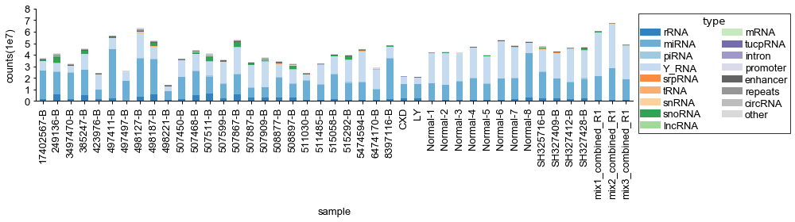


## bar plot of RNA by sample


```python
def plot_bar_by_rna(fig,ax,table,rnaname,savefig=1, statistics = 'ratio',height = 4, width=20):
    '''
    table: ratio or count table, rows are rna type
    statistics: ratio or count
    '''
    table = table.T
    count = np.array(table[table.index ==rnaname]).ravel()
    #fig,ax=plt.subplots(1,figsize=(width,height))
    counttable =  pd.DataFrame(np.concatenate((np.arange(1,table.shape[1]+1).reshape(-1,1),
                count[np.argsort(-count)].reshape(-1,1)),axis=1),columns=['sample',statistics])
    
    sns.barplot(ax=ax,x='sample',y=statistics,data = counttable,color=Category20c[20][np.random.randint(0,20)],alpha=1)
    ax.set_xticks(np.arange(0,table.shape[1],5))
    ax.set_xticklabels(np.arange(0,table.shape[1],5))
    ax.set_title(statistics+' of '+rnaname,fontsize=15)
    if savefig:
        fig.savefig(save_path+'sample_'+rnaname+'_'+statistics+'_bar_plot'+saveformat, bbox_inches='tight')
        
```


```python
def plot_bar_by_rna_total(table,datatype='ratio'):
    fignum= table.columns.shape[0]
    fig,ax=plt.subplots(fignum ,1,figsize=(7 , 24 ))
    for i in range(fignum):
        plot_bar_by_rna(fig,ax[i],table,table.columns[i],statistics = datatype)
        std_plot(ax[i],'sample','ratio',datatype+' of '+table.columns[i])
    fig.tight_layout()
```

if sequencing_type == 'long': 
    plot_bar_by_rna_total(percent_by_mapped/100.,datatype='ratio')
else: 
    plot_bar_by_rna_total(table_ratio,datatype='ratio')

embed_pdf_figure()

if sequencing_type == 'long': 
    plot_bar_by_rna_total(percent_by_mapped/100.,datatype='count')
else: 
    plot_bar_by_rna_total(table_ratio,datatype='count')


embed_pdf_figure()

## FastQC


```python
summary = pd.read_table('output/'+dataset+'/summary/fastqc.txt', sep='\t')
qc_status = summary.iloc[:, 9:]
qc_status.fillna('NA')
qc_status = qc_status.astype('str')
sample_ids = summary.sample_id
sections = qc_status.columns.values
def style_func(val):
    status, row, col = val.split('|')
    row, col = int(row), int(col)
    color = {'pass': 'green', 'fail': 'red', 'warn': 'orange'}.get(status, 'gray')
    return '<a href="../output/'+dataset+'/fastqc/{sample_id}_fastqc.html#M{section}" style="color: {color}">{status}</a>'.format(
        sample_id=sample_ids[row], color=color, status=status, section=col + 1)

pd.DataFrame(qc_status.values \
             + '|' + np.arange(qc_status.shape[0]).astype('str')[:, np.newaxis] \
             + '|' + np.arange(qc_status.shape[1]).astype('str')[np.newaxis, :],
             index=qc_status.index, columns=qc_status.columns) \
    .style.format(style_func)
```


<style  type="text/css" >
</style>  
<table id="T_b9e38600_7878_11e9_9f96_33a93858c7c7" > 
<thead>    <tr> 
        <th class="blank level0" ></th> 
        <th class="col_heading level0 col0" >Basic Statistics</th> 
        <th class="col_heading level0 col1" >Per base sequence quality</th> 
        <th class="col_heading level0 col2" >Per tile sequence quality</th> 
        <th class="col_heading level0 col3" >Per sequence quality scores</th> 
        <th class="col_heading level0 col4" >Per base sequence content</th> 
        <th class="col_heading level0 col5" >Per sequence GC content</th> 
        <th class="col_heading level0 col6" >Per base N content</th> 
        <th class="col_heading level0 col7" >Sequence Length Distribution</th> 
        <th class="col_heading level0 col8" >Sequence Duplication Levels</th> 
        <th class="col_heading level0 col9" >Overrepresented sequences</th> 
        <th class="col_heading level0 col10" >Adapter Content</th> 
    </tr></thead> 
<tbody>    <tr> 
        <th id="T_b9e38600_7878_11e9_9f96_33a93858c7c7level0_row0" class="row_heading level0 row0" >0</th> 
        <td id="T_b9e38600_7878_11e9_9f96_33a93858c7c7row0_col0" class="data row0 col0" ><a href="../output/lulab_hcc/fastqc/10515058-A_fastqc.html#M1" style="color: green">pass</a></td> 
        <td id="T_b9e38600_7878_11e9_9f96_33a93858c7c7row0_col1" class="data row0 col1" ><a href="../output/lulab_hcc/fastqc/10515058-A_fastqc.html#M2" style="color: orange">warn</a></td> 
        <td id="T_b9e38600_7878_11e9_9f96_33a93858c7c7row0_col2" class="data row0 col2" ><a href="../output/lulab_hcc/fastqc/10515058-A_fastqc.html#M3" style="color: orange">warn</a></td> 
        <td id="T_b9e38600_7878_11e9_9f96_33a93858c7c7row0_col3" class="data row0 col3" ><a href="../output/lulab_hcc/fastqc/10515058-A_fastqc.html#M4" style="color: green">pass</a></td> 
        <td id="T_b9e38600_7878_11e9_9f96_33a93858c7c7row0_col4" class="data row0 col4" ><a href="../output/lulab_hcc/fastqc/10515058-A_fastqc.html#M5" style="color: red">fail</a></td> 
        <td id="T_b9e38600_7878_11e9_9f96_33a93858c7c7row0_col5" class="data row0 col5" ><a href="../output/lulab_hcc/fastqc/10515058-A_fastqc.html#M6" style="color: red">fail</a></td> 
        <td id="T_b9e38600_7878_11e9_9f96_33a93858c7c7row0_col6" class="data row0 col6" ><a href="../output/lulab_hcc/fastqc/10515058-A_fastqc.html#M7" style="color: green">pass</a></td> 
        <td id="T_b9e38600_7878_11e9_9f96_33a93858c7c7row0_col7" class="data row0 col7" ><a href="../output/lulab_hcc/fastqc/10515058-A_fastqc.html#M8" style="color: green">pass</a></td> 
        <td id="T_b9e38600_7878_11e9_9f96_33a93858c7c7row0_col8" class="data row0 col8" ><a href="../output/lulab_hcc/fastqc/10515058-A_fastqc.html#M9" style="color: red">fail</a></td> 
        <td id="T_b9e38600_7878_11e9_9f96_33a93858c7c7row0_col9" class="data row0 col9" ><a href="../output/lulab_hcc/fastqc/10515058-A_fastqc.html#M10" style="color: red">fail</a></td> 
        <td id="T_b9e38600_7878_11e9_9f96_33a93858c7c7row0_col10" class="data row0 col10" ><a href="../output/lulab_hcc/fastqc/10515058-A_fastqc.html#M11" style="color: red">fail</a></td> 
    </tr>    <tr> 
        <th id="T_b9e38600_7878_11e9_9f96_33a93858c7c7level0_row1" class="row_heading level0 row1" >1</th> 
        <td id="T_b9e38600_7878_11e9_9f96_33a93858c7c7row1_col0" class="data row1 col0" ><a href="../output/lulab_hcc/fastqc/12402567-A_fastqc.html#M1" style="color: green">pass</a></td> 
        <td id="T_b9e38600_7878_11e9_9f96_33a93858c7c7row1_col1" class="data row1 col1" ><a href="../output/lulab_hcc/fastqc/12402567-A_fastqc.html#M2" style="color: red">fail</a></td> 
        <td id="T_b9e38600_7878_11e9_9f96_33a93858c7c7row1_col2" class="data row1 col2" ><a href="../output/lulab_hcc/fastqc/12402567-A_fastqc.html#M3" style="color: orange">warn</a></td> 
        <td id="T_b9e38600_7878_11e9_9f96_33a93858c7c7row1_col3" class="data row1 col3" ><a href="../output/lulab_hcc/fastqc/12402567-A_fastqc.html#M4" style="color: green">pass</a></td> 
        <td id="T_b9e38600_7878_11e9_9f96_33a93858c7c7row1_col4" class="data row1 col4" ><a href="../output/lulab_hcc/fastqc/12402567-A_fastqc.html#M5" style="color: red">fail</a></td> 
        <td id="T_b9e38600_7878_11e9_9f96_33a93858c7c7row1_col5" class="data row1 col5" ><a href="../output/lulab_hcc/fastqc/12402567-A_fastqc.html#M6" style="color: red">fail</a></td> 
        <td id="T_b9e38600_7878_11e9_9f96_33a93858c7c7row1_col6" class="data row1 col6" ><a href="../output/lulab_hcc/fastqc/12402567-A_fastqc.html#M7" style="color: green">pass</a></td> 
        <td id="T_b9e38600_7878_11e9_9f96_33a93858c7c7row1_col7" class="data row1 col7" ><a href="../output/lulab_hcc/fastqc/12402567-A_fastqc.html#M8" style="color: green">pass</a></td> 
        <td id="T_b9e38600_7878_11e9_9f96_33a93858c7c7row1_col8" class="data row1 col8" ><a href="../output/lulab_hcc/fastqc/12402567-A_fastqc.html#M9" style="color: red">fail</a></td> 
        <td id="T_b9e38600_7878_11e9_9f96_33a93858c7c7row1_col9" class="data row1 col9" ><a href="../output/lulab_hcc/fastqc/12402567-A_fastqc.html#M10" style="color: red">fail</a></td> 
        <td id="T_b9e38600_7878_11e9_9f96_33a93858c7c7row1_col10" class="data row1 col10" ><a href="../output/lulab_hcc/fastqc/12402567-A_fastqc.html#M11" style="color: red">fail</a></td> 
    </tr>    <tr> 
        <th id="T_b9e38600_7878_11e9_9f96_33a93858c7c7level0_row2" class="row_heading level0 row2" >2</th> 
        <td id="T_b9e38600_7878_11e9_9f96_33a93858c7c7row2_col0" class="data row2 col0" ><a href="../output/lulab_hcc/fastqc/13515292-A_fastqc.html#M1" style="color: green">pass</a></td> 
        <td id="T_b9e38600_7878_11e9_9f96_33a93858c7c7row2_col1" class="data row2 col1" ><a href="../output/lulab_hcc/fastqc/13515292-A_fastqc.html#M2" style="color: red">fail</a></td> 
        <td id="T_b9e38600_7878_11e9_9f96_33a93858c7c7row2_col2" class="data row2 col2" ><a href="../output/lulab_hcc/fastqc/13515292-A_fastqc.html#M3" style="color: orange">warn</a></td> 
        <td id="T_b9e38600_7878_11e9_9f96_33a93858c7c7row2_col3" class="data row2 col3" ><a href="../output/lulab_hcc/fastqc/13515292-A_fastqc.html#M4" style="color: green">pass</a></td> 
        <td id="T_b9e38600_7878_11e9_9f96_33a93858c7c7row2_col4" class="data row2 col4" ><a href="../output/lulab_hcc/fastqc/13515292-A_fastqc.html#M5" style="color: red">fail</a></td> 
        <td id="T_b9e38600_7878_11e9_9f96_33a93858c7c7row2_col5" class="data row2 col5" ><a href="../output/lulab_hcc/fastqc/13515292-A_fastqc.html#M6" style="color: red">fail</a></td> 
        <td id="T_b9e38600_7878_11e9_9f96_33a93858c7c7row2_col6" class="data row2 col6" ><a href="../output/lulab_hcc/fastqc/13515292-A_fastqc.html#M7" style="color: green">pass</a></td> 
        <td id="T_b9e38600_7878_11e9_9f96_33a93858c7c7row2_col7" class="data row2 col7" ><a href="../output/lulab_hcc/fastqc/13515292-A_fastqc.html#M8" style="color: green">pass</a></td> 
        <td id="T_b9e38600_7878_11e9_9f96_33a93858c7c7row2_col8" class="data row2 col8" ><a href="../output/lulab_hcc/fastqc/13515292-A_fastqc.html#M9" style="color: red">fail</a></td> 
        <td id="T_b9e38600_7878_11e9_9f96_33a93858c7c7row2_col9" class="data row2 col9" ><a href="../output/lulab_hcc/fastqc/13515292-A_fastqc.html#M10" style="color: red">fail</a></td> 
        <td id="T_b9e38600_7878_11e9_9f96_33a93858c7c7row2_col10" class="data row2 col10" ><a href="../output/lulab_hcc/fastqc/13515292-A_fastqc.html#M11" style="color: red">fail</a></td> 
    </tr>    <tr> 
        <th id="T_b9e38600_7878_11e9_9f96_33a93858c7c7level0_row3" class="row_heading level0 row3" >3</th> 
        <td id="T_b9e38600_7878_11e9_9f96_33a93858c7c7row3_col0" class="data row3 col0" ><a href="../output/lulab_hcc/fastqc/17402567-B_fastqc.html#M1" style="color: green">pass</a></td> 
        <td id="T_b9e38600_7878_11e9_9f96_33a93858c7c7row3_col1" class="data row3 col1" ><a href="../output/lulab_hcc/fastqc/17402567-B_fastqc.html#M2" style="color: red">fail</a></td> 
        <td id="T_b9e38600_7878_11e9_9f96_33a93858c7c7row3_col2" class="data row3 col2" ><a href="../output/lulab_hcc/fastqc/17402567-B_fastqc.html#M3" style="color: green">pass</a></td> 
        <td id="T_b9e38600_7878_11e9_9f96_33a93858c7c7row3_col3" class="data row3 col3" ><a href="../output/lulab_hcc/fastqc/17402567-B_fastqc.html#M4" style="color: green">pass</a></td> 
        <td id="T_b9e38600_7878_11e9_9f96_33a93858c7c7row3_col4" class="data row3 col4" ><a href="../output/lulab_hcc/fastqc/17402567-B_fastqc.html#M5" style="color: red">fail</a></td> 
        <td id="T_b9e38600_7878_11e9_9f96_33a93858c7c7row3_col5" class="data row3 col5" ><a href="../output/lulab_hcc/fastqc/17402567-B_fastqc.html#M6" style="color: red">fail</a></td> 
        <td id="T_b9e38600_7878_11e9_9f96_33a93858c7c7row3_col6" class="data row3 col6" ><a href="../output/lulab_hcc/fastqc/17402567-B_fastqc.html#M7" style="color: green">pass</a></td> 
        <td id="T_b9e38600_7878_11e9_9f96_33a93858c7c7row3_col7" class="data row3 col7" ><a href="../output/lulab_hcc/fastqc/17402567-B_fastqc.html#M8" style="color: green">pass</a></td> 
        <td id="T_b9e38600_7878_11e9_9f96_33a93858c7c7row3_col8" class="data row3 col8" ><a href="../output/lulab_hcc/fastqc/17402567-B_fastqc.html#M9" style="color: red">fail</a></td> 
        <td id="T_b9e38600_7878_11e9_9f96_33a93858c7c7row3_col9" class="data row3 col9" ><a href="../output/lulab_hcc/fastqc/17402567-B_fastqc.html#M10" style="color: red">fail</a></td> 
        <td id="T_b9e38600_7878_11e9_9f96_33a93858c7c7row3_col10" class="data row3 col10" ><a href="../output/lulab_hcc/fastqc/17402567-B_fastqc.html#M11" style="color: red">fail</a></td> 
    </tr>    <tr> 
        <th id="T_b9e38600_7878_11e9_9f96_33a93858c7c7level0_row4" class="row_heading level0 row4" >4</th> 
        <td id="T_b9e38600_7878_11e9_9f96_33a93858c7c7row4_col0" class="data row4 col0" ><a href="../output/lulab_hcc/fastqc/249136-B_fastqc.html#M1" style="color: green">pass</a></td> 
        <td id="T_b9e38600_7878_11e9_9f96_33a93858c7c7row4_col1" class="data row4 col1" ><a href="../output/lulab_hcc/fastqc/249136-B_fastqc.html#M2" style="color: red">fail</a></td> 
        <td id="T_b9e38600_7878_11e9_9f96_33a93858c7c7row4_col2" class="data row4 col2" ><a href="../output/lulab_hcc/fastqc/249136-B_fastqc.html#M3" style="color: orange">warn</a></td> 
        <td id="T_b9e38600_7878_11e9_9f96_33a93858c7c7row4_col3" class="data row4 col3" ><a href="../output/lulab_hcc/fastqc/249136-B_fastqc.html#M4" style="color: orange">warn</a></td> 
        <td id="T_b9e38600_7878_11e9_9f96_33a93858c7c7row4_col4" class="data row4 col4" ><a href="../output/lulab_hcc/fastqc/249136-B_fastqc.html#M5" style="color: red">fail</a></td> 
        <td id="T_b9e38600_7878_11e9_9f96_33a93858c7c7row4_col5" class="data row4 col5" ><a href="../output/lulab_hcc/fastqc/249136-B_fastqc.html#M6" style="color: orange">warn</a></td> 
        <td id="T_b9e38600_7878_11e9_9f96_33a93858c7c7row4_col6" class="data row4 col6" ><a href="../output/lulab_hcc/fastqc/249136-B_fastqc.html#M7" style="color: green">pass</a></td> 
        <td id="T_b9e38600_7878_11e9_9f96_33a93858c7c7row4_col7" class="data row4 col7" ><a href="../output/lulab_hcc/fastqc/249136-B_fastqc.html#M8" style="color: green">pass</a></td> 
        <td id="T_b9e38600_7878_11e9_9f96_33a93858c7c7row4_col8" class="data row4 col8" ><a href="../output/lulab_hcc/fastqc/249136-B_fastqc.html#M9" style="color: red">fail</a></td> 
        <td id="T_b9e38600_7878_11e9_9f96_33a93858c7c7row4_col9" class="data row4 col9" ><a href="../output/lulab_hcc/fastqc/249136-B_fastqc.html#M10" style="color: red">fail</a></td> 
        <td id="T_b9e38600_7878_11e9_9f96_33a93858c7c7row4_col10" class="data row4 col10" ><a href="../output/lulab_hcc/fastqc/249136-B_fastqc.html#M11" style="color: red">fail</a></td> 
    </tr>    <tr> 
        <th id="T_b9e38600_7878_11e9_9f96_33a93858c7c7level0_row5" class="row_heading level0 row5" >5</th> 
        <td id="T_b9e38600_7878_11e9_9f96_33a93858c7c7row5_col0" class="data row5 col0" ><a href="../output/lulab_hcc/fastqc/333874-A_fastqc.html#M1" style="color: green">pass</a></td> 
        <td id="T_b9e38600_7878_11e9_9f96_33a93858c7c7row5_col1" class="data row5 col1" ><a href="../output/lulab_hcc/fastqc/333874-A_fastqc.html#M2" style="color: red">fail</a></td> 
        <td id="T_b9e38600_7878_11e9_9f96_33a93858c7c7row5_col2" class="data row5 col2" ><a href="../output/lulab_hcc/fastqc/333874-A_fastqc.html#M3" style="color: red">fail</a></td> 
        <td id="T_b9e38600_7878_11e9_9f96_33a93858c7c7row5_col3" class="data row5 col3" ><a href="../output/lulab_hcc/fastqc/333874-A_fastqc.html#M4" style="color: green">pass</a></td> 
        <td id="T_b9e38600_7878_11e9_9f96_33a93858c7c7row5_col4" class="data row5 col4" ><a href="../output/lulab_hcc/fastqc/333874-A_fastqc.html#M5" style="color: red">fail</a></td> 
        <td id="T_b9e38600_7878_11e9_9f96_33a93858c7c7row5_col5" class="data row5 col5" ><a href="../output/lulab_hcc/fastqc/333874-A_fastqc.html#M6" style="color: red">fail</a></td> 
        <td id="T_b9e38600_7878_11e9_9f96_33a93858c7c7row5_col6" class="data row5 col6" ><a href="../output/lulab_hcc/fastqc/333874-A_fastqc.html#M7" style="color: green">pass</a></td> 
        <td id="T_b9e38600_7878_11e9_9f96_33a93858c7c7row5_col7" class="data row5 col7" ><a href="../output/lulab_hcc/fastqc/333874-A_fastqc.html#M8" style="color: green">pass</a></td> 
        <td id="T_b9e38600_7878_11e9_9f96_33a93858c7c7row5_col8" class="data row5 col8" ><a href="../output/lulab_hcc/fastqc/333874-A_fastqc.html#M9" style="color: red">fail</a></td> 
        <td id="T_b9e38600_7878_11e9_9f96_33a93858c7c7row5_col9" class="data row5 col9" ><a href="../output/lulab_hcc/fastqc/333874-A_fastqc.html#M10" style="color: red">fail</a></td> 
        <td id="T_b9e38600_7878_11e9_9f96_33a93858c7c7row5_col10" class="data row5 col10" ><a href="../output/lulab_hcc/fastqc/333874-A_fastqc.html#M11" style="color: red">fail</a></td> 
    </tr>    <tr> 
        <th id="T_b9e38600_7878_11e9_9f96_33a93858c7c7level0_row6" class="row_heading level0 row6" >6</th> 
        <td id="T_b9e38600_7878_11e9_9f96_33a93858c7c7row6_col0" class="data row6 col0" ><a href="../output/lulab_hcc/fastqc/3497470-B_fastqc.html#M1" style="color: green">pass</a></td> 
        <td id="T_b9e38600_7878_11e9_9f96_33a93858c7c7row6_col1" class="data row6 col1" ><a href="../output/lulab_hcc/fastqc/3497470-B_fastqc.html#M2" style="color: red">fail</a></td> 
        <td id="T_b9e38600_7878_11e9_9f96_33a93858c7c7row6_col2" class="data row6 col2" ><a href="../output/lulab_hcc/fastqc/3497470-B_fastqc.html#M3" style="color: green">pass</a></td> 
        <td id="T_b9e38600_7878_11e9_9f96_33a93858c7c7row6_col3" class="data row6 col3" ><a href="../output/lulab_hcc/fastqc/3497470-B_fastqc.html#M4" style="color: green">pass</a></td> 
        <td id="T_b9e38600_7878_11e9_9f96_33a93858c7c7row6_col4" class="data row6 col4" ><a href="../output/lulab_hcc/fastqc/3497470-B_fastqc.html#M5" style="color: red">fail</a></td> 
        <td id="T_b9e38600_7878_11e9_9f96_33a93858c7c7row6_col5" class="data row6 col5" ><a href="../output/lulab_hcc/fastqc/3497470-B_fastqc.html#M6" style="color: orange">warn</a></td> 
        <td id="T_b9e38600_7878_11e9_9f96_33a93858c7c7row6_col6" class="data row6 col6" ><a href="../output/lulab_hcc/fastqc/3497470-B_fastqc.html#M7" style="color: green">pass</a></td> 
        <td id="T_b9e38600_7878_11e9_9f96_33a93858c7c7row6_col7" class="data row6 col7" ><a href="../output/lulab_hcc/fastqc/3497470-B_fastqc.html#M8" style="color: green">pass</a></td> 
        <td id="T_b9e38600_7878_11e9_9f96_33a93858c7c7row6_col8" class="data row6 col8" ><a href="../output/lulab_hcc/fastqc/3497470-B_fastqc.html#M9" style="color: red">fail</a></td> 
        <td id="T_b9e38600_7878_11e9_9f96_33a93858c7c7row6_col9" class="data row6 col9" ><a href="../output/lulab_hcc/fastqc/3497470-B_fastqc.html#M10" style="color: red">fail</a></td> 
        <td id="T_b9e38600_7878_11e9_9f96_33a93858c7c7row6_col10" class="data row6 col10" ><a href="../output/lulab_hcc/fastqc/3497470-B_fastqc.html#M11" style="color: red">fail</a></td> 
    </tr>    <tr> 
        <th id="T_b9e38600_7878_11e9_9f96_33a93858c7c7level0_row7" class="row_heading level0 row7" >7</th> 
        <td id="T_b9e38600_7878_11e9_9f96_33a93858c7c7row7_col0" class="data row7 col0" ><a href="../output/lulab_hcc/fastqc/385247-A_fastqc.html#M1" style="color: green">pass</a></td> 
        <td id="T_b9e38600_7878_11e9_9f96_33a93858c7c7row7_col1" class="data row7 col1" ><a href="../output/lulab_hcc/fastqc/385247-A_fastqc.html#M2" style="color: red">fail</a></td> 
        <td id="T_b9e38600_7878_11e9_9f96_33a93858c7c7row7_col2" class="data row7 col2" ><a href="../output/lulab_hcc/fastqc/385247-A_fastqc.html#M3" style="color: green">pass</a></td> 
        <td id="T_b9e38600_7878_11e9_9f96_33a93858c7c7row7_col3" class="data row7 col3" ><a href="../output/lulab_hcc/fastqc/385247-A_fastqc.html#M4" style="color: green">pass</a></td> 
        <td id="T_b9e38600_7878_11e9_9f96_33a93858c7c7row7_col4" class="data row7 col4" ><a href="../output/lulab_hcc/fastqc/385247-A_fastqc.html#M5" style="color: red">fail</a></td> 
        <td id="T_b9e38600_7878_11e9_9f96_33a93858c7c7row7_col5" class="data row7 col5" ><a href="../output/lulab_hcc/fastqc/385247-A_fastqc.html#M6" style="color: red">fail</a></td> 
        <td id="T_b9e38600_7878_11e9_9f96_33a93858c7c7row7_col6" class="data row7 col6" ><a href="../output/lulab_hcc/fastqc/385247-A_fastqc.html#M7" style="color: green">pass</a></td> 
        <td id="T_b9e38600_7878_11e9_9f96_33a93858c7c7row7_col7" class="data row7 col7" ><a href="../output/lulab_hcc/fastqc/385247-A_fastqc.html#M8" style="color: green">pass</a></td> 
        <td id="T_b9e38600_7878_11e9_9f96_33a93858c7c7row7_col8" class="data row7 col8" ><a href="../output/lulab_hcc/fastqc/385247-A_fastqc.html#M9" style="color: red">fail</a></td> 
        <td id="T_b9e38600_7878_11e9_9f96_33a93858c7c7row7_col9" class="data row7 col9" ><a href="../output/lulab_hcc/fastqc/385247-A_fastqc.html#M10" style="color: red">fail</a></td> 
        <td id="T_b9e38600_7878_11e9_9f96_33a93858c7c7row7_col10" class="data row7 col10" ><a href="../output/lulab_hcc/fastqc/385247-A_fastqc.html#M11" style="color: red">fail</a></td> 
    </tr>    <tr> 
        <th id="T_b9e38600_7878_11e9_9f96_33a93858c7c7level0_row8" class="row_heading level0 row8" >8</th> 
        <td id="T_b9e38600_7878_11e9_9f96_33a93858c7c7row8_col0" class="data row8 col0" ><a href="../output/lulab_hcc/fastqc/385247-B_fastqc.html#M1" style="color: green">pass</a></td> 
        <td id="T_b9e38600_7878_11e9_9f96_33a93858c7c7row8_col1" class="data row8 col1" ><a href="../output/lulab_hcc/fastqc/385247-B_fastqc.html#M2" style="color: red">fail</a></td> 
        <td id="T_b9e38600_7878_11e9_9f96_33a93858c7c7row8_col2" class="data row8 col2" ><a href="../output/lulab_hcc/fastqc/385247-B_fastqc.html#M3" style="color: green">pass</a></td> 
        <td id="T_b9e38600_7878_11e9_9f96_33a93858c7c7row8_col3" class="data row8 col3" ><a href="../output/lulab_hcc/fastqc/385247-B_fastqc.html#M4" style="color: green">pass</a></td> 
        <td id="T_b9e38600_7878_11e9_9f96_33a93858c7c7row8_col4" class="data row8 col4" ><a href="../output/lulab_hcc/fastqc/385247-B_fastqc.html#M5" style="color: red">fail</a></td> 
        <td id="T_b9e38600_7878_11e9_9f96_33a93858c7c7row8_col5" class="data row8 col5" ><a href="../output/lulab_hcc/fastqc/385247-B_fastqc.html#M6" style="color: red">fail</a></td> 
        <td id="T_b9e38600_7878_11e9_9f96_33a93858c7c7row8_col6" class="data row8 col6" ><a href="../output/lulab_hcc/fastqc/385247-B_fastqc.html#M7" style="color: green">pass</a></td> 
        <td id="T_b9e38600_7878_11e9_9f96_33a93858c7c7row8_col7" class="data row8 col7" ><a href="../output/lulab_hcc/fastqc/385247-B_fastqc.html#M8" style="color: green">pass</a></td> 
        <td id="T_b9e38600_7878_11e9_9f96_33a93858c7c7row8_col8" class="data row8 col8" ><a href="../output/lulab_hcc/fastqc/385247-B_fastqc.html#M9" style="color: red">fail</a></td> 
        <td id="T_b9e38600_7878_11e9_9f96_33a93858c7c7row8_col9" class="data row8 col9" ><a href="../output/lulab_hcc/fastqc/385247-B_fastqc.html#M10" style="color: red">fail</a></td> 
        <td id="T_b9e38600_7878_11e9_9f96_33a93858c7c7row8_col10" class="data row8 col10" ><a href="../output/lulab_hcc/fastqc/385247-B_fastqc.html#M11" style="color: red">fail</a></td> 
    </tr>    <tr> 
        <th id="T_b9e38600_7878_11e9_9f96_33a93858c7c7level0_row9" class="row_heading level0 row9" >9</th> 
        <td id="T_b9e38600_7878_11e9_9f96_33a93858c7c7row9_col0" class="data row9 col0" ><a href="../output/lulab_hcc/fastqc/423976-B_fastqc.html#M1" style="color: green">pass</a></td> 
        <td id="T_b9e38600_7878_11e9_9f96_33a93858c7c7row9_col1" class="data row9 col1" ><a href="../output/lulab_hcc/fastqc/423976-B_fastqc.html#M2" style="color: red">fail</a></td> 
        <td id="T_b9e38600_7878_11e9_9f96_33a93858c7c7row9_col2" class="data row9 col2" ><a href="../output/lulab_hcc/fastqc/423976-B_fastqc.html#M3" style="color: green">pass</a></td> 
        <td id="T_b9e38600_7878_11e9_9f96_33a93858c7c7row9_col3" class="data row9 col3" ><a href="../output/lulab_hcc/fastqc/423976-B_fastqc.html#M4" style="color: green">pass</a></td> 
        <td id="T_b9e38600_7878_11e9_9f96_33a93858c7c7row9_col4" class="data row9 col4" ><a href="../output/lulab_hcc/fastqc/423976-B_fastqc.html#M5" style="color: red">fail</a></td> 
        <td id="T_b9e38600_7878_11e9_9f96_33a93858c7c7row9_col5" class="data row9 col5" ><a href="../output/lulab_hcc/fastqc/423976-B_fastqc.html#M6" style="color: red">fail</a></td> 
        <td id="T_b9e38600_7878_11e9_9f96_33a93858c7c7row9_col6" class="data row9 col6" ><a href="../output/lulab_hcc/fastqc/423976-B_fastqc.html#M7" style="color: green">pass</a></td> 
        <td id="T_b9e38600_7878_11e9_9f96_33a93858c7c7row9_col7" class="data row9 col7" ><a href="../output/lulab_hcc/fastqc/423976-B_fastqc.html#M8" style="color: green">pass</a></td> 
        <td id="T_b9e38600_7878_11e9_9f96_33a93858c7c7row9_col8" class="data row9 col8" ><a href="../output/lulab_hcc/fastqc/423976-B_fastqc.html#M9" style="color: red">fail</a></td> 
        <td id="T_b9e38600_7878_11e9_9f96_33a93858c7c7row9_col9" class="data row9 col9" ><a href="../output/lulab_hcc/fastqc/423976-B_fastqc.html#M10" style="color: red">fail</a></td> 
        <td id="T_b9e38600_7878_11e9_9f96_33a93858c7c7row9_col10" class="data row9 col10" ><a href="../output/lulab_hcc/fastqc/423976-B_fastqc.html#M11" style="color: red">fail</a></td> 
    </tr>    <tr> 
        <th id="T_b9e38600_7878_11e9_9f96_33a93858c7c7level0_row10" class="row_heading level0 row10" >10</th> 
        <td id="T_b9e38600_7878_11e9_9f96_33a93858c7c7row10_col0" class="data row10 col0" ><a href="../output/lulab_hcc/fastqc/482592-A_fastqc.html#M1" style="color: green">pass</a></td> 
        <td id="T_b9e38600_7878_11e9_9f96_33a93858c7c7row10_col1" class="data row10 col1" ><a href="../output/lulab_hcc/fastqc/482592-A_fastqc.html#M2" style="color: red">fail</a></td> 
        <td id="T_b9e38600_7878_11e9_9f96_33a93858c7c7row10_col2" class="data row10 col2" ><a href="../output/lulab_hcc/fastqc/482592-A_fastqc.html#M3" style="color: red">fail</a></td> 
        <td id="T_b9e38600_7878_11e9_9f96_33a93858c7c7row10_col3" class="data row10 col3" ><a href="../output/lulab_hcc/fastqc/482592-A_fastqc.html#M4" style="color: green">pass</a></td> 
        <td id="T_b9e38600_7878_11e9_9f96_33a93858c7c7row10_col4" class="data row10 col4" ><a href="../output/lulab_hcc/fastqc/482592-A_fastqc.html#M5" style="color: red">fail</a></td> 
        <td id="T_b9e38600_7878_11e9_9f96_33a93858c7c7row10_col5" class="data row10 col5" ><a href="../output/lulab_hcc/fastqc/482592-A_fastqc.html#M6" style="color: red">fail</a></td> 
        <td id="T_b9e38600_7878_11e9_9f96_33a93858c7c7row10_col6" class="data row10 col6" ><a href="../output/lulab_hcc/fastqc/482592-A_fastqc.html#M7" style="color: green">pass</a></td> 
        <td id="T_b9e38600_7878_11e9_9f96_33a93858c7c7row10_col7" class="data row10 col7" ><a href="../output/lulab_hcc/fastqc/482592-A_fastqc.html#M8" style="color: green">pass</a></td> 
        <td id="T_b9e38600_7878_11e9_9f96_33a93858c7c7row10_col8" class="data row10 col8" ><a href="../output/lulab_hcc/fastqc/482592-A_fastqc.html#M9" style="color: red">fail</a></td> 
        <td id="T_b9e38600_7878_11e9_9f96_33a93858c7c7row10_col9" class="data row10 col9" ><a href="../output/lulab_hcc/fastqc/482592-A_fastqc.html#M10" style="color: red">fail</a></td> 
        <td id="T_b9e38600_7878_11e9_9f96_33a93858c7c7row10_col10" class="data row10 col10" ><a href="../output/lulab_hcc/fastqc/482592-A_fastqc.html#M11" style="color: red">fail</a></td> 
    </tr>    <tr> 
        <th id="T_b9e38600_7878_11e9_9f96_33a93858c7c7level0_row11" class="row_heading level0 row11" >11</th> 
        <td id="T_b9e38600_7878_11e9_9f96_33a93858c7c7row11_col0" class="data row11 col0" ><a href="../output/lulab_hcc/fastqc/486978-A_fastqc.html#M1" style="color: green">pass</a></td> 
        <td id="T_b9e38600_7878_11e9_9f96_33a93858c7c7row11_col1" class="data row11 col1" ><a href="../output/lulab_hcc/fastqc/486978-A_fastqc.html#M2" style="color: orange">warn</a></td> 
        <td id="T_b9e38600_7878_11e9_9f96_33a93858c7c7row11_col2" class="data row11 col2" ><a href="../output/lulab_hcc/fastqc/486978-A_fastqc.html#M3" style="color: red">fail</a></td> 
        <td id="T_b9e38600_7878_11e9_9f96_33a93858c7c7row11_col3" class="data row11 col3" ><a href="../output/lulab_hcc/fastqc/486978-A_fastqc.html#M4" style="color: green">pass</a></td> 
        <td id="T_b9e38600_7878_11e9_9f96_33a93858c7c7row11_col4" class="data row11 col4" ><a href="../output/lulab_hcc/fastqc/486978-A_fastqc.html#M5" style="color: red">fail</a></td> 
        <td id="T_b9e38600_7878_11e9_9f96_33a93858c7c7row11_col5" class="data row11 col5" ><a href="../output/lulab_hcc/fastqc/486978-A_fastqc.html#M6" style="color: red">fail</a></td> 
        <td id="T_b9e38600_7878_11e9_9f96_33a93858c7c7row11_col6" class="data row11 col6" ><a href="../output/lulab_hcc/fastqc/486978-A_fastqc.html#M7" style="color: green">pass</a></td> 
        <td id="T_b9e38600_7878_11e9_9f96_33a93858c7c7row11_col7" class="data row11 col7" ><a href="../output/lulab_hcc/fastqc/486978-A_fastqc.html#M8" style="color: green">pass</a></td> 
        <td id="T_b9e38600_7878_11e9_9f96_33a93858c7c7row11_col8" class="data row11 col8" ><a href="../output/lulab_hcc/fastqc/486978-A_fastqc.html#M9" style="color: red">fail</a></td> 
        <td id="T_b9e38600_7878_11e9_9f96_33a93858c7c7row11_col9" class="data row11 col9" ><a href="../output/lulab_hcc/fastqc/486978-A_fastqc.html#M10" style="color: red">fail</a></td> 
        <td id="T_b9e38600_7878_11e9_9f96_33a93858c7c7row11_col10" class="data row11 col10" ><a href="../output/lulab_hcc/fastqc/486978-A_fastqc.html#M11" style="color: red">fail</a></td> 
    </tr>    <tr> 
        <th id="T_b9e38600_7878_11e9_9f96_33a93858c7c7level0_row12" class="row_heading level0 row12" >12</th> 
        <td id="T_b9e38600_7878_11e9_9f96_33a93858c7c7row12_col0" class="data row12 col0" ><a href="../output/lulab_hcc/fastqc/497411-B_fastqc.html#M1" style="color: green">pass</a></td> 
        <td id="T_b9e38600_7878_11e9_9f96_33a93858c7c7row12_col1" class="data row12 col1" ><a href="../output/lulab_hcc/fastqc/497411-B_fastqc.html#M2" style="color: red">fail</a></td> 
        <td id="T_b9e38600_7878_11e9_9f96_33a93858c7c7row12_col2" class="data row12 col2" ><a href="../output/lulab_hcc/fastqc/497411-B_fastqc.html#M3" style="color: green">pass</a></td> 
        <td id="T_b9e38600_7878_11e9_9f96_33a93858c7c7row12_col3" class="data row12 col3" ><a href="../output/lulab_hcc/fastqc/497411-B_fastqc.html#M4" style="color: green">pass</a></td> 
        <td id="T_b9e38600_7878_11e9_9f96_33a93858c7c7row12_col4" class="data row12 col4" ><a href="../output/lulab_hcc/fastqc/497411-B_fastqc.html#M5" style="color: red">fail</a></td> 
        <td id="T_b9e38600_7878_11e9_9f96_33a93858c7c7row12_col5" class="data row12 col5" ><a href="../output/lulab_hcc/fastqc/497411-B_fastqc.html#M6" style="color: orange">warn</a></td> 
        <td id="T_b9e38600_7878_11e9_9f96_33a93858c7c7row12_col6" class="data row12 col6" ><a href="../output/lulab_hcc/fastqc/497411-B_fastqc.html#M7" style="color: green">pass</a></td> 
        <td id="T_b9e38600_7878_11e9_9f96_33a93858c7c7row12_col7" class="data row12 col7" ><a href="../output/lulab_hcc/fastqc/497411-B_fastqc.html#M8" style="color: green">pass</a></td> 
        <td id="T_b9e38600_7878_11e9_9f96_33a93858c7c7row12_col8" class="data row12 col8" ><a href="../output/lulab_hcc/fastqc/497411-B_fastqc.html#M9" style="color: red">fail</a></td> 
        <td id="T_b9e38600_7878_11e9_9f96_33a93858c7c7row12_col9" class="data row12 col9" ><a href="../output/lulab_hcc/fastqc/497411-B_fastqc.html#M10" style="color: red">fail</a></td> 
        <td id="T_b9e38600_7878_11e9_9f96_33a93858c7c7row12_col10" class="data row12 col10" ><a href="../output/lulab_hcc/fastqc/497411-B_fastqc.html#M11" style="color: red">fail</a></td> 
    </tr>    <tr> 
        <th id="T_b9e38600_7878_11e9_9f96_33a93858c7c7level0_row13" class="row_heading level0 row13" >13</th> 
        <td id="T_b9e38600_7878_11e9_9f96_33a93858c7c7row13_col0" class="data row13 col0" ><a href="../output/lulab_hcc/fastqc/497497-B_fastqc.html#M1" style="color: green">pass</a></td> 
        <td id="T_b9e38600_7878_11e9_9f96_33a93858c7c7row13_col1" class="data row13 col1" ><a href="../output/lulab_hcc/fastqc/497497-B_fastqc.html#M2" style="color: red">fail</a></td> 
        <td id="T_b9e38600_7878_11e9_9f96_33a93858c7c7row13_col2" class="data row13 col2" ><a href="../output/lulab_hcc/fastqc/497497-B_fastqc.html#M3" style="color: green">pass</a></td> 
        <td id="T_b9e38600_7878_11e9_9f96_33a93858c7c7row13_col3" class="data row13 col3" ><a href="../output/lulab_hcc/fastqc/497497-B_fastqc.html#M4" style="color: green">pass</a></td> 
        <td id="T_b9e38600_7878_11e9_9f96_33a93858c7c7row13_col4" class="data row13 col4" ><a href="../output/lulab_hcc/fastqc/497497-B_fastqc.html#M5" style="color: red">fail</a></td> 
        <td id="T_b9e38600_7878_11e9_9f96_33a93858c7c7row13_col5" class="data row13 col5" ><a href="../output/lulab_hcc/fastqc/497497-B_fastqc.html#M6" style="color: red">fail</a></td> 
        <td id="T_b9e38600_7878_11e9_9f96_33a93858c7c7row13_col6" class="data row13 col6" ><a href="../output/lulab_hcc/fastqc/497497-B_fastqc.html#M7" style="color: green">pass</a></td> 
        <td id="T_b9e38600_7878_11e9_9f96_33a93858c7c7row13_col7" class="data row13 col7" ><a href="../output/lulab_hcc/fastqc/497497-B_fastqc.html#M8" style="color: green">pass</a></td> 
        <td id="T_b9e38600_7878_11e9_9f96_33a93858c7c7row13_col8" class="data row13 col8" ><a href="../output/lulab_hcc/fastqc/497497-B_fastqc.html#M9" style="color: red">fail</a></td> 
        <td id="T_b9e38600_7878_11e9_9f96_33a93858c7c7row13_col9" class="data row13 col9" ><a href="../output/lulab_hcc/fastqc/497497-B_fastqc.html#M10" style="color: red">fail</a></td> 
        <td id="T_b9e38600_7878_11e9_9f96_33a93858c7c7row13_col10" class="data row13 col10" ><a href="../output/lulab_hcc/fastqc/497497-B_fastqc.html#M11" style="color: red">fail</a></td> 
    </tr>    <tr> 
        <th id="T_b9e38600_7878_11e9_9f96_33a93858c7c7level0_row14" class="row_heading level0 row14" >14</th> 
        <td id="T_b9e38600_7878_11e9_9f96_33a93858c7c7row14_col0" class="data row14 col0" ><a href="../output/lulab_hcc/fastqc/498127-B_fastqc.html#M1" style="color: green">pass</a></td> 
        <td id="T_b9e38600_7878_11e9_9f96_33a93858c7c7row14_col1" class="data row14 col1" ><a href="../output/lulab_hcc/fastqc/498127-B_fastqc.html#M2" style="color: red">fail</a></td> 
        <td id="T_b9e38600_7878_11e9_9f96_33a93858c7c7row14_col2" class="data row14 col2" ><a href="../output/lulab_hcc/fastqc/498127-B_fastqc.html#M3" style="color: green">pass</a></td> 
        <td id="T_b9e38600_7878_11e9_9f96_33a93858c7c7row14_col3" class="data row14 col3" ><a href="../output/lulab_hcc/fastqc/498127-B_fastqc.html#M4" style="color: green">pass</a></td> 
        <td id="T_b9e38600_7878_11e9_9f96_33a93858c7c7row14_col4" class="data row14 col4" ><a href="../output/lulab_hcc/fastqc/498127-B_fastqc.html#M5" style="color: red">fail</a></td> 
        <td id="T_b9e38600_7878_11e9_9f96_33a93858c7c7row14_col5" class="data row14 col5" ><a href="../output/lulab_hcc/fastqc/498127-B_fastqc.html#M6" style="color: red">fail</a></td> 
        <td id="T_b9e38600_7878_11e9_9f96_33a93858c7c7row14_col6" class="data row14 col6" ><a href="../output/lulab_hcc/fastqc/498127-B_fastqc.html#M7" style="color: green">pass</a></td> 
        <td id="T_b9e38600_7878_11e9_9f96_33a93858c7c7row14_col7" class="data row14 col7" ><a href="../output/lulab_hcc/fastqc/498127-B_fastqc.html#M8" style="color: green">pass</a></td> 
        <td id="T_b9e38600_7878_11e9_9f96_33a93858c7c7row14_col8" class="data row14 col8" ><a href="../output/lulab_hcc/fastqc/498127-B_fastqc.html#M9" style="color: red">fail</a></td> 
        <td id="T_b9e38600_7878_11e9_9f96_33a93858c7c7row14_col9" class="data row14 col9" ><a href="../output/lulab_hcc/fastqc/498127-B_fastqc.html#M10" style="color: red">fail</a></td> 
        <td id="T_b9e38600_7878_11e9_9f96_33a93858c7c7row14_col10" class="data row14 col10" ><a href="../output/lulab_hcc/fastqc/498127-B_fastqc.html#M11" style="color: red">fail</a></td> 
    </tr>    <tr> 
        <th id="T_b9e38600_7878_11e9_9f96_33a93858c7c7level0_row15" class="row_heading level0 row15" >15</th> 
        <td id="T_b9e38600_7878_11e9_9f96_33a93858c7c7row15_col0" class="data row15 col0" ><a href="../output/lulab_hcc/fastqc/498187-A_fastqc.html#M1" style="color: green">pass</a></td> 
        <td id="T_b9e38600_7878_11e9_9f96_33a93858c7c7row15_col1" class="data row15 col1" ><a href="../output/lulab_hcc/fastqc/498187-A_fastqc.html#M2" style="color: red">fail</a></td> 
        <td id="T_b9e38600_7878_11e9_9f96_33a93858c7c7row15_col2" class="data row15 col2" ><a href="../output/lulab_hcc/fastqc/498187-A_fastqc.html#M3" style="color: green">pass</a></td> 
        <td id="T_b9e38600_7878_11e9_9f96_33a93858c7c7row15_col3" class="data row15 col3" ><a href="../output/lulab_hcc/fastqc/498187-A_fastqc.html#M4" style="color: green">pass</a></td> 
        <td id="T_b9e38600_7878_11e9_9f96_33a93858c7c7row15_col4" class="data row15 col4" ><a href="../output/lulab_hcc/fastqc/498187-A_fastqc.html#M5" style="color: red">fail</a></td> 
        <td id="T_b9e38600_7878_11e9_9f96_33a93858c7c7row15_col5" class="data row15 col5" ><a href="../output/lulab_hcc/fastqc/498187-A_fastqc.html#M6" style="color: red">fail</a></td> 
        <td id="T_b9e38600_7878_11e9_9f96_33a93858c7c7row15_col6" class="data row15 col6" ><a href="../output/lulab_hcc/fastqc/498187-A_fastqc.html#M7" style="color: green">pass</a></td> 
        <td id="T_b9e38600_7878_11e9_9f96_33a93858c7c7row15_col7" class="data row15 col7" ><a href="../output/lulab_hcc/fastqc/498187-A_fastqc.html#M8" style="color: green">pass</a></td> 
        <td id="T_b9e38600_7878_11e9_9f96_33a93858c7c7row15_col8" class="data row15 col8" ><a href="../output/lulab_hcc/fastqc/498187-A_fastqc.html#M9" style="color: red">fail</a></td> 
        <td id="T_b9e38600_7878_11e9_9f96_33a93858c7c7row15_col9" class="data row15 col9" ><a href="../output/lulab_hcc/fastqc/498187-A_fastqc.html#M10" style="color: red">fail</a></td> 
        <td id="T_b9e38600_7878_11e9_9f96_33a93858c7c7row15_col10" class="data row15 col10" ><a href="../output/lulab_hcc/fastqc/498187-A_fastqc.html#M11" style="color: red">fail</a></td> 
    </tr>    <tr> 
        <th id="T_b9e38600_7878_11e9_9f96_33a93858c7c7level0_row16" class="row_heading level0 row16" >16</th> 
        <td id="T_b9e38600_7878_11e9_9f96_33a93858c7c7row16_col0" class="data row16 col0" ><a href="../output/lulab_hcc/fastqc/498187-B_fastqc.html#M1" style="color: green">pass</a></td> 
        <td id="T_b9e38600_7878_11e9_9f96_33a93858c7c7row16_col1" class="data row16 col1" ><a href="../output/lulab_hcc/fastqc/498187-B_fastqc.html#M2" style="color: red">fail</a></td> 
        <td id="T_b9e38600_7878_11e9_9f96_33a93858c7c7row16_col2" class="data row16 col2" ><a href="../output/lulab_hcc/fastqc/498187-B_fastqc.html#M3" style="color: green">pass</a></td> 
        <td id="T_b9e38600_7878_11e9_9f96_33a93858c7c7row16_col3" class="data row16 col3" ><a href="../output/lulab_hcc/fastqc/498187-B_fastqc.html#M4" style="color: green">pass</a></td> 
        <td id="T_b9e38600_7878_11e9_9f96_33a93858c7c7row16_col4" class="data row16 col4" ><a href="../output/lulab_hcc/fastqc/498187-B_fastqc.html#M5" style="color: red">fail</a></td> 
        <td id="T_b9e38600_7878_11e9_9f96_33a93858c7c7row16_col5" class="data row16 col5" ><a href="../output/lulab_hcc/fastqc/498187-B_fastqc.html#M6" style="color: red">fail</a></td> 
        <td id="T_b9e38600_7878_11e9_9f96_33a93858c7c7row16_col6" class="data row16 col6" ><a href="../output/lulab_hcc/fastqc/498187-B_fastqc.html#M7" style="color: green">pass</a></td> 
        <td id="T_b9e38600_7878_11e9_9f96_33a93858c7c7row16_col7" class="data row16 col7" ><a href="../output/lulab_hcc/fastqc/498187-B_fastqc.html#M8" style="color: green">pass</a></td> 
        <td id="T_b9e38600_7878_11e9_9f96_33a93858c7c7row16_col8" class="data row16 col8" ><a href="../output/lulab_hcc/fastqc/498187-B_fastqc.html#M9" style="color: red">fail</a></td> 
        <td id="T_b9e38600_7878_11e9_9f96_33a93858c7c7row16_col9" class="data row16 col9" ><a href="../output/lulab_hcc/fastqc/498187-B_fastqc.html#M10" style="color: red">fail</a></td> 
        <td id="T_b9e38600_7878_11e9_9f96_33a93858c7c7row16_col10" class="data row16 col10" ><a href="../output/lulab_hcc/fastqc/498187-B_fastqc.html#M11" style="color: red">fail</a></td> 
    </tr>    <tr> 
        <th id="T_b9e38600_7878_11e9_9f96_33a93858c7c7level0_row17" class="row_heading level0 row17" >17</th> 
        <td id="T_b9e38600_7878_11e9_9f96_33a93858c7c7row17_col0" class="data row17 col0" ><a href="../output/lulab_hcc/fastqc/498191-A_fastqc.html#M1" style="color: green">pass</a></td> 
        <td id="T_b9e38600_7878_11e9_9f96_33a93858c7c7row17_col1" class="data row17 col1" ><a href="../output/lulab_hcc/fastqc/498191-A_fastqc.html#M2" style="color: red">fail</a></td> 
        <td id="T_b9e38600_7878_11e9_9f96_33a93858c7c7row17_col2" class="data row17 col2" ><a href="../output/lulab_hcc/fastqc/498191-A_fastqc.html#M3" style="color: green">pass</a></td> 
        <td id="T_b9e38600_7878_11e9_9f96_33a93858c7c7row17_col3" class="data row17 col3" ><a href="../output/lulab_hcc/fastqc/498191-A_fastqc.html#M4" style="color: green">pass</a></td> 
        <td id="T_b9e38600_7878_11e9_9f96_33a93858c7c7row17_col4" class="data row17 col4" ><a href="../output/lulab_hcc/fastqc/498191-A_fastqc.html#M5" style="color: red">fail</a></td> 
        <td id="T_b9e38600_7878_11e9_9f96_33a93858c7c7row17_col5" class="data row17 col5" ><a href="../output/lulab_hcc/fastqc/498191-A_fastqc.html#M6" style="color: red">fail</a></td> 
        <td id="T_b9e38600_7878_11e9_9f96_33a93858c7c7row17_col6" class="data row17 col6" ><a href="../output/lulab_hcc/fastqc/498191-A_fastqc.html#M7" style="color: green">pass</a></td> 
        <td id="T_b9e38600_7878_11e9_9f96_33a93858c7c7row17_col7" class="data row17 col7" ><a href="../output/lulab_hcc/fastqc/498191-A_fastqc.html#M8" style="color: green">pass</a></td> 
        <td id="T_b9e38600_7878_11e9_9f96_33a93858c7c7row17_col8" class="data row17 col8" ><a href="../output/lulab_hcc/fastqc/498191-A_fastqc.html#M9" style="color: red">fail</a></td> 
        <td id="T_b9e38600_7878_11e9_9f96_33a93858c7c7row17_col9" class="data row17 col9" ><a href="../output/lulab_hcc/fastqc/498191-A_fastqc.html#M10" style="color: red">fail</a></td> 
        <td id="T_b9e38600_7878_11e9_9f96_33a93858c7c7row17_col10" class="data row17 col10" ><a href="../output/lulab_hcc/fastqc/498191-A_fastqc.html#M11" style="color: red">fail</a></td> 
    </tr>    <tr> 
        <th id="T_b9e38600_7878_11e9_9f96_33a93858c7c7level0_row18" class="row_heading level0 row18" >18</th> 
        <td id="T_b9e38600_7878_11e9_9f96_33a93858c7c7row18_col0" class="data row18 col0" ><a href="../output/lulab_hcc/fastqc/498221-A_fastqc.html#M1" style="color: green">pass</a></td> 
        <td id="T_b9e38600_7878_11e9_9f96_33a93858c7c7row18_col1" class="data row18 col1" ><a href="../output/lulab_hcc/fastqc/498221-A_fastqc.html#M2" style="color: red">fail</a></td> 
        <td id="T_b9e38600_7878_11e9_9f96_33a93858c7c7row18_col2" class="data row18 col2" ><a href="../output/lulab_hcc/fastqc/498221-A_fastqc.html#M3" style="color: green">pass</a></td> 
        <td id="T_b9e38600_7878_11e9_9f96_33a93858c7c7row18_col3" class="data row18 col3" ><a href="../output/lulab_hcc/fastqc/498221-A_fastqc.html#M4" style="color: green">pass</a></td> 
        <td id="T_b9e38600_7878_11e9_9f96_33a93858c7c7row18_col4" class="data row18 col4" ><a href="../output/lulab_hcc/fastqc/498221-A_fastqc.html#M5" style="color: red">fail</a></td> 
        <td id="T_b9e38600_7878_11e9_9f96_33a93858c7c7row18_col5" class="data row18 col5" ><a href="../output/lulab_hcc/fastqc/498221-A_fastqc.html#M6" style="color: red">fail</a></td> 
        <td id="T_b9e38600_7878_11e9_9f96_33a93858c7c7row18_col6" class="data row18 col6" ><a href="../output/lulab_hcc/fastqc/498221-A_fastqc.html#M7" style="color: green">pass</a></td> 
        <td id="T_b9e38600_7878_11e9_9f96_33a93858c7c7row18_col7" class="data row18 col7" ><a href="../output/lulab_hcc/fastqc/498221-A_fastqc.html#M8" style="color: green">pass</a></td> 
        <td id="T_b9e38600_7878_11e9_9f96_33a93858c7c7row18_col8" class="data row18 col8" ><a href="../output/lulab_hcc/fastqc/498221-A_fastqc.html#M9" style="color: red">fail</a></td> 
        <td id="T_b9e38600_7878_11e9_9f96_33a93858c7c7row18_col9" class="data row18 col9" ><a href="../output/lulab_hcc/fastqc/498221-A_fastqc.html#M10" style="color: red">fail</a></td> 
        <td id="T_b9e38600_7878_11e9_9f96_33a93858c7c7row18_col10" class="data row18 col10" ><a href="../output/lulab_hcc/fastqc/498221-A_fastqc.html#M11" style="color: red">fail</a></td> 
    </tr>    <tr> 
        <th id="T_b9e38600_7878_11e9_9f96_33a93858c7c7level0_row19" class="row_heading level0 row19" >19</th> 
        <td id="T_b9e38600_7878_11e9_9f96_33a93858c7c7row19_col0" class="data row19 col0" ><a href="../output/lulab_hcc/fastqc/498221-B_fastqc.html#M1" style="color: green">pass</a></td> 
        <td id="T_b9e38600_7878_11e9_9f96_33a93858c7c7row19_col1" class="data row19 col1" ><a href="../output/lulab_hcc/fastqc/498221-B_fastqc.html#M2" style="color: red">fail</a></td> 
        <td id="T_b9e38600_7878_11e9_9f96_33a93858c7c7row19_col2" class="data row19 col2" ><a href="../output/lulab_hcc/fastqc/498221-B_fastqc.html#M3" style="color: green">pass</a></td> 
        <td id="T_b9e38600_7878_11e9_9f96_33a93858c7c7row19_col3" class="data row19 col3" ><a href="../output/lulab_hcc/fastqc/498221-B_fastqc.html#M4" style="color: green">pass</a></td> 
        <td id="T_b9e38600_7878_11e9_9f96_33a93858c7c7row19_col4" class="data row19 col4" ><a href="../output/lulab_hcc/fastqc/498221-B_fastqc.html#M5" style="color: red">fail</a></td> 
        <td id="T_b9e38600_7878_11e9_9f96_33a93858c7c7row19_col5" class="data row19 col5" ><a href="../output/lulab_hcc/fastqc/498221-B_fastqc.html#M6" style="color: red">fail</a></td> 
        <td id="T_b9e38600_7878_11e9_9f96_33a93858c7c7row19_col6" class="data row19 col6" ><a href="../output/lulab_hcc/fastqc/498221-B_fastqc.html#M7" style="color: green">pass</a></td> 
        <td id="T_b9e38600_7878_11e9_9f96_33a93858c7c7row19_col7" class="data row19 col7" ><a href="../output/lulab_hcc/fastqc/498221-B_fastqc.html#M8" style="color: green">pass</a></td> 
        <td id="T_b9e38600_7878_11e9_9f96_33a93858c7c7row19_col8" class="data row19 col8" ><a href="../output/lulab_hcc/fastqc/498221-B_fastqc.html#M9" style="color: red">fail</a></td> 
        <td id="T_b9e38600_7878_11e9_9f96_33a93858c7c7row19_col9" class="data row19 col9" ><a href="../output/lulab_hcc/fastqc/498221-B_fastqc.html#M10" style="color: red">fail</a></td> 
        <td id="T_b9e38600_7878_11e9_9f96_33a93858c7c7row19_col10" class="data row19 col10" ><a href="../output/lulab_hcc/fastqc/498221-B_fastqc.html#M11" style="color: red">fail</a></td> 
    </tr>    <tr> 
        <th id="T_b9e38600_7878_11e9_9f96_33a93858c7c7level0_row20" class="row_heading level0 row20" >20</th> 
        <td id="T_b9e38600_7878_11e9_9f96_33a93858c7c7row20_col0" class="data row20 col0" ><a href="../output/lulab_hcc/fastqc/507450-B_fastqc.html#M1" style="color: green">pass</a></td> 
        <td id="T_b9e38600_7878_11e9_9f96_33a93858c7c7row20_col1" class="data row20 col1" ><a href="../output/lulab_hcc/fastqc/507450-B_fastqc.html#M2" style="color: red">fail</a></td> 
        <td id="T_b9e38600_7878_11e9_9f96_33a93858c7c7row20_col2" class="data row20 col2" ><a href="../output/lulab_hcc/fastqc/507450-B_fastqc.html#M3" style="color: green">pass</a></td> 
        <td id="T_b9e38600_7878_11e9_9f96_33a93858c7c7row20_col3" class="data row20 col3" ><a href="../output/lulab_hcc/fastqc/507450-B_fastqc.html#M4" style="color: green">pass</a></td> 
        <td id="T_b9e38600_7878_11e9_9f96_33a93858c7c7row20_col4" class="data row20 col4" ><a href="../output/lulab_hcc/fastqc/507450-B_fastqc.html#M5" style="color: red">fail</a></td> 
        <td id="T_b9e38600_7878_11e9_9f96_33a93858c7c7row20_col5" class="data row20 col5" ><a href="../output/lulab_hcc/fastqc/507450-B_fastqc.html#M6" style="color: red">fail</a></td> 
        <td id="T_b9e38600_7878_11e9_9f96_33a93858c7c7row20_col6" class="data row20 col6" ><a href="../output/lulab_hcc/fastqc/507450-B_fastqc.html#M7" style="color: green">pass</a></td> 
        <td id="T_b9e38600_7878_11e9_9f96_33a93858c7c7row20_col7" class="data row20 col7" ><a href="../output/lulab_hcc/fastqc/507450-B_fastqc.html#M8" style="color: green">pass</a></td> 
        <td id="T_b9e38600_7878_11e9_9f96_33a93858c7c7row20_col8" class="data row20 col8" ><a href="../output/lulab_hcc/fastqc/507450-B_fastqc.html#M9" style="color: red">fail</a></td> 
        <td id="T_b9e38600_7878_11e9_9f96_33a93858c7c7row20_col9" class="data row20 col9" ><a href="../output/lulab_hcc/fastqc/507450-B_fastqc.html#M10" style="color: red">fail</a></td> 
        <td id="T_b9e38600_7878_11e9_9f96_33a93858c7c7row20_col10" class="data row20 col10" ><a href="../output/lulab_hcc/fastqc/507450-B_fastqc.html#M11" style="color: red">fail</a></td> 
    </tr>    <tr> 
        <th id="T_b9e38600_7878_11e9_9f96_33a93858c7c7level0_row21" class="row_heading level0 row21" >21</th> 
        <td id="T_b9e38600_7878_11e9_9f96_33a93858c7c7row21_col0" class="data row21 col0" ><a href="../output/lulab_hcc/fastqc/507468-B_fastqc.html#M1" style="color: green">pass</a></td> 
        <td id="T_b9e38600_7878_11e9_9f96_33a93858c7c7row21_col1" class="data row21 col1" ><a href="../output/lulab_hcc/fastqc/507468-B_fastqc.html#M2" style="color: red">fail</a></td> 
        <td id="T_b9e38600_7878_11e9_9f96_33a93858c7c7row21_col2" class="data row21 col2" ><a href="../output/lulab_hcc/fastqc/507468-B_fastqc.html#M3" style="color: green">pass</a></td> 
        <td id="T_b9e38600_7878_11e9_9f96_33a93858c7c7row21_col3" class="data row21 col3" ><a href="../output/lulab_hcc/fastqc/507468-B_fastqc.html#M4" style="color: green">pass</a></td> 
        <td id="T_b9e38600_7878_11e9_9f96_33a93858c7c7row21_col4" class="data row21 col4" ><a href="../output/lulab_hcc/fastqc/507468-B_fastqc.html#M5" style="color: red">fail</a></td> 
        <td id="T_b9e38600_7878_11e9_9f96_33a93858c7c7row21_col5" class="data row21 col5" ><a href="../output/lulab_hcc/fastqc/507468-B_fastqc.html#M6" style="color: red">fail</a></td> 
        <td id="T_b9e38600_7878_11e9_9f96_33a93858c7c7row21_col6" class="data row21 col6" ><a href="../output/lulab_hcc/fastqc/507468-B_fastqc.html#M7" style="color: green">pass</a></td> 
        <td id="T_b9e38600_7878_11e9_9f96_33a93858c7c7row21_col7" class="data row21 col7" ><a href="../output/lulab_hcc/fastqc/507468-B_fastqc.html#M8" style="color: green">pass</a></td> 
        <td id="T_b9e38600_7878_11e9_9f96_33a93858c7c7row21_col8" class="data row21 col8" ><a href="../output/lulab_hcc/fastqc/507468-B_fastqc.html#M9" style="color: red">fail</a></td> 
        <td id="T_b9e38600_7878_11e9_9f96_33a93858c7c7row21_col9" class="data row21 col9" ><a href="../output/lulab_hcc/fastqc/507468-B_fastqc.html#M10" style="color: red">fail</a></td> 
        <td id="T_b9e38600_7878_11e9_9f96_33a93858c7c7row21_col10" class="data row21 col10" ><a href="../output/lulab_hcc/fastqc/507468-B_fastqc.html#M11" style="color: red">fail</a></td> 
    </tr>    <tr> 
        <th id="T_b9e38600_7878_11e9_9f96_33a93858c7c7level0_row22" class="row_heading level0 row22" >22</th> 
        <td id="T_b9e38600_7878_11e9_9f96_33a93858c7c7row22_col0" class="data row22 col0" ><a href="../output/lulab_hcc/fastqc/507511-B_fastqc.html#M1" style="color: green">pass</a></td> 
        <td id="T_b9e38600_7878_11e9_9f96_33a93858c7c7row22_col1" class="data row22 col1" ><a href="../output/lulab_hcc/fastqc/507511-B_fastqc.html#M2" style="color: red">fail</a></td> 
        <td id="T_b9e38600_7878_11e9_9f96_33a93858c7c7row22_col2" class="data row22 col2" ><a href="../output/lulab_hcc/fastqc/507511-B_fastqc.html#M3" style="color: green">pass</a></td> 
        <td id="T_b9e38600_7878_11e9_9f96_33a93858c7c7row22_col3" class="data row22 col3" ><a href="../output/lulab_hcc/fastqc/507511-B_fastqc.html#M4" style="color: green">pass</a></td> 
        <td id="T_b9e38600_7878_11e9_9f96_33a93858c7c7row22_col4" class="data row22 col4" ><a href="../output/lulab_hcc/fastqc/507511-B_fastqc.html#M5" style="color: red">fail</a></td> 
        <td id="T_b9e38600_7878_11e9_9f96_33a93858c7c7row22_col5" class="data row22 col5" ><a href="../output/lulab_hcc/fastqc/507511-B_fastqc.html#M6" style="color: red">fail</a></td> 
        <td id="T_b9e38600_7878_11e9_9f96_33a93858c7c7row22_col6" class="data row22 col6" ><a href="../output/lulab_hcc/fastqc/507511-B_fastqc.html#M7" style="color: green">pass</a></td> 
        <td id="T_b9e38600_7878_11e9_9f96_33a93858c7c7row22_col7" class="data row22 col7" ><a href="../output/lulab_hcc/fastqc/507511-B_fastqc.html#M8" style="color: green">pass</a></td> 
        <td id="T_b9e38600_7878_11e9_9f96_33a93858c7c7row22_col8" class="data row22 col8" ><a href="../output/lulab_hcc/fastqc/507511-B_fastqc.html#M9" style="color: red">fail</a></td> 
        <td id="T_b9e38600_7878_11e9_9f96_33a93858c7c7row22_col9" class="data row22 col9" ><a href="../output/lulab_hcc/fastqc/507511-B_fastqc.html#M10" style="color: red">fail</a></td> 
        <td id="T_b9e38600_7878_11e9_9f96_33a93858c7c7row22_col10" class="data row22 col10" ><a href="../output/lulab_hcc/fastqc/507511-B_fastqc.html#M11" style="color: red">fail</a></td> 
    </tr>    <tr> 
        <th id="T_b9e38600_7878_11e9_9f96_33a93858c7c7level0_row23" class="row_heading level0 row23" >23</th> 
        <td id="T_b9e38600_7878_11e9_9f96_33a93858c7c7row23_col0" class="data row23 col0" ><a href="../output/lulab_hcc/fastqc/507599-B_fastqc.html#M1" style="color: green">pass</a></td> 
        <td id="T_b9e38600_7878_11e9_9f96_33a93858c7c7row23_col1" class="data row23 col1" ><a href="../output/lulab_hcc/fastqc/507599-B_fastqc.html#M2" style="color: red">fail</a></td> 
        <td id="T_b9e38600_7878_11e9_9f96_33a93858c7c7row23_col2" class="data row23 col2" ><a href="../output/lulab_hcc/fastqc/507599-B_fastqc.html#M3" style="color: green">pass</a></td> 
        <td id="T_b9e38600_7878_11e9_9f96_33a93858c7c7row23_col3" class="data row23 col3" ><a href="../output/lulab_hcc/fastqc/507599-B_fastqc.html#M4" style="color: green">pass</a></td> 
        <td id="T_b9e38600_7878_11e9_9f96_33a93858c7c7row23_col4" class="data row23 col4" ><a href="../output/lulab_hcc/fastqc/507599-B_fastqc.html#M5" style="color: red">fail</a></td> 
        <td id="T_b9e38600_7878_11e9_9f96_33a93858c7c7row23_col5" class="data row23 col5" ><a href="../output/lulab_hcc/fastqc/507599-B_fastqc.html#M6" style="color: red">fail</a></td> 
        <td id="T_b9e38600_7878_11e9_9f96_33a93858c7c7row23_col6" class="data row23 col6" ><a href="../output/lulab_hcc/fastqc/507599-B_fastqc.html#M7" style="color: green">pass</a></td> 
        <td id="T_b9e38600_7878_11e9_9f96_33a93858c7c7row23_col7" class="data row23 col7" ><a href="../output/lulab_hcc/fastqc/507599-B_fastqc.html#M8" style="color: green">pass</a></td> 
        <td id="T_b9e38600_7878_11e9_9f96_33a93858c7c7row23_col8" class="data row23 col8" ><a href="../output/lulab_hcc/fastqc/507599-B_fastqc.html#M9" style="color: red">fail</a></td> 
        <td id="T_b9e38600_7878_11e9_9f96_33a93858c7c7row23_col9" class="data row23 col9" ><a href="../output/lulab_hcc/fastqc/507599-B_fastqc.html#M10" style="color: red">fail</a></td> 
        <td id="T_b9e38600_7878_11e9_9f96_33a93858c7c7row23_col10" class="data row23 col10" ><a href="../output/lulab_hcc/fastqc/507599-B_fastqc.html#M11" style="color: red">fail</a></td> 
    </tr>    <tr> 
        <th id="T_b9e38600_7878_11e9_9f96_33a93858c7c7level0_row24" class="row_heading level0 row24" >24</th> 
        <td id="T_b9e38600_7878_11e9_9f96_33a93858c7c7row24_col0" class="data row24 col0" ><a href="../output/lulab_hcc/fastqc/507867-B_fastqc.html#M1" style="color: green">pass</a></td> 
        <td id="T_b9e38600_7878_11e9_9f96_33a93858c7c7row24_col1" class="data row24 col1" ><a href="../output/lulab_hcc/fastqc/507867-B_fastqc.html#M2" style="color: red">fail</a></td> 
        <td id="T_b9e38600_7878_11e9_9f96_33a93858c7c7row24_col2" class="data row24 col2" ><a href="../output/lulab_hcc/fastqc/507867-B_fastqc.html#M3" style="color: green">pass</a></td> 
        <td id="T_b9e38600_7878_11e9_9f96_33a93858c7c7row24_col3" class="data row24 col3" ><a href="../output/lulab_hcc/fastqc/507867-B_fastqc.html#M4" style="color: green">pass</a></td> 
        <td id="T_b9e38600_7878_11e9_9f96_33a93858c7c7row24_col4" class="data row24 col4" ><a href="../output/lulab_hcc/fastqc/507867-B_fastqc.html#M5" style="color: red">fail</a></td> 
        <td id="T_b9e38600_7878_11e9_9f96_33a93858c7c7row24_col5" class="data row24 col5" ><a href="../output/lulab_hcc/fastqc/507867-B_fastqc.html#M6" style="color: red">fail</a></td> 
        <td id="T_b9e38600_7878_11e9_9f96_33a93858c7c7row24_col6" class="data row24 col6" ><a href="../output/lulab_hcc/fastqc/507867-B_fastqc.html#M7" style="color: green">pass</a></td> 
        <td id="T_b9e38600_7878_11e9_9f96_33a93858c7c7row24_col7" class="data row24 col7" ><a href="../output/lulab_hcc/fastqc/507867-B_fastqc.html#M8" style="color: green">pass</a></td> 
        <td id="T_b9e38600_7878_11e9_9f96_33a93858c7c7row24_col8" class="data row24 col8" ><a href="../output/lulab_hcc/fastqc/507867-B_fastqc.html#M9" style="color: red">fail</a></td> 
        <td id="T_b9e38600_7878_11e9_9f96_33a93858c7c7row24_col9" class="data row24 col9" ><a href="../output/lulab_hcc/fastqc/507867-B_fastqc.html#M10" style="color: red">fail</a></td> 
        <td id="T_b9e38600_7878_11e9_9f96_33a93858c7c7row24_col10" class="data row24 col10" ><a href="../output/lulab_hcc/fastqc/507867-B_fastqc.html#M11" style="color: red">fail</a></td> 
    </tr>    <tr> 
        <th id="T_b9e38600_7878_11e9_9f96_33a93858c7c7level0_row25" class="row_heading level0 row25" >25</th> 
        <td id="T_b9e38600_7878_11e9_9f96_33a93858c7c7row25_col0" class="data row25 col0" ><a href="../output/lulab_hcc/fastqc/507887-B_fastqc.html#M1" style="color: green">pass</a></td> 
        <td id="T_b9e38600_7878_11e9_9f96_33a93858c7c7row25_col1" class="data row25 col1" ><a href="../output/lulab_hcc/fastqc/507887-B_fastqc.html#M2" style="color: red">fail</a></td> 
        <td id="T_b9e38600_7878_11e9_9f96_33a93858c7c7row25_col2" class="data row25 col2" ><a href="../output/lulab_hcc/fastqc/507887-B_fastqc.html#M3" style="color: green">pass</a></td> 
        <td id="T_b9e38600_7878_11e9_9f96_33a93858c7c7row25_col3" class="data row25 col3" ><a href="../output/lulab_hcc/fastqc/507887-B_fastqc.html#M4" style="color: green">pass</a></td> 
        <td id="T_b9e38600_7878_11e9_9f96_33a93858c7c7row25_col4" class="data row25 col4" ><a href="../output/lulab_hcc/fastqc/507887-B_fastqc.html#M5" style="color: red">fail</a></td> 
        <td id="T_b9e38600_7878_11e9_9f96_33a93858c7c7row25_col5" class="data row25 col5" ><a href="../output/lulab_hcc/fastqc/507887-B_fastqc.html#M6" style="color: red">fail</a></td> 
        <td id="T_b9e38600_7878_11e9_9f96_33a93858c7c7row25_col6" class="data row25 col6" ><a href="../output/lulab_hcc/fastqc/507887-B_fastqc.html#M7" style="color: green">pass</a></td> 
        <td id="T_b9e38600_7878_11e9_9f96_33a93858c7c7row25_col7" class="data row25 col7" ><a href="../output/lulab_hcc/fastqc/507887-B_fastqc.html#M8" style="color: green">pass</a></td> 
        <td id="T_b9e38600_7878_11e9_9f96_33a93858c7c7row25_col8" class="data row25 col8" ><a href="../output/lulab_hcc/fastqc/507887-B_fastqc.html#M9" style="color: red">fail</a></td> 
        <td id="T_b9e38600_7878_11e9_9f96_33a93858c7c7row25_col9" class="data row25 col9" ><a href="../output/lulab_hcc/fastqc/507887-B_fastqc.html#M10" style="color: red">fail</a></td> 
        <td id="T_b9e38600_7878_11e9_9f96_33a93858c7c7row25_col10" class="data row25 col10" ><a href="../output/lulab_hcc/fastqc/507887-B_fastqc.html#M11" style="color: red">fail</a></td> 
    </tr>    <tr> 
        <th id="T_b9e38600_7878_11e9_9f96_33a93858c7c7level0_row26" class="row_heading level0 row26" >26</th> 
        <td id="T_b9e38600_7878_11e9_9f96_33a93858c7c7row26_col0" class="data row26 col0" ><a href="../output/lulab_hcc/fastqc/507909-B_fastqc.html#M1" style="color: green">pass</a></td> 
        <td id="T_b9e38600_7878_11e9_9f96_33a93858c7c7row26_col1" class="data row26 col1" ><a href="../output/lulab_hcc/fastqc/507909-B_fastqc.html#M2" style="color: red">fail</a></td> 
        <td id="T_b9e38600_7878_11e9_9f96_33a93858c7c7row26_col2" class="data row26 col2" ><a href="../output/lulab_hcc/fastqc/507909-B_fastqc.html#M3" style="color: green">pass</a></td> 
        <td id="T_b9e38600_7878_11e9_9f96_33a93858c7c7row26_col3" class="data row26 col3" ><a href="../output/lulab_hcc/fastqc/507909-B_fastqc.html#M4" style="color: green">pass</a></td> 
        <td id="T_b9e38600_7878_11e9_9f96_33a93858c7c7row26_col4" class="data row26 col4" ><a href="../output/lulab_hcc/fastqc/507909-B_fastqc.html#M5" style="color: red">fail</a></td> 
        <td id="T_b9e38600_7878_11e9_9f96_33a93858c7c7row26_col5" class="data row26 col5" ><a href="../output/lulab_hcc/fastqc/507909-B_fastqc.html#M6" style="color: red">fail</a></td> 
        <td id="T_b9e38600_7878_11e9_9f96_33a93858c7c7row26_col6" class="data row26 col6" ><a href="../output/lulab_hcc/fastqc/507909-B_fastqc.html#M7" style="color: green">pass</a></td> 
        <td id="T_b9e38600_7878_11e9_9f96_33a93858c7c7row26_col7" class="data row26 col7" ><a href="../output/lulab_hcc/fastqc/507909-B_fastqc.html#M8" style="color: green">pass</a></td> 
        <td id="T_b9e38600_7878_11e9_9f96_33a93858c7c7row26_col8" class="data row26 col8" ><a href="../output/lulab_hcc/fastqc/507909-B_fastqc.html#M9" style="color: red">fail</a></td> 
        <td id="T_b9e38600_7878_11e9_9f96_33a93858c7c7row26_col9" class="data row26 col9" ><a href="../output/lulab_hcc/fastqc/507909-B_fastqc.html#M10" style="color: red">fail</a></td> 
        <td id="T_b9e38600_7878_11e9_9f96_33a93858c7c7row26_col10" class="data row26 col10" ><a href="../output/lulab_hcc/fastqc/507909-B_fastqc.html#M11" style="color: red">fail</a></td> 
    </tr>    <tr> 
        <th id="T_b9e38600_7878_11e9_9f96_33a93858c7c7level0_row27" class="row_heading level0 row27" >27</th> 
        <td id="T_b9e38600_7878_11e9_9f96_33a93858c7c7row27_col0" class="data row27 col0" ><a href="../output/lulab_hcc/fastqc/508877-B_fastqc.html#M1" style="color: green">pass</a></td> 
        <td id="T_b9e38600_7878_11e9_9f96_33a93858c7c7row27_col1" class="data row27 col1" ><a href="../output/lulab_hcc/fastqc/508877-B_fastqc.html#M2" style="color: red">fail</a></td> 
        <td id="T_b9e38600_7878_11e9_9f96_33a93858c7c7row27_col2" class="data row27 col2" ><a href="../output/lulab_hcc/fastqc/508877-B_fastqc.html#M3" style="color: orange">warn</a></td> 
        <td id="T_b9e38600_7878_11e9_9f96_33a93858c7c7row27_col3" class="data row27 col3" ><a href="../output/lulab_hcc/fastqc/508877-B_fastqc.html#M4" style="color: green">pass</a></td> 
        <td id="T_b9e38600_7878_11e9_9f96_33a93858c7c7row27_col4" class="data row27 col4" ><a href="../output/lulab_hcc/fastqc/508877-B_fastqc.html#M5" style="color: red">fail</a></td> 
        <td id="T_b9e38600_7878_11e9_9f96_33a93858c7c7row27_col5" class="data row27 col5" ><a href="../output/lulab_hcc/fastqc/508877-B_fastqc.html#M6" style="color: red">fail</a></td> 
        <td id="T_b9e38600_7878_11e9_9f96_33a93858c7c7row27_col6" class="data row27 col6" ><a href="../output/lulab_hcc/fastqc/508877-B_fastqc.html#M7" style="color: green">pass</a></td> 
        <td id="T_b9e38600_7878_11e9_9f96_33a93858c7c7row27_col7" class="data row27 col7" ><a href="../output/lulab_hcc/fastqc/508877-B_fastqc.html#M8" style="color: green">pass</a></td> 
        <td id="T_b9e38600_7878_11e9_9f96_33a93858c7c7row27_col8" class="data row27 col8" ><a href="../output/lulab_hcc/fastqc/508877-B_fastqc.html#M9" style="color: red">fail</a></td> 
        <td id="T_b9e38600_7878_11e9_9f96_33a93858c7c7row27_col9" class="data row27 col9" ><a href="../output/lulab_hcc/fastqc/508877-B_fastqc.html#M10" style="color: red">fail</a></td> 
        <td id="T_b9e38600_7878_11e9_9f96_33a93858c7c7row27_col10" class="data row27 col10" ><a href="../output/lulab_hcc/fastqc/508877-B_fastqc.html#M11" style="color: red">fail</a></td> 
    </tr>    <tr> 
        <th id="T_b9e38600_7878_11e9_9f96_33a93858c7c7level0_row28" class="row_heading level0 row28" >28</th> 
        <td id="T_b9e38600_7878_11e9_9f96_33a93858c7c7row28_col0" class="data row28 col0" ><a href="../output/lulab_hcc/fastqc/508897-B_fastqc.html#M1" style="color: green">pass</a></td> 
        <td id="T_b9e38600_7878_11e9_9f96_33a93858c7c7row28_col1" class="data row28 col1" ><a href="../output/lulab_hcc/fastqc/508897-B_fastqc.html#M2" style="color: orange">warn</a></td> 
        <td id="T_b9e38600_7878_11e9_9f96_33a93858c7c7row28_col2" class="data row28 col2" ><a href="../output/lulab_hcc/fastqc/508897-B_fastqc.html#M3" style="color: red">fail</a></td> 
        <td id="T_b9e38600_7878_11e9_9f96_33a93858c7c7row28_col3" class="data row28 col3" ><a href="../output/lulab_hcc/fastqc/508897-B_fastqc.html#M4" style="color: green">pass</a></td> 
        <td id="T_b9e38600_7878_11e9_9f96_33a93858c7c7row28_col4" class="data row28 col4" ><a href="../output/lulab_hcc/fastqc/508897-B_fastqc.html#M5" style="color: red">fail</a></td> 
        <td id="T_b9e38600_7878_11e9_9f96_33a93858c7c7row28_col5" class="data row28 col5" ><a href="../output/lulab_hcc/fastqc/508897-B_fastqc.html#M6" style="color: red">fail</a></td> 
        <td id="T_b9e38600_7878_11e9_9f96_33a93858c7c7row28_col6" class="data row28 col6" ><a href="../output/lulab_hcc/fastqc/508897-B_fastqc.html#M7" style="color: green">pass</a></td> 
        <td id="T_b9e38600_7878_11e9_9f96_33a93858c7c7row28_col7" class="data row28 col7" ><a href="../output/lulab_hcc/fastqc/508897-B_fastqc.html#M8" style="color: green">pass</a></td> 
        <td id="T_b9e38600_7878_11e9_9f96_33a93858c7c7row28_col8" class="data row28 col8" ><a href="../output/lulab_hcc/fastqc/508897-B_fastqc.html#M9" style="color: red">fail</a></td> 
        <td id="T_b9e38600_7878_11e9_9f96_33a93858c7c7row28_col9" class="data row28 col9" ><a href="../output/lulab_hcc/fastqc/508897-B_fastqc.html#M10" style="color: red">fail</a></td> 
        <td id="T_b9e38600_7878_11e9_9f96_33a93858c7c7row28_col10" class="data row28 col10" ><a href="../output/lulab_hcc/fastqc/508897-B_fastqc.html#M11" style="color: red">fail</a></td> 
    </tr>    <tr> 
        <th id="T_b9e38600_7878_11e9_9f96_33a93858c7c7level0_row29" class="row_heading level0 row29" >29</th> 
        <td id="T_b9e38600_7878_11e9_9f96_33a93858c7c7row29_col0" class="data row29 col0" ><a href="../output/lulab_hcc/fastqc/508955-A_fastqc.html#M1" style="color: green">pass</a></td> 
        <td id="T_b9e38600_7878_11e9_9f96_33a93858c7c7row29_col1" class="data row29 col1" ><a href="../output/lulab_hcc/fastqc/508955-A_fastqc.html#M2" style="color: orange">warn</a></td> 
        <td id="T_b9e38600_7878_11e9_9f96_33a93858c7c7row29_col2" class="data row29 col2" ><a href="../output/lulab_hcc/fastqc/508955-A_fastqc.html#M3" style="color: red">fail</a></td> 
        <td id="T_b9e38600_7878_11e9_9f96_33a93858c7c7row29_col3" class="data row29 col3" ><a href="../output/lulab_hcc/fastqc/508955-A_fastqc.html#M4" style="color: green">pass</a></td> 
        <td id="T_b9e38600_7878_11e9_9f96_33a93858c7c7row29_col4" class="data row29 col4" ><a href="../output/lulab_hcc/fastqc/508955-A_fastqc.html#M5" style="color: red">fail</a></td> 
        <td id="T_b9e38600_7878_11e9_9f96_33a93858c7c7row29_col5" class="data row29 col5" ><a href="../output/lulab_hcc/fastqc/508955-A_fastqc.html#M6" style="color: red">fail</a></td> 
        <td id="T_b9e38600_7878_11e9_9f96_33a93858c7c7row29_col6" class="data row29 col6" ><a href="../output/lulab_hcc/fastqc/508955-A_fastqc.html#M7" style="color: green">pass</a></td> 
        <td id="T_b9e38600_7878_11e9_9f96_33a93858c7c7row29_col7" class="data row29 col7" ><a href="../output/lulab_hcc/fastqc/508955-A_fastqc.html#M8" style="color: green">pass</a></td> 
        <td id="T_b9e38600_7878_11e9_9f96_33a93858c7c7row29_col8" class="data row29 col8" ><a href="../output/lulab_hcc/fastqc/508955-A_fastqc.html#M9" style="color: red">fail</a></td> 
        <td id="T_b9e38600_7878_11e9_9f96_33a93858c7c7row29_col9" class="data row29 col9" ><a href="../output/lulab_hcc/fastqc/508955-A_fastqc.html#M10" style="color: red">fail</a></td> 
        <td id="T_b9e38600_7878_11e9_9f96_33a93858c7c7row29_col10" class="data row29 col10" ><a href="../output/lulab_hcc/fastqc/508955-A_fastqc.html#M11" style="color: red">fail</a></td> 
    </tr>    <tr> 
        <th id="T_b9e38600_7878_11e9_9f96_33a93858c7c7level0_row30" class="row_heading level0 row30" >30</th> 
        <td id="T_b9e38600_7878_11e9_9f96_33a93858c7c7row30_col0" class="data row30 col0" ><a href="../output/lulab_hcc/fastqc/509155-A_fastqc.html#M1" style="color: green">pass</a></td> 
        <td id="T_b9e38600_7878_11e9_9f96_33a93858c7c7row30_col1" class="data row30 col1" ><a href="../output/lulab_hcc/fastqc/509155-A_fastqc.html#M2" style="color: orange">warn</a></td> 
        <td id="T_b9e38600_7878_11e9_9f96_33a93858c7c7row30_col2" class="data row30 col2" ><a href="../output/lulab_hcc/fastqc/509155-A_fastqc.html#M3" style="color: red">fail</a></td> 
        <td id="T_b9e38600_7878_11e9_9f96_33a93858c7c7row30_col3" class="data row30 col3" ><a href="../output/lulab_hcc/fastqc/509155-A_fastqc.html#M4" style="color: green">pass</a></td> 
        <td id="T_b9e38600_7878_11e9_9f96_33a93858c7c7row30_col4" class="data row30 col4" ><a href="../output/lulab_hcc/fastqc/509155-A_fastqc.html#M5" style="color: red">fail</a></td> 
        <td id="T_b9e38600_7878_11e9_9f96_33a93858c7c7row30_col5" class="data row30 col5" ><a href="../output/lulab_hcc/fastqc/509155-A_fastqc.html#M6" style="color: red">fail</a></td> 
        <td id="T_b9e38600_7878_11e9_9f96_33a93858c7c7row30_col6" class="data row30 col6" ><a href="../output/lulab_hcc/fastqc/509155-A_fastqc.html#M7" style="color: green">pass</a></td> 
        <td id="T_b9e38600_7878_11e9_9f96_33a93858c7c7row30_col7" class="data row30 col7" ><a href="../output/lulab_hcc/fastqc/509155-A_fastqc.html#M8" style="color: green">pass</a></td> 
        <td id="T_b9e38600_7878_11e9_9f96_33a93858c7c7row30_col8" class="data row30 col8" ><a href="../output/lulab_hcc/fastqc/509155-A_fastqc.html#M9" style="color: red">fail</a></td> 
        <td id="T_b9e38600_7878_11e9_9f96_33a93858c7c7row30_col9" class="data row30 col9" ><a href="../output/lulab_hcc/fastqc/509155-A_fastqc.html#M10" style="color: red">fail</a></td> 
        <td id="T_b9e38600_7878_11e9_9f96_33a93858c7c7row30_col10" class="data row30 col10" ><a href="../output/lulab_hcc/fastqc/509155-A_fastqc.html#M11" style="color: red">fail</a></td> 
    </tr>    <tr> 
        <th id="T_b9e38600_7878_11e9_9f96_33a93858c7c7level0_row31" class="row_heading level0 row31" >31</th> 
        <td id="T_b9e38600_7878_11e9_9f96_33a93858c7c7row31_col0" class="data row31 col0" ><a href="../output/lulab_hcc/fastqc/509442-A_fastqc.html#M1" style="color: green">pass</a></td> 
        <td id="T_b9e38600_7878_11e9_9f96_33a93858c7c7row31_col1" class="data row31 col1" ><a href="../output/lulab_hcc/fastqc/509442-A_fastqc.html#M2" style="color: red">fail</a></td> 
        <td id="T_b9e38600_7878_11e9_9f96_33a93858c7c7row31_col2" class="data row31 col2" ><a href="../output/lulab_hcc/fastqc/509442-A_fastqc.html#M3" style="color: red">fail</a></td> 
        <td id="T_b9e38600_7878_11e9_9f96_33a93858c7c7row31_col3" class="data row31 col3" ><a href="../output/lulab_hcc/fastqc/509442-A_fastqc.html#M4" style="color: green">pass</a></td> 
        <td id="T_b9e38600_7878_11e9_9f96_33a93858c7c7row31_col4" class="data row31 col4" ><a href="../output/lulab_hcc/fastqc/509442-A_fastqc.html#M5" style="color: red">fail</a></td> 
        <td id="T_b9e38600_7878_11e9_9f96_33a93858c7c7row31_col5" class="data row31 col5" ><a href="../output/lulab_hcc/fastqc/509442-A_fastqc.html#M6" style="color: red">fail</a></td> 
        <td id="T_b9e38600_7878_11e9_9f96_33a93858c7c7row31_col6" class="data row31 col6" ><a href="../output/lulab_hcc/fastqc/509442-A_fastqc.html#M7" style="color: green">pass</a></td> 
        <td id="T_b9e38600_7878_11e9_9f96_33a93858c7c7row31_col7" class="data row31 col7" ><a href="../output/lulab_hcc/fastqc/509442-A_fastqc.html#M8" style="color: green">pass</a></td> 
        <td id="T_b9e38600_7878_11e9_9f96_33a93858c7c7row31_col8" class="data row31 col8" ><a href="../output/lulab_hcc/fastqc/509442-A_fastqc.html#M9" style="color: red">fail</a></td> 
        <td id="T_b9e38600_7878_11e9_9f96_33a93858c7c7row31_col9" class="data row31 col9" ><a href="../output/lulab_hcc/fastqc/509442-A_fastqc.html#M10" style="color: red">fail</a></td> 
        <td id="T_b9e38600_7878_11e9_9f96_33a93858c7c7row31_col10" class="data row31 col10" ><a href="../output/lulab_hcc/fastqc/509442-A_fastqc.html#M11" style="color: red">fail</a></td> 
    </tr>    <tr> 
        <th id="T_b9e38600_7878_11e9_9f96_33a93858c7c7level0_row32" class="row_heading level0 row32" >32</th> 
        <td id="T_b9e38600_7878_11e9_9f96_33a93858c7c7row32_col0" class="data row32 col0" ><a href="../output/lulab_hcc/fastqc/509970-A_fastqc.html#M1" style="color: green">pass</a></td> 
        <td id="T_b9e38600_7878_11e9_9f96_33a93858c7c7row32_col1" class="data row32 col1" ><a href="../output/lulab_hcc/fastqc/509970-A_fastqc.html#M2" style="color: orange">warn</a></td> 
        <td id="T_b9e38600_7878_11e9_9f96_33a93858c7c7row32_col2" class="data row32 col2" ><a href="../output/lulab_hcc/fastqc/509970-A_fastqc.html#M3" style="color: red">fail</a></td> 
        <td id="T_b9e38600_7878_11e9_9f96_33a93858c7c7row32_col3" class="data row32 col3" ><a href="../output/lulab_hcc/fastqc/509970-A_fastqc.html#M4" style="color: green">pass</a></td> 
        <td id="T_b9e38600_7878_11e9_9f96_33a93858c7c7row32_col4" class="data row32 col4" ><a href="../output/lulab_hcc/fastqc/509970-A_fastqc.html#M5" style="color: red">fail</a></td> 
        <td id="T_b9e38600_7878_11e9_9f96_33a93858c7c7row32_col5" class="data row32 col5" ><a href="../output/lulab_hcc/fastqc/509970-A_fastqc.html#M6" style="color: red">fail</a></td> 
        <td id="T_b9e38600_7878_11e9_9f96_33a93858c7c7row32_col6" class="data row32 col6" ><a href="../output/lulab_hcc/fastqc/509970-A_fastqc.html#M7" style="color: green">pass</a></td> 
        <td id="T_b9e38600_7878_11e9_9f96_33a93858c7c7row32_col7" class="data row32 col7" ><a href="../output/lulab_hcc/fastqc/509970-A_fastqc.html#M8" style="color: green">pass</a></td> 
        <td id="T_b9e38600_7878_11e9_9f96_33a93858c7c7row32_col8" class="data row32 col8" ><a href="../output/lulab_hcc/fastqc/509970-A_fastqc.html#M9" style="color: red">fail</a></td> 
        <td id="T_b9e38600_7878_11e9_9f96_33a93858c7c7row32_col9" class="data row32 col9" ><a href="../output/lulab_hcc/fastqc/509970-A_fastqc.html#M10" style="color: red">fail</a></td> 
        <td id="T_b9e38600_7878_11e9_9f96_33a93858c7c7row32_col10" class="data row32 col10" ><a href="../output/lulab_hcc/fastqc/509970-A_fastqc.html#M11" style="color: red">fail</a></td> 
    </tr>    <tr> 
        <th id="T_b9e38600_7878_11e9_9f96_33a93858c7c7level0_row33" class="row_heading level0 row33" >33</th> 
        <td id="T_b9e38600_7878_11e9_9f96_33a93858c7c7row33_col0" class="data row33 col0" ><a href="../output/lulab_hcc/fastqc/510199-A_fastqc.html#M1" style="color: green">pass</a></td> 
        <td id="T_b9e38600_7878_11e9_9f96_33a93858c7c7row33_col1" class="data row33 col1" ><a href="../output/lulab_hcc/fastqc/510199-A_fastqc.html#M2" style="color: red">fail</a></td> 
        <td id="T_b9e38600_7878_11e9_9f96_33a93858c7c7row33_col2" class="data row33 col2" ><a href="../output/lulab_hcc/fastqc/510199-A_fastqc.html#M3" style="color: orange">warn</a></td> 
        <td id="T_b9e38600_7878_11e9_9f96_33a93858c7c7row33_col3" class="data row33 col3" ><a href="../output/lulab_hcc/fastqc/510199-A_fastqc.html#M4" style="color: green">pass</a></td> 
        <td id="T_b9e38600_7878_11e9_9f96_33a93858c7c7row33_col4" class="data row33 col4" ><a href="../output/lulab_hcc/fastqc/510199-A_fastqc.html#M5" style="color: red">fail</a></td> 
        <td id="T_b9e38600_7878_11e9_9f96_33a93858c7c7row33_col5" class="data row33 col5" ><a href="../output/lulab_hcc/fastqc/510199-A_fastqc.html#M6" style="color: red">fail</a></td> 
        <td id="T_b9e38600_7878_11e9_9f96_33a93858c7c7row33_col6" class="data row33 col6" ><a href="../output/lulab_hcc/fastqc/510199-A_fastqc.html#M7" style="color: green">pass</a></td> 
        <td id="T_b9e38600_7878_11e9_9f96_33a93858c7c7row33_col7" class="data row33 col7" ><a href="../output/lulab_hcc/fastqc/510199-A_fastqc.html#M8" style="color: green">pass</a></td> 
        <td id="T_b9e38600_7878_11e9_9f96_33a93858c7c7row33_col8" class="data row33 col8" ><a href="../output/lulab_hcc/fastqc/510199-A_fastqc.html#M9" style="color: red">fail</a></td> 
        <td id="T_b9e38600_7878_11e9_9f96_33a93858c7c7row33_col9" class="data row33 col9" ><a href="../output/lulab_hcc/fastqc/510199-A_fastqc.html#M10" style="color: red">fail</a></td> 
        <td id="T_b9e38600_7878_11e9_9f96_33a93858c7c7row33_col10" class="data row33 col10" ><a href="../output/lulab_hcc/fastqc/510199-A_fastqc.html#M11" style="color: red">fail</a></td> 
    </tr>    <tr> 
        <th id="T_b9e38600_7878_11e9_9f96_33a93858c7c7level0_row34" class="row_heading level0 row34" >34</th> 
        <td id="T_b9e38600_7878_11e9_9f96_33a93858c7c7row34_col0" class="data row34 col0" ><a href="../output/lulab_hcc/fastqc/510470-A_fastqc.html#M1" style="color: green">pass</a></td> 
        <td id="T_b9e38600_7878_11e9_9f96_33a93858c7c7row34_col1" class="data row34 col1" ><a href="../output/lulab_hcc/fastqc/510470-A_fastqc.html#M2" style="color: red">fail</a></td> 
        <td id="T_b9e38600_7878_11e9_9f96_33a93858c7c7row34_col2" class="data row34 col2" ><a href="../output/lulab_hcc/fastqc/510470-A_fastqc.html#M3" style="color: red">fail</a></td> 
        <td id="T_b9e38600_7878_11e9_9f96_33a93858c7c7row34_col3" class="data row34 col3" ><a href="../output/lulab_hcc/fastqc/510470-A_fastqc.html#M4" style="color: green">pass</a></td> 
        <td id="T_b9e38600_7878_11e9_9f96_33a93858c7c7row34_col4" class="data row34 col4" ><a href="../output/lulab_hcc/fastqc/510470-A_fastqc.html#M5" style="color: red">fail</a></td> 
        <td id="T_b9e38600_7878_11e9_9f96_33a93858c7c7row34_col5" class="data row34 col5" ><a href="../output/lulab_hcc/fastqc/510470-A_fastqc.html#M6" style="color: orange">warn</a></td> 
        <td id="T_b9e38600_7878_11e9_9f96_33a93858c7c7row34_col6" class="data row34 col6" ><a href="../output/lulab_hcc/fastqc/510470-A_fastqc.html#M7" style="color: green">pass</a></td> 
        <td id="T_b9e38600_7878_11e9_9f96_33a93858c7c7row34_col7" class="data row34 col7" ><a href="../output/lulab_hcc/fastqc/510470-A_fastqc.html#M8" style="color: green">pass</a></td> 
        <td id="T_b9e38600_7878_11e9_9f96_33a93858c7c7row34_col8" class="data row34 col8" ><a href="../output/lulab_hcc/fastqc/510470-A_fastqc.html#M9" style="color: red">fail</a></td> 
        <td id="T_b9e38600_7878_11e9_9f96_33a93858c7c7row34_col9" class="data row34 col9" ><a href="../output/lulab_hcc/fastqc/510470-A_fastqc.html#M10" style="color: red">fail</a></td> 
        <td id="T_b9e38600_7878_11e9_9f96_33a93858c7c7row34_col10" class="data row34 col10" ><a href="../output/lulab_hcc/fastqc/510470-A_fastqc.html#M11" style="color: red">fail</a></td> 
    </tr>    <tr> 
        <th id="T_b9e38600_7878_11e9_9f96_33a93858c7c7level0_row35" class="row_heading level0 row35" >35</th> 
        <td id="T_b9e38600_7878_11e9_9f96_33a93858c7c7row35_col0" class="data row35 col0" ><a href="../output/lulab_hcc/fastqc/511030-B_fastqc.html#M1" style="color: green">pass</a></td> 
        <td id="T_b9e38600_7878_11e9_9f96_33a93858c7c7row35_col1" class="data row35 col1" ><a href="../output/lulab_hcc/fastqc/511030-B_fastqc.html#M2" style="color: red">fail</a></td> 
        <td id="T_b9e38600_7878_11e9_9f96_33a93858c7c7row35_col2" class="data row35 col2" ><a href="../output/lulab_hcc/fastqc/511030-B_fastqc.html#M3" style="color: green">pass</a></td> 
        <td id="T_b9e38600_7878_11e9_9f96_33a93858c7c7row35_col3" class="data row35 col3" ><a href="../output/lulab_hcc/fastqc/511030-B_fastqc.html#M4" style="color: orange">warn</a></td> 
        <td id="T_b9e38600_7878_11e9_9f96_33a93858c7c7row35_col4" class="data row35 col4" ><a href="../output/lulab_hcc/fastqc/511030-B_fastqc.html#M5" style="color: red">fail</a></td> 
        <td id="T_b9e38600_7878_11e9_9f96_33a93858c7c7row35_col5" class="data row35 col5" ><a href="../output/lulab_hcc/fastqc/511030-B_fastqc.html#M6" style="color: red">fail</a></td> 
        <td id="T_b9e38600_7878_11e9_9f96_33a93858c7c7row35_col6" class="data row35 col6" ><a href="../output/lulab_hcc/fastqc/511030-B_fastqc.html#M7" style="color: green">pass</a></td> 
        <td id="T_b9e38600_7878_11e9_9f96_33a93858c7c7row35_col7" class="data row35 col7" ><a href="../output/lulab_hcc/fastqc/511030-B_fastqc.html#M8" style="color: green">pass</a></td> 
        <td id="T_b9e38600_7878_11e9_9f96_33a93858c7c7row35_col8" class="data row35 col8" ><a href="../output/lulab_hcc/fastqc/511030-B_fastqc.html#M9" style="color: red">fail</a></td> 
        <td id="T_b9e38600_7878_11e9_9f96_33a93858c7c7row35_col9" class="data row35 col9" ><a href="../output/lulab_hcc/fastqc/511030-B_fastqc.html#M10" style="color: red">fail</a></td> 
        <td id="T_b9e38600_7878_11e9_9f96_33a93858c7c7row35_col10" class="data row35 col10" ><a href="../output/lulab_hcc/fastqc/511030-B_fastqc.html#M11" style="color: red">fail</a></td> 
    </tr>    <tr> 
        <th id="T_b9e38600_7878_11e9_9f96_33a93858c7c7level0_row36" class="row_heading level0 row36" >36</th> 
        <td id="T_b9e38600_7878_11e9_9f96_33a93858c7c7row36_col0" class="data row36 col0" ><a href="../output/lulab_hcc/fastqc/511485-B_fastqc.html#M1" style="color: green">pass</a></td> 
        <td id="T_b9e38600_7878_11e9_9f96_33a93858c7c7row36_col1" class="data row36 col1" ><a href="../output/lulab_hcc/fastqc/511485-B_fastqc.html#M2" style="color: red">fail</a></td> 
        <td id="T_b9e38600_7878_11e9_9f96_33a93858c7c7row36_col2" class="data row36 col2" ><a href="../output/lulab_hcc/fastqc/511485-B_fastqc.html#M3" style="color: orange">warn</a></td> 
        <td id="T_b9e38600_7878_11e9_9f96_33a93858c7c7row36_col3" class="data row36 col3" ><a href="../output/lulab_hcc/fastqc/511485-B_fastqc.html#M4" style="color: green">pass</a></td> 
        <td id="T_b9e38600_7878_11e9_9f96_33a93858c7c7row36_col4" class="data row36 col4" ><a href="../output/lulab_hcc/fastqc/511485-B_fastqc.html#M5" style="color: red">fail</a></td> 
        <td id="T_b9e38600_7878_11e9_9f96_33a93858c7c7row36_col5" class="data row36 col5" ><a href="../output/lulab_hcc/fastqc/511485-B_fastqc.html#M6" style="color: red">fail</a></td> 
        <td id="T_b9e38600_7878_11e9_9f96_33a93858c7c7row36_col6" class="data row36 col6" ><a href="../output/lulab_hcc/fastqc/511485-B_fastqc.html#M7" style="color: green">pass</a></td> 
        <td id="T_b9e38600_7878_11e9_9f96_33a93858c7c7row36_col7" class="data row36 col7" ><a href="../output/lulab_hcc/fastqc/511485-B_fastqc.html#M8" style="color: green">pass</a></td> 
        <td id="T_b9e38600_7878_11e9_9f96_33a93858c7c7row36_col8" class="data row36 col8" ><a href="../output/lulab_hcc/fastqc/511485-B_fastqc.html#M9" style="color: red">fail</a></td> 
        <td id="T_b9e38600_7878_11e9_9f96_33a93858c7c7row36_col9" class="data row36 col9" ><a href="../output/lulab_hcc/fastqc/511485-B_fastqc.html#M10" style="color: red">fail</a></td> 
        <td id="T_b9e38600_7878_11e9_9f96_33a93858c7c7row36_col10" class="data row36 col10" ><a href="../output/lulab_hcc/fastqc/511485-B_fastqc.html#M11" style="color: red">fail</a></td> 
    </tr>    <tr> 
        <th id="T_b9e38600_7878_11e9_9f96_33a93858c7c7level0_row37" class="row_heading level0 row37" >37</th> 
        <td id="T_b9e38600_7878_11e9_9f96_33a93858c7c7row37_col0" class="data row37 col0" ><a href="../output/lulab_hcc/fastqc/515058-A_fastqc.html#M1" style="color: green">pass</a></td> 
        <td id="T_b9e38600_7878_11e9_9f96_33a93858c7c7row37_col1" class="data row37 col1" ><a href="../output/lulab_hcc/fastqc/515058-A_fastqc.html#M2" style="color: red">fail</a></td> 
        <td id="T_b9e38600_7878_11e9_9f96_33a93858c7c7row37_col2" class="data row37 col2" ><a href="../output/lulab_hcc/fastqc/515058-A_fastqc.html#M3" style="color: green">pass</a></td> 
        <td id="T_b9e38600_7878_11e9_9f96_33a93858c7c7row37_col3" class="data row37 col3" ><a href="../output/lulab_hcc/fastqc/515058-A_fastqc.html#M4" style="color: green">pass</a></td> 
        <td id="T_b9e38600_7878_11e9_9f96_33a93858c7c7row37_col4" class="data row37 col4" ><a href="../output/lulab_hcc/fastqc/515058-A_fastqc.html#M5" style="color: red">fail</a></td> 
        <td id="T_b9e38600_7878_11e9_9f96_33a93858c7c7row37_col5" class="data row37 col5" ><a href="../output/lulab_hcc/fastqc/515058-A_fastqc.html#M6" style="color: red">fail</a></td> 
        <td id="T_b9e38600_7878_11e9_9f96_33a93858c7c7row37_col6" class="data row37 col6" ><a href="../output/lulab_hcc/fastqc/515058-A_fastqc.html#M7" style="color: green">pass</a></td> 
        <td id="T_b9e38600_7878_11e9_9f96_33a93858c7c7row37_col7" class="data row37 col7" ><a href="../output/lulab_hcc/fastqc/515058-A_fastqc.html#M8" style="color: green">pass</a></td> 
        <td id="T_b9e38600_7878_11e9_9f96_33a93858c7c7row37_col8" class="data row37 col8" ><a href="../output/lulab_hcc/fastqc/515058-A_fastqc.html#M9" style="color: red">fail</a></td> 
        <td id="T_b9e38600_7878_11e9_9f96_33a93858c7c7row37_col9" class="data row37 col9" ><a href="../output/lulab_hcc/fastqc/515058-A_fastqc.html#M10" style="color: red">fail</a></td> 
        <td id="T_b9e38600_7878_11e9_9f96_33a93858c7c7row37_col10" class="data row37 col10" ><a href="../output/lulab_hcc/fastqc/515058-A_fastqc.html#M11" style="color: red">fail</a></td> 
    </tr>    <tr> 
        <th id="T_b9e38600_7878_11e9_9f96_33a93858c7c7level0_row38" class="row_heading level0 row38" >38</th> 
        <td id="T_b9e38600_7878_11e9_9f96_33a93858c7c7row38_col0" class="data row38 col0" ><a href="../output/lulab_hcc/fastqc/515058-B_fastqc.html#M1" style="color: green">pass</a></td> 
        <td id="T_b9e38600_7878_11e9_9f96_33a93858c7c7row38_col1" class="data row38 col1" ><a href="../output/lulab_hcc/fastqc/515058-B_fastqc.html#M2" style="color: red">fail</a></td> 
        <td id="T_b9e38600_7878_11e9_9f96_33a93858c7c7row38_col2" class="data row38 col2" ><a href="../output/lulab_hcc/fastqc/515058-B_fastqc.html#M3" style="color: green">pass</a></td> 
        <td id="T_b9e38600_7878_11e9_9f96_33a93858c7c7row38_col3" class="data row38 col3" ><a href="../output/lulab_hcc/fastqc/515058-B_fastqc.html#M4" style="color: green">pass</a></td> 
        <td id="T_b9e38600_7878_11e9_9f96_33a93858c7c7row38_col4" class="data row38 col4" ><a href="../output/lulab_hcc/fastqc/515058-B_fastqc.html#M5" style="color: red">fail</a></td> 
        <td id="T_b9e38600_7878_11e9_9f96_33a93858c7c7row38_col5" class="data row38 col5" ><a href="../output/lulab_hcc/fastqc/515058-B_fastqc.html#M6" style="color: red">fail</a></td> 
        <td id="T_b9e38600_7878_11e9_9f96_33a93858c7c7row38_col6" class="data row38 col6" ><a href="../output/lulab_hcc/fastqc/515058-B_fastqc.html#M7" style="color: green">pass</a></td> 
        <td id="T_b9e38600_7878_11e9_9f96_33a93858c7c7row38_col7" class="data row38 col7" ><a href="../output/lulab_hcc/fastqc/515058-B_fastqc.html#M8" style="color: green">pass</a></td> 
        <td id="T_b9e38600_7878_11e9_9f96_33a93858c7c7row38_col8" class="data row38 col8" ><a href="../output/lulab_hcc/fastqc/515058-B_fastqc.html#M9" style="color: red">fail</a></td> 
        <td id="T_b9e38600_7878_11e9_9f96_33a93858c7c7row38_col9" class="data row38 col9" ><a href="../output/lulab_hcc/fastqc/515058-B_fastqc.html#M10" style="color: red">fail</a></td> 
        <td id="T_b9e38600_7878_11e9_9f96_33a93858c7c7row38_col10" class="data row38 col10" ><a href="../output/lulab_hcc/fastqc/515058-B_fastqc.html#M11" style="color: red">fail</a></td> 
    </tr>    <tr> 
        <th id="T_b9e38600_7878_11e9_9f96_33a93858c7c7level0_row39" class="row_heading level0 row39" >39</th> 
        <td id="T_b9e38600_7878_11e9_9f96_33a93858c7c7row39_col0" class="data row39 col0" ><a href="../output/lulab_hcc/fastqc/515292-A_fastqc.html#M1" style="color: green">pass</a></td> 
        <td id="T_b9e38600_7878_11e9_9f96_33a93858c7c7row39_col1" class="data row39 col1" ><a href="../output/lulab_hcc/fastqc/515292-A_fastqc.html#M2" style="color: orange">warn</a></td> 
        <td id="T_b9e38600_7878_11e9_9f96_33a93858c7c7row39_col2" class="data row39 col2" ><a href="../output/lulab_hcc/fastqc/515292-A_fastqc.html#M3" style="color: green">pass</a></td> 
        <td id="T_b9e38600_7878_11e9_9f96_33a93858c7c7row39_col3" class="data row39 col3" ><a href="../output/lulab_hcc/fastqc/515292-A_fastqc.html#M4" style="color: green">pass</a></td> 
        <td id="T_b9e38600_7878_11e9_9f96_33a93858c7c7row39_col4" class="data row39 col4" ><a href="../output/lulab_hcc/fastqc/515292-A_fastqc.html#M5" style="color: red">fail</a></td> 
        <td id="T_b9e38600_7878_11e9_9f96_33a93858c7c7row39_col5" class="data row39 col5" ><a href="../output/lulab_hcc/fastqc/515292-A_fastqc.html#M6" style="color: red">fail</a></td> 
        <td id="T_b9e38600_7878_11e9_9f96_33a93858c7c7row39_col6" class="data row39 col6" ><a href="../output/lulab_hcc/fastqc/515292-A_fastqc.html#M7" style="color: green">pass</a></td> 
        <td id="T_b9e38600_7878_11e9_9f96_33a93858c7c7row39_col7" class="data row39 col7" ><a href="../output/lulab_hcc/fastqc/515292-A_fastqc.html#M8" style="color: green">pass</a></td> 
        <td id="T_b9e38600_7878_11e9_9f96_33a93858c7c7row39_col8" class="data row39 col8" ><a href="../output/lulab_hcc/fastqc/515292-A_fastqc.html#M9" style="color: red">fail</a></td> 
        <td id="T_b9e38600_7878_11e9_9f96_33a93858c7c7row39_col9" class="data row39 col9" ><a href="../output/lulab_hcc/fastqc/515292-A_fastqc.html#M10" style="color: red">fail</a></td> 
        <td id="T_b9e38600_7878_11e9_9f96_33a93858c7c7row39_col10" class="data row39 col10" ><a href="../output/lulab_hcc/fastqc/515292-A_fastqc.html#M11" style="color: red">fail</a></td> 
    </tr>    <tr> 
        <th id="T_b9e38600_7878_11e9_9f96_33a93858c7c7level0_row40" class="row_heading level0 row40" >40</th> 
        <td id="T_b9e38600_7878_11e9_9f96_33a93858c7c7row40_col0" class="data row40 col0" ><a href="../output/lulab_hcc/fastqc/515292-B_fastqc.html#M1" style="color: green">pass</a></td> 
        <td id="T_b9e38600_7878_11e9_9f96_33a93858c7c7row40_col1" class="data row40 col1" ><a href="../output/lulab_hcc/fastqc/515292-B_fastqc.html#M2" style="color: green">pass</a></td> 
        <td id="T_b9e38600_7878_11e9_9f96_33a93858c7c7row40_col2" class="data row40 col2" ><a href="../output/lulab_hcc/fastqc/515292-B_fastqc.html#M3" style="color: green">pass</a></td> 
        <td id="T_b9e38600_7878_11e9_9f96_33a93858c7c7row40_col3" class="data row40 col3" ><a href="../output/lulab_hcc/fastqc/515292-B_fastqc.html#M4" style="color: green">pass</a></td> 
        <td id="T_b9e38600_7878_11e9_9f96_33a93858c7c7row40_col4" class="data row40 col4" ><a href="../output/lulab_hcc/fastqc/515292-B_fastqc.html#M5" style="color: red">fail</a></td> 
        <td id="T_b9e38600_7878_11e9_9f96_33a93858c7c7row40_col5" class="data row40 col5" ><a href="../output/lulab_hcc/fastqc/515292-B_fastqc.html#M6" style="color: red">fail</a></td> 
        <td id="T_b9e38600_7878_11e9_9f96_33a93858c7c7row40_col6" class="data row40 col6" ><a href="../output/lulab_hcc/fastqc/515292-B_fastqc.html#M7" style="color: green">pass</a></td> 
        <td id="T_b9e38600_7878_11e9_9f96_33a93858c7c7row40_col7" class="data row40 col7" ><a href="../output/lulab_hcc/fastqc/515292-B_fastqc.html#M8" style="color: green">pass</a></td> 
        <td id="T_b9e38600_7878_11e9_9f96_33a93858c7c7row40_col8" class="data row40 col8" ><a href="../output/lulab_hcc/fastqc/515292-B_fastqc.html#M9" style="color: red">fail</a></td> 
        <td id="T_b9e38600_7878_11e9_9f96_33a93858c7c7row40_col9" class="data row40 col9" ><a href="../output/lulab_hcc/fastqc/515292-B_fastqc.html#M10" style="color: red">fail</a></td> 
        <td id="T_b9e38600_7878_11e9_9f96_33a93858c7c7row40_col10" class="data row40 col10" ><a href="../output/lulab_hcc/fastqc/515292-B_fastqc.html#M11" style="color: red">fail</a></td> 
    </tr>    <tr> 
        <th id="T_b9e38600_7878_11e9_9f96_33a93858c7c7level0_row41" class="row_heading level0 row41" >41</th> 
        <td id="T_b9e38600_7878_11e9_9f96_33a93858c7c7row41_col0" class="data row41 col0" ><a href="../output/lulab_hcc/fastqc/5474594-B_fastqc.html#M1" style="color: green">pass</a></td> 
        <td id="T_b9e38600_7878_11e9_9f96_33a93858c7c7row41_col1" class="data row41 col1" ><a href="../output/lulab_hcc/fastqc/5474594-B_fastqc.html#M2" style="color: red">fail</a></td> 
        <td id="T_b9e38600_7878_11e9_9f96_33a93858c7c7row41_col2" class="data row41 col2" ><a href="../output/lulab_hcc/fastqc/5474594-B_fastqc.html#M3" style="color: green">pass</a></td> 
        <td id="T_b9e38600_7878_11e9_9f96_33a93858c7c7row41_col3" class="data row41 col3" ><a href="../output/lulab_hcc/fastqc/5474594-B_fastqc.html#M4" style="color: green">pass</a></td> 
        <td id="T_b9e38600_7878_11e9_9f96_33a93858c7c7row41_col4" class="data row41 col4" ><a href="../output/lulab_hcc/fastqc/5474594-B_fastqc.html#M5" style="color: red">fail</a></td> 
        <td id="T_b9e38600_7878_11e9_9f96_33a93858c7c7row41_col5" class="data row41 col5" ><a href="../output/lulab_hcc/fastqc/5474594-B_fastqc.html#M6" style="color: red">fail</a></td> 
        <td id="T_b9e38600_7878_11e9_9f96_33a93858c7c7row41_col6" class="data row41 col6" ><a href="../output/lulab_hcc/fastqc/5474594-B_fastqc.html#M7" style="color: green">pass</a></td> 
        <td id="T_b9e38600_7878_11e9_9f96_33a93858c7c7row41_col7" class="data row41 col7" ><a href="../output/lulab_hcc/fastqc/5474594-B_fastqc.html#M8" style="color: green">pass</a></td> 
        <td id="T_b9e38600_7878_11e9_9f96_33a93858c7c7row41_col8" class="data row41 col8" ><a href="../output/lulab_hcc/fastqc/5474594-B_fastqc.html#M9" style="color: red">fail</a></td> 
        <td id="T_b9e38600_7878_11e9_9f96_33a93858c7c7row41_col9" class="data row41 col9" ><a href="../output/lulab_hcc/fastqc/5474594-B_fastqc.html#M10" style="color: red">fail</a></td> 
        <td id="T_b9e38600_7878_11e9_9f96_33a93858c7c7row41_col10" class="data row41 col10" ><a href="../output/lulab_hcc/fastqc/5474594-B_fastqc.html#M11" style="color: red">fail</a></td> 
    </tr>    <tr> 
        <th id="T_b9e38600_7878_11e9_9f96_33a93858c7c7level0_row42" class="row_heading level0 row42" >42</th> 
        <td id="T_b9e38600_7878_11e9_9f96_33a93858c7c7row42_col0" class="data row42 col0" ><a href="../output/lulab_hcc/fastqc/6474170-B_fastqc.html#M1" style="color: green">pass</a></td> 
        <td id="T_b9e38600_7878_11e9_9f96_33a93858c7c7row42_col1" class="data row42 col1" ><a href="../output/lulab_hcc/fastqc/6474170-B_fastqc.html#M2" style="color: orange">warn</a></td> 
        <td id="T_b9e38600_7878_11e9_9f96_33a93858c7c7row42_col2" class="data row42 col2" ><a href="../output/lulab_hcc/fastqc/6474170-B_fastqc.html#M3" style="color: orange">warn</a></td> 
        <td id="T_b9e38600_7878_11e9_9f96_33a93858c7c7row42_col3" class="data row42 col3" ><a href="../output/lulab_hcc/fastqc/6474170-B_fastqc.html#M4" style="color: green">pass</a></td> 
        <td id="T_b9e38600_7878_11e9_9f96_33a93858c7c7row42_col4" class="data row42 col4" ><a href="../output/lulab_hcc/fastqc/6474170-B_fastqc.html#M5" style="color: red">fail</a></td> 
        <td id="T_b9e38600_7878_11e9_9f96_33a93858c7c7row42_col5" class="data row42 col5" ><a href="../output/lulab_hcc/fastqc/6474170-B_fastqc.html#M6" style="color: red">fail</a></td> 
        <td id="T_b9e38600_7878_11e9_9f96_33a93858c7c7row42_col6" class="data row42 col6" ><a href="../output/lulab_hcc/fastqc/6474170-B_fastqc.html#M7" style="color: green">pass</a></td> 
        <td id="T_b9e38600_7878_11e9_9f96_33a93858c7c7row42_col7" class="data row42 col7" ><a href="../output/lulab_hcc/fastqc/6474170-B_fastqc.html#M8" style="color: green">pass</a></td> 
        <td id="T_b9e38600_7878_11e9_9f96_33a93858c7c7row42_col8" class="data row42 col8" ><a href="../output/lulab_hcc/fastqc/6474170-B_fastqc.html#M9" style="color: red">fail</a></td> 
        <td id="T_b9e38600_7878_11e9_9f96_33a93858c7c7row42_col9" class="data row42 col9" ><a href="../output/lulab_hcc/fastqc/6474170-B_fastqc.html#M10" style="color: red">fail</a></td> 
        <td id="T_b9e38600_7878_11e9_9f96_33a93858c7c7row42_col10" class="data row42 col10" ><a href="../output/lulab_hcc/fastqc/6474170-B_fastqc.html#M11" style="color: red">fail</a></td> 
    </tr>    <tr> 
        <th id="T_b9e38600_7878_11e9_9f96_33a93858c7c7level0_row43" class="row_heading level0 row43" >43</th> 
        <td id="T_b9e38600_7878_11e9_9f96_33a93858c7c7row43_col0" class="data row43 col0" ><a href="../output/lulab_hcc/fastqc/8397116-B_fastqc.html#M1" style="color: green">pass</a></td> 
        <td id="T_b9e38600_7878_11e9_9f96_33a93858c7c7row43_col1" class="data row43 col1" ><a href="../output/lulab_hcc/fastqc/8397116-B_fastqc.html#M2" style="color: red">fail</a></td> 
        <td id="T_b9e38600_7878_11e9_9f96_33a93858c7c7row43_col2" class="data row43 col2" ><a href="../output/lulab_hcc/fastqc/8397116-B_fastqc.html#M3" style="color: orange">warn</a></td> 
        <td id="T_b9e38600_7878_11e9_9f96_33a93858c7c7row43_col3" class="data row43 col3" ><a href="../output/lulab_hcc/fastqc/8397116-B_fastqc.html#M4" style="color: green">pass</a></td> 
        <td id="T_b9e38600_7878_11e9_9f96_33a93858c7c7row43_col4" class="data row43 col4" ><a href="../output/lulab_hcc/fastqc/8397116-B_fastqc.html#M5" style="color: red">fail</a></td> 
        <td id="T_b9e38600_7878_11e9_9f96_33a93858c7c7row43_col5" class="data row43 col5" ><a href="../output/lulab_hcc/fastqc/8397116-B_fastqc.html#M6" style="color: red">fail</a></td> 
        <td id="T_b9e38600_7878_11e9_9f96_33a93858c7c7row43_col6" class="data row43 col6" ><a href="../output/lulab_hcc/fastqc/8397116-B_fastqc.html#M7" style="color: green">pass</a></td> 
        <td id="T_b9e38600_7878_11e9_9f96_33a93858c7c7row43_col7" class="data row43 col7" ><a href="../output/lulab_hcc/fastqc/8397116-B_fastqc.html#M8" style="color: green">pass</a></td> 
        <td id="T_b9e38600_7878_11e9_9f96_33a93858c7c7row43_col8" class="data row43 col8" ><a href="../output/lulab_hcc/fastqc/8397116-B_fastqc.html#M9" style="color: red">fail</a></td> 
        <td id="T_b9e38600_7878_11e9_9f96_33a93858c7c7row43_col9" class="data row43 col9" ><a href="../output/lulab_hcc/fastqc/8397116-B_fastqc.html#M10" style="color: red">fail</a></td> 
        <td id="T_b9e38600_7878_11e9_9f96_33a93858c7c7row43_col10" class="data row43 col10" ><a href="../output/lulab_hcc/fastqc/8397116-B_fastqc.html#M11" style="color: red">fail</a></td> 
    </tr>    <tr> 
        <th id="T_b9e38600_7878_11e9_9f96_33a93858c7c7level0_row44" class="row_heading level0 row44" >44</th> 
        <td id="T_b9e38600_7878_11e9_9f96_33a93858c7c7row44_col0" class="data row44 col0" ><a href="../output/lulab_hcc/fastqc/CXD_fastqc.html#M1" style="color: green">pass</a></td> 
        <td id="T_b9e38600_7878_11e9_9f96_33a93858c7c7row44_col1" class="data row44 col1" ><a href="../output/lulab_hcc/fastqc/CXD_fastqc.html#M2" style="color: red">fail</a></td> 
        <td id="T_b9e38600_7878_11e9_9f96_33a93858c7c7row44_col2" class="data row44 col2" ><a href="../output/lulab_hcc/fastqc/CXD_fastqc.html#M3" style="color: orange">warn</a></td> 
        <td id="T_b9e38600_7878_11e9_9f96_33a93858c7c7row44_col3" class="data row44 col3" ><a href="../output/lulab_hcc/fastqc/CXD_fastqc.html#M4" style="color: green">pass</a></td> 
        <td id="T_b9e38600_7878_11e9_9f96_33a93858c7c7row44_col4" class="data row44 col4" ><a href="../output/lulab_hcc/fastqc/CXD_fastqc.html#M5" style="color: red">fail</a></td> 
        <td id="T_b9e38600_7878_11e9_9f96_33a93858c7c7row44_col5" class="data row44 col5" ><a href="../output/lulab_hcc/fastqc/CXD_fastqc.html#M6" style="color: red">fail</a></td> 
        <td id="T_b9e38600_7878_11e9_9f96_33a93858c7c7row44_col6" class="data row44 col6" ><a href="../output/lulab_hcc/fastqc/CXD_fastqc.html#M7" style="color: green">pass</a></td> 
        <td id="T_b9e38600_7878_11e9_9f96_33a93858c7c7row44_col7" class="data row44 col7" ><a href="../output/lulab_hcc/fastqc/CXD_fastqc.html#M8" style="color: green">pass</a></td> 
        <td id="T_b9e38600_7878_11e9_9f96_33a93858c7c7row44_col8" class="data row44 col8" ><a href="../output/lulab_hcc/fastqc/CXD_fastqc.html#M9" style="color: red">fail</a></td> 
        <td id="T_b9e38600_7878_11e9_9f96_33a93858c7c7row44_col9" class="data row44 col9" ><a href="../output/lulab_hcc/fastqc/CXD_fastqc.html#M10" style="color: red">fail</a></td> 
        <td id="T_b9e38600_7878_11e9_9f96_33a93858c7c7row44_col10" class="data row44 col10" ><a href="../output/lulab_hcc/fastqc/CXD_fastqc.html#M11" style="color: red">fail</a></td> 
    </tr>    <tr> 
        <th id="T_b9e38600_7878_11e9_9f96_33a93858c7c7level0_row45" class="row_heading level0 row45" >45</th> 
        <td id="T_b9e38600_7878_11e9_9f96_33a93858c7c7row45_col0" class="data row45 col0" ><a href="../output/lulab_hcc/fastqc/LY_fastqc.html#M1" style="color: green">pass</a></td> 
        <td id="T_b9e38600_7878_11e9_9f96_33a93858c7c7row45_col1" class="data row45 col1" ><a href="../output/lulab_hcc/fastqc/LY_fastqc.html#M2" style="color: red">fail</a></td> 
        <td id="T_b9e38600_7878_11e9_9f96_33a93858c7c7row45_col2" class="data row45 col2" ><a href="../output/lulab_hcc/fastqc/LY_fastqc.html#M3" style="color: orange">warn</a></td> 
        <td id="T_b9e38600_7878_11e9_9f96_33a93858c7c7row45_col3" class="data row45 col3" ><a href="../output/lulab_hcc/fastqc/LY_fastqc.html#M4" style="color: orange">warn</a></td> 
        <td id="T_b9e38600_7878_11e9_9f96_33a93858c7c7row45_col4" class="data row45 col4" ><a href="../output/lulab_hcc/fastqc/LY_fastqc.html#M5" style="color: red">fail</a></td> 
        <td id="T_b9e38600_7878_11e9_9f96_33a93858c7c7row45_col5" class="data row45 col5" ><a href="../output/lulab_hcc/fastqc/LY_fastqc.html#M6" style="color: red">fail</a></td> 
        <td id="T_b9e38600_7878_11e9_9f96_33a93858c7c7row45_col6" class="data row45 col6" ><a href="../output/lulab_hcc/fastqc/LY_fastqc.html#M7" style="color: green">pass</a></td> 
        <td id="T_b9e38600_7878_11e9_9f96_33a93858c7c7row45_col7" class="data row45 col7" ><a href="../output/lulab_hcc/fastqc/LY_fastqc.html#M8" style="color: green">pass</a></td> 
        <td id="T_b9e38600_7878_11e9_9f96_33a93858c7c7row45_col8" class="data row45 col8" ><a href="../output/lulab_hcc/fastqc/LY_fastqc.html#M9" style="color: red">fail</a></td> 
        <td id="T_b9e38600_7878_11e9_9f96_33a93858c7c7row45_col9" class="data row45 col9" ><a href="../output/lulab_hcc/fastqc/LY_fastqc.html#M10" style="color: red">fail</a></td> 
        <td id="T_b9e38600_7878_11e9_9f96_33a93858c7c7row45_col10" class="data row45 col10" ><a href="../output/lulab_hcc/fastqc/LY_fastqc.html#M11" style="color: red">fail</a></td> 
    </tr>    <tr> 
        <th id="T_b9e38600_7878_11e9_9f96_33a93858c7c7level0_row46" class="row_heading level0 row46" >46</th> 
        <td id="T_b9e38600_7878_11e9_9f96_33a93858c7c7row46_col0" class="data row46 col0" ><a href="../output/lulab_hcc/fastqc/Normal-1_fastqc.html#M1" style="color: green">pass</a></td> 
        <td id="T_b9e38600_7878_11e9_9f96_33a93858c7c7row46_col1" class="data row46 col1" ><a href="../output/lulab_hcc/fastqc/Normal-1_fastqc.html#M2" style="color: orange">warn</a></td> 
        <td id="T_b9e38600_7878_11e9_9f96_33a93858c7c7row46_col2" class="data row46 col2" ><a href="../output/lulab_hcc/fastqc/Normal-1_fastqc.html#M3" style="color: orange">warn</a></td> 
        <td id="T_b9e38600_7878_11e9_9f96_33a93858c7c7row46_col3" class="data row46 col3" ><a href="../output/lulab_hcc/fastqc/Normal-1_fastqc.html#M4" style="color: green">pass</a></td> 
        <td id="T_b9e38600_7878_11e9_9f96_33a93858c7c7row46_col4" class="data row46 col4" ><a href="../output/lulab_hcc/fastqc/Normal-1_fastqc.html#M5" style="color: red">fail</a></td> 
        <td id="T_b9e38600_7878_11e9_9f96_33a93858c7c7row46_col5" class="data row46 col5" ><a href="../output/lulab_hcc/fastqc/Normal-1_fastqc.html#M6" style="color: red">fail</a></td> 
        <td id="T_b9e38600_7878_11e9_9f96_33a93858c7c7row46_col6" class="data row46 col6" ><a href="../output/lulab_hcc/fastqc/Normal-1_fastqc.html#M7" style="color: green">pass</a></td> 
        <td id="T_b9e38600_7878_11e9_9f96_33a93858c7c7row46_col7" class="data row46 col7" ><a href="../output/lulab_hcc/fastqc/Normal-1_fastqc.html#M8" style="color: green">pass</a></td> 
        <td id="T_b9e38600_7878_11e9_9f96_33a93858c7c7row46_col8" class="data row46 col8" ><a href="../output/lulab_hcc/fastqc/Normal-1_fastqc.html#M9" style="color: red">fail</a></td> 
        <td id="T_b9e38600_7878_11e9_9f96_33a93858c7c7row46_col9" class="data row46 col9" ><a href="../output/lulab_hcc/fastqc/Normal-1_fastqc.html#M10" style="color: red">fail</a></td> 
        <td id="T_b9e38600_7878_11e9_9f96_33a93858c7c7row46_col10" class="data row46 col10" ><a href="../output/lulab_hcc/fastqc/Normal-1_fastqc.html#M11" style="color: red">fail</a></td> 
    </tr>    <tr> 
        <th id="T_b9e38600_7878_11e9_9f96_33a93858c7c7level0_row47" class="row_heading level0 row47" >47</th> 
        <td id="T_b9e38600_7878_11e9_9f96_33a93858c7c7row47_col0" class="data row47 col0" ><a href="../output/lulab_hcc/fastqc/Normal-2_fastqc.html#M1" style="color: green">pass</a></td> 
        <td id="T_b9e38600_7878_11e9_9f96_33a93858c7c7row47_col1" class="data row47 col1" ><a href="../output/lulab_hcc/fastqc/Normal-2_fastqc.html#M2" style="color: orange">warn</a></td> 
        <td id="T_b9e38600_7878_11e9_9f96_33a93858c7c7row47_col2" class="data row47 col2" ><a href="../output/lulab_hcc/fastqc/Normal-2_fastqc.html#M3" style="color: orange">warn</a></td> 
        <td id="T_b9e38600_7878_11e9_9f96_33a93858c7c7row47_col3" class="data row47 col3" ><a href="../output/lulab_hcc/fastqc/Normal-2_fastqc.html#M4" style="color: green">pass</a></td> 
        <td id="T_b9e38600_7878_11e9_9f96_33a93858c7c7row47_col4" class="data row47 col4" ><a href="../output/lulab_hcc/fastqc/Normal-2_fastqc.html#M5" style="color: red">fail</a></td> 
        <td id="T_b9e38600_7878_11e9_9f96_33a93858c7c7row47_col5" class="data row47 col5" ><a href="../output/lulab_hcc/fastqc/Normal-2_fastqc.html#M6" style="color: red">fail</a></td> 
        <td id="T_b9e38600_7878_11e9_9f96_33a93858c7c7row47_col6" class="data row47 col6" ><a href="../output/lulab_hcc/fastqc/Normal-2_fastqc.html#M7" style="color: green">pass</a></td> 
        <td id="T_b9e38600_7878_11e9_9f96_33a93858c7c7row47_col7" class="data row47 col7" ><a href="../output/lulab_hcc/fastqc/Normal-2_fastqc.html#M8" style="color: green">pass</a></td> 
        <td id="T_b9e38600_7878_11e9_9f96_33a93858c7c7row47_col8" class="data row47 col8" ><a href="../output/lulab_hcc/fastqc/Normal-2_fastqc.html#M9" style="color: red">fail</a></td> 
        <td id="T_b9e38600_7878_11e9_9f96_33a93858c7c7row47_col9" class="data row47 col9" ><a href="../output/lulab_hcc/fastqc/Normal-2_fastqc.html#M10" style="color: red">fail</a></td> 
        <td id="T_b9e38600_7878_11e9_9f96_33a93858c7c7row47_col10" class="data row47 col10" ><a href="../output/lulab_hcc/fastqc/Normal-2_fastqc.html#M11" style="color: red">fail</a></td> 
    </tr>    <tr> 
        <th id="T_b9e38600_7878_11e9_9f96_33a93858c7c7level0_row48" class="row_heading level0 row48" >48</th> 
        <td id="T_b9e38600_7878_11e9_9f96_33a93858c7c7row48_col0" class="data row48 col0" ><a href="../output/lulab_hcc/fastqc/Normal-3_fastqc.html#M1" style="color: green">pass</a></td> 
        <td id="T_b9e38600_7878_11e9_9f96_33a93858c7c7row48_col1" class="data row48 col1" ><a href="../output/lulab_hcc/fastqc/Normal-3_fastqc.html#M2" style="color: orange">warn</a></td> 
        <td id="T_b9e38600_7878_11e9_9f96_33a93858c7c7row48_col2" class="data row48 col2" ><a href="../output/lulab_hcc/fastqc/Normal-3_fastqc.html#M3" style="color: orange">warn</a></td> 
        <td id="T_b9e38600_7878_11e9_9f96_33a93858c7c7row48_col3" class="data row48 col3" ><a href="../output/lulab_hcc/fastqc/Normal-3_fastqc.html#M4" style="color: green">pass</a></td> 
        <td id="T_b9e38600_7878_11e9_9f96_33a93858c7c7row48_col4" class="data row48 col4" ><a href="../output/lulab_hcc/fastqc/Normal-3_fastqc.html#M5" style="color: red">fail</a></td> 
        <td id="T_b9e38600_7878_11e9_9f96_33a93858c7c7row48_col5" class="data row48 col5" ><a href="../output/lulab_hcc/fastqc/Normal-3_fastqc.html#M6" style="color: red">fail</a></td> 
        <td id="T_b9e38600_7878_11e9_9f96_33a93858c7c7row48_col6" class="data row48 col6" ><a href="../output/lulab_hcc/fastqc/Normal-3_fastqc.html#M7" style="color: green">pass</a></td> 
        <td id="T_b9e38600_7878_11e9_9f96_33a93858c7c7row48_col7" class="data row48 col7" ><a href="../output/lulab_hcc/fastqc/Normal-3_fastqc.html#M8" style="color: green">pass</a></td> 
        <td id="T_b9e38600_7878_11e9_9f96_33a93858c7c7row48_col8" class="data row48 col8" ><a href="../output/lulab_hcc/fastqc/Normal-3_fastqc.html#M9" style="color: red">fail</a></td> 
        <td id="T_b9e38600_7878_11e9_9f96_33a93858c7c7row48_col9" class="data row48 col9" ><a href="../output/lulab_hcc/fastqc/Normal-3_fastqc.html#M10" style="color: red">fail</a></td> 
        <td id="T_b9e38600_7878_11e9_9f96_33a93858c7c7row48_col10" class="data row48 col10" ><a href="../output/lulab_hcc/fastqc/Normal-3_fastqc.html#M11" style="color: red">fail</a></td> 
    </tr>    <tr> 
        <th id="T_b9e38600_7878_11e9_9f96_33a93858c7c7level0_row49" class="row_heading level0 row49" >49</th> 
        <td id="T_b9e38600_7878_11e9_9f96_33a93858c7c7row49_col0" class="data row49 col0" ><a href="../output/lulab_hcc/fastqc/Normal-4_fastqc.html#M1" style="color: green">pass</a></td> 
        <td id="T_b9e38600_7878_11e9_9f96_33a93858c7c7row49_col1" class="data row49 col1" ><a href="../output/lulab_hcc/fastqc/Normal-4_fastqc.html#M2" style="color: orange">warn</a></td> 
        <td id="T_b9e38600_7878_11e9_9f96_33a93858c7c7row49_col2" class="data row49 col2" ><a href="../output/lulab_hcc/fastqc/Normal-4_fastqc.html#M3" style="color: orange">warn</a></td> 
        <td id="T_b9e38600_7878_11e9_9f96_33a93858c7c7row49_col3" class="data row49 col3" ><a href="../output/lulab_hcc/fastqc/Normal-4_fastqc.html#M4" style="color: green">pass</a></td> 
        <td id="T_b9e38600_7878_11e9_9f96_33a93858c7c7row49_col4" class="data row49 col4" ><a href="../output/lulab_hcc/fastqc/Normal-4_fastqc.html#M5" style="color: red">fail</a></td> 
        <td id="T_b9e38600_7878_11e9_9f96_33a93858c7c7row49_col5" class="data row49 col5" ><a href="../output/lulab_hcc/fastqc/Normal-4_fastqc.html#M6" style="color: red">fail</a></td> 
        <td id="T_b9e38600_7878_11e9_9f96_33a93858c7c7row49_col6" class="data row49 col6" ><a href="../output/lulab_hcc/fastqc/Normal-4_fastqc.html#M7" style="color: green">pass</a></td> 
        <td id="T_b9e38600_7878_11e9_9f96_33a93858c7c7row49_col7" class="data row49 col7" ><a href="../output/lulab_hcc/fastqc/Normal-4_fastqc.html#M8" style="color: green">pass</a></td> 
        <td id="T_b9e38600_7878_11e9_9f96_33a93858c7c7row49_col8" class="data row49 col8" ><a href="../output/lulab_hcc/fastqc/Normal-4_fastqc.html#M9" style="color: red">fail</a></td> 
        <td id="T_b9e38600_7878_11e9_9f96_33a93858c7c7row49_col9" class="data row49 col9" ><a href="../output/lulab_hcc/fastqc/Normal-4_fastqc.html#M10" style="color: red">fail</a></td> 
        <td id="T_b9e38600_7878_11e9_9f96_33a93858c7c7row49_col10" class="data row49 col10" ><a href="../output/lulab_hcc/fastqc/Normal-4_fastqc.html#M11" style="color: red">fail</a></td> 
    </tr>    <tr> 
        <th id="T_b9e38600_7878_11e9_9f96_33a93858c7c7level0_row50" class="row_heading level0 row50" >50</th> 
        <td id="T_b9e38600_7878_11e9_9f96_33a93858c7c7row50_col0" class="data row50 col0" ><a href="../output/lulab_hcc/fastqc/Normal-5_fastqc.html#M1" style="color: green">pass</a></td> 
        <td id="T_b9e38600_7878_11e9_9f96_33a93858c7c7row50_col1" class="data row50 col1" ><a href="../output/lulab_hcc/fastqc/Normal-5_fastqc.html#M2" style="color: orange">warn</a></td> 
        <td id="T_b9e38600_7878_11e9_9f96_33a93858c7c7row50_col2" class="data row50 col2" ><a href="../output/lulab_hcc/fastqc/Normal-5_fastqc.html#M3" style="color: orange">warn</a></td> 
        <td id="T_b9e38600_7878_11e9_9f96_33a93858c7c7row50_col3" class="data row50 col3" ><a href="../output/lulab_hcc/fastqc/Normal-5_fastqc.html#M4" style="color: green">pass</a></td> 
        <td id="T_b9e38600_7878_11e9_9f96_33a93858c7c7row50_col4" class="data row50 col4" ><a href="../output/lulab_hcc/fastqc/Normal-5_fastqc.html#M5" style="color: red">fail</a></td> 
        <td id="T_b9e38600_7878_11e9_9f96_33a93858c7c7row50_col5" class="data row50 col5" ><a href="../output/lulab_hcc/fastqc/Normal-5_fastqc.html#M6" style="color: red">fail</a></td> 
        <td id="T_b9e38600_7878_11e9_9f96_33a93858c7c7row50_col6" class="data row50 col6" ><a href="../output/lulab_hcc/fastqc/Normal-5_fastqc.html#M7" style="color: green">pass</a></td> 
        <td id="T_b9e38600_7878_11e9_9f96_33a93858c7c7row50_col7" class="data row50 col7" ><a href="../output/lulab_hcc/fastqc/Normal-5_fastqc.html#M8" style="color: green">pass</a></td> 
        <td id="T_b9e38600_7878_11e9_9f96_33a93858c7c7row50_col8" class="data row50 col8" ><a href="../output/lulab_hcc/fastqc/Normal-5_fastqc.html#M9" style="color: red">fail</a></td> 
        <td id="T_b9e38600_7878_11e9_9f96_33a93858c7c7row50_col9" class="data row50 col9" ><a href="../output/lulab_hcc/fastqc/Normal-5_fastqc.html#M10" style="color: red">fail</a></td> 
        <td id="T_b9e38600_7878_11e9_9f96_33a93858c7c7row50_col10" class="data row50 col10" ><a href="../output/lulab_hcc/fastqc/Normal-5_fastqc.html#M11" style="color: red">fail</a></td> 
    </tr>    <tr> 
        <th id="T_b9e38600_7878_11e9_9f96_33a93858c7c7level0_row51" class="row_heading level0 row51" >51</th> 
        <td id="T_b9e38600_7878_11e9_9f96_33a93858c7c7row51_col0" class="data row51 col0" ><a href="../output/lulab_hcc/fastqc/Normal-6_fastqc.html#M1" style="color: green">pass</a></td> 
        <td id="T_b9e38600_7878_11e9_9f96_33a93858c7c7row51_col1" class="data row51 col1" ><a href="../output/lulab_hcc/fastqc/Normal-6_fastqc.html#M2" style="color: orange">warn</a></td> 
        <td id="T_b9e38600_7878_11e9_9f96_33a93858c7c7row51_col2" class="data row51 col2" ><a href="../output/lulab_hcc/fastqc/Normal-6_fastqc.html#M3" style="color: orange">warn</a></td> 
        <td id="T_b9e38600_7878_11e9_9f96_33a93858c7c7row51_col3" class="data row51 col3" ><a href="../output/lulab_hcc/fastqc/Normal-6_fastqc.html#M4" style="color: green">pass</a></td> 
        <td id="T_b9e38600_7878_11e9_9f96_33a93858c7c7row51_col4" class="data row51 col4" ><a href="../output/lulab_hcc/fastqc/Normal-6_fastqc.html#M5" style="color: red">fail</a></td> 
        <td id="T_b9e38600_7878_11e9_9f96_33a93858c7c7row51_col5" class="data row51 col5" ><a href="../output/lulab_hcc/fastqc/Normal-6_fastqc.html#M6" style="color: red">fail</a></td> 
        <td id="T_b9e38600_7878_11e9_9f96_33a93858c7c7row51_col6" class="data row51 col6" ><a href="../output/lulab_hcc/fastqc/Normal-6_fastqc.html#M7" style="color: green">pass</a></td> 
        <td id="T_b9e38600_7878_11e9_9f96_33a93858c7c7row51_col7" class="data row51 col7" ><a href="../output/lulab_hcc/fastqc/Normal-6_fastqc.html#M8" style="color: green">pass</a></td> 
        <td id="T_b9e38600_7878_11e9_9f96_33a93858c7c7row51_col8" class="data row51 col8" ><a href="../output/lulab_hcc/fastqc/Normal-6_fastqc.html#M9" style="color: red">fail</a></td> 
        <td id="T_b9e38600_7878_11e9_9f96_33a93858c7c7row51_col9" class="data row51 col9" ><a href="../output/lulab_hcc/fastqc/Normal-6_fastqc.html#M10" style="color: red">fail</a></td> 
        <td id="T_b9e38600_7878_11e9_9f96_33a93858c7c7row51_col10" class="data row51 col10" ><a href="../output/lulab_hcc/fastqc/Normal-6_fastqc.html#M11" style="color: red">fail</a></td> 
    </tr>    <tr> 
        <th id="T_b9e38600_7878_11e9_9f96_33a93858c7c7level0_row52" class="row_heading level0 row52" >52</th> 
        <td id="T_b9e38600_7878_11e9_9f96_33a93858c7c7row52_col0" class="data row52 col0" ><a href="../output/lulab_hcc/fastqc/Normal-7_fastqc.html#M1" style="color: green">pass</a></td> 
        <td id="T_b9e38600_7878_11e9_9f96_33a93858c7c7row52_col1" class="data row52 col1" ><a href="../output/lulab_hcc/fastqc/Normal-7_fastqc.html#M2" style="color: orange">warn</a></td> 
        <td id="T_b9e38600_7878_11e9_9f96_33a93858c7c7row52_col2" class="data row52 col2" ><a href="../output/lulab_hcc/fastqc/Normal-7_fastqc.html#M3" style="color: orange">warn</a></td> 
        <td id="T_b9e38600_7878_11e9_9f96_33a93858c7c7row52_col3" class="data row52 col3" ><a href="../output/lulab_hcc/fastqc/Normal-7_fastqc.html#M4" style="color: green">pass</a></td> 
        <td id="T_b9e38600_7878_11e9_9f96_33a93858c7c7row52_col4" class="data row52 col4" ><a href="../output/lulab_hcc/fastqc/Normal-7_fastqc.html#M5" style="color: red">fail</a></td> 
        <td id="T_b9e38600_7878_11e9_9f96_33a93858c7c7row52_col5" class="data row52 col5" ><a href="../output/lulab_hcc/fastqc/Normal-7_fastqc.html#M6" style="color: red">fail</a></td> 
        <td id="T_b9e38600_7878_11e9_9f96_33a93858c7c7row52_col6" class="data row52 col6" ><a href="../output/lulab_hcc/fastqc/Normal-7_fastqc.html#M7" style="color: green">pass</a></td> 
        <td id="T_b9e38600_7878_11e9_9f96_33a93858c7c7row52_col7" class="data row52 col7" ><a href="../output/lulab_hcc/fastqc/Normal-7_fastqc.html#M8" style="color: green">pass</a></td> 
        <td id="T_b9e38600_7878_11e9_9f96_33a93858c7c7row52_col8" class="data row52 col8" ><a href="../output/lulab_hcc/fastqc/Normal-7_fastqc.html#M9" style="color: red">fail</a></td> 
        <td id="T_b9e38600_7878_11e9_9f96_33a93858c7c7row52_col9" class="data row52 col9" ><a href="../output/lulab_hcc/fastqc/Normal-7_fastqc.html#M10" style="color: red">fail</a></td> 
        <td id="T_b9e38600_7878_11e9_9f96_33a93858c7c7row52_col10" class="data row52 col10" ><a href="../output/lulab_hcc/fastqc/Normal-7_fastqc.html#M11" style="color: red">fail</a></td> 
    </tr>    <tr> 
        <th id="T_b9e38600_7878_11e9_9f96_33a93858c7c7level0_row53" class="row_heading level0 row53" >53</th> 
        <td id="T_b9e38600_7878_11e9_9f96_33a93858c7c7row53_col0" class="data row53 col0" ><a href="../output/lulab_hcc/fastqc/Normal-8_fastqc.html#M1" style="color: green">pass</a></td> 
        <td id="T_b9e38600_7878_11e9_9f96_33a93858c7c7row53_col1" class="data row53 col1" ><a href="../output/lulab_hcc/fastqc/Normal-8_fastqc.html#M2" style="color: red">fail</a></td> 
        <td id="T_b9e38600_7878_11e9_9f96_33a93858c7c7row53_col2" class="data row53 col2" ><a href="../output/lulab_hcc/fastqc/Normal-8_fastqc.html#M3" style="color: orange">warn</a></td> 
        <td id="T_b9e38600_7878_11e9_9f96_33a93858c7c7row53_col3" class="data row53 col3" ><a href="../output/lulab_hcc/fastqc/Normal-8_fastqc.html#M4" style="color: green">pass</a></td> 
        <td id="T_b9e38600_7878_11e9_9f96_33a93858c7c7row53_col4" class="data row53 col4" ><a href="../output/lulab_hcc/fastqc/Normal-8_fastqc.html#M5" style="color: red">fail</a></td> 
        <td id="T_b9e38600_7878_11e9_9f96_33a93858c7c7row53_col5" class="data row53 col5" ><a href="../output/lulab_hcc/fastqc/Normal-8_fastqc.html#M6" style="color: red">fail</a></td> 
        <td id="T_b9e38600_7878_11e9_9f96_33a93858c7c7row53_col6" class="data row53 col6" ><a href="../output/lulab_hcc/fastqc/Normal-8_fastqc.html#M7" style="color: green">pass</a></td> 
        <td id="T_b9e38600_7878_11e9_9f96_33a93858c7c7row53_col7" class="data row53 col7" ><a href="../output/lulab_hcc/fastqc/Normal-8_fastqc.html#M8" style="color: green">pass</a></td> 
        <td id="T_b9e38600_7878_11e9_9f96_33a93858c7c7row53_col8" class="data row53 col8" ><a href="../output/lulab_hcc/fastqc/Normal-8_fastqc.html#M9" style="color: red">fail</a></td> 
        <td id="T_b9e38600_7878_11e9_9f96_33a93858c7c7row53_col9" class="data row53 col9" ><a href="../output/lulab_hcc/fastqc/Normal-8_fastqc.html#M10" style="color: red">fail</a></td> 
        <td id="T_b9e38600_7878_11e9_9f96_33a93858c7c7row53_col10" class="data row53 col10" ><a href="../output/lulab_hcc/fastqc/Normal-8_fastqc.html#M11" style="color: red">fail</a></td> 
    </tr>    <tr> 
        <th id="T_b9e38600_7878_11e9_9f96_33a93858c7c7level0_row54" class="row_heading level0 row54" >54</th> 
        <td id="T_b9e38600_7878_11e9_9f96_33a93858c7c7row54_col0" class="data row54 col0" ><a href="../output/lulab_hcc/fastqc/SH325716-B_fastqc.html#M1" style="color: green">pass</a></td> 
        <td id="T_b9e38600_7878_11e9_9f96_33a93858c7c7row54_col1" class="data row54 col1" ><a href="../output/lulab_hcc/fastqc/SH325716-B_fastqc.html#M2" style="color: orange">warn</a></td> 
        <td id="T_b9e38600_7878_11e9_9f96_33a93858c7c7row54_col2" class="data row54 col2" ><a href="../output/lulab_hcc/fastqc/SH325716-B_fastqc.html#M3" style="color: green">pass</a></td> 
        <td id="T_b9e38600_7878_11e9_9f96_33a93858c7c7row54_col3" class="data row54 col3" ><a href="../output/lulab_hcc/fastqc/SH325716-B_fastqc.html#M4" style="color: green">pass</a></td> 
        <td id="T_b9e38600_7878_11e9_9f96_33a93858c7c7row54_col4" class="data row54 col4" ><a href="../output/lulab_hcc/fastqc/SH325716-B_fastqc.html#M5" style="color: red">fail</a></td> 
        <td id="T_b9e38600_7878_11e9_9f96_33a93858c7c7row54_col5" class="data row54 col5" ><a href="../output/lulab_hcc/fastqc/SH325716-B_fastqc.html#M6" style="color: red">fail</a></td> 
        <td id="T_b9e38600_7878_11e9_9f96_33a93858c7c7row54_col6" class="data row54 col6" ><a href="../output/lulab_hcc/fastqc/SH325716-B_fastqc.html#M7" style="color: green">pass</a></td> 
        <td id="T_b9e38600_7878_11e9_9f96_33a93858c7c7row54_col7" class="data row54 col7" ><a href="../output/lulab_hcc/fastqc/SH325716-B_fastqc.html#M8" style="color: green">pass</a></td> 
        <td id="T_b9e38600_7878_11e9_9f96_33a93858c7c7row54_col8" class="data row54 col8" ><a href="../output/lulab_hcc/fastqc/SH325716-B_fastqc.html#M9" style="color: red">fail</a></td> 
        <td id="T_b9e38600_7878_11e9_9f96_33a93858c7c7row54_col9" class="data row54 col9" ><a href="../output/lulab_hcc/fastqc/SH325716-B_fastqc.html#M10" style="color: red">fail</a></td> 
        <td id="T_b9e38600_7878_11e9_9f96_33a93858c7c7row54_col10" class="data row54 col10" ><a href="../output/lulab_hcc/fastqc/SH325716-B_fastqc.html#M11" style="color: red">fail</a></td> 
    </tr>    <tr> 
        <th id="T_b9e38600_7878_11e9_9f96_33a93858c7c7level0_row55" class="row_heading level0 row55" >55</th> 
        <td id="T_b9e38600_7878_11e9_9f96_33a93858c7c7row55_col0" class="data row55 col0" ><a href="../output/lulab_hcc/fastqc/SH327409-B_fastqc.html#M1" style="color: green">pass</a></td> 
        <td id="T_b9e38600_7878_11e9_9f96_33a93858c7c7row55_col1" class="data row55 col1" ><a href="../output/lulab_hcc/fastqc/SH327409-B_fastqc.html#M2" style="color: green">pass</a></td> 
        <td id="T_b9e38600_7878_11e9_9f96_33a93858c7c7row55_col2" class="data row55 col2" ><a href="../output/lulab_hcc/fastqc/SH327409-B_fastqc.html#M3" style="color: green">pass</a></td> 
        <td id="T_b9e38600_7878_11e9_9f96_33a93858c7c7row55_col3" class="data row55 col3" ><a href="../output/lulab_hcc/fastqc/SH327409-B_fastqc.html#M4" style="color: green">pass</a></td> 
        <td id="T_b9e38600_7878_11e9_9f96_33a93858c7c7row55_col4" class="data row55 col4" ><a href="../output/lulab_hcc/fastqc/SH327409-B_fastqc.html#M5" style="color: red">fail</a></td> 
        <td id="T_b9e38600_7878_11e9_9f96_33a93858c7c7row55_col5" class="data row55 col5" ><a href="../output/lulab_hcc/fastqc/SH327409-B_fastqc.html#M6" style="color: red">fail</a></td> 
        <td id="T_b9e38600_7878_11e9_9f96_33a93858c7c7row55_col6" class="data row55 col6" ><a href="../output/lulab_hcc/fastqc/SH327409-B_fastqc.html#M7" style="color: green">pass</a></td> 
        <td id="T_b9e38600_7878_11e9_9f96_33a93858c7c7row55_col7" class="data row55 col7" ><a href="../output/lulab_hcc/fastqc/SH327409-B_fastqc.html#M8" style="color: green">pass</a></td> 
        <td id="T_b9e38600_7878_11e9_9f96_33a93858c7c7row55_col8" class="data row55 col8" ><a href="../output/lulab_hcc/fastqc/SH327409-B_fastqc.html#M9" style="color: red">fail</a></td> 
        <td id="T_b9e38600_7878_11e9_9f96_33a93858c7c7row55_col9" class="data row55 col9" ><a href="../output/lulab_hcc/fastqc/SH327409-B_fastqc.html#M10" style="color: red">fail</a></td> 
        <td id="T_b9e38600_7878_11e9_9f96_33a93858c7c7row55_col10" class="data row55 col10" ><a href="../output/lulab_hcc/fastqc/SH327409-B_fastqc.html#M11" style="color: red">fail</a></td> 
    </tr>    <tr> 
        <th id="T_b9e38600_7878_11e9_9f96_33a93858c7c7level0_row56" class="row_heading level0 row56" >56</th> 
        <td id="T_b9e38600_7878_11e9_9f96_33a93858c7c7row56_col0" class="data row56 col0" ><a href="../output/lulab_hcc/fastqc/SH327412-B_fastqc.html#M1" style="color: green">pass</a></td> 
        <td id="T_b9e38600_7878_11e9_9f96_33a93858c7c7row56_col1" class="data row56 col1" ><a href="../output/lulab_hcc/fastqc/SH327412-B_fastqc.html#M2" style="color: green">pass</a></td> 
        <td id="T_b9e38600_7878_11e9_9f96_33a93858c7c7row56_col2" class="data row56 col2" ><a href="../output/lulab_hcc/fastqc/SH327412-B_fastqc.html#M3" style="color: green">pass</a></td> 
        <td id="T_b9e38600_7878_11e9_9f96_33a93858c7c7row56_col3" class="data row56 col3" ><a href="../output/lulab_hcc/fastqc/SH327412-B_fastqc.html#M4" style="color: green">pass</a></td> 
        <td id="T_b9e38600_7878_11e9_9f96_33a93858c7c7row56_col4" class="data row56 col4" ><a href="../output/lulab_hcc/fastqc/SH327412-B_fastqc.html#M5" style="color: red">fail</a></td> 
        <td id="T_b9e38600_7878_11e9_9f96_33a93858c7c7row56_col5" class="data row56 col5" ><a href="../output/lulab_hcc/fastqc/SH327412-B_fastqc.html#M6" style="color: red">fail</a></td> 
        <td id="T_b9e38600_7878_11e9_9f96_33a93858c7c7row56_col6" class="data row56 col6" ><a href="../output/lulab_hcc/fastqc/SH327412-B_fastqc.html#M7" style="color: green">pass</a></td> 
        <td id="T_b9e38600_7878_11e9_9f96_33a93858c7c7row56_col7" class="data row56 col7" ><a href="../output/lulab_hcc/fastqc/SH327412-B_fastqc.html#M8" style="color: green">pass</a></td> 
        <td id="T_b9e38600_7878_11e9_9f96_33a93858c7c7row56_col8" class="data row56 col8" ><a href="../output/lulab_hcc/fastqc/SH327412-B_fastqc.html#M9" style="color: red">fail</a></td> 
        <td id="T_b9e38600_7878_11e9_9f96_33a93858c7c7row56_col9" class="data row56 col9" ><a href="../output/lulab_hcc/fastqc/SH327412-B_fastqc.html#M10" style="color: red">fail</a></td> 
        <td id="T_b9e38600_7878_11e9_9f96_33a93858c7c7row56_col10" class="data row56 col10" ><a href="../output/lulab_hcc/fastqc/SH327412-B_fastqc.html#M11" style="color: red">fail</a></td> 
    </tr>    <tr> 
        <th id="T_b9e38600_7878_11e9_9f96_33a93858c7c7level0_row57" class="row_heading level0 row57" >57</th> 
        <td id="T_b9e38600_7878_11e9_9f96_33a93858c7c7row57_col0" class="data row57 col0" ><a href="../output/lulab_hcc/fastqc/SH327428-B_fastqc.html#M1" style="color: green">pass</a></td> 
        <td id="T_b9e38600_7878_11e9_9f96_33a93858c7c7row57_col1" class="data row57 col1" ><a href="../output/lulab_hcc/fastqc/SH327428-B_fastqc.html#M2" style="color: green">pass</a></td> 
        <td id="T_b9e38600_7878_11e9_9f96_33a93858c7c7row57_col2" class="data row57 col2" ><a href="../output/lulab_hcc/fastqc/SH327428-B_fastqc.html#M3" style="color: green">pass</a></td> 
        <td id="T_b9e38600_7878_11e9_9f96_33a93858c7c7row57_col3" class="data row57 col3" ><a href="../output/lulab_hcc/fastqc/SH327428-B_fastqc.html#M4" style="color: green">pass</a></td> 
        <td id="T_b9e38600_7878_11e9_9f96_33a93858c7c7row57_col4" class="data row57 col4" ><a href="../output/lulab_hcc/fastqc/SH327428-B_fastqc.html#M5" style="color: red">fail</a></td> 
        <td id="T_b9e38600_7878_11e9_9f96_33a93858c7c7row57_col5" class="data row57 col5" ><a href="../output/lulab_hcc/fastqc/SH327428-B_fastqc.html#M6" style="color: red">fail</a></td> 
        <td id="T_b9e38600_7878_11e9_9f96_33a93858c7c7row57_col6" class="data row57 col6" ><a href="../output/lulab_hcc/fastqc/SH327428-B_fastqc.html#M7" style="color: green">pass</a></td> 
        <td id="T_b9e38600_7878_11e9_9f96_33a93858c7c7row57_col7" class="data row57 col7" ><a href="../output/lulab_hcc/fastqc/SH327428-B_fastqc.html#M8" style="color: green">pass</a></td> 
        <td id="T_b9e38600_7878_11e9_9f96_33a93858c7c7row57_col8" class="data row57 col8" ><a href="../output/lulab_hcc/fastqc/SH327428-B_fastqc.html#M9" style="color: red">fail</a></td> 
        <td id="T_b9e38600_7878_11e9_9f96_33a93858c7c7row57_col9" class="data row57 col9" ><a href="../output/lulab_hcc/fastqc/SH327428-B_fastqc.html#M10" style="color: red">fail</a></td> 
        <td id="T_b9e38600_7878_11e9_9f96_33a93858c7c7row57_col10" class="data row57 col10" ><a href="../output/lulab_hcc/fastqc/SH327428-B_fastqc.html#M11" style="color: red">fail</a></td> 
    </tr>    <tr> 
        <th id="T_b9e38600_7878_11e9_9f96_33a93858c7c7level0_row58" class="row_heading level0 row58" >58</th> 
        <td id="T_b9e38600_7878_11e9_9f96_33a93858c7c7row58_col0" class="data row58 col0" ><a href="../output/lulab_hcc/fastqc/mix1_combined_R1_fastqc.html#M1" style="color: green">pass</a></td> 
        <td id="T_b9e38600_7878_11e9_9f96_33a93858c7c7row58_col1" class="data row58 col1" ><a href="../output/lulab_hcc/fastqc/mix1_combined_R1_fastqc.html#M2" style="color: red">fail</a></td> 
        <td id="T_b9e38600_7878_11e9_9f96_33a93858c7c7row58_col2" class="data row58 col2" ><a href="../output/lulab_hcc/fastqc/mix1_combined_R1_fastqc.html#M3" style="color: green">pass</a></td> 
        <td id="T_b9e38600_7878_11e9_9f96_33a93858c7c7row58_col3" class="data row58 col3" ><a href="../output/lulab_hcc/fastqc/mix1_combined_R1_fastqc.html#M4" style="color: green">pass</a></td> 
        <td id="T_b9e38600_7878_11e9_9f96_33a93858c7c7row58_col4" class="data row58 col4" ><a href="../output/lulab_hcc/fastqc/mix1_combined_R1_fastqc.html#M5" style="color: red">fail</a></td> 
        <td id="T_b9e38600_7878_11e9_9f96_33a93858c7c7row58_col5" class="data row58 col5" ><a href="../output/lulab_hcc/fastqc/mix1_combined_R1_fastqc.html#M6" style="color: red">fail</a></td> 
        <td id="T_b9e38600_7878_11e9_9f96_33a93858c7c7row58_col6" class="data row58 col6" ><a href="../output/lulab_hcc/fastqc/mix1_combined_R1_fastqc.html#M7" style="color: green">pass</a></td> 
        <td id="T_b9e38600_7878_11e9_9f96_33a93858c7c7row58_col7" class="data row58 col7" ><a href="../output/lulab_hcc/fastqc/mix1_combined_R1_fastqc.html#M8" style="color: green">pass</a></td> 
        <td id="T_b9e38600_7878_11e9_9f96_33a93858c7c7row58_col8" class="data row58 col8" ><a href="../output/lulab_hcc/fastqc/mix1_combined_R1_fastqc.html#M9" style="color: red">fail</a></td> 
        <td id="T_b9e38600_7878_11e9_9f96_33a93858c7c7row58_col9" class="data row58 col9" ><a href="../output/lulab_hcc/fastqc/mix1_combined_R1_fastqc.html#M10" style="color: red">fail</a></td> 
        <td id="T_b9e38600_7878_11e9_9f96_33a93858c7c7row58_col10" class="data row58 col10" ><a href="../output/lulab_hcc/fastqc/mix1_combined_R1_fastqc.html#M11" style="color: red">fail</a></td> 
    </tr>    <tr> 
        <th id="T_b9e38600_7878_11e9_9f96_33a93858c7c7level0_row59" class="row_heading level0 row59" >59</th> 
        <td id="T_b9e38600_7878_11e9_9f96_33a93858c7c7row59_col0" class="data row59 col0" ><a href="../output/lulab_hcc/fastqc/mix2_combined_R1_fastqc.html#M1" style="color: green">pass</a></td> 
        <td id="T_b9e38600_7878_11e9_9f96_33a93858c7c7row59_col1" class="data row59 col1" ><a href="../output/lulab_hcc/fastqc/mix2_combined_R1_fastqc.html#M2" style="color: red">fail</a></td> 
        <td id="T_b9e38600_7878_11e9_9f96_33a93858c7c7row59_col2" class="data row59 col2" ><a href="../output/lulab_hcc/fastqc/mix2_combined_R1_fastqc.html#M3" style="color: green">pass</a></td> 
        <td id="T_b9e38600_7878_11e9_9f96_33a93858c7c7row59_col3" class="data row59 col3" ><a href="../output/lulab_hcc/fastqc/mix2_combined_R1_fastqc.html#M4" style="color: green">pass</a></td> 
        <td id="T_b9e38600_7878_11e9_9f96_33a93858c7c7row59_col4" class="data row59 col4" ><a href="../output/lulab_hcc/fastqc/mix2_combined_R1_fastqc.html#M5" style="color: red">fail</a></td> 
        <td id="T_b9e38600_7878_11e9_9f96_33a93858c7c7row59_col5" class="data row59 col5" ><a href="../output/lulab_hcc/fastqc/mix2_combined_R1_fastqc.html#M6" style="color: red">fail</a></td> 
        <td id="T_b9e38600_7878_11e9_9f96_33a93858c7c7row59_col6" class="data row59 col6" ><a href="../output/lulab_hcc/fastqc/mix2_combined_R1_fastqc.html#M7" style="color: green">pass</a></td> 
        <td id="T_b9e38600_7878_11e9_9f96_33a93858c7c7row59_col7" class="data row59 col7" ><a href="../output/lulab_hcc/fastqc/mix2_combined_R1_fastqc.html#M8" style="color: green">pass</a></td> 
        <td id="T_b9e38600_7878_11e9_9f96_33a93858c7c7row59_col8" class="data row59 col8" ><a href="../output/lulab_hcc/fastqc/mix2_combined_R1_fastqc.html#M9" style="color: red">fail</a></td> 
        <td id="T_b9e38600_7878_11e9_9f96_33a93858c7c7row59_col9" class="data row59 col9" ><a href="../output/lulab_hcc/fastqc/mix2_combined_R1_fastqc.html#M10" style="color: red">fail</a></td> 
        <td id="T_b9e38600_7878_11e9_9f96_33a93858c7c7row59_col10" class="data row59 col10" ><a href="../output/lulab_hcc/fastqc/mix2_combined_R1_fastqc.html#M11" style="color: red">fail</a></td> 
    </tr>    <tr> 
        <th id="T_b9e38600_7878_11e9_9f96_33a93858c7c7level0_row60" class="row_heading level0 row60" >60</th> 
        <td id="T_b9e38600_7878_11e9_9f96_33a93858c7c7row60_col0" class="data row60 col0" ><a href="../output/lulab_hcc/fastqc/mix3_combined_R1_fastqc.html#M1" style="color: green">pass</a></td> 
        <td id="T_b9e38600_7878_11e9_9f96_33a93858c7c7row60_col1" class="data row60 col1" ><a href="../output/lulab_hcc/fastqc/mix3_combined_R1_fastqc.html#M2" style="color: red">fail</a></td> 
        <td id="T_b9e38600_7878_11e9_9f96_33a93858c7c7row60_col2" class="data row60 col2" ><a href="../output/lulab_hcc/fastqc/mix3_combined_R1_fastqc.html#M3" style="color: green">pass</a></td> 
        <td id="T_b9e38600_7878_11e9_9f96_33a93858c7c7row60_col3" class="data row60 col3" ><a href="../output/lulab_hcc/fastqc/mix3_combined_R1_fastqc.html#M4" style="color: green">pass</a></td> 
        <td id="T_b9e38600_7878_11e9_9f96_33a93858c7c7row60_col4" class="data row60 col4" ><a href="../output/lulab_hcc/fastqc/mix3_combined_R1_fastqc.html#M5" style="color: red">fail</a></td> 
        <td id="T_b9e38600_7878_11e9_9f96_33a93858c7c7row60_col5" class="data row60 col5" ><a href="../output/lulab_hcc/fastqc/mix3_combined_R1_fastqc.html#M6" style="color: red">fail</a></td> 
        <td id="T_b9e38600_7878_11e9_9f96_33a93858c7c7row60_col6" class="data row60 col6" ><a href="../output/lulab_hcc/fastqc/mix3_combined_R1_fastqc.html#M7" style="color: green">pass</a></td> 
        <td id="T_b9e38600_7878_11e9_9f96_33a93858c7c7row60_col7" class="data row60 col7" ><a href="../output/lulab_hcc/fastqc/mix3_combined_R1_fastqc.html#M8" style="color: green">pass</a></td> 
        <td id="T_b9e38600_7878_11e9_9f96_33a93858c7c7row60_col8" class="data row60 col8" ><a href="../output/lulab_hcc/fastqc/mix3_combined_R1_fastqc.html#M9" style="color: red">fail</a></td> 
        <td id="T_b9e38600_7878_11e9_9f96_33a93858c7c7row60_col9" class="data row60 col9" ><a href="../output/lulab_hcc/fastqc/mix3_combined_R1_fastqc.html#M10" style="color: red">fail</a></td> 
        <td id="T_b9e38600_7878_11e9_9f96_33a93858c7c7row60_col10" class="data row60 col10" ><a href="../output/lulab_hcc/fastqc/mix3_combined_R1_fastqc.html#M11" style="color: red">fail</a></td> 
    </tr></tbody> 
</table> 


## Sample QC
use PCA and tSNE to visualize outliters


```python
original_mx_file = 'output/'+dataset+'/count_matrix/'+exp_mx_name+'.txt'
original_mx = pd.read_table(original_mx_file,index_col=0)
```


```python
def PCA_plot_basic(ax,data,sampleclass,method = 'PCA'):
    X = log_transfrom(data).T
    X = StandardScaler().fit_transform(X)
    if method == 'PCA':
        transform = PCA()
    elif method == 'tSNE':
        transform = TSNE()
    elif method == 'UMAP':
        transform = umap.UMAP(n_neighbors=5,min_dist=0.3,metric='correlation')
    
    X_pca = transform.fit_transform(X)
    plot_table = pd.DataFrame(X_pca[:,:2])
    plot_table.columns = ['dimension_1','dimension_2']
    g = sns.scatterplot(ax=ax,data=plot_table,x="dimension_1", y="dimension_2",
                   s=50)
    return g
    #plt.figure(linewidth=30.5)
    #ax.spines['right'].set_visible(False)
    #ax.spines['top'].set_visible(False)
def sample_qc_visualize_outlier(original_mx,table_ratio,method='PCA'):
    fig, ax = plt.subplots(1,2,figsize=(7, 4))
    if method=='PCA':
        method_PCA = True
    elif method=='tSNE':
        method_PCA = False
    g = PCA_plot_basic(ax[0],original_mx, method_PCA)
    std_plot(g,'Dimension 1','Dimension 2','Original matrix',legendscale=False,legend_adj=False)
    g = PCA_plot_basic(ax[1],table_ratio, method_PCA)
    std_plot(g,'Dimension 1','Dimension 2','Table ratio',legendscale=False,legend_adj=False)
    #embed_pdf_figure()
```


```python
if sequencing_type=='short':
    sample_qc_visualize_outlier(original_mx,table_ratio.T,method='tSNE')
elif sequencing_type=='long':
    sample_qc_visualize_outlier(original_mx,percent_by_clean.T,method='tSNE')
```


## Differential Expression


```python
compare_list_use = np.array(['Normal-CRC','Normal-CRC_S1','Normal-HCC','Normal-stage_A'])
                             #,'Normal-PAAD','Normal-PRAD'

if dataset =='scirep':
    compare_group_list = ['Normal-CRC','Normal-PAAD','Normal-PRAD','Normal-CRC_S1','Normal-CRC_S2','Normal-CRC_S3','Normal-CRC_S4']
elif dataset =='exorbase':
    compare_group_list = ['Normal-HCC','Normal-CRC','Normal-PAAD']
elif dataset =='pico_3v3':
    compare_group_list = ['Normal-CRC']
elif dataset =='lulab_hcc':
    compare_group_list = ['Normal-HCC','Normal-stage_A']
    
```


```python
def volcano_plot():
    for compare_group in compare_group_list: 
        if np.isin( compare_group,compare_list_use):
            detable = pd.read_table('output/'+dataset+'/differential_expression/'+exp_mx_name+'/'+compare_group+'/deseq2.txt'
                                    ,index_col=0)
            de_plot_mx = pd.DataFrame(data={'feature':[name.split('|')[0] for name in detable.index.values],
                                      'log2FoldChange':detable['log2FoldChange'].tolist(),
                                      'padj':detable['padj'].tolist()})
            de_plot_mx.set_index('feature',inplace=True)
            de_plot_mx['threshold'] = (abs(de_plot_mx['log2FoldChange'])>1) & (de_plot_mx['padj']<0.05)
            de_plot_mx['-log10(q values)'] = [-math.log10(qvalue) for qvalue in de_plot_mx['padj'].tolist()]
            #de_plot_mx.iloc[np.where(de_plot_mx['threshold']==True)]
            de_plot_mx['color'] = de_plot_mx['threshold']
            for i in np.where(de_plot_mx['threshold']==True):
                de_plot_mx['color'][i]='#DA706F'
            for i in np.where(de_plot_mx['threshold']==False):
                de_plot_mx['color'][i]='#5876B9'

            fig,ax=plt.subplots(figsize=(4,4))
            ax.scatter(de_plot_mx['log2FoldChange'], de_plot_mx['-log10(q values)'], c=de_plot_mx['color'],s=10,alpha=0.8,edgecolors='none')
            ax.vlines(-1,-1,10,linewidth=0.5)
            ax.vlines(1,-1,10,linewidth=0.5)
            ax.hlines(-math.log10(0.05),-4,4,linewidth=0.5)
            std_plot(ax,'log2FoldChange','-log10(q values)','volcano plot of '+compare_group,ylim=[-2,18])
            ax.tick_params(direction='out', pad=2)
            fig.tight_layout()
            fig.savefig(save_path+'volcano_plot_of_'+compare_group+saveformat)
            #embed_pdf_figure()
volcano_plot()
```


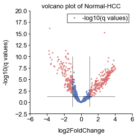


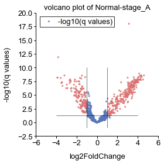


```python
class_info = 'data/'+dataset+'/sample_classes.txt'

original_mx_file = 'output/'+dataset+'/count_matrix/'+exp_mx_name+'.txt'
filter_mx_file = 'output/'+dataset+'/matrix_processing/filter.'+exp_mx_name+'.txt'

original_mx = pd.read_table(original_mx_file,index_col=0)
filter_mx = pd.read_table(filter_mx_file,index_col=0)
if dataset=='lulab_hcc':
    sample_class_stage = pd.read_table(class_info,sep='\t',index_col=0)
    sample_classes = sample_class_stage.copy()
    sample_classes[sample_class_stage.label !='Normal'] ='HCC'
elif dataset=='exorbase':
    sample_classes = pd.read_table(class_info,sep='\t',index_col=0)
```


```python
DE_methods = ['deseq2','edger_exact','edger_glmlrt','edger_glmqlf','wilcox']
```


```python
def heamap_plot(mat,sample_class=sample_classes):
    if sequencing_type=='short':
        norm_mx = mat/mat.sum(axis=0)*10e6
        norm_mx = (norm_mx+0.01).apply(np.log2,0)

    if sequencing_type=='long':
        norm_mx = mat/mat.sum(axis=0)*10e6
        length = np.array([mat.index[i].split('|')[-1] for i in range(mat.index.shape[0])]).astype('int')-\
        np.array([mat.index[i].split('|')[-2] for i in range(mat.index.shape[0])]).astype('int')

        norm_mx = (norm_mx.T/length).T*1000
        norm_mx = (norm_mx+0.01).apply(np.log2,0)

    for compare_group in tqdm(compare_group_list):
        if np.isin( compare_group,compare_list_use):
            if dataset=='scirep':
                if compare_group=='Normal-CRC_S1':
                    class_compare = np.array([ 'Colorectal Cancer Stage 1', 'Healthy Control'])
                if compare_group=='Normal-CRC_S1':
                    class_compare = np.array([ 'Colorectal Cancer Stage 1', 'Healthy Control'])
                if compare_group=='Normal-CRC_S1':
                    class_compare = np.array([ 'Colorectal Cancer Stage 1', 'Healthy Control'])
                if compare_group=='Normal-CRC_S1':
                    class_compare = np.array([ 'Colorectal Cancer Stage 1', 'Healthy Control'])
                if compare_group == 'Normal-CRC':
                    class_select = ['Healthy Control','Colorectal Cancer']
                if compare_group == 'Normal-PAAD':
                    class_select = ['Healthy Control','Pancreatic Cancer']
                if compare_group == 'Normal-PRAD':
                    class_select = ['Healthy Control','Prostate Cancer']
            elif dataset=='exorbase':
                if compare_group == 'Normal-CRC':
                    class_select = ['Healthy','CRC']
                if compare_group == 'Normal-HCC':
                    class_select = ['Healthy','HCC']
                if compare_group == 'Normal-PAAD':
                    class_select = ['Healthy','PAAD']
            elif dataset=='lulab_hcc':
                if compare_group == 'Normal-HCC':
                    class_select = ['Normal','HCC']
                    sample_class = sample_classes
                if compare_group == 'Normal-stage_A':
                    class_select = ['Normal','stage_A']
                    sample_class = sample_class_stage
            elif dataset=='pico_3v3':
                if compare_group == 'Normal-CRC':
                    class_select = ['Control','CRC']

            print (compare_group)
            norm_mx_delete = norm_mx
            norm_mx_delete = norm_mx_delete.loc[:,np.array(sample_class.iloc[np.where(np.isin(sample_class['label'],class_select)==1)[0]].index)]
            norm_z_mx = norm_mx_delete.apply(scipy.stats.zscore,1)
            detable = pd.read_table('output/'+dataset+'/differential_expression/'+exp_mx_name+'/'+compare_group+'/deseq2.txt'
                                    ,index_col=0)
            de_plot_mx = pd.DataFrame(data={'feature':[name.split('|')[0] for name in detable.index.values],
                                      'log2FoldChange':detable['log2FoldChange'].tolist(),
                                      'padj':detable['padj'].tolist()})
            de_plot_mx.set_index('feature',inplace=True)
            de_plot_mx['threshold'] = (abs(de_plot_mx['log2FoldChange'])>1) & (de_plot_mx['padj']<0.05)
            de_plot_mx['-log10(q values)'] = [-math.log10(qvalue) for qvalue in de_plot_mx['padj'].tolist()]
            
            detable['-log10(q values)']=-np.log10(detable['padj'])
            detable['metrics']=detable['-log10(q values)']*np.abs(detable['log2FoldChange'])
            de_mx = pd.DataFrame(norm_z_mx).loc[detable.sort_values('metrics',ascending=False).iloc[np.where(de_plot_mx.sort_values('-log10(q values)',ascending=False)['threshold']==True)].index]
            
            type_select =pd.DataFrame(sample_class.loc[de_mx.columns])
            column_colors = np.zeros(type_select.shape[0]).astype('str')
            column_colors[np.where(type_select.label==class_select[0])] = np.array(["#DA706F"])
            column_colors[np.where(type_select.label==class_select[1])] = np.array(["#5876B9"])
            tmpind = de_mx.index
            tmpind = np.array([tmpind[i].split('|')[0]+'|'+tmpind[i].split('|')[1]+'|'+tmpind[i].split('|')[2] for i in range(tmpind.shape[0])])
            de_mx.index = tmpind
            de_mx = de_mx.fillna(0)
            g = sns.clustermap(de_mx.iloc[:20], row_cluster=False,cmap="vlag",
                           col_colors=column_colors,linewidths=.005,vmax=3,vmin=-3)#,z_score=0)
            g.savefig(save_path+compare_group+'_DE_heatmap'+saveformat)
            #with embed_pdf_data() as data:
                #g.savefig(data, format='pdf', metadata={'Title': compare_group})
heamap_plot(original_mx)
```


<p>Failed to display Jupyter Widget of type <code>HBox</code>.</p>
<p>
  If you're reading this message in the Jupyter Notebook or JupyterLab Notebook, it may mean
  that the widgets JavaScript is still loading. If this message persists, it
  likely means that the widgets JavaScript library is either not installed or
  not enabled. See the <a href="https://ipywidgets.readthedocs.io/en/stable/user_install.html">Jupyter
  Widgets Documentation</a> for setup instructions.
</p>
<p>
  If you're reading this message in another frontend (for example, a static
  rendering on GitHub or <a href="https://nbviewer.jupyter.org/">NBViewer</a>),
  it may mean that your frontend doesn't currently support widgets.
</p>


    Normal-HCC
    Normal-stage_A
    


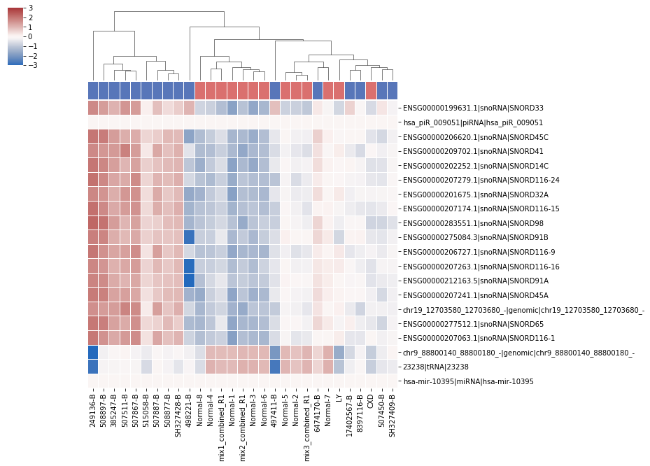


**if you would like to try...**

Find suitable methods and metrics for better visualization
```python
cluster_methods = ['single','average','weighted','centroid','median','ward']
cluster_metrics=['euclidean','correlation','cosine','seuclidean',
                 'braycurtis', 'canberra','chebyshev', 'cityblock','dice',
                 'hamming','jaccard','kulsinski','matching',
                 'minkowski','rogerstanimoto','russellrao','sokalmichener','sokalsneath',
                 'sqeuclidean']
```


```python
def heamap_plot(mat,sample_class=sample_classes):
    if sequencing_type=='short':
        norm_mx = mat/mat.sum(axis=0)*10e6
        norm_mx = (norm_mx+0.01).apply(np.log2,0)

    if sequencing_type=='long':
        norm_mx = mat/mat.sum(axis=0)*10e6
        length = np.array([mat.index[i].split('|')[-1] for i in range(mat.index.shape[0])]).astype('int')-\
        np.array([mat.index[i].split('|')[-2] for i in range(mat.index.shape[0])]).astype('int')

        norm_mx = (norm_mx.T/length).T*1000
        norm_mx = (norm_mx+0.01).apply(np.log2,0)

    for compare_group in tqdm(compare_group_list):
        if np.isin( compare_group,compare_list_use):
            if dataset=='scirep':
                if compare_group=='Normal-CRC_S1':
                    class_compare = np.array([ 'Colorectal Cancer Stage 1', 'Healthy Control'])
                if compare_group=='Normal-CRC_S1':
                    class_compare = np.array([ 'Colorectal Cancer Stage 1', 'Healthy Control'])
                if compare_group=='Normal-CRC_S1':
                    class_compare = np.array([ 'Colorectal Cancer Stage 1', 'Healthy Control'])
                if compare_group=='Normal-CRC_S1':
                    class_compare = np.array([ 'Colorectal Cancer Stage 1', 'Healthy Control'])
                if compare_group == 'Normal-CRC':
                    class_select = ['Healthy Control','Colorectal Cancer']
                if compare_group == 'Normal-PAAD':
                    class_select = ['Healthy Control','Pancreatic Cancer']
                if compare_group == 'Normal-PRAD':
                    class_select = ['Healthy Control','Prostate Cancer']
            elif dataset=='exorbase':
                if compare_group == 'Normal-CRC':
                    class_select = ['Healthy','CRC']
                if compare_group == 'Normal-HCC':
                    class_select = ['Healthy','HCC']
                if compare_group == 'Normal-PAAD':
                    class_select = ['Healthy','PAAD']
            elif dataset=='lulab_hcc':
                if compare_group == 'Normal-HCC':
                    class_select = ['Normal','HCC']
                    sample_class = sample_classes
                if compare_group == 'Normal-stage_A':
                    class_select = ['Normal','stage_A']
                    sample_class = sample_class_stage
            elif dataset=='pico_3v3':
                if compare_group == 'Normal-CRC':
                    class_select = ['Control','CRC']

            print (compare_group)
            norm_mx_delete = norm_mx
            norm_mx_delete = norm_mx_delete.loc[:,np.array(sample_class.iloc[np.where(np.isin(sample_class['label'],class_select)==1)[0]].index)]
            norm_z_mx = norm_mx_delete.apply(scipy.stats.zscore,1)
            detable = pd.read_table('output/'+dataset+'/differential_expression/'+exp_mx_name+'/'+compare_group+'/deseq2.txt'
                                    ,index_col=0)
            de_plot_mx = pd.DataFrame(data={'feature':[name.split('|')[0] for name in detable.index.values],
                                      'log2FoldChange':detable['log2FoldChange'].tolist(),
                                      'padj':detable['padj'].tolist()})
            de_plot_mx.set_index('feature',inplace=True)
            de_plot_mx['threshold'] = (abs(de_plot_mx['log2FoldChange'])>1) & (de_plot_mx['padj']<0.05)
            de_plot_mx['-log10(q values)'] = [-math.log10(qvalue) for qvalue in de_plot_mx['padj'].tolist()]
            
            detable['-log10(q values)']=-np.log10(detable['padj'])
            detable['metrics']=detable['-log10(q values)']*np.abs(detable['log2FoldChange'])
            de_mx = pd.DataFrame(norm_z_mx).loc[detable.sort_values('metrics',ascending=False).iloc[np.where(de_plot_mx.sort_values('-log10(q values)',ascending=False)['threshold']==True)].index]

            type_select =pd.DataFrame(sample_class.loc[de_mx.columns])
            column_colors = np.zeros(type_select.shape[0]).astype('str')
            column_colors[np.where(type_select.label==class_select[0])] = np.array(["#DA706F"])
            column_colors[np.where(type_select.label==class_select[1])] = np.array(["#5876B9"])
            tmpind = de_mx.index
            tmpind = np.array([tmpind[i].split('|')[0]+'|'+tmpind[i].split('|')[1]+'|'+tmpind[i].split('|')[2] for i in range(tmpind.shape[0])])
            de_mx.index = tmpind
            de_mx = de_mx.fillna(0)
            g = sns.clustermap(de_mx.iloc[:20], row_cluster=False,cmap="vlag",
                           col_colors=column_colors,linewidths=.005,vmax=3,vmin=-3)#,z_score=0)
            g.savefig(save_path+compare_group+'_DE_heatmap'+saveformat)
            #with embed_pdf_data() as data:
               # g.savefig(data, format='pdf', metadata={'Title': compare_group})
heamap_plot(original_mx)
```


<p>Failed to display Jupyter Widget of type <code>HBox</code>.</p>
<p>
  If you're reading this message in the Jupyter Notebook or JupyterLab Notebook, it may mean
  that the widgets JavaScript is still loading. If this message persists, it
  likely means that the widgets JavaScript library is either not installed or
  not enabled. See the <a href="https://ipywidgets.readthedocs.io/en/stable/user_install.html">Jupyter
  Widgets Documentation</a> for setup instructions.
</p>
<p>
  If you're reading this message in another frontend (for example, a static
  rendering on GitHub or <a href="https://nbviewer.jupyter.org/">NBViewer</a>),
  it may mean that your frontend doesn't currently support widgets.
</p>


    Normal-HCC
    Normal-stage_A
    


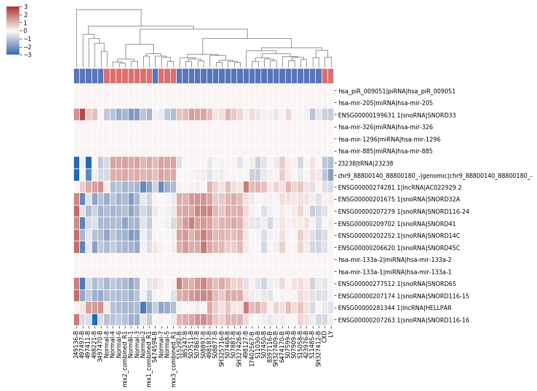


```python
cpm_table_origin_ = pd.read_table('output/'+dataset+'/count_matrix/'+exp_mx_name+'.txt',index_col=0)
cpm_table_origin =  cpm_table_origin_/cpm_table_origin_.sum(axis=0)*10e6
length_tmp = np.array([cpm_table_origin.index[i].split('|')[-1] for i in range(cpm_table_origin.index.shape[0])]).astype('int')-\
np.array([cpm_table_origin.index[i].split('|')[-2] for i in range(cpm_table_origin.index.shape[0])]).astype('int')
rpkm_table_origin = (cpm_table_origin.T/length_tmp*1000).T

```


```python
from matplotlib.colors import ListedColormap, LinearSegmentedColormap
viridisBig = cm.get_cmap('BuGn', 512)
newcmp = ListedColormap(viridisBig(np.linspace(0.4, 1, 256)))
def DE_scatter(area_=(6.0,8.0),nameshort=True,savefig=True,DE_method='deseq2',up_regulated=1):
    for compare_group in compare_group_list: 
        if np.isin( compare_group,compare_list_use):
            detable = pd.read_table('output/'+dataset+'/differential_expression/'+exp_mx_name+'/'+compare_group+'/'+DE_method+'.txt'
                                    ,index_col=0)
            de_plot_mx = pd.DataFrame(data={'feature':detable.index,
                                      'log2FoldChange':detable['log2FoldChange'].tolist(),
                                      'padj':detable['padj'].tolist()})
            de_plot_mx.set_index('feature',inplace=True)
            if up_regulated:
                de_plot_mx['threshold'] = (de_plot_mx['log2FoldChange']>1) & (de_plot_mx['padj']<0.05)
            else:
                de_plot_mx['threshold'] = (abs(de_plot_mx['log2FoldChange'])>1) & (de_plot_mx['padj']<0.05)
            de_plot_mx['-log10(q values)'] = [-math.log10(qvalue) for qvalue in de_plot_mx['padj'].tolist()]
            de_plot_mx['color'] = de_plot_mx['threshold']
            for i in np.where(de_plot_mx['threshold']==True):
                de_plot_mx['color'][i]='#DA706F'
            for i in np.where(de_plot_mx['threshold']==False):
                de_plot_mx['color'][i]='#5876B9'
            
            if dataset=='scirep':
                rpkmtable = cpm_table_origin
                matrix_type='cpm'
            elif dataset=='lulab_hcc':
                rpkmtable = cpm_table_origin
                matrix_type='cpm'
            elif dataset=='exorbase':
                rpkmtable = rpkm_table_origin
                matrix_type='rpkm'
            elif dataset=='pico_3v3':
                rpkmtable = rpkm_table_origin
                matrix_type='rpkm'
            de_plot_mx['metrics']=de_plot_mx['-log10(q values)']*np.abs(de_plot_mx['log2FoldChange'])
            de_plot_mx = de_plot_mx.sort_values(['metrics'],ascending=0).iloc[:10]
            de_plot_mx = de_plot_mx.sort_values(['log2FoldChange'],ascending=0)
            rpkmtable = rpkmtable.loc[de_plot_mx.index]
            de_plot_mx['log2RPKM'] = np.mean(log_transfrom(rpkmtable),axis=1)
            de_plot_mx.index = np.array([name.split('|')[2]+'|'+name.split('|')[1] 
                                         #+'|'+name.split('|')[3]+'|'+name.split('|')[4] 
                                         for name in de_plot_mx.index.values])
            fig, (ax) = plt.subplots(1, figsize=(6,3))
            im = ax.scatter(de_plot_mx['log2FoldChange'],de_plot_mx.index,s=((de_plot_mx['log2RPKM']/area_[0]-0.5)*area_[1])**2,c=de_plot_mx['-log10(q values)'],cmap=newcmp)
            cbar =fig.colorbar(im, ax=ax)
            cbar.outline.set_visible(False)
            interval = np.max(de_plot_mx.log2RPKM) - np.min(de_plot_mx.log2RPKM)
            ratiointer = interval/2
            pws = set(np.round(np.arange(np.min(de_plot_mx.log2RPKM),np.max(de_plot_mx.log2RPKM),ratiointer),0).astype(int))
            for pw in pws:
                ax.scatter([], [], s=((pw/area_[0]-0.5)*area_[1])**2, c="k",label=str(pw))
            ax = std_plot(ax,'Fold Change','Feature Name','DE bar plot of '+compare_group+' '+DE_method,'log('+matrix_type+')',
                              borderpad=0.1,labelspacing=0.2,handletextpad=1,cbar=cbar,cbarlabel='-log10(q values)',xlim=[np.min(de_plot_mx['log2FoldChange'])-0.1,np.max(de_plot_mx['log2FoldChange'])+0.1])
            fig.tight_layout()
            fig.savefig(save_path+'DE_bar_plot_of_'+compare_group+'.'+DE_method+saveformat)
            #embed_pdf_figure()
            de_plot_mx.to_csv(save_path+'DE_selected_features.'+compare_group+'.'+DE_method+'.txt',sep='\t')
```


```python
DE_scatter()
```


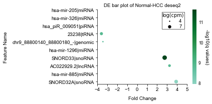


## abundance and diversity

def filter_mx(expression_mx,cutoff_ratio = 0.2,counts_threshold = 10 ):
    retain_index = np.where(np.sum(expression_mx > counts_threshold,axis=1) >=round(cutoff_ratio*expression_mx.shape[1]))[0]
    return expression_mx.iloc[retain_index,:]


```python
filter_mx=pd.read_table('output/'+dataset+'/matrix_processing/filter.'+exp_mx_name+'.txt')
def div_abu_plot(expression_mx,savefig=True):
    total_counts = expression_mx.shape[0]
    type_counts_sample = pd.DataFrame()
    for samplename in expression_mx.columns.values:
        filter_zero_samplename = expression_mx.iloc[np.where(expression_mx[samplename]>0)[0],:]
        names = filter_zero_samplename.index
        names_type = np.array([names[i].split('|')[1] for i in range(names.shape[0])])
        type_counts = np.unique(names_type, return_counts = True)
        new = pd.DataFrame({'type' : type_counts[0],
                            samplename : type_counts[1],
                           })
        new = new.set_index('type')
        type_counts_sample = pd.concat([type_counts_sample, new], axis=1)#, join_axes=[df1.index]
    typelist = np.unique([expression_mx.index[i].split('|')[1] for i in range(expression_mx.shape[0])])
    type_mx = pd.DataFrame(index=typelist,columns=expression_mx.columns)
    for sample in expression_mx.columns:
        sample_feature = pd.DataFrame(data=expression_mx.loc[:,sample],index=expression_mx.index)
        sample_feature['type']=[expression_mx.index[i].split('|')[1] for i in range(expression_mx.shape[0])]
        for i in typelist:
            type_mx.loc[i,sample] = sample_feature.iloc[np.where(sample_feature['type']==i)].iloc[:,0].sum()
    table_ratio = (type_mx/type_mx.sum()).T
    

    xticks = type_counts_sample.index.tolist()
    Means = type_counts_sample.mean(axis=1).values.tolist()
    Std=type_counts_sample.std(axis=1).values.tolist()
    mean_sd = pd.DataFrame(data = {'type':xticks,'mean':Means,'std':Std})
    mean_sd = mean_sd.sort_values(by='mean',ascending=False)
    mean_sd = mean_sd.set_index('type')
    Std = [[0]*len(mean_sd['std'].tolist()),mean_sd['std'].tolist()]
    ab = table_ratio*100

    xticks_ab = ab.columns.tolist()
    Means_ab = ab.mean(axis=0).values.tolist()
    
    Std_ab = ab.std(axis=0).values.tolist()
    mean_sd_ab = pd.DataFrame(data = {'type':xticks_ab,'mean_ab':Means_ab,'std_ab':Std_ab})
    mean_sd_ab = mean_sd_ab.set_index('type')
    N = type_counts_sample.shape[0]
    ind = np.arange(N)
    merge = pd.concat([mean_sd,mean_sd_ab],axis=1,join_axes=[mean_sd.index])
    Std_ab = [[0]*len(merge['std_ab'].tolist()),merge['std_ab'].tolist()]

    merge = merge.sort_values(by='mean_ab',ascending=False)
    xticks = np.array(merge.index.tolist())
    tmpname,tmpcount = np.unique(np.array([i.split('|')[1] for i in expression_mx.index]),return_counts=1)
    tmpdataframe = pd.DataFrame(np.zeros(tmpname.shape[0]))
    tmpdataframe.index = tmpname

    tmpdataframe.iloc[:,0] = tmpcount
    fig,(ax,ax1) = plt.subplots(1,2,figsize = (5,2.6))
    ax.barh(ind,tmpdataframe.loc[merge.index].iloc[:,0],0.7,xerr=None,color=np.array(['#cc3399','#3300ff','#006699','#339999','#66ffcc','#00ff00','#006600','#FFFF00','#FF6600','#FF0000','#FF9999']))
    ax.invert_xaxis()
    ax.set_yticks(ind)
    ax.set_yticks([])
    ax = std_plot(ax,'Number of RNA domains/miRNAs','','Number of RNA domains/miRNAs (cfRNA)',left=False,rotation=0,legendscale=False,legend_adj=False)#,ylim=[np.min(ind),np.max(ind)]
    ax1.barh(ind,merge['mean_ab'],0.7,xerr=Std_ab,color=np.array(['#cc3399','#3300ff','#006699','#339999','#66ffcc','#00ff00','#006600','#FFFF00','#FF6600','#FF0000','#FF9999']))
    ax1.set_yticks(ind)
    xticks[np.where(xticks=='Y_RNA')] = 'Y RNA'
    ax1.set_yticklabels(xticks)
    
    ax1 = std_plot(ax1,'Percentage of mapped reads (%)', '','Abundance',rotation=0,legendscale=False,legend_adj=False)
    ax1.tick_params(direction='out', pad=4,length=0)
    fig.tight_layout(w_pad=0.2)
    if savefig is True:
        fig.savefig(save_path+'diversity_abundance_cfRNA.eps')
    #embed_pdf_figure()    
    
    return tmpdataframe.loc[merge.index],_
diversity,ratio =div_abu_plot(expression_mx=filter_mx,
                              savefig=True)
```


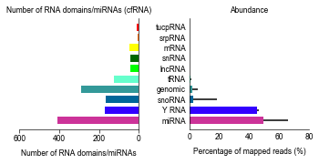


```python
de_table=pd.read_table('output/'+dataset+'/differential_expression/'+exp_mx_name+'/Normal-HCC/deseq2.txt')
rnaname_tmp,count_tmp = np.unique(np.array([i.split('|')[1] for i in de_table[de_table.padj<=0.05].index]),return_counts=1)
div_df = pd.DataFrame([count_tmp]).T
div_df.index = rnaname_tmp
display_dataframe(div_df.loc[pd.DataFrame(diversity).index])

```


<style  type="text/css" >
</style>  
<table id="T_c106ae26_7878_11e9_9f96_33a93858c7c7" > 
<thead>    <tr> 
        <th class="blank level0" ></th> 
        <th class="col_heading level0 col0" >0</th> 
    </tr>    <tr> 
        <th class="index_name level0" >type</th> 
        <th class="blank" ></th> 
    </tr></thead> 
<tbody>    <tr> 
        <th id="T_c106ae26_7878_11e9_9f96_33a93858c7c7level0_row0" class="row_heading level0 row0" >miRNA</th> 
        <td id="T_c106ae26_7878_11e9_9f96_33a93858c7c7row0_col0" class="data row0 col0" >166</td> 
    </tr>    <tr> 
        <th id="T_c106ae26_7878_11e9_9f96_33a93858c7c7level0_row1" class="row_heading level0 row1" >Y_RNA</th> 
        <td id="T_c106ae26_7878_11e9_9f96_33a93858c7c7row1_col0" class="data row1 col0" >50</td> 
    </tr>    <tr> 
        <th id="T_c106ae26_7878_11e9_9f96_33a93858c7c7level0_row2" class="row_heading level0 row2" >snoRNA</th> 
        <td id="T_c106ae26_7878_11e9_9f96_33a93858c7c7row2_col0" class="data row2 col0" >137</td> 
    </tr>    <tr> 
        <th id="T_c106ae26_7878_11e9_9f96_33a93858c7c7level0_row3" class="row_heading level0 row3" >genomic</th> 
        <td id="T_c106ae26_7878_11e9_9f96_33a93858c7c7row3_col0" class="data row3 col0" >89</td> 
    </tr>    <tr> 
        <th id="T_c106ae26_7878_11e9_9f96_33a93858c7c7level0_row4" class="row_heading level0 row4" >tRNA</th> 
        <td id="T_c106ae26_7878_11e9_9f96_33a93858c7c7row4_col0" class="data row4 col0" >17</td> 
    </tr>    <tr> 
        <th id="T_c106ae26_7878_11e9_9f96_33a93858c7c7level0_row5" class="row_heading level0 row5" >lncRNA</th> 
        <td id="T_c106ae26_7878_11e9_9f96_33a93858c7c7row5_col0" class="data row5 col0" >15</td> 
    </tr>    <tr> 
        <th id="T_c106ae26_7878_11e9_9f96_33a93858c7c7level0_row6" class="row_heading level0 row6" >snRNA</th> 
        <td id="T_c106ae26_7878_11e9_9f96_33a93858c7c7row6_col0" class="data row6 col0" >34</td> 
    </tr>    <tr> 
        <th id="T_c106ae26_7878_11e9_9f96_33a93858c7c7level0_row7" class="row_heading level0 row7" >mRNA</th> 
        <td id="T_c106ae26_7878_11e9_9f96_33a93858c7c7row7_col0" class="data row7 col0" >12</td> 
    </tr>    <tr> 
        <th id="T_c106ae26_7878_11e9_9f96_33a93858c7c7level0_row8" class="row_heading level0 row8" >srpRNA</th> 
        <td id="T_c106ae26_7878_11e9_9f96_33a93858c7c7row8_col0" class="data row8 col0" >nan</td> 
    </tr>    <tr> 
        <th id="T_c106ae26_7878_11e9_9f96_33a93858c7c7level0_row9" class="row_heading level0 row9" >tucpRNA</th> 
        <td id="T_c106ae26_7878_11e9_9f96_33a93858c7c7row9_col0" class="data row9 col0" >2</td> 
    </tr></tbody> 
</table> 


```python
def plot_pie_de(df):
    '''
    data: table_ratio
    rnanames: rna type names
    adjustment: merge RNA with small percent together
    '''
    from bokeh.plotting import figure
    from bokeh.transform import cumsum
    x = np.array(df.index)
    y = (np.array(df.values)+10e-8).ravel()
    y = y/y.sum()
    z_ = np.array([x[i] + str(' {:.2f}'.format(y[i]*100)+'%') for i in range(y.shape[0])])
    z = np.array([float('{:.10f}'.format(y[i]*100)) for i in range(y.shape[0])])
    dataframe = pd.DataFrame(np.concatenate((x.reshape(-1,1),z.reshape(-1,1),z_.reshape(-1,1)),axis=1))
    dataframe.columns=['rna','percent','label']
    dataframe["percent"] = pd.to_numeric(dataframe["percent"])
    dataframe['angle'] = dataframe['percent']/dataframe['percent'].sum() * 2*pi
    dataframe['color'] = Category20c[len(x)]
    p = figure(height=500,width=750, title="Pie Chart", toolbar_location=None,
               tools="hover", tooltips="@label", x_range=(-0.5, 1.0))
    p.wedge(x=0.14, y=1, radius=0.45,
            start_angle=cumsum('angle', include_zero=True), end_angle=cumsum('angle'),
            line_color="black", fill_color='color', legend="label", source=dataframe)
    p.axis.axis_label=None
    p.axis.visible=False
    p.grid.grid_line_color = None
    show(p)

```


```python
plot_pie_de(div_df.loc[pd.DataFrame(diversity).index].fillna(0))
```


    


```python
domain_mx = filter_mx.iloc[np.where(np.array([i.split("|")[1] for i in filter_mx.index])!='genomic')]
domain_size = np.array([int(i.split('|')[-1]) -int(i.split('|')[-2]) for i in  domain_mx.index])
```


```python
if sequencing_type=='short':
    fig ,ax=plt.subplots(1,figsize=(2.5,2.5))
    ax.hist(domain_size,bins=200,alpha=0.9)
    ax = std_plot(ax,'Domain Size','','Domain size distribution',xlim=[20,150],legendscale=False,legend_adj=False)
    fig.tight_layout()
    fig.savefig(save_path+'domainsize.eps')
    #embed_pdf_figure()    
```


